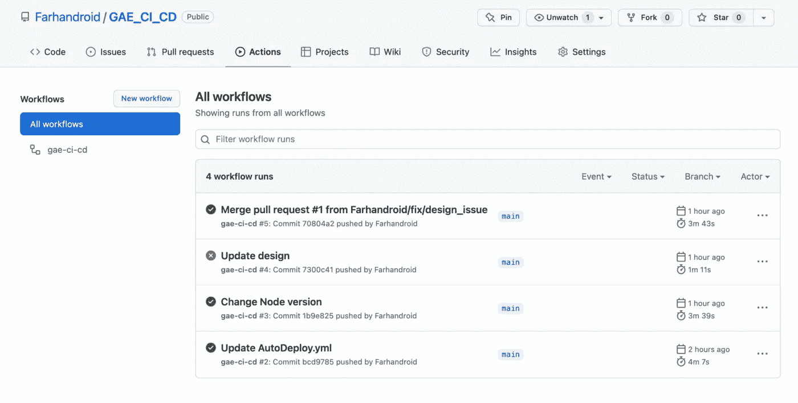
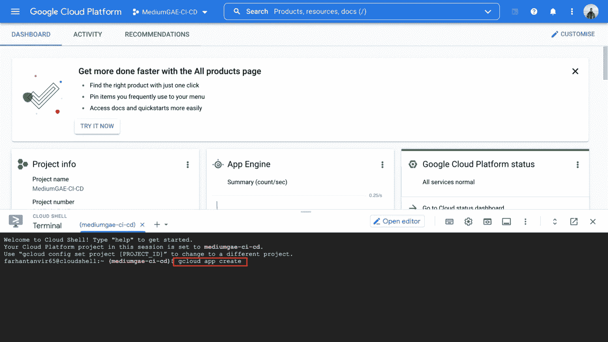
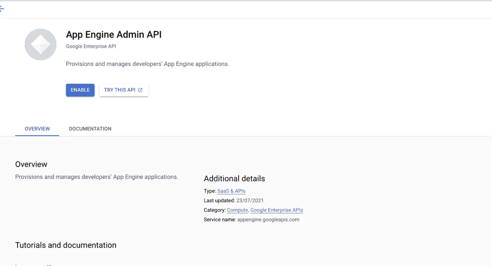
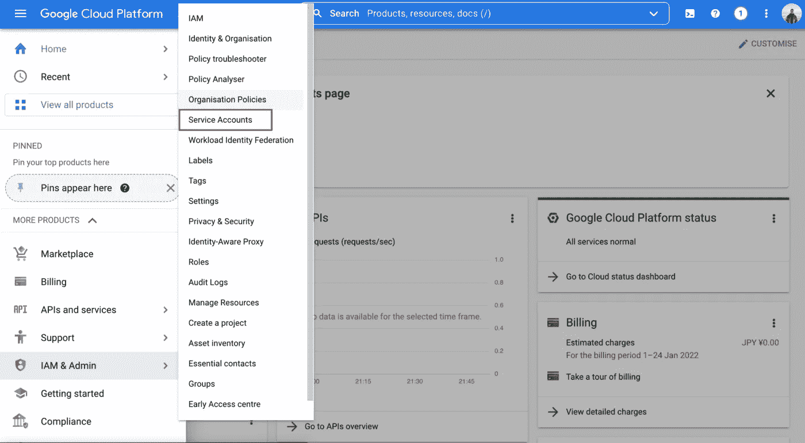
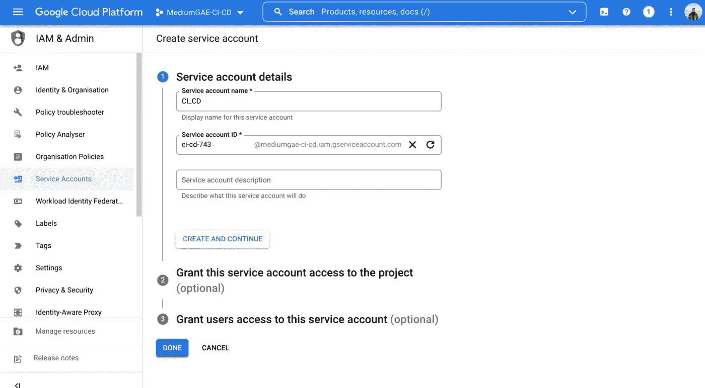
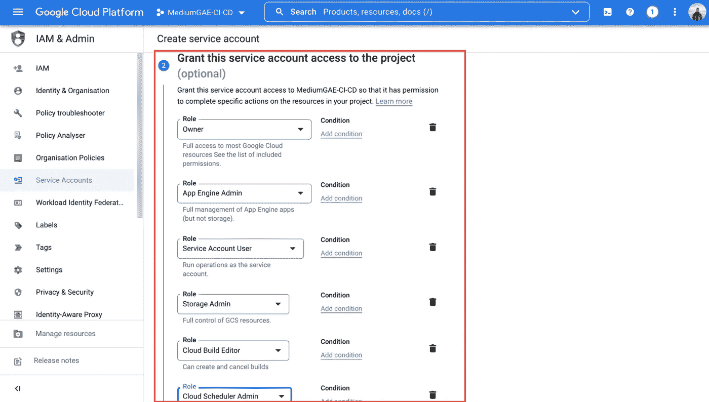
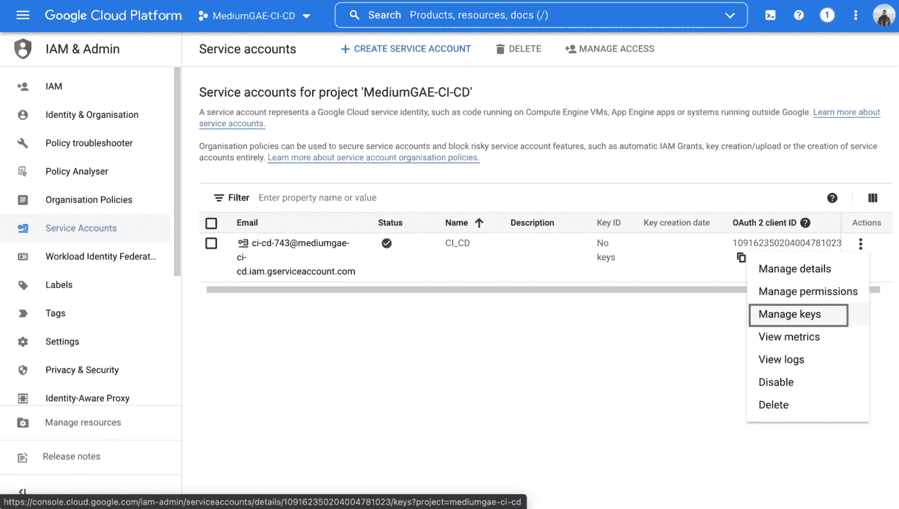
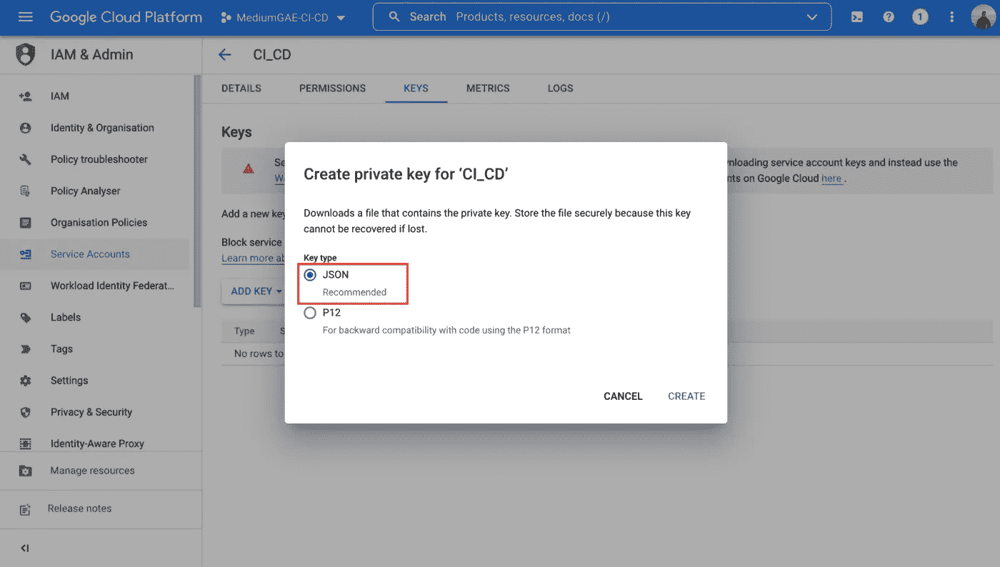
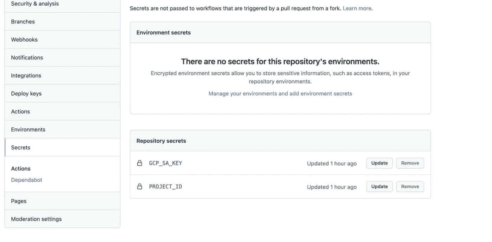
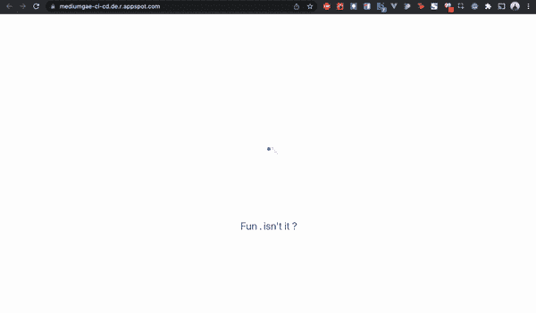

# 使用 GitHub 操作从 GitHub 到 GAE 的 CI/CD

> 原文：<https://levelup.gitconnected.com/ci-cd-from-github-to-gae-using-github-action-3586083fdb52>

## 自动化您的部署



作为开发人员，我们喜欢以自动化的方式做事。因为它既有趣又节省时间。GitHub action 让 CI/CD 变得如此简单。仅仅几行代码就可以自动完成整个测试和部署。今天，我将一步步指导你如何为 GAE 实现这一目标。

# 什么是 GAE？

首先，我们将知道什么是 GAE。根据官方 [**文档**](https://cloud.google.com/appengine/docs)

> 谷歌应用引擎(GAE)是一个完全托管的无服务器平台，用于大规模开发和托管网络应用。您可以从几种流行的语言、库和框架中进行选择来开发您的应用程序，然后让 App Engine 负责根据需求配置服务器和扩展您的应用程序实例。

# 什么是 CI/CD 和 GitHub 动作？

我不打算用书中的语言描述什么是 CI/CD 和 GitHub action。这方面有很多资源。

> 据我所知，CI 正在检查应用程序是否正常工作，而 CD 正在交付应用程序。显然两者都是自动的。但是它可以做很多事情。这只是擦伤。GitHub action 是一个帮助我们轻松实现 CI/CD 的工具，并且在一定时间内是免费的。

# TL；速度三角形定位法(dead reckoning)

1.  创建新的 Google 云项目或选择现有项目
2.  初始化 GAE 项目。
3.  启用应用引擎管理 API
4.  创建服务帐户并设置所需的角色
5.  获取服务帐户的凭据。
6.  在 Github secret 中设置凭证
7.  创建 app.yaml
8.  创建。yml 文件来构建和部署应用程序。

我们将使用 React 和这个 [GitHub](https://github.com/Farhandroid/GAE_CI_CD) 库作为一个示例项目。我们开始吧。

# 1.创建新的 Google 云项目或选择现有项目

如果你是 GCP 的新手，只需进入这个[链接](https://console.cloud.google.com/)并创建一个项目。如果您有一个现有的项目，您也可以选择它。

# 2.初始化 GAE 项目。

只需运行这个命令`gcloud app create`来创建一个 GAE 应用程序。然后选择地区并启用计费。**启用计费对部署 GAE 应用**很重要。



# 3.启用应用引擎管理 API

转到此[链接](https://console.cloud.google.com/apis/api/appengine.googleapis.com)并启用应用引擎管理 API。



# 4.创建服务帐户并设置所需的角色

转到`IAM & Admin > Service Accounts`创建一个帐户并赋予以下角色。

*   应用引擎管理员(`roles/appengine.appAdmin`):可以管理所有的应用引擎资源
*   服务帐户用户(`roles/iam.serviceAccountUser`):部署为服务帐户
*   存储管理员(`roles/compute.storageAdmin`):上传文件
*   云构建编辑器(`roles/cloudbuild.builds.editor`):构建应用程序
*   *(可选)*云调度管理(`roles/cloudscheduler.admin`):调度任务

*注意:需要一个所有者来创建应用引擎应用*



# 5.获取服务帐户的凭据

创建服务帐户后，创建一个密钥。这个键很重要。我们以后会需要它。



# 6.在 Github secret 中设置凭证

现在复制项目 ID(作为项目 Id)和服务帐户密钥(作为 GCP SA 密钥)，并将其设置为 GitHub secret。请复制关键 JSON 文件的全部内容并粘贴。



# 7.创建 app.yaml

创建 app.yaml，放在根目录下。它将用于在 GAE 路由应用程序。还有很多其他的用例，比如服务于一个静态文件，划分测试和生产环境，等等。

```
runtime: nodejs12
handlers:
*# Catch all handler* - url: /.*
  secure: always
  redirect_http_response_code: 301
  script: auto
```

# 8.创建。yml 文件来构建和部署应用程序。

现在我们将编写 AutoDeploy.yml 文件，所有神奇的事情都发生在这里。这个。yml 文件将被写入存储库的。github/workflows 文件夹。

代码很简单，不是吗？。如果在主分支中有任何推送，或者如果在主分支中合并了一个分支，它将执行 CI/CD 操作。因此，当我在示例项目的主分支中合并一个新的 PR 后，它会自动部署到 GAE。



伟大的应用？不是吗？

今天到此为止。希望你学到了有用的东西。

你的意见和建议对我很有价值。所以如果可能的话，请在评论中分享。直到我们再次见面…干杯！

```
**Want to Connect?**If you want to, you can connect with me on [Twitter](https://twitter.com/FarhanT99598254) or [LinkedIn](https://www.linkedin.com/in/farhan-tanvir-b08520151/).
```