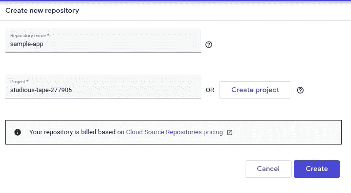

# GCP 上的 CI/CD 管道使用云源存储库、云构建、容器注册和云运行

> 原文：<https://levelup.gitconnected.com/ci-cd-pipeline-on-gcp-using-cloud-source-repository-cloud-build-container-registry-and-cloud-run-b66413133933>

当更改被推送到 CSR 存储库时，自动构建容器并将其部署到云运行中。


GCP 无服务器 CI/CD 流水线架构

# 概观

在本文中，我们将看到如何使用**云资源仓库、云构建、容器注册表**和**云运行**在 GCP 上配置 CI/CD 管道。

## 云资源存储库

Google Cloud Source Repositories 是托管在 Google Cloud Platform 上的功能齐全的私有 Git 仓库。协作在功能全面、可扩展的私有 Git 存储库上轻松安全地管理您的代码。

## 云构建

Cloud Build 是一项在 Google 云平台基础设施上执行构建的服务。Cloud Build 可以从 Google Cloud Storage、Cloud Source Repositories、GitHub 或 Bitbucket 导入源代码，根据您的规范执行构建，并生成 Docker 容器或 Java 归档等工件。

## 集装箱登记处

Container Registry 是一个私有的容器映像注册表，运行在 Google Cloud 上。

## 云运行

完全托管的计算平台，用于快速、安全地部署和扩展容器化应用

# 设置 GCP 项目

要学习本教程，您需要访问 GCP 项目

1.  进入 [GCP 控制台](https://console.cloud.google.com/projectcreate)，为你的新项目输入一个名字，然后点击创建按钮
2.  选择**API&服务**然后点击**启用 API 和服务**
3.  启用这些 API:**云资源仓库 API、云构建 API** 、 **Google 容器注册 API** 和**云运行 API** 。

# 示例应用程序

我们将在本教程中使用的示例应用程序是一个非常简单的 Flask 应用程序。

如果你想了解更多关于这款应用的信息，请关注[我之前的博客](https://medium.com/@vikramshinde/config-service-using-google-sheet-6ac126b1c742)

这是使用谷歌表的配置服务。

它公开了两个端点

*   /project/<>/env/<>/key/<>:获取键值的端点。
*   /spread sheet/<>/worksheet/<>/id/<>:返回属于 id 的数据。

[](https://github.com/vikramshinde12/config-service-googlesheet) [## vikramshinde 12/config-service-Google sheet

### 这个库创建 Docker 映像，可以部署在 Docker、Kubernetes (GKE)和 Google Cloud Run 上。创建一个…

github.com](https://github.com/vikramshinde12/config-service-googlesheet) 

## Dockerfile 文件

示例应用程序的文档

## 创建服务帐户

转到云壳(右上角“> _”)图标。运行以下命令

```
gcloud iam service-accounts create sample-app
```

创建为“sample-app @ $ PROJECT _ id . iam . gserviceaccount . com”的服务帐户

## 在云来源存储库中创建存储库

这一步将在云资源仓库中创建仓库，然后从 Github 中克隆它。

1.  从左侧菜单中选择**云源库**。然后选择**添加资源库**。


创建存储库

2.输入存储库名称和项目名称。



3.转到 Cloud shell，从 Github 克隆示例代码。

```
cd ~git clone [https://github.com/vikramshinde12/config-service-googlesheet.git](https://github.com/vikramshinde12/config-service-googlesheet.git) sample-app
```

4.将源代码库配置为远程

```
cd ~/sample-app
PROJECT_ID=$(gcloud config get-value project)
git remote add google \
    "https://source.developers.google.com/p/${PROJECT_ID}/r/sample-app"
```

5.将示例应用程序代码推送到 CSR

```
git push google master
```

6.刷新云源代码库，查看代码是否已被推送。

## 配置云构建管道

在 YML 文件中定义的构建管道的步骤叫做 [cloudbuild.yaml](https://raw.githubusercontent.com/vikramshinde12/config-service-googlesheet/master/cloudbuild.yaml) 。管道由三个步骤组成。

1.  第一步是负责构建和标记应用程序的 Docker 图像。
2.  第二步负责将第一步构建的 Docker 映像推送到容器注册中心。
3.  第三步负责将 Docker 映像部署到云运行。

我们使用一些变量，如$PROJECT_ID 和$SHORT_SHA。这些都是由云构建提供的。

我还创建了${ _SERVICE_NAME}、${_REGION}和${_SERVICE_ACCOUNT_EMAIL}，这是一个用户定义的变量，用于生成 Docker 图像。

## 设置云构建触发器

从菜单中，选择**云构建**，选择**触发器**，选择我们在 CSR 中创建的库，点击:并选择**添加触发器**


在云构建中添加触发器

这里，我们指定:

*   触发器的**名称**和**描述**；
*   每当有东西被推送到存储库的主分支时，就应该触发构建；
*   构建配置由我们存储库中的 [cloudbuild.yaml](https://raw.githubusercontent.com/vikramshinde12/config-service-googlesheet/master/cloudbuild.yaml) 文件提供；
*   我们的 [cloudbuild.yaml](https://raw.githubusercontent.com/vikramshinde12/config-service-googlesheet/master/cloudbuild.yaml) 中的 **_SERVICE_ACCOUNT_EMAIL** 变量应该替换为 **service account** 值。如前所述，这个变量用于管理我们生成的 Docker 映像，以及设置部署的云运行服务的名称。

**服务账户权限**

单击“设置”,并为默认云构建服务帐户启用以下权限。

*   云运行
*   服务帐户


# 触发构件

为了测试配置，

1.  将任何更改提交并推送到存储库的主分支。
2.  通过单击运行触发器按钮，手动运行触发器。

## 测试管道

点击运行触发器按钮。


仪表板显示触发器的高级详细信息


仪表盘

单击“历史记录”查看构建中每个步骤的状态


云构建详细信息

# 集装箱登记处

云构建触发器将 Docker 映像推送到容器注册表。


图像列表

您可以将这个 Docker 容器直接部署到

*   云运行
*   谷歌 Kubernetes 引擎
*   谷歌计算引擎

# 云运行

既然已经构建并部署了应用程序，您应该能够通过 Cloud Run 生成的端点来访问它。要获取其地址:

*   在 GCP 控制台中，从左上角菜单中选择**云运行**；
*   单击已部署服务的名称；
*   复制页面顶部的 URL:


该服务有两个端点

*   /project/ <> /env/ <> /key/ <>:获取键值的端点。
*   /spread sheet/<>/worksheet/<>/id/<>:返回属于 id 的数据。

# 访问示例应用程序

这个示例应用程序是 Google Sheet 上的配置服务。

要访问应用程序，您需要遵循以下步骤

1.  启用 API:工作表 API、驱动 API
2.  使用任何谷歌帐户创建谷歌表。


示例应用程序表

3.将 Googlesheet 共享给在本教程中创建的服务帐户。


4.点击 GET API/project/<>/env/<>/key/<>


5.点击获取 API/电子表格/<>/工作表/ <> /id/ <>


注意:有时，往复驱动 API 需要时间，所以可以在 project_name 或 spreadsheet_name 中使用 spreadsheet_id。

## 清理

为了避免本教程中使用的资源对您的 Google 云平台帐户产生费用。

1.  要么删除该项目

*   转到[管理资源](https://console.cloud.google.com/iam-admin/projects?_ga=2.183846566.1480748549.1590056782-1349464283.1576220136)
*   选择新项目
*   点击删除

2.删除资源

*   删除已部署的云运行服务
*   删除容器注册表保存的图像
*   删除云构建配置的触发器
*   删除云源存储库。

# 结论

管道被配置为在每次新代码被推入云资源存储库的主分支时被触发。一旦发生这种情况，管道:

*   构建 Docker 映像；
*   将构建的 Docker 映像推送到容器注册表中；
*   将 Docker 映像部署到云运行中；