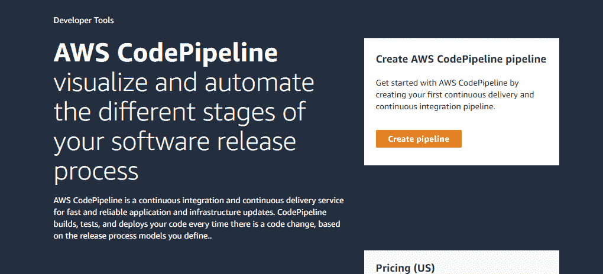
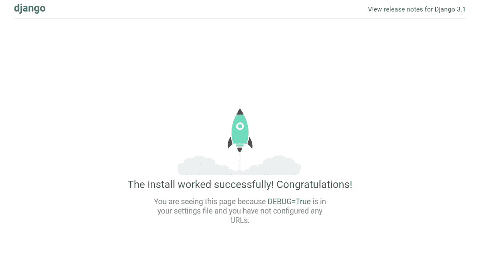
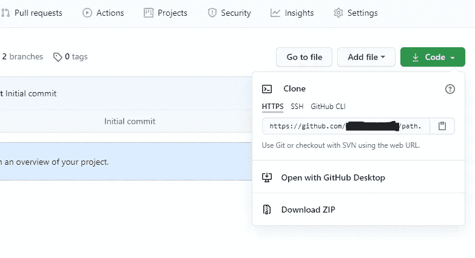
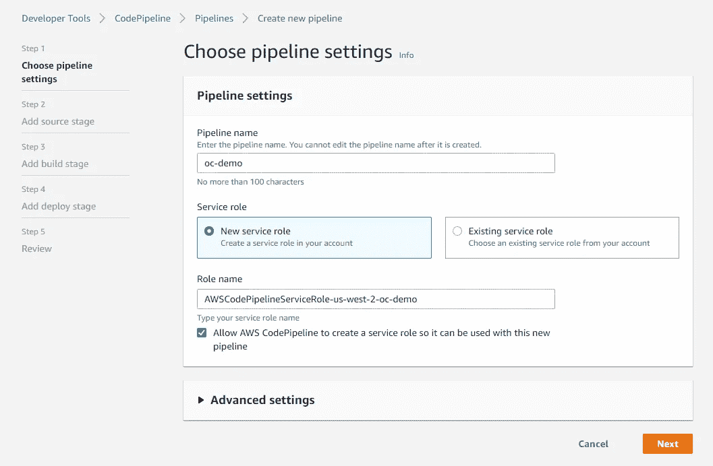
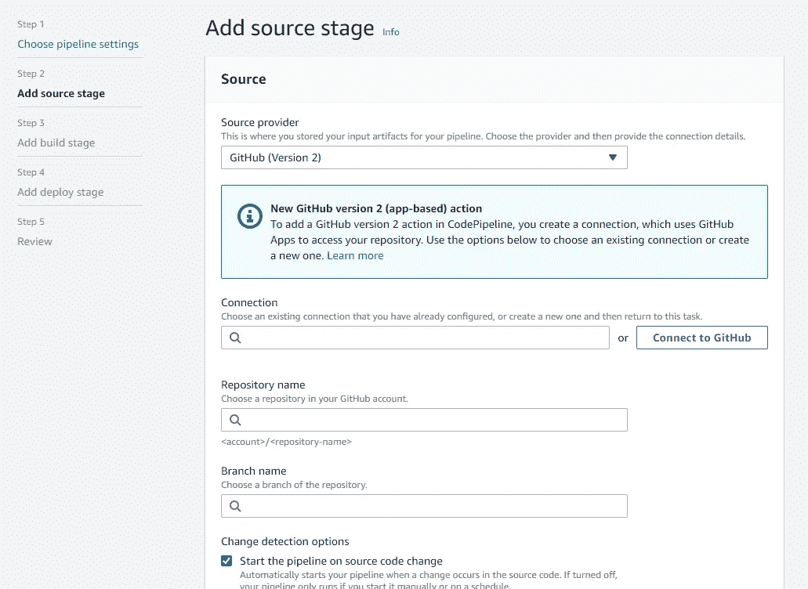
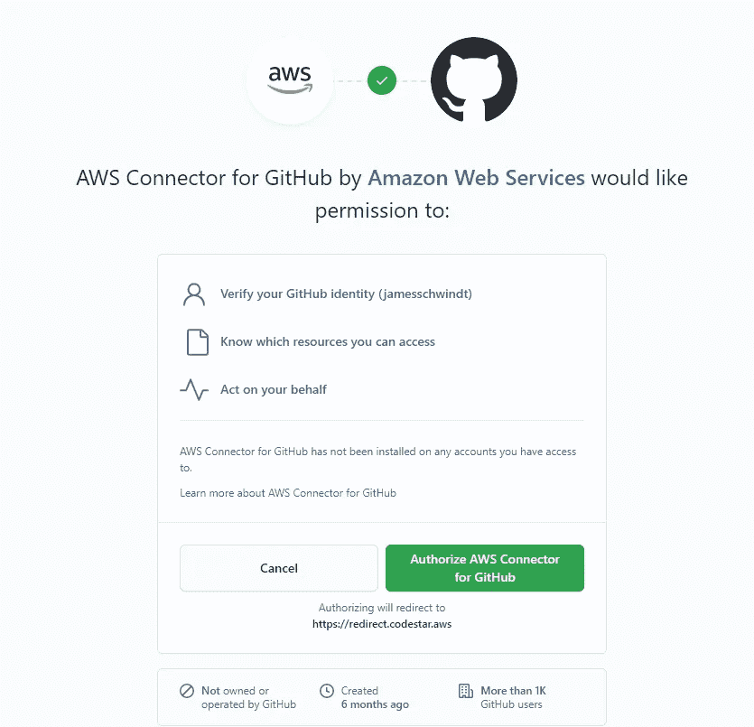
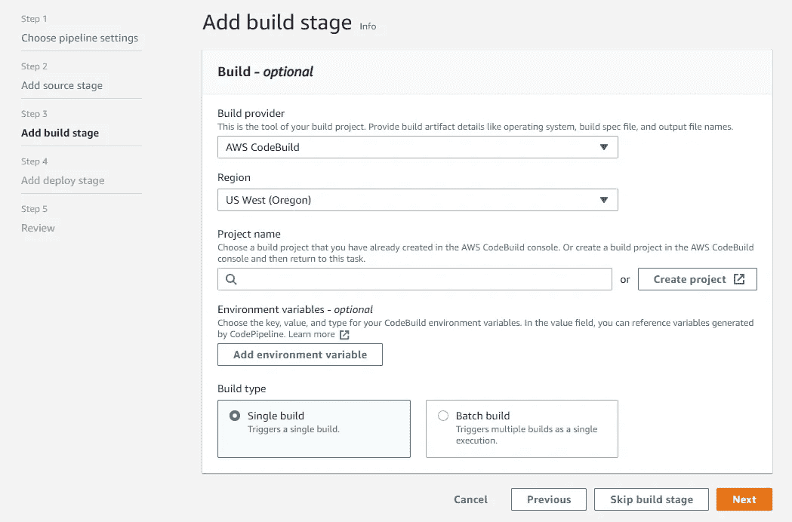
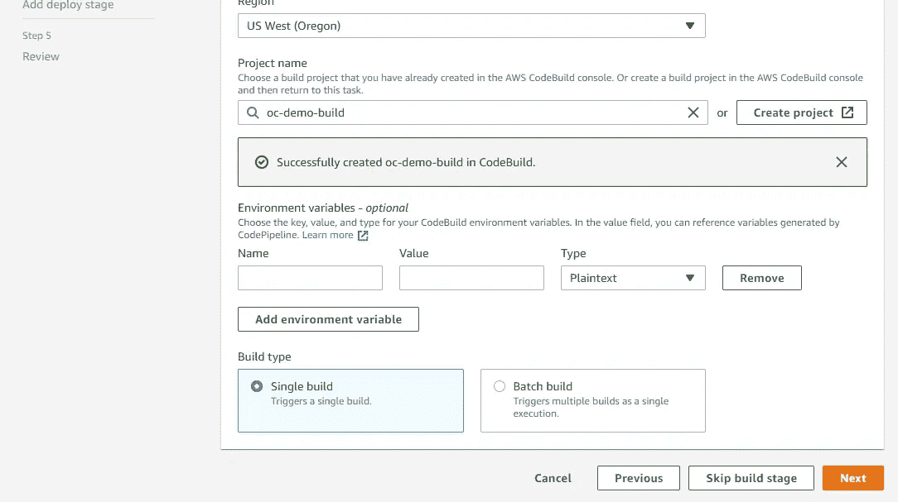
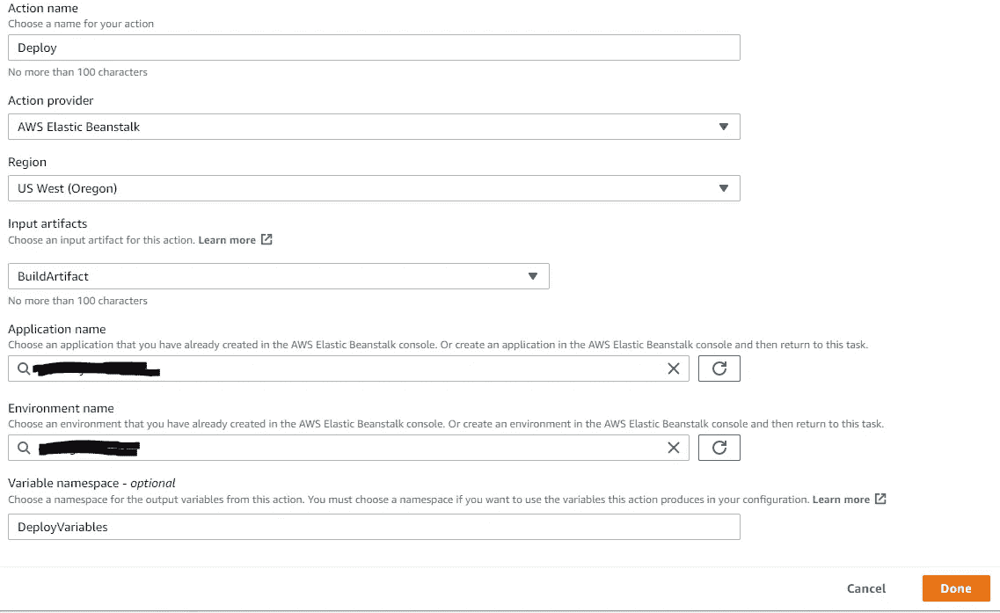
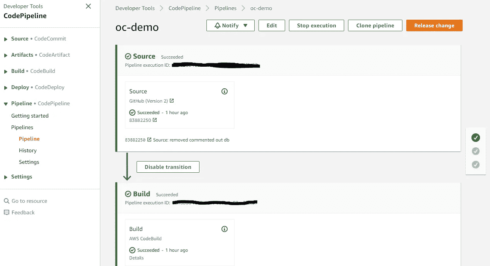

# CI/CD 管道工具和 AWS 代码管道教程

> 原文：<https://levelup.gitconnected.com/ci-cd-pipeline-tools-and-aws-codepipeline-tutorial-ae49e763d120>



# **什么是 CI/CD 管道？**

CI/CD 代表持续集成/持续部署，指的是创建一个代码管道，在其中提交、测试代码更改，然后在没有任何人工干预的情况下进行部署。基本上，开发人员可以向他们的代码库添加一个新特性，并在一个高效、简化的过程中推送更新。

# **为什么 CI/CD 很重要？**

假设您在本地设备上创建了一个 Django web 应用程序，并将其部署在 AWS Elastic Beanstalk 上。如果你以前自己做过或者跟随这个[教程](https://www.ordinarycoders.com/blog/article/deploying-from-aws-eb-console)，你可能知道这是一个非常简单的过程。一旦 AWS CLI 设置完毕，应用程序运行完毕，您就可以运行 eb init，然后运行 eb deploy 来启动。如果需要进行任何更改，可以编辑必要的文件并再次运行 eb deploy。但是，如果您的应用程序整天都在吸引用户，新的代码更改可能会导致错误，用户可能会得到 404 或 500 错误。为了缓解这个问题，开发人员建立了一个 CI/CD 管道，在自动添加到生产环境之前，对任何代码更改进行测试。这也允许大型初创公司的开发人员每天提交数百个变更，而不必手动检查相同的内容。CI/CD 管道将允许您更快、更有效地传送代码——这是可伸缩性的一个关键过程。

# **谁使用 CI/CD？**

任何软件公司或初创公司都可能已经建立了 CI/CD 渠道。事实上，任何新的软件职位通常都需要潜在的开发人员了解如何使用代码管道。只需查看给定软件公司的任何“职业”标签，看看他们推荐了解哪些管道工具。您可能会看到下面列出的工具之一。

# **有哪些常用的 CI/CD 工具？**

*   好朋友
*   崔维斯 CI/CD
*   詹金斯
*   切尔莱西
*   Gitlab
*   代码船
*   AWS 代码管道

尽管工具各不相同，但每个工具都非常相似。它们都涉及到使用 git 将代码推送到与给定 CI/CD 工具相连的存储库中。然后，无需做任何额外的工作，就可以对变更进行测试和部署。当然，每一个都有一些独特的功能，但我们将坚持使用 AWS Codepipeline，因为我们将在 ElasticBeanstalk 上部署，并且我们已经在这里讨论了其他 AWS 主题[。当选择一个 CI/CD 工具时，您可能会考虑一些因素，如定价、实现的容易程度，甚至受欢迎程度，因为其他开发人员可能会熟悉该软件。](https://www.ordinarycoders.com/blog/aws)

# **CI/CD 教程— AWS 代码管道**

别担心，部署自己的代码管道应该没那么难；它可以分为以下几个步骤:创建一个管道，指定项目源代码所在的位置(很可能是 Github)，添加一个构建阶段以在隔离的环境中运行测试，然后选择要部署代码的位置。为了使这变得简单一点，我们将首先完成部署到 ElasticBeanstalk 的步骤。这样，您将从一开始就知道我们将在哪里部署。

**1。设置 Django 应用程序并部署在 AWS ElasticBeanstalk 上**

如果您从未将 Django web 应用程序部署到 ElasticBeanstalk，这里有一个简短的分析。有关详细说明，请查看 [Django 快速入门](https://www.ordinarycoders.com/blog/article/quick-start-django-installation)和[将 Django Web 应用程序部署到 AWS ElasticBeanstalk](https://www.ordinarycoders.com/deploying-to-aws-elastic-beanstalk) 。

从命令提示符/终端，创建一个虚拟环境:`python3 -m venv env` (Mac) `py -m venv env` (Windows)

激活虚拟环境:`source bin/activate` (Mac) `Scripts\activate` (Windows)

CD 进入虚拟环境并安装 Django: `pip install Django`

使用`django-admin startproject mysite`创建一个新的 django 项目

CD 到 mysite 并运行服务器:`python3 manage.py runserver` (Mac) `py manage.py runserver` (Windows)

当您访问 [http://127.0.0.1:8000/](http://127.0.0.1:8000/) 时，您应该会看到以下屏幕。



接下来，在 mysite 项目目录中，将您的依赖项保存在 requierements.txt 文件中:`pip freeze > requirements.txt`

然后创建一个 ebextensions 文件夹:`mkdir .ebextensions`

在 ebextensions 文件夹中，创建一个名为 django.config 的文件，其内容如下:

```
option_settings:
  aws:elasticbeanstalk:container:python:
    WSGIPath: mysite/wsgi.py
```

太棒了，还剩下两步，为我们的项目创建一个 git 存储库并部署到 Elasticbeanstalk，要么通过上面链接的文章中的 AWS 命令行界面，要么通过将我们的[压缩项目上传到 Elasticbeanstalk 控制台](https://www.ordinarycoders.com/blog/article/deploying-from-aws-eb-console)。无论如何，您都需要运行`git init`来初始化一个空的存储库。你可以使用这个指南来安装 git:[https://gist.github.com/derhuerst/1b15ff4652a867391f03](https://gist.github.com/derhuerst/1b15ff4652a867391f03)。不出所料，你需要一个 Github 帐户才能继续。

在初始化您的存储库之后，访问 github.com 并创建一个新的远程存储库，您将把它连接到您的本地存储库。在 Github 上创建新的存储库之后，在您刚刚运行 git init 的命令提示符/终端中输入下面一行来连接两个存储库:`git remote add origin <remote_url>`

用新创建的远程存储库中的 URL 替换`<remote_url>` :



接下来，添加并提交您的文件，然后推送到远程存储库。之后，您应该会在远程存储库中看到您的项目

*   `git add .`
*   `git commit -m "first commit"`
*   `git push origin`

好了，您已经准备好部署您的 web 应用程序了。我已经在上面列出了几个选项，因此您可以选择您想要的部署方式，通过 AWS CLI 或 AWS ElasticBeanstalk 控制台。请记住，如果您选择通过 AWS CLI 进行部署，您所做的最后一次提交将被部署到**而不是**项目中的当前文件。部署后，继续下面的步骤。

**2。创建代码管道**



现在，让我们开始实际的 CI/CD 集成。如果您还没有，请登录您的 AWS 帐户，然后访问 AWS Codepipeline 并单击“创建管道”。为您的管道命名。选择“新建服务角色”，然后单击“下一步”。

**3。添加源阶段**



目前，我们应该有 Github 上托管的演示项目的源代码，所以让我们选择 Github(版本 2)。版本 2 以更安全的方式管理认证，而版本 1 使用 OAuth 令牌，根据官方[文档](https://docs.aws.amazon.com/codepipeline/latest/userguide/update-github-action-connections.html)不再推荐使用。选择“连接到 Github”并通过命名您的连接来创建连接，然后安装新的 Github 应用程序。您将被要求授权许可。



创建连接后，如果成功，您应该会在绿色框中看到“准备连接”。选择您想要使用的存储库和分支名称。然后选择“CodePipeline default”而不是克隆整个存储库，并点击“Next”。

**4。添加构建阶段**



现在我们需要设置一个构建环境。基本上，我们可以选择 AWS CodeBuild 或 Jenkins 在单独的服务器上构建我们的项目，以便在部署之前在隔离的环境中运行测试。如果继续，选择 AWS CodeBuild，然后单击“创建项目”框。一个新窗口将会打开。为您的构建项目命名。对于环境映像，我们将选择“托管映像”，对于操作系统，Amazon Linux 2，对于运行时，标准，对于映像版本，选择最新版本。我们将保留其余的配置选项。



一旦完成，您应该会看到一个绿色的框，表示您的构建创建成功了。应该添加环境变量，但是，我们通常使用 [python-decouple](https://www.ordinarycoders.com/blog/article/secure-django-variables-with-python-decouple) 在我们的项目中设置 env 变量，并将一个. env 文件添加到私有存储库中；所以我们跳过这一步。选择“单一构建”并点击“下一步”。

**5。增加部署阶段和评审:**



(注意:上图看起来会和你第一次进入这一步的时候有点不一样。这是设置管道，然后返回并编辑此步骤后的图像。)因为我们在第一步中在 Elastic Beanstalk 上部署了我们的应用程序，所以我们将选择这个选项作为我们的部署提供者。然后选择您之前创建的正确的应用程序和环境。单击“下一步”,查看我们配置的所有选项。这应该会让你对整个过程有一个很好的了解。

**6。使用构建规范**再次部署

有趣的部分来了。首先，将 buildspec.yml 添加到 mysite 项目文件夹中:

```
version: 0.2phases:
  install:
    runtime-versions:
      python: 3.7
    commands:
      # Install dependencies needed for running tests
      - echo Installing dependencies
      - pip install -r requirements.txt build:
    commands:
      - echo Build started on `date`
      - echo Running tests
      - python3 manage.py test post_build:
    commands:
      - echo Build completed on `date`artifacts:
  files:
    - '**/*'
```

接下来，通过用自己的主页替换调试页面来更改 Django 项目。然后添加、提交和推送更改。将您的更改推送到主分支后，您的代码管道将会启动！你会看到你的代码经历不同的阶段；从从 Github 检索到在 AWS CodeBuild 中测试，最终部署到您的 ElasticBeanstalk 环境中。如果一切顺利，那么您应该会在每个阶段旁边看到一个绿色的复选框。



否则，您将在其中一个阶段得到一个错误，并需要使用提供的日志进行调试。

# **结论**

本 CI/CD 概述和教程到此结束。让我在评论中知道我是否应该扩展某些观点，或者如果你对某个给定的主题有一点困惑。本教程是针对一个简单的 Django 项目的，所以我没有讨论如何处理不同的数据库。例如，如果使用 AWS RDS，settings.py 文件中可能包含以下内容:

```
DATABASES = {
     'default': {
        'ENGINE': 'django.db.backends.postgresql',
        'NAME': config('DB_NAME'),
        'USER': config('DB_USER'),
        'PASSWORD': config('DB_PASSWORD'),
        'HOST': config('DB_HOST'),
        'PORT': config('DB_PORT'),
        }
    }
```

这实际上在 AWS 代码构建阶段产生了一个问题。我们的构建环境没有连接到远程数据库的权限。但是，有一些解决方案。

*   在构建阶段添加一个 VPC，以授予您的构建环境连接到 RDS 数据库的权限。
*   向您的构建项目添加特权访问，这样您就可以使用 Docker 在构建环境中创建数据库(我在使用 localhost 作为主机连接 Docker 容器时遇到了问题)
*   (推荐)根据您的 RDS 数据库的快照创建一个临时数据库，遵循这个官方指南:[https://AWS . Amazon . com/blogs/devo PS/enhancing-automated-database-continuous-integration-with-AWS-code build-and-Amazon-RDS-database-snapshot/](https://aws.amazon.com/blogs/devops/enhancing-automated-database-continuous-integration-with-aws-codebuild-and-amazon-rds-database-snapshot/)
*   在构建阶段使用 SQLite，在部署时切换到生产数据库。

此外，我从未提及 buildspec.yml 文件中发生的事情。我们正在指定在构建阶段的特定阶段运行的命令，以设置我们的依赖项和测试。如果你想测试一些东西，运行`py manage.py createapp main`为你的项目创建一个应用程序。这里有一些测试来检查一个 robots.txt 文件是否被正确地添加到你的站点中。这有助于[将你的 Django 项目连接到谷歌搜索控制台](https://www.ordinarycoders.com/blog/article/google-search-console-django)。

```
from django.test import TestCase
from http import HTTPStatus# Create your tests here.class RobotsTxtTests(TestCase):
    def test_get(self): response = self.client.get("/robots.txt")
        self.assertEqual(response.status_code, HTTPStatus.OK)
        self.assertEqual(response["content-type"], "text/plain")
        lines = response.content.decode().splitlines()
        self.assertEqual(lines[0], "User-Agent: *") def test_post_disallowed(self): response = self.client.post("/robots.txt")
        self.assertEqual(response.status_code, HTTPStatus.METHOD_NOT_ALLOWED)
```

希望你喜欢！

*原载于*[](https://www.ordinarycoders.com/blog/article/deploying-django-aws-codepipeline)**。**