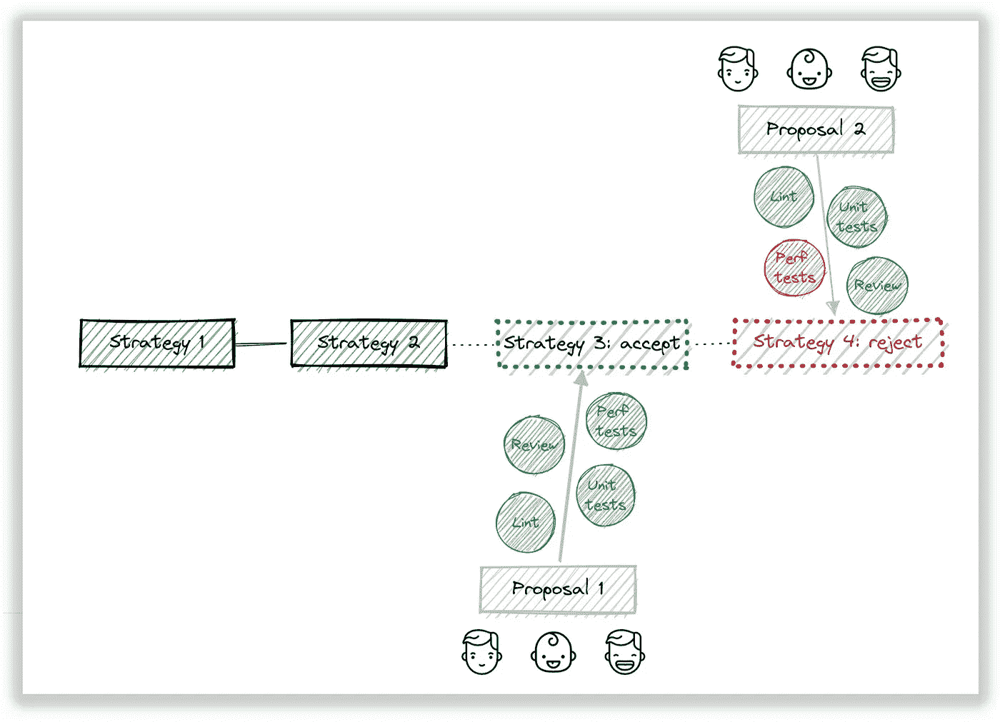
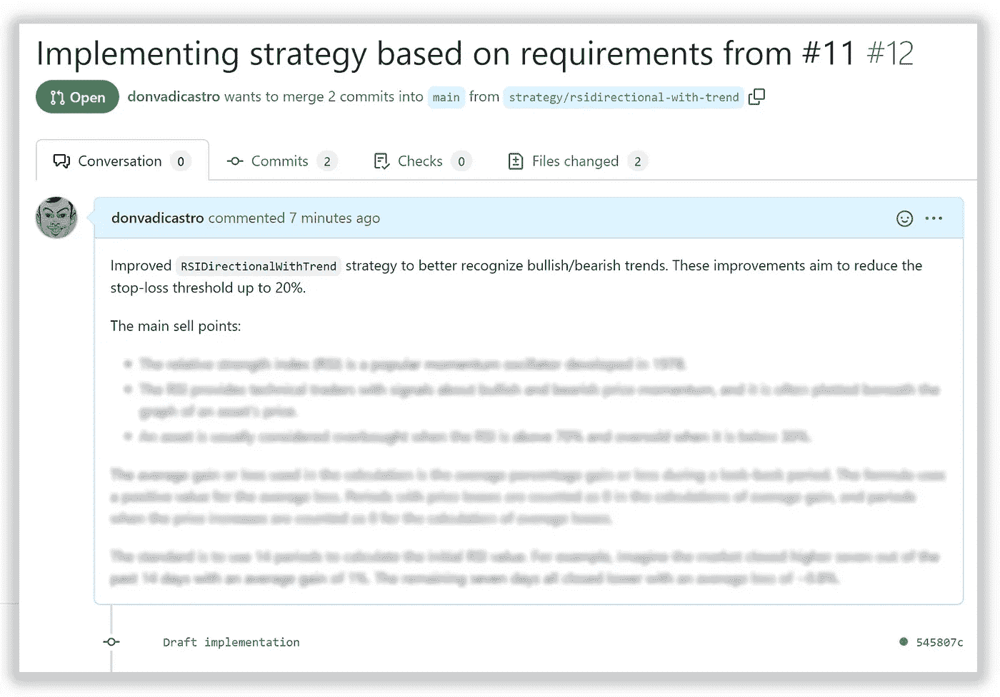
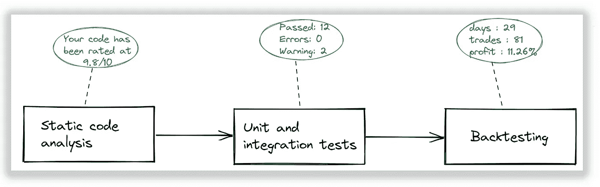
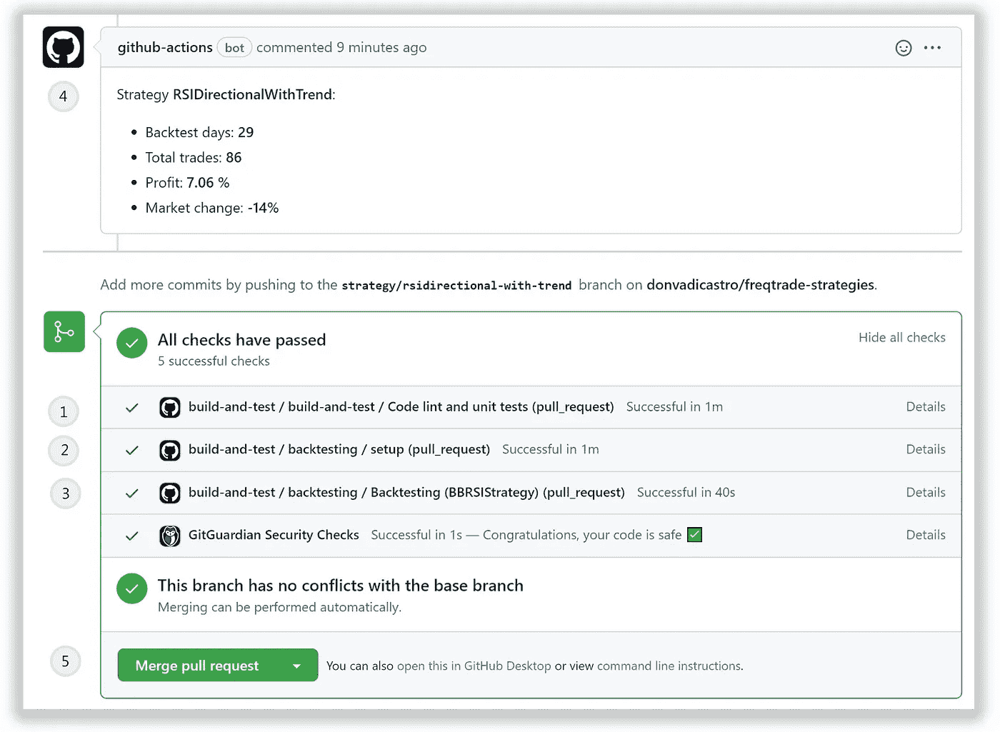

# 加密交易中的 CI/CD 实践(上)

> 原文：<https://levelup.gitconnected.com/ci-cd-practices-in-crypto-trading-part-1-7bee5dac75e1>


Pierre Borthiry 在 [Unsplash](https://unsplash.com?utm_source=medium&utm_medium=referral) 上拍摄的照片

# 关于怀旧的故事

尽管从事了很长的工程职业，我仍然记得我与计算机交互的第一印象，因为智能机器可以处理我的原始命令行请求，并使用原子数学计算序列产生预期的结果——例如，输入数字的平方根或斜边的长度等。精确的机器解决数学问题的能力比使用不同语言编写的经典“hello world”更有吸引力。

时光荏苒，在写了大量代码并深入解决问题之后，这种第一印象被日常生活所掩盖，所有这些机器魔法已经神奇地消失了。

但当我有机会深入设计数字资产的交易策略时，我体验到了与使用计算资源解决数学问题和预测行为模式完全相同的满足感。很可能在一个全新的专业水平上，这是相同的“stdin => compute => stdout”效果。结果，我真的充满了热情去考察未知的领域。

只是，我想利用我过去的经验来减少失误率和可能的重大投资组合损失。

## 混合颜色


我已经充满信心，伟大的设计决策是建立在不同概念的边界上的，就像艺术家通过组合不同的颜色和份额来创造新的调色板一样:

*   微前端是围绕后端微服务的概念构建的
*   服务器端代码生成工具重用众所周知的前端 cli 实践
*   或者更令人震惊的技术，比如通过 WebAssembly 代理在客户端浏览器中运行本机图像

如果这个想法听起来有点疯狂，不要停下来。试试看。

那么，在密码交易中尝试结合 CI/CD 实践怎么样？采用一个成熟的交付渠道来推广一个几乎不费吹灰之力的交易策略，减少策略设计者的入职体验，这是否合理？与结果相比，这些努力值得吗？

让我们至少试一试。但首先，让我们定义要实现的目标。


激励

# 要实现的目标

在真实环境中创建和运行交易策略，确保:

*   基于定义的质量特征，它足够有效(否则策略需要被关闭或回滚)
*   它高度可靠(我们希望满足可用性、预期延迟等方面定义的 SLA)
*   策略设计不需要特定的基础设施、设计和编码专业知识(有足够高的 DSL 来描述意图，而不暴露实际的产品/框架细节)
*   推广不需要开发工作(新策略可以自动推广到工作环境中，并具有最小的“上市时间”间隔)

为了最小化开发和交付成本，我们必须使用有效的交付实践。

**有效的交付实践包括:**

*   敏捷开发思维(在整个软件开发周期中适应持续变化*的灵活性)*
*   协作开发模式(许多人可以在单一产品/功能上工作)
*   自动化代码交付过程
*   有效的软件验证阶段(检查功能增量的各种适应性功能，如果某些功能没有通过，则拒绝交付管道)
*   监控和可观察性(更快地检测问题和异常，确保基础设施正常运行)
*   蓝色/绿色部署，用于维护不同的产品/功能版本，内部/外部(测试/生产)活动的独立环境

**要覆盖的用例:**

*   作为一个用户，我想改变我当前的策略设计或创建一个新的，并确保如果发现任何基于质量要求的问题，功能增量将被自动拒绝，或者如果全部通过，则被接受
*   作为一个用户，我想确保我的策略能够成功地推广到一个开发人员零成本的真实环境中，如果它满足环境 SLA 的话
*   作为一名用户，我希望确保我的策略在违反环境 SLA 时会自动停止使用

# 成套工具

*   [https://www.freqtrade.io](https://www.freqtrade.io) 用于战略设计和执行
*   [https://github.com/features/actions](https://github.com/features/actions)自动化验证和交付
*   [https://github.com](https://github.com)为协同发展模式

# 履行

## 步骤 1:使用领域友好的抽象来表示策略

交易策略是建立在外部或内部因素产生的信号基础上的。信号是基于交易指标、新闻或人为意图的数学评估条件。所有这些看起来都非常模糊、特定于业务，并且没有足够的结构来简化为单一的共同点。

同时，领域设计需要定义严格和干净的有界上下文以及这些上下文之间的连接，声明领域模型和这些模型的层次结构。

那么如何以最抽象的方式声明业务上下文呢？我认为“类”是描述独立自足的领域元素的最方便的 OOP 抽象。将策略描述为一个类可以显著提高原子性和可测试性。

但是这听起来更像是一个教条——使用类，因为所有优秀的工程师都在使用类。如果它仅仅满足了 OOP 鉴赏家的老俱乐部的需求，这就没有什么意义了。将策略表示为一个类的真正好处是自给自足和上下文完整，仅使用其内部状态来计算所需的行为。这使得有可能模拟不超过定义的边界(局部性原则)的不同场景，并且即使没有实际数据也可以测试不同的场景。

Freqtrade 提供了一个有效的数据结构来描述一个使用“OHLCV”数据帧作为输入数据的“策略”实体。使用 Python 类描述的这种策略的一个例子是:

```
class SomeStrategy(IStrategy):
    # minimal ROI
    minimal_roi = { ... } # optimal stoploss
    stoploss = ... # optimal ticker interval
    ticker_interval = ... # additional, informative pair/interval combinations
    def informative_pairs(self):
        ... # adds additional TA indicators to the given DataFrame
    def populate_indicators(...) -> DataFrame:
        ... # populates the buy signal for the given dataframe
    def populate_buy_trend(...) -> DataFrame:
        ... # populates the sell signal for the given dataframe
    def populate_sell_trend(...) -> DataFrame:
        ...
```

正如我们所看到的，这种表示允许将所有需要的依赖关系封装在一个实例中。这允许使用唯一的内部状态来计算卖出和买入信号，并使这种抽象高度可测试，更容易支持和维护。

## 第二步:尊重合作贡献模式

为了在设计新的和支持遗留策略时真正高效，我们需要确保知识共享、指导和点对点审查是默认的开发风格。

因为深厚的领域知识是成功的基础——我们需要确保领域和主题专家参与早期阶段的策略设计和之后的验证阶段。



协作支持模型

作为阶段 1 的结果，我们已经选择了一个足够好的策略描述 DSL 来在开发、产品和业务团队之间进行交流，所以让我们使用 GIT 项目作为这种交流的来源(使用 pull 请求)。

有了这些，我们就可以将第一个需求应用到我们的交付管道中——每个变更请求都需要由相应的业务部门团队代表进行同行评审:

*   开发团队从架构、可重用性、模式角度检查代码质量
*   业务团队检查策略意图和运行时特征
*   安全团队检查可能的投资组合和预期的预算过度使用



## 步骤 3:定义要检查的质量特性和适应度函数

如果策略被表示为一个类——它可以被单元测试。这允许在实际运行之前检测行为问题。如果我们设计自己的生长指标——我们可以检查信号是否在特定的数据框架内成功产生。如果我们有一个复杂的工作流程来基于我们的投资组合状态定义“数量”——我们可以模拟这些场景并检查。这种类型的白盒测试还允许我们与业务团队进行沟通，交流作为战略支柱的低级测试场景。

一般来说，策略的有效性是基于输入信号的正确性，因此通过适当的单元测试内部行为来提高 its 的质量并减少负面噪声也可以提高整体策略的有效性。

但是质量不仅仅是作为通过测试场景的百分比来衡量的，也是作为整体策略有效性(赢信号对输信号的百分比)来衡量的。因此，我们可以根据策略黑盒测试的需要来定义这个质量特性，并定义附加的适应度函数来检查它，作为交付管道执行的一部分。



持续集成管道

因此，在战略交付渠道中，将会有下一个强制验证关口:

*   策略定义的静态代码分析
*   其内部行为的单元测试(白盒测试)
*   对真实标记数据的回溯测试(黑盒测试)

只有通过了所有阶段，我们才能选择一个提案，在交付流程中进一步推广。如果一些失败了——一个提议被拒绝并被排除在发布序列之外。

让我们回顾一个特定的示例—改进现有战略并创建一个拉动式评审请求:



CI 管道执行结果

让我解释一下这个过程:

1.  针对代码规则违规检查建议的功能增量，并检查单元测试执行的结果
2.  随着第一阶段的过去，CI 加载了上个月的历史蜡烛图，用于回溯测试
3.  提议的策略经过了回溯测试，总体 CI 步骤被标记为通过，因为总估计利润为正
4.  回溯测试报告作为 PR 意见发布，以简化进一步的调查
5.  因为满足了所有要求，所以允许将 PR 提案合并到主干中

到目前为止，我从支持这个过程中获得了以下好处:

*   我可以让业务人员参与战略评审，因为它直观简单
*   我可以尊重合作模式和人为错误，因为我可以肯定，应该考虑基本的质量要求，以促进管道中的进一步增加
*   我可以很容易地检查我的假设和其他建议，因为我知道基于定义的质量阈值有足够快的全自动响应

**仪表**:

*   [GitHub 动作](https://github.com/features/actions)来声明性地描述管道
*   [Python 环境](https://github.com/actions/setup-python)，用于在 CI 容器内部进行内衬和测试，安装了 [pylint](https://pylint.org/) 和 [pytest](https://docs.pytest.org/) 库
*   [Freqtrade docker 运行时](https://www.freqtrade.io/en/stable/docker_quickstart/)下载历史数据和回溯测试
*   [GitHub 注释操作](https://github.com/peter-evans/create-or-update-comment)向链接的问题或拉式请求发布消息

## 第四步:环境隔离

一旦特性提案被接受，下一个阶段就是将它提升到一个类似 prod 的环境中进行更健壮的验证。需要它来确保“真空”验证满足现实世界的挑战。

由于帖子太大，在这里暂停一下。在下一章中，我们将介绍如何使用 github events 向内部(非云)测试环境发布一个经过验证的策略，作为自我交付管道的一部分，并收集一个实时统计数据，以便对其在现实世界中的盈利能力做出决策。

感谢任何反馈。祝你从你的发现中获益。