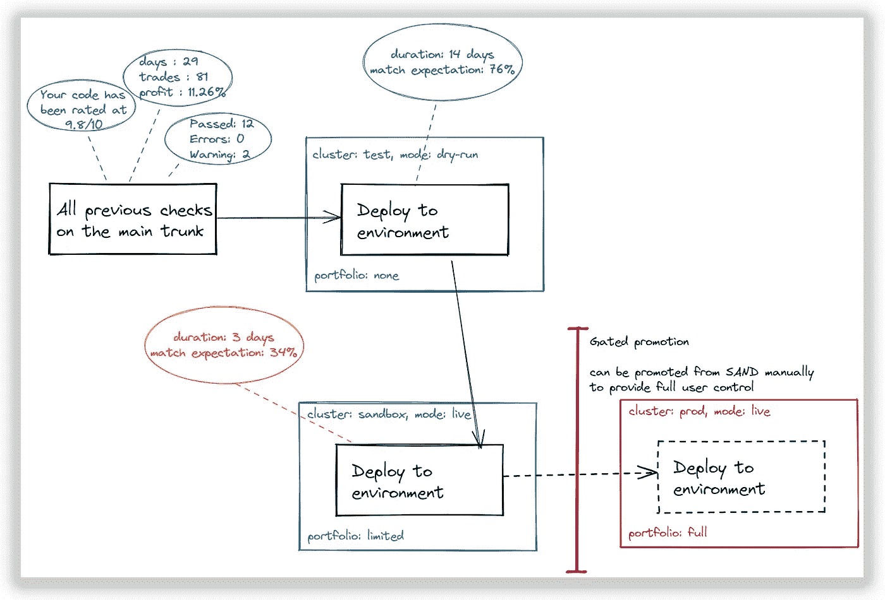
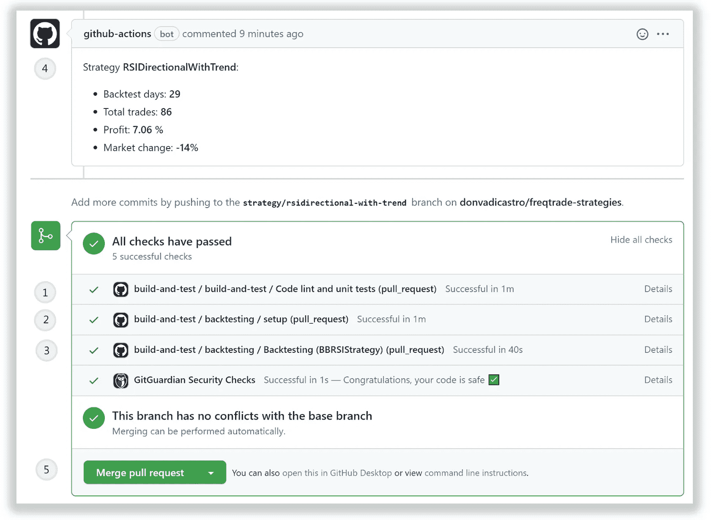
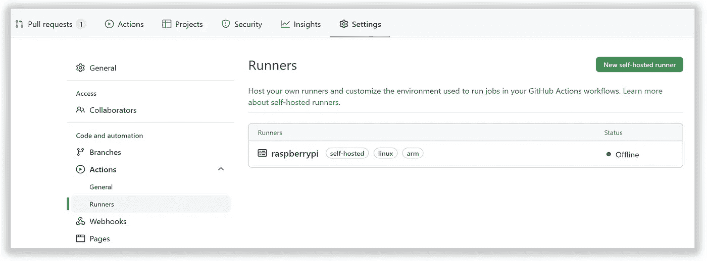
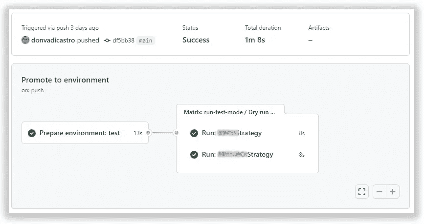
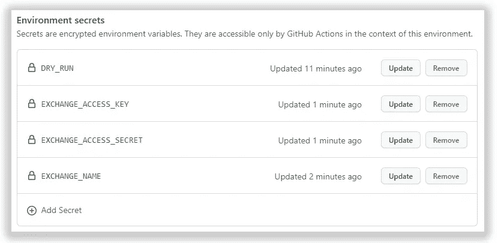
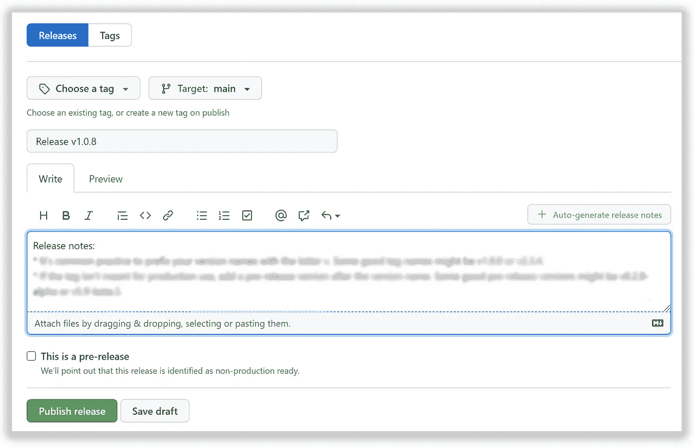
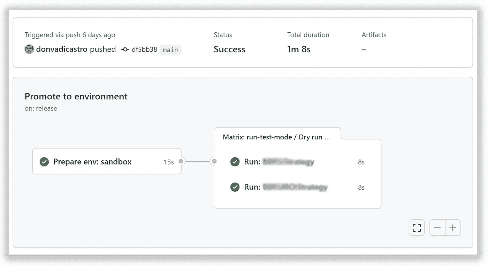
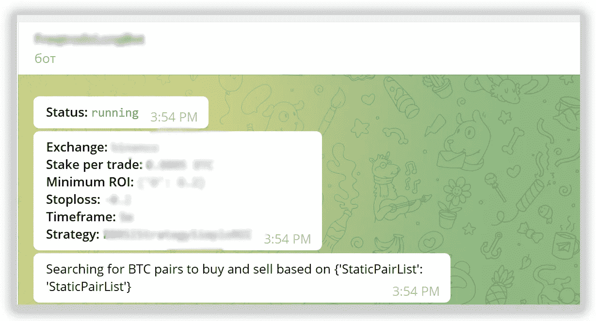

# 加密交易中的 CI/CD 实践(下)

> 原文：<https://levelup.gitconnected.com/ci-cd-practices-in-crypto-trading-part-2-1b504c620d45>

Pierre Borthiry 在 [Unsplash](https://unsplash.com/?utm_source=medium&utm_medium=referral) 上拍摄的照片

[在本次旅程的第一部分](https://medium.com/@vadim.barilo/ci-cd-practices-in-crypto-trading-part-1-7bee5dac75e1)，我们设计了战略验证管道的初始阶段，重点是内部行为检查和整体真空战略盈利能力衡量。

其中包括:

*   策略类定义与开发团队(林挺)定义的代码质量规则相匹配
*   策略行为特征匹配预定义的用例(单元测试)
*   基于历史数据的战略执行符合定义的盈利能力阈值

持续集成管道

但是提醒一下——如果我们可以开始交易并看到战略盈利能力，我们为什么要做这些？正是因为相反的原因——避免使用低效的算法进行交易。这里的“低效”是指算法没有通过利益相关者和主题专家的检查，并且显示的结果低于定义的阈值。

一旦特性提案被接受，下一步就是使用一个发布系列将它提升到一个类似 prod 的环境中，以进行更健壮的验证。需要它来确保“真空”验证满足现实世界的挑战。

## 释放列车

release train 的必要性是以最小的开发和跨团队协议成本，自动将代码从多个分布式团队提升到定义的环境。在我们的例子中，“代码”可以理解为“策略”。

此外，主题敏感性需要一个避免敏感数据暴露和错误配置的人工无误的提升过程。

我们需要至少 3 个环境来让一个新策略被完全采纳。这里的“采纳”是指我们可以长期信赖的战略设计。

这些环境是:

*   *测试*:策略以“模拟”模式运行，没有连接实际投资组合
*   *沙盒*:策略以“实时”模式运行，投资组合权重显著降低(更小的持股量和更小的未平仓交易限额)
*   *Prod* :战略以“实时”模式运行，在更加稳定和高度安全的环境中具有所需的投资组合权重(增加的资源和更好的云可用性特征、基于角色的访问受限的专用虚拟网络，以及零信任架构)。

连续输送管道

显然，我们的最终目标是将一个策略提升到 PROD 环境中进行长期执行。这可以自动发生(通过在指定的时间范围内监控实际执行)或手动发生。

每个环境监控策略的有效性，并使用这个统计数据来决定它的命运——是进一步提升还是回退。

## **提升到测试环境**

一旦新的策略提案符合所有质量要求，创建的拉动式请求就可以在主分支中进行合并，并且“合并”按钮被激活。

让我们进行一次合并，这将触发 CD 管道中下一阶段的开始—部署到测试环境。

接受这个话题的敏感性和违反安全需求的严重后果(可能的金钱损失)——我们将避免使用公共云基础设施来引导测试平台。让我们在下一篇文章中为数字资产交易设计一个零信任网络的解决方案，但现在保持它与外部访问完全隔离。

幸运的是， [github actions](https://github.com/features/actions) 可以通过提供对内部平台的支持来帮助解决这个问题。我们可以在私有基础设施中注册自己的运行器，一旦触发了适当的存储库事件，它将接收执行请求(在我们的例子中，将代码合并到主生产分支)。

定制滑槽

我将使用我的 **RaspberryPi** 设备，上面有 docker 引导程序。此外，需要按照[详细说明](https://docs.github.com/en/actions/hosting-your-own-runners/adding-self-hosted-runners)安装作业滑槽。

把一个策略提升到覆盆子并运行

但是如何区分——特定的运行环境将使用什么样的特定策略配置。我们最不希望的就是硬编码特定于环境的配置并将其存储在存储库中——这至少是不安全的。

让我们遵循 [12 因素方法](https://12factor.net/)并使用针对每个环境的单独配置，为所有环境部署一个免配置代码库。Github 可以通过使用[环境支持](https://docs.github.com/en/actions/deployment/targeting-different-environments/using-environments-for-deployment)公共(或付费私有)存储库来帮助满足这个需求。

在创建测试环境之后，我们可以声明特定于环境的配置选项，这些选项将通过环境变量在定制的运行器上被访问。我们至少需要最少的配置选项:

*   *模拟运行* —运行模式，TRUE 表示策略连接到虚拟化产品组合(不使用实际用户帐户)
*   *交换访问密钥* —用户投资组合访问密钥
*   *交换访问密码* —用户投资组合访问密码
*   *交换名称* —不言自明

配置环境

## 提升到沙盒环境

到目前为止一切顺利。我们有一个部署到测试环境中的策略，该测试环境一直在模拟运行模式下运行，以收集其自身的盈利能力指标。另一个“好”——环境之间的所有差异都在于它们的配置，而不在于特定于环境的策略设计。

我们现在可以检查运行的统计数据，以决定在发布系列中进一步提升它，或者回滚到审查和改进。

由于沙盒环境已经是一个您可能会失去金钱的地方，因为它需要一些投资组合来连接，所以首选的方法是避免自动提升，而是将此决策的责任交给产品所有者。以后的任何时候促销程序都可以完全自动化。

那么什么是开始推广的好事件呢？我会选择“release tag created”作为要响应的事件。它还有以下好处:

*   新的发布标签表明解决方案通过了所有的需求检查
*   可以仅对特定角色(例如，仅“项目管理员”中的用户)进行保护，以将责任仅赋予特定的一组人。
*   因为它需要手动操作，所以它基于其他观察来指示交付的代码增量的某种信任状态

创建发布标签

发布创建事件将触发一个提升管道，该管道将使用当前工件作为沙盒环境中 strategy runner 的源。

释放到沙盒

我们使用同一个 runner，这是唯一应用的另一个配置:使用有效的用户凭证访问 exchange API 的实时运行。

瞧，在类似生产的环境中，策略会在一段时间内启动，并在电报中发出关于其健康状态的信号。

## 工具集:

*   [Freqtrade 在 docker](https://www.freqtrade.io/en/stable/docker_quickstart/) 进行战略执行
*   https://github.com/features/actions 的[自动送货](https://github.com/features/actions)
*   [https://github.com](https://github.com)为协同开发模式
*   安装了[对接引擎](https://docs.docker.com/engine/install/debian/)的 RaspberryPI
*   电报机器人与策略运行时通信

## 步骤 5:可观察性(监控和警报)

我们已经可以放松下来，观察战略执行了。它需要一些时间来收集历史数据，以证明或反对其效率。

但是，如何自动收集这些数据作为数据点，然后将它们聚合起来，在某个监控工具中可视化策略效率呢？

它的有效性可以作为时间的函数来衡量。如果我们可以定义它(例如，一段时间内的平衡、一段时间内的胜率等。)，然后我们可以收集数据点，计算结果，并将其盈利能力可视化为该数据的函数。

此外，定义的业务指标有助于做出在环境堆栈中向前或向后移动策略的决策(例如，如果结果在指定的时间范围内稳定，则从“SAND”移动到“PROD”)。多功能监控和改进的健康检查也是保持 strategy runner 处于健康状态的先决条件。

但是让我们在这里暂停一下，因为这个帖子变得太大了，并且在另一个方面过饱和了。