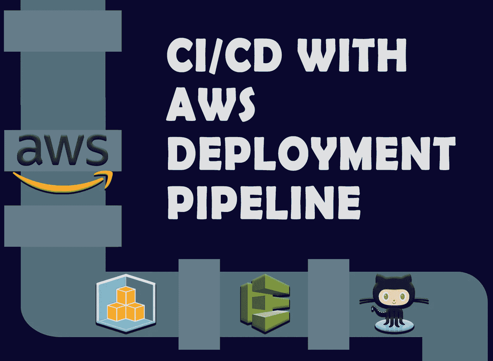
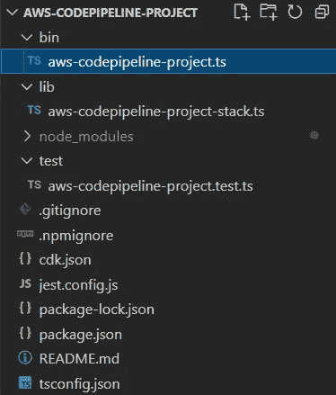

# 带有 AWS 代码管道的 CI/CD

> 原文：<https://levelup.gitconnected.com/ci-cd-with-aws-codepipeline-a452c5b88c60>

## 如何使用 AWS CodePipeline 和 GitHub 为 CDK 应用程序创建部署管道



作者为[的作品](https://pawara73.medium.com/)

这是另一篇“如何做”的文章，将描述使用 AWS 代码管道创建部署管道的过程。现在，项目的构建、测试和部署不再是手工进行的。借助各种云服务提供商提供的 CI/CD 技术，任何应用程序的整个部署流程都得到了简化，只需最少的人工干预。

AWS Codepipeline 是 AWS 提供的一种服务，用于自动化项目的发布管道。在本文中，我们将自动化 CDK 项目的部署管道，并将 AWS Codepipeline 集成到 GitHub 存储库中。

*【在本文末尾找到源代码】*

## 什么是 AWS 代码管道？

根据 AWS 自己的说法，AWS CodePipeline 是一种完全托管的连续交付服务，有助于实现发布管道的自动化，以实现快速可靠的应用程序和基础架构更新。当提交对代码库的更改时，您可以自动化您的 CDK 应用程序的整个构建、测试和部署过程(您可以在发布模型中定义特定的触发器)。因此，Codepipeline 是用于持续交付 AWS CDK 应用程序的构造库模块。

这是一项始终免费的服务，但在 AWS 免费层下，每月为您提供 01 个活动管道，之后则属于现收现付选项。CodePipeline 的特点是它可以与 AWS CodeCommit、CodeStar 或 GitHub 等第三方服务以及自己的定制插件集成。

## 使用 AWS CodePipeline、CDK 和 GitHub 的部署管道

我们将实现 CI/CD 管道，如图 1 所示。


图 01:部署管道的高层架构(来源:由[作者](https://pawara73.medium.com/)用 [draw.io](https://app.diagrams.net/) 设计)

CDK 项目的代码库、lambda 函数的源代码和发布管道都包含在 GitHub 库中。图 01 中间框中描绘的管道将在 AWS 账户中创建，并通过回购中的 CDK 代码进行定义。

我们将对它进行设置，以便每次我们提交对 GitHub repo 的更改时，它都会发布到测试环境中的 AWS lambda 函数。管道中的下一个主要步骤是需要手动批准，在将代码部署到生产环境之前，您必须检查更改并批准。生产阶段也采用了 lambda 函数。

# 步骤:01 —先决条件

您需要创建或安装一些先决条件(按照链接)，我不打算在本文中解释。您可以很容易地按照 CDK 研讨会的先决条件步骤来配置您的本地环境。(在 Windows 中，如果终端命令不适用于 PowerShell，请使用命令提示符)。

> 注:如果你对 CDK 不熟悉，强烈推荐关注 [CDK 工作坊](https://cdkworkshop.com/)(免费)并参考这篇文章，下一篇。

1.  [安装 AWS-CLI](https://cdkworkshop.com/15-prerequisites/100-awscli.html)
2.  [创建 AWS 账户并配置凭证](https://cdkworkshop.com/15-prerequisites/200-account.html)
3.  [安装节点 j](https://cdkworkshop.com/15-prerequisites/300-nodejs.html)
4.  [安装 CDK](https://cdkworkshop.com/15-prerequisites/500-toolkit.html) (全球)
5.  创建一个空的 GitHub 存储库并克隆它

完成先决条件之后，您可以按照下面的步骤来设置您的第一个 AWS 部署管道。

# 步骤 02:设置 CDK 项目

## 1.建立 CDK 项目的初始代码库

创建一个文件夹，并给出您偏好的名称(我的是*AWS-code pipeline-project*)。打开文件夹中的 VS 代码(或任何代码编辑器),运行以下命令来初始化 CDK 应用程序。

```
cdk init app --language typescript
```

(是的，我将使用 typescript 来实现 CDK 项目的代码库。)



图 02:CDK 项目的初始文件夹结构(来源:[作者](https://pawara73.medium.com/)截图)

一旦项目成功初始化，导航到“bin”目录并打开文件*“your-root-directory-name . ts”*并进行以下修改。我添加了一些注释来解释代码，以及哪里需要修改。

bin/your-project-name.ts

接下来，修改 lib 目录中的'*your-root-directory-name-stack . ts '*，如下所示。

lib/您的项目名称堆栈. ts

在 AwsCodepipelineProjectStack 类中，我们创建了一个新的代码管道构造。可以用合适的名称(我的是 CDKTestPipeline)来命名。接下来，添加一个新的合成“ShellStep ”,指向我们的 GitHub 库，CDK 代码库就在这里。在那里，管道执行将在我们的存储库的主要分支发生任何变化时发生。最后，为管道中的构建步骤添加命令:

*   *npm ci* - (npm 全新安装)，类似于在自动化环境中使用的 npm 安装。
*   npm 运行构建 -允许我们为项目执行任何必要的构建/准备任务。
*   npx cdk synth -合成我们在云形成堆栈中拥有的任何东西，以生成自变异管道。

## 2.将更改提交到远程 GitHub 存储库

在将更改提交到远程存储库之前，首先检查配置。

设置远程原点。

```
git remote add origin https://github.com/aLLUPS/aws-codepipeline-project.git
```

如果您的 CDK 项目中缺少一个. gitignore 文件，那么请确保添加一个并在其中包含“node_modules”。

然后提交更改并将代码库推送到远程存储库。

# 步骤 03:在 AWS 中提供访问和配置

## 1.生成 GitHub 个人访问令牌

现在我们需要在 GitHub 存储库和 AWS 帐户之间创建一个连接。为此，我们需要一个访问令牌，该令牌允许 AWS 正确访问我们的 GitHub 存储库。

要做到这一点，在你的 GitHub 账户中进入开发者设置，在个人访问令牌下，点击“生成新令牌”(图 03)。为新令牌提供一个合适的名称，并确保选中复选框: *repo* 和 *admin:repo_hook。*然后点击“生成令牌”。生成令牌后，将其保存在某个地方，因为您将无法再查看它。


图 03:生成 GitHub 个人访问令牌(来源:[作者](https://pawara73.medium.com/)截图)

## 2.配置 AWS 帐户

转到 AWS 管理控制台，搜索“Secrets Manager”。这是一个 30 天的免费试用服务，在此之后，你将不得不支付每个秘密每月 0.40 美元，每 10，000 个 API 调用 0.05 美元。

接下来，转到“存储新密码”和“*选择其他类型的密码*”。然后选择'*键/值对*'下的'*纯文本*选项，并粘贴 GitHub 个人访问令牌。然后给它起一个合适的名字(我的是 *github-token* )。最后，“存储”密钥。

> 注意:您必须将“秘密”存储在您在先决条件步骤 2 中配置 AWS 凭据的同一区域中。(即在 AWS 管理控制台中首先选择区域，然后存储秘密)。


图 04:将 GitHub 个人访问令牌存储在“AWS Secrets Manager”中(来源:作者[截图](https://pawara73.medium.com/)

# 步骤 04:部署具有基本阶段的管道

## **1。在本地存储库中引导 CDK 项目**

如果你第一次在本地机器上运行 CDK 项目，在将 CDK 项目部署到 codepipeline 之前的另一个重要步骤是引导它。在根目录中打开的命令提示符下运行以下命令来引导您的项目环境。

```
cdk bootstrap
```

要成功运行该命令，首先，您必须在[先决条件步骤 2](#9eba) 中正确配置凭证。该区域应与*[*bin/your-project-name . ts*](#1add)文件中环境变量下给定的区域相同。*

*如果引导过程成功，您将能够看到在您的 AWS 帐户中创建的 CloudFormation 堆栈(图 05)。*

**

*图 05:CDK 项目的云形成堆栈(来源:[作者](https://pawara73.medium.com/)截图)*

## *2.部署 CDK 项目*

*这一步将创建我们的代码管道的初始版本和部署项目所需的其他基础设施。为此，请在命令提示符下运行以下命令。*

```
*cdk deploy*
```

*当您运行 deploy 命令时，它会询问您是否需要创建管道和其他必要的基础设施，并输入“yes”继续部署。如果部署失败，很可能是由于您的 GitHub 访问令牌有问题，将秘密存储在不同的区域等等。参考 [**AWS CDK 文档中给出的以下故障排除选项。**](https://docs.aws.amazon.com/cdk/api/v1/docs/pipelines-readme.html#troubleshooting) 如果部署成功，您可以看到完成的 CloudFormation 堆栈和创建的管道(图 06)。*

**

*图 07:部署管道成功创建(来源:作者截图)*

*在图 07 中，您可以看到我们 CDK 项目的初始管道由 03 个主要阶段组成:源代码、构建和更新管道。*

**

*图 07:初始管道中的步骤(来源:作者截图)*

# *步骤 05:在管道中配置更多步骤*

## *1.初始化 Lambda*

*转到 lib 目录并创建新文件“lambda-stack.ts ”,如下所示:*

*lib/lambda-stack.ts*

*我们将有一个 lambda 函数的测试和生产环境。我们希望在 lambda 函数(stageName)中设置一个环境变量，以便它知道自己处于哪个阶段。例如，假设我们有两个数据库作为测试和生产。在这里，我们的 lambda 函数的测试版本知道它处于测试阶段，它将连接到测试数据库，而生产版本将知道它处于生产阶段，并将连接到生产数据库。*

*接下来，在“lib”目录中创建一个名为“lambda”的新目录，并在其中创建一个新文件“handler.ts”。因为在 lambda-stack.ts 中，我们定义了一个处理程序文件，它带有一个名为“handler”的入口点函数，位于目录“lambda”中。*

*lib/λ/handler . ts*

## *2.设置阶段*

*下一步是搭建舞台。在 lib 目录中创建一个名为“stage.ts”的新文件，并对其进行如下修改。这里我们从 lambda stack 创建了一个新的 lambda 堆栈，并应该传递 stageName。*

*库/阶段. ts*

*为了将' *stageName* '添加到 stage.ts 中，我们应该将以下代码行添加到' lib/your-project-name-stack.ts '文件中。在这里，也要确保使用与您之前配置的相同的帐户 ID 和“aws-region”。此外，在测试阶段之后，我还添加了一个手动审查步骤(第 29 行)。*

*lib/您的项目名称堆栈. ts*

## *3.提交更改以更新管道*

*最后，将代码更改提交到远程 GitHub 存储库。一旦 repo 更新，在 codepipeline 中，您将会看到添加的新阶段:测试、人工批准和生产，而不是初始阶段、源代码、构建和更新管道。管道的执行将被暂停，直到您对变更提供手动批准(图 08)。*

**

*图 08:人工审批步骤(来源:[作者](https://pawara73.medium.com/)截图)*

*完整的流水线如图 09 所示。*

**

*图 09:完整的部署管道(来源:由[作者](https://pawara73.medium.com/)创建的屏幕记录器)*

*好了，现在您已经成功地用 AWS 代码管道为您的 CDK 项目设置了 CI/CD 管道。*

*这是一个非常基本的 AWS Codepipeline 实现，使用 GitHub 连接到您的 CDK 项目。您可以添加单元测试并进一步修改它们。*

*   ***https://github.com/aLLUPS/aws-cdk-codepipeline-public.git CDK 项目的 GitHub 链接:***

# ***参考文献:***

*[使用 Amazon.com CDK 管道— AWS 云开发套件(CDK) v2 的持续集成和交付(CI/CD)](https://docs.aws.amazon.com/cdk/v2/guide/cdk_pipeline.html)*

*[AWS](https://aws.amazon.com/cdk/#:~:text=CDK%20allows%20you%20to%20use,needing%20to%20be%20an%20expert.)[AWS code pipeline |持续集成&持续交付(Amazon.com)](https://aws.amazon.com/codepipeline/)*

*[云开发工具包—亚马逊网络服务](https://aws.amazon.com/cdk/#:~:text=CDK%20allows%20you%20to%20use,needing%20to%20be%20an%20expert.)*

*[@ AWS-CDK/管道模块 AWS CDK(Amazon.com)](https://docs.aws.amazon.com/cdk/api/v1/docs/pipelines-readme.html#troubleshooting)*