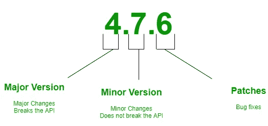
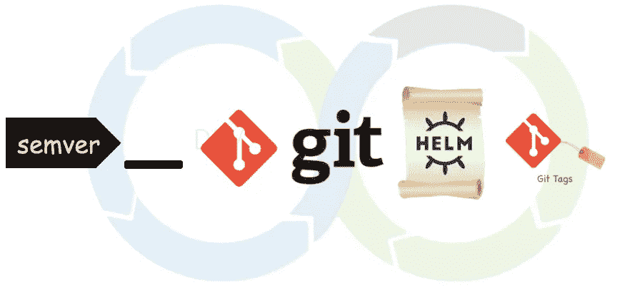

# CI 管道和 SemVer

> 原文：<https://levelup.gitconnected.com/ci-pipelines-and-semver-391c0e1c15e7>

## 借助语义版本控制的命令配置项管道


semver cli 决定管道

语义版本化(也称为 *SemVer* )是一个标准的版本化系统，已经被软件工程师和开发人员遵循了一段时间。这是为了保持应用程序的依赖关系图不变而引入的。

通过保持依赖图的完整性，应用程序可以保持稳定。为了做到这一点，语义版本标准被定义为一个三部分的数字，格式为 **X.Y.Z** ，其中



资料来源:geeksforgeeks.org

时至今日，这种语义版本化标准几乎在所有语言和工件中都得到了广泛的遵循。从节点开始。JS npm 包到 Kubernetes 发布版本。

在这个循环中，在 CI/CD 管道中，根据正在运行的 CI 管道中的语义版本做出一些决策变得非常重要。例如，让我们深入一个简单的舵图场景。舵图打包成`tgz`文件。当然，现在掌舵的包都是 OCI 的抱怨。这不会改变图表的过程和命名惯例。这些' *tgz'* 文件以图表的版本为后缀。这意味着打包图表的名称将是`chart-name-x.x.x.tgz`。这是为了始终获取图表的最新版本，除非用户指定从图表注册表中获取该版本。

上述场景要求开发人员将`Chart.yml`文件中定义的图表版本与来自 GitHub 等源代码控制系统的发布分支的`tag version`同步。



管道中的 semver cli 剪切舵图的标记

开源贡献者在贡献过程中经常遇到的问题是他们错过了图表的版本。或者他们错过了已经遵循了一段时间的版本标签逻辑。

为了避免这种情况，我们需要验证 Chart.yml 的版本和标记版本是否相同。类似地，在一些场景中，机器人需要提交代码并发布相同的版本。在这种情况下，我们需要一种简单的机制来进行语义版本化发布。

# 我们如何做到这一点？

因此，如果我们有一个简单的**二进制代码**，以上所有这些都可以在流水线中实现。现在我们有了。

***semver*** 是一个二进制程序，可以进行比较，也可以在 semver 标准中为我们增加版本。在 Helm chart 示例中，标记的 CI 作业需要验证版本，如下所示。

比较 Chart.yaml 中的 GitHub 发布标签和版本

上面的 shell 脚本显示了如何比较 GitHub release 标签和 helm chart 版本。在第 5 行，semver 二进制码比较出`$CHART_VERSION`和`$TAG`相等。否则，semver 将会死机并退出(1 ),在管道进程中抛出一个错误。

类似地，将第一行替换为`TAG: $(Build.SourceBranchName)`将从 Azure DevOps 管道中选取标签值。运行与上述相同的脚本将进行验证，如果不相等，则*退出(1)* 至错误，如果相等，则*退出(0)* ，为进一步运行流水线铺平道路。

# **永远**

*semver* 是一个简单的命令行包装器，位于来自 [Masterminds](https://github.com/Masterminds/semver) 的出色的 semver 包之上，使用 [Cobra](https://github.com/spf13/cobra) cli 实用程序。

该二进制文件可用于 Linux、Windows、T21 和 Mac 平台。要查看用法，只需输入`semver`，将显示以下帮助信息

```
A cli to work with the semver for comparison and incrementing via command line.
For example:

	$ semver inc 1.6.0-alpha.30 alpha
will return 1.6.0-alpha.31

	$ semver inc 1.5.89 patch alpha
will return 1.5.90-alpha

	$ semver greater 1.6.0-alpha.30 1.6.0-alpha
will result in exit(0)

Usage:
  semver [command]

Available Commands:
  equal       Compares the equality of two given semver
  greater     Compare two given semver
  help        Help about any command
  inc         Increments the semver against the given flag
  lesser      Compare two given semver

Flags:
  -h, --help      help for semver
  -v, --verbose   verbose output

Use "semver [command] --help" for more information about a command.
```

要比较两个相等的版本，请提供如下所示的版本。如果两个版本相同，将退出(0 ),否则将退出(1)到

```
$ semver equal 1.6.8 1.6.8
```

同样，为了验证 LeftHandSide(LHS)版本是否大于 RightHandSide(RHS)版本，可以使用以下子命令。

```
$ semver greater 1.4.5 0.3.9
```

# 自动版本递增

**semver** 也可用于自动增加提供组件引用字符串的版本。例如，`semver inc 1.6.0 major`将增加所提供的`1.6.0`中的主要版本，导致`2.0.0`成为增加的版本。

更多示例可在[自述文件](https://github.com/gkarthiks/semver)中找到。欢迎以 PRs 或 GitHub 问题的形式投稿。

如果你喜欢这篇文章，请通过拍手帮助其他人找到，并在这里和 twitter 上关注我以获取更多更新。

# 参考:

*   [http://semver.org/](http://semver.org/)
*   [https://github.com/gkarthiks/semver](https://github.com/gkarthiks/semver)
*   [https://github.com/Masterminds/semver](https://github.com/Masterminds/semver)
*   [https://github.com/spf13/cobra](https://github.com/spf13/cobra)