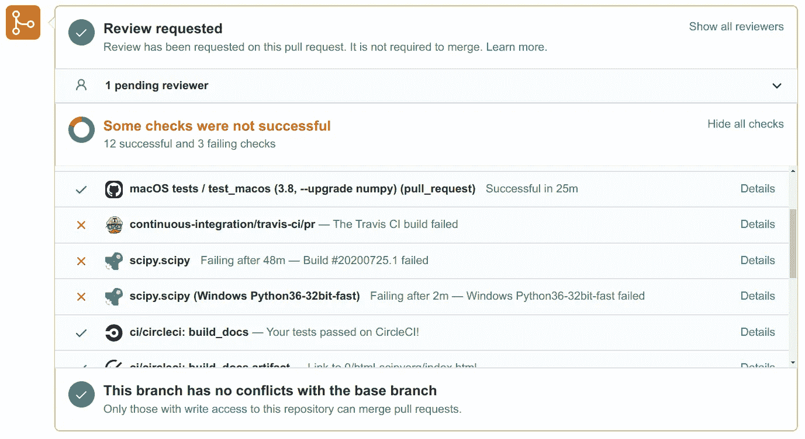
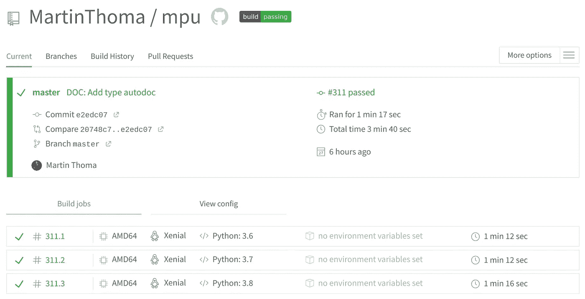
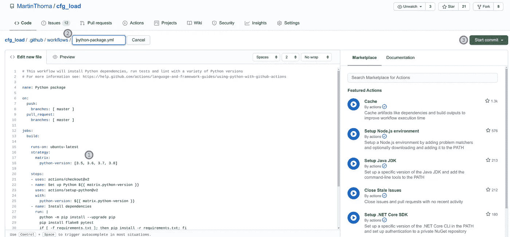
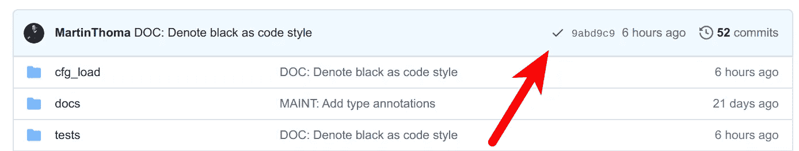
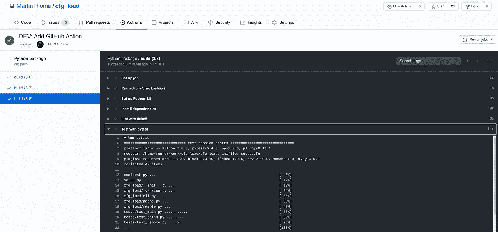
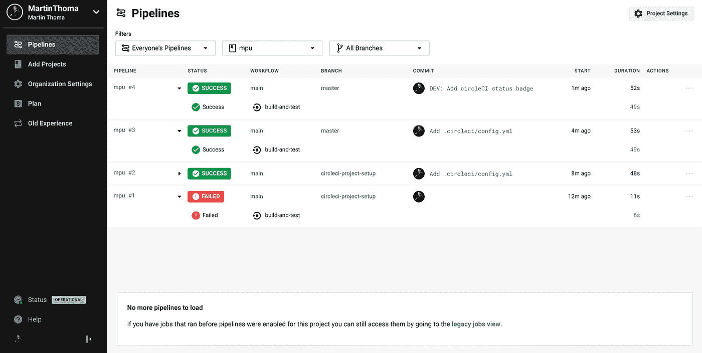
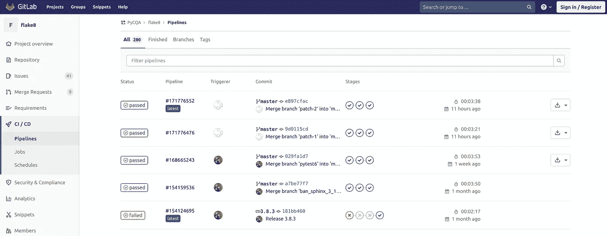
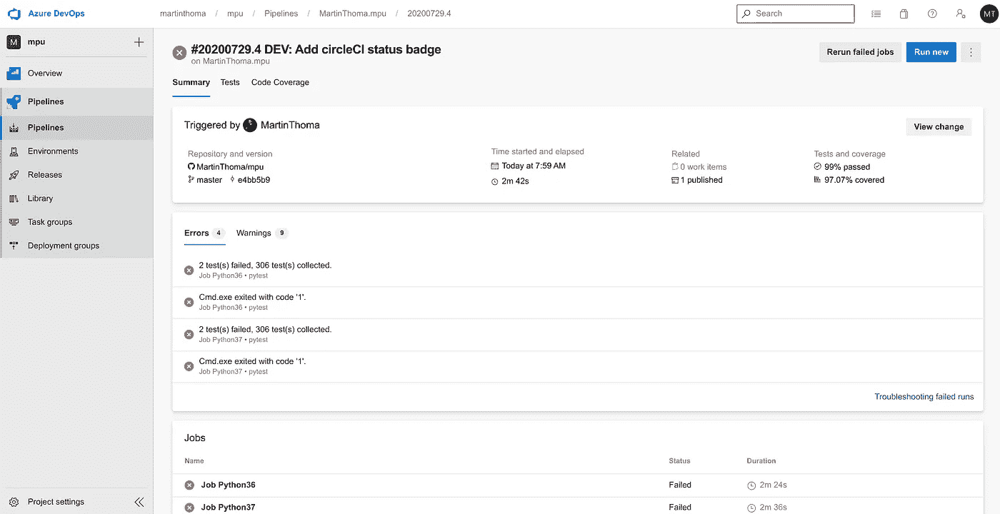
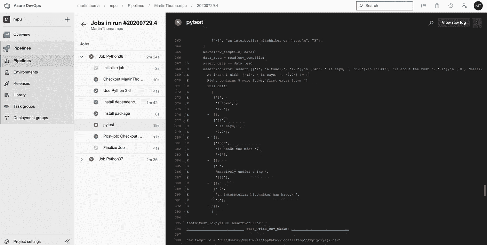

# Python 项目的 CI 管道

> 原文：<https://levelup.gitconnected.com/ci-pipelines-for-python-projects-9ac2830d2e38>

## 什么是持续集成管道，我如何使用它？


尽可能自动化以节省时间，专注于复杂的事情。莱尼·屈尼在 Unsplash[拍摄的照片](https://unsplash.com?utm_source=medium&utm_medium=referral)

持续集成是定期将代码与主要开发分支集成的实践。当您查看像 SciPy 这样的大型项目时，您会发现这样做的必要性，这些项目目前有 [274 个开放拉取请求](https://github.com/scipy/scipy/pulls) (PRs)。这意味着要添加 274 个不同的新功能、错误修复或其他改进。维护人员可能不认识贡献者本人。虽然没有办法查看促成的更改，但是有一个好的解决方案可以确保事情不会严重出错:单元测试。

为所有这些拉请求运行测试套件需要花费相当多的时间。维护人员越快发现 PR 是否有问题以及问题是什么，就越好。

解决方案是持续集成管道。CI 管道是自动执行的代码。通常，流水线中有几个步骤，比如(1)用 pytest 进行单元测试(2)用 flake8 或 pylint 等工具进行林挺(3)用 mypy 进行类型检查(4)手工评审。有一个自动生成的注释，让维护者和贡献者知道管道步骤的状态。



Github Actions、Travis、Azure Pipelines、Circle CI 给出的自动反馈。有些步骤失败了，有些成功了。这些步骤都有链接，以便维护人员可以查看细节。马丁·托马斯截图。

在下一篇文章中，我将向您展示如何使用各种 CI 服务(如 Github Actions、Azure Pipelines、TravisCI 和 CircleCI)自动运行单元测试。

在本文中，我展示了可以使用纯 Python 的相当简单的例子。如果您需要安装其他依赖项(例如 C 库)，那么您需要创建一个 Docker 映像。其余保持不变。如果你想开始使用 Docker，我有[一篇文章给你](https://makeitnew.io/docker-ab1a6bddf389)。

# 特拉维斯·CI

Travis CI 成立于 2011 年，是我使用的第一个 CI 服务。它通过一个`.travis.yml`文件进行配置

我几乎总是在下面的脚本中使用它，只是略有不同:

`[tox-travis](https://github.com/tox-dev/tox-travis)`套餐超赞。我刚确认了毒理检验有效，特拉维斯也有效。如果你想重温一下 tox，看看本系列的前一篇文章。

这个配置文件看起来肯定没有 Github Actions 那么可怕。Travis 的界面也很漂亮干净:



特拉维斯的网页界面。马丁·托马斯截图

# Github 操作

[Github Actions](https://github.com/features/actions) 是集成到 Github 中的 CI/CD 解决方案。它于 2019 年 11 月发布，因此是最近发布的服务。它相对于其他产品的主要优势是与 Github 的集成。您可以通过单击提供的选项卡来创建新的操作:


马丁·托马斯截图

默认值是可以的，但是您可能想要调整文件中的一些内容。例如，在我的私人项目中，我不支持任何比 3.6 更老的 Python 版本。我还想从我的`requirements.txt`安装依赖项。如果你想调整文件名，你可以这样做。看起来不错的时候提交。



马丁·托马斯截图

最后，您可以看到一个漂亮的绿色复选标记，表示运行成功。



马丁·托马斯截图

您也可以单击“操作”选项卡并检查上次运行:



马丁·托马斯截图

# 切尔莱西

CircleCI 是 CI 渠道的另一种可能性。他们有一个叫做 [Orbs](https://circleci.com/orbs/) 的概念，这是一组可重用的配置。这让我想起了一个 Docker 基础图片。

Python orb 在 Github 的[circle ci-Public/Python-orb](https://github.com/circleci-public/python-orb)上。有趣的部分在`src/commands`。CircleCI 有一个 Python orb 的[示例页面](https://circleci.com/orbs/registry/orb/circleci/python)和一个 [Python 语言概述](https://circleci.com/docs/2.0/language-python/)。

我为`[mpu](https://github.com/MartinThoma/mpu)`使用的配置只使用了`checkout`步骤。其余的是手动定义的。以下是在`.circleci/config.yml`中:

```
version: 2.1orbs:
  python: circleci/python@0.2.1jobs:
  build-and-test:
    executor: python/default
    steps:
      - checkout
      - run:
          command: pip install -r requirements-dev.txt
          name: Install Test requirements-dev
      - run:
          command: pip install -e .[all]
          name: Install Pacakge
      - run:
          command: pytest
          name: Testworkflows:
  main:
    jobs:
      - build-and-test
```

CircleCI 网络界面看起来漂亮而干净:



CircleCI 接口。马丁·托马斯截图

我在 mpu 中添加了 CircleCI check，当然，徽章不应该丢失:

```
[](https://app.circleci.com/pipelines/github/MartinThoma/mpu)](https://circleci.com/gh/MartinThoma/mpu.svg?style=shield)](https://app.circleci.com/pipelines/github/MartinThoma/mpu))
```

# Gitlab CI

[Gitlab CI](https://docs.gitlab.com/ee/ci/yaml/README.html) 类似于 Github Actions，因为它也被集成到平台中。您使用一个`.gitlab-ci.yml`文件来配置它。然而，我更喜欢 Gitlab CI，因为它看起来更干净。

让我们以棉绒[薄片 8](https://gitlab.com/pycqa/flake8) 为例。他们的`[.gitlab-ci.yml](https://gitlab.com/pycqa/flake8/-/blob/master/.gitlab-ci.yml)`有点长，所以我把它缩短到测试阶段。它们也有构建和发布阶段:

在 web 界面中，它看起来像这样:



GitLab 的 web 界面。马丁·托马斯截图。

如果管道失败，您还可以勾选存储库的“设置”部分中的复选框来防止合并。你应该去做。

# 天蓝色管道

Azure 是微软的云平台，类似于亚马逊的 AWS 或谷歌的 GCP。与所有这些大型云平台一样，事情过于复杂。比不上特拉维斯的轻松。

我不喜欢 Azure Pipelines 的很多地方，尤其是它需要许可才能进行代码更改。这主要是作为一个方便的特性，这样它可以创建配置文件`azure-pipelines.yml`。我讨厌这样，因为 CI 解决方案不应该触及我的代码。它应该只是读它。但由于 Github 被微软收购，Azure Pipelines 也归微软所有，我猜给它访问权不会有太大的坏处🤷

Azure 管道有一个杀手锏:你可以在 Windows 机器上执行东西。让我们进入到达那里的最短路径:

1.  转到[azure.microsoft.com/services/devops/pipelines](http://azure.microsoft.com/services/devops/pipelines/)
2.  创建项目
3.  点击管道->创建管道-> Github YAML -> Python 包
4.  使用`vmImage: 'VS2017-Win2016'`

它将在项目根中创建一个`azure-pipelines.yml`:

```
# [https://docs.microsoft.com/azure/devops/pipelines/languages/python](https://docs.microsoft.com/azure/devops/pipelines/languages/python)trigger:
- masterpool:
  vmImage: 'VS2017-Win2016'
strategy:
  matrix:
    Python36:
      python.version: '3.6'
    Python37:
      python.version: '3.7'steps:
- task: UsePythonVersion@0
  inputs:
    versionSpec: '$(python.version)'
  displayName: 'Use Python $(python.version)'- script: |
    python -m pip install --upgrade pip
    pip install -r requirements-dev.txt
  displayName: 'Install dependencies'- script: |
    pip install .[all]
  displayName: 'Install package'- script: |
    pip install pytest pytest-azurepipelines
    pytest -vv
  displayName: 'pytest'
```

管道工作后，我做的第一件事是添加一个项目徽章:

```
[](https://dev.azure.com/martinthoma/mpu/_build/latest?definitionId=1&branchName=master)](https://dev.azure.com/martinthoma/mpu/_apis/build/status/MartinThoma.mpu?branchName=master)](https://dev.azure.com/martinthoma/mpu/_build/latest?definitionId=1&branchName=master))
```

添加徽章的主要原因是 Azure 试图为我创建新帐户。我很难回到主概览页面😢



项目概述页面。马丁·托马斯截图

如果您单击其中一个失败的作业，您会看到:



失败的 pytest 运行。马丁·托马斯截图。

# CI 服务比较

Azure 的独特卖点是可以在 Windows 机器上运行代码。Github Actions / Gitlab CI 的杀手锏是与 github.com/git lab 的集成。

> 编辑:Github 动作也可以通过`*runs-on: "windows-2019"*` ( [docs](https://docs.github.com/en/actions/reference/workflow-syntax-for-github-actions#jobsjob_idruns-on) ，[完整示例](https://github.com/domdfcoding/flake8_strftime/blob/master/.github/workflows/python_ci.yml)在 Windows 上执行
> 
> 编辑:CircleCI 在 2019 年增加了 Windows 支持( [docs](https://circleci.com/build-environments/windows/) )并且 Travis 也提供了 Windows 支持( [docs](https://docs.travis-ci.com/user/reference/windows/) )。所以我看不出有什么理由再使用 Azure 管道了。

只看 **Web 界面**，很喜欢 CircleCI，Travis，Gitlab。Github Actions 有点超载，我讨厌 Azure pipelines，因为我找不到一种简单的方法来访问我的帐户。

**配置文件格式**都是 YAML。我喜欢大多数服务都有一个文件/文件夹的前导点，这样 CI 配置在 Linux 上就隐藏起来了。只有 Azure Pipelines 希望可见。看配置本身，Travis 和 Gitlab 在我看来最干净。CircleCI 提供了我不习惯的独特的“球体”概念——从长远来看，这可能会使事情变得更简单。

对于 CircleCI 来说，这些步骤的**执行速度**感觉相当快，但是我没有彻底测试过。

当您中断管道以及管道再次修复时，所有提供的 CI 服务都会发送一封电子邮件。我不确定设置其他**通知**比如松弛消息有多简单。我已经看到了 Jenkins 和 Gitlab 的 Slack 通知。

到目前为止我还没有提出的一点是**连续交付(CD)** 。所有呈现的服务也可以用于 CD。你想读一篇专门关于 CD 的文章吗？


图片来源:[极客和戳](http://geek-and-poke.com/geekandpoke/2010/10/26/geekpokes-list-of-best-practices-today-continuous-integratio.html)

# 下一步是什么？

在这个系列中，我们已经有了:

*   第 1 部分:[Python 中单元测试的基础知识](https://medium.com/swlh/unit-testing-in-python-basics-21a9a57418a0)
*   第 2 部分:[修补、模拟和依赖注入](/unit-testing-in-python-mocking-patching-and-dependency-injection-301280db2fed)
*   第 3 部分:[如何用数据库、模板和受保护的页面测试 Flask 应用程序](https://medium.com/analytics-vidhya/how-to-test-flask-applications-aef12ae5181c)
*   第 4 部分: [tox 和 nox](https://medium.com/python-in-plain-english/unit-testing-in-python-tox-and-nox-833e4bbce729)
*   第 5 部分:[结构化单元测试](https://medium.com/python-in-plain-english/unit-testing-in-python-structure-57acd51da923)
*   第 6 部分:[CI-管道](/ci-pipelines-for-python-projects-9ac2830d2e38)
*   第 7 部分:[基于属性的测试](/unit-testing-in-python-property-based-testing-892a741fc119)
*   第 8 部分:[突变测试](https://medium.com/analytics-vidhya/unit-testing-in-python-mutation-testing-7a70143180d8)
*   第 9 部分:[静态代码分析](https://towardsdatascience.com/static-code-analysis-for-python-bdce10b8d287) — Linters、类型检查和代码复杂性
*   第 10 部分: [Pytest 插件来爱](https://towardsdatascience.com/pytest-plugins-to-love-%EF%B8%8F-9c71635fbe22)

如果您对使用 Python 测试的其他主题感兴趣，请告诉我。

# 请参见

*   joaquín Menchaca:[Jenkins CI Pipeline with Python](https://medium.com/@Joachim8675309/jenkins-ci-pipeline-with-python-8bf1a0234ec3)，2019。
*   Elle O'Brien : [科学家需要了解 2020 年 DevOps](https://towardsdatascience.com/what-data-scientists-need-to-know-about-devops-2f8bc6660284) 的哪些数据。