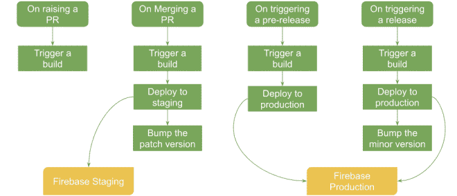
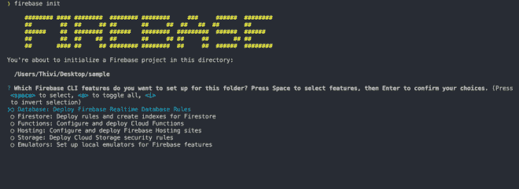
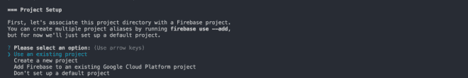
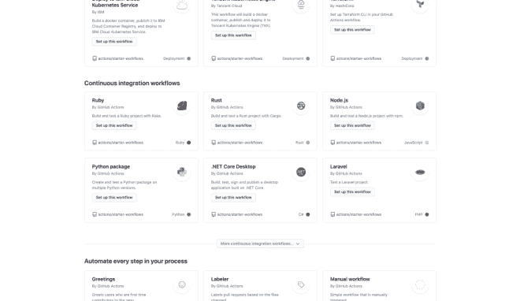

# 具有 Firebase 和 GitHub 操作的前端 CICD

> 原文：<https://levelup.gitconnected.com/cicd-for-frontend-with-firebase-and-github-actions-2a2575acce2b>

GitHub Actions 让 CICD 变得简单了。将它与 Firebase 提供的免费托管服务结合起来，你马上就可以为你的前端应用程序准备好一个完全免费的功能齐全的 CICD 管道。

作为前端开发人员，我们可能经常需要向团队的其他成员演示我们的应用程序，以获得他们对应用程序的设计和用户体验的意见。然而，仅仅用投影仪或缩放会议给他们演示你的应用程序可能是不够的。

毕竟，除非你自己摆弄 app，否则很难形成合格的意见。建立一个 CICD 管道来不断地将你的更改推送到网络上的一个工作应用程序中，这将会派上用场。

GitHub Actions 允许你用几个`yaml`文件建立一个 CICD 管道。更重要的是，GitHub Actions 是 GitHub 的一部分，你不必使用外部工具来设置 CICD。

# 管道

因此，让我们深入了解情况，部署我们的 CICD 管道。这就是我们将要做的。

1.  创建基于 React 的前端应用程序
2.  使用 GitHub 动作来自动化部署过程

我们的应用程序将部署在两种不同的环境中，即暂存和生产。创建拉请求时，应该构建应用程序来检查是否有任何构建错误。一旦拉请求被合并，那么，再一次，应用程序应该被构建，然后被部署到登台环境。一旦部署，应用程序的补丁版本应该被取消。

当发布应用程序的预发布版本时，应该构建应用程序并将其部署到生产环境中。当最终版本发布时，应该构建应用程序并将其部署到生产环境中，之后应该删除应用程序的次要版本。



# 创建 React 应用程序

首先，让我们创建一个 React 应用程序。我将使用以下命令，使用 Create React App 环境引导一个简单的应用程序。

```
npx create-react-app my-app
```

这是一个简单的 React 应用程序，我们将使用 GitHub 操作将它部署到 web 上。在设置管道之前，我们需要创建两个环境。

# 安装 Firebase 工具

为了在网络上托管应用程序，我决定在这里使用 Firebase。但是你也可以试试其他免费的主机服务，比如 Heroku。

Firebase 为我们提供了一个 CLI 应用程序，帮助我们轻松地将应用程序发布到 Firebase。要使用它，让我们先安装它。

```
npm install -g firebase-tools
```

一旦安装，我们将不得不登录到我们的谷歌帐户。由于 Firebase 是谷歌提供的服务，我们需要一个谷歌帐户来访问他们的服务。使用以下命令登录。

```
firebase login
```

一旦您输入这个命令，您的浏览器将会打开 Google 登录表单。输入您的凭据，并授予 Firebase CLI 必要的权限。

# 初始化 Firebase 项目

然后，我们可以使用下面的命令用 Firebase 启动我们的应用程序。

```
firebase init
```

一旦您输入这个命令，您将看到下面的屏幕。



Firebase 提供了很多服务，从虚拟主机到实时非 SQL 数据库。因为我们只想托管我们的 web 应用程序，所以我们需要从显示的服务列表中选择托管。选择它后，我们将进入下一个屏幕。



在这里，我们必须选择一个项目或创建一个新项目。因为我们没有项目，所以我们需要选择 Create a new project 选项。一旦选择，您将被要求提供一个项目的唯一 id。提供一个。接下来，将要求您输入项目的名称。输入一个名称，然后按回车键。

CLI 可能需要几秒钟来创建项目。一旦完成，您将被要求设置`public`目录。`public`目录是应该提供静态文件的目录。大多数情况下，它是捆绑器捆绑 JavaScript 文件的目录。由于`Create React App`将文件输出到“构建”目录中，那应该是我们的公共目录。

所以，输入`build`并回车。

在下一步中，您将被询问是否要重写所有的 URL 到`index.html`。因为我们的是单页应用程序，我们需要它。所以，说 yes 来完成初始化过程。

# 创建 Firebase 站点

完成后，我们必须转到 Firebase 控制台来创建另一个站点。创建托管项目时，Firebase 已经创建了一个站点。但是，由于我们需要两个站点——一个用于试运行，一个用于生产，所以我们需要创建一个额外的站点。

为此，请转到[https://console.firebase.google.com/](https://console.firebase.google.com/)并选择您刚才创建的项目。然后，从侧面板中选择主机。您可能需要单击“Get Started ”,并按照逐步说明进入控制台视图。

在控制台视图中，靠近视图底部，有一个名为 Add another site 的按钮。点击它创建一个额外的网站。我们将使用该站点进行试运行，所以我们称之为“样品试运行”。添加后，新站点应该出现在域部分下。

Firebase 提供了“web.app”和“firebaseapp.com”两个域，因此您将看到每个站点有两个域。此时，最好记下已经存在的站点的名称。

# 部署到多个站点

现在，让我们回到我们的应用程序。由于我们有两个应用程序，我们现在需要告诉 Firebase 将我们的应用程序部署到哪个站点。我们可以通过使用目标名称，然后将目标名称映射到一个站点来做到这一点。

要设置目标名称，请转到根目录下的`firebase.json`文件。在这里，您会发现`hosting`属性被分配了一个对象。我们需要用一组对象来替换它。为此，复制对象并将其传递到一个数组中。然后，复制对象，使数组有两个对象。在这两个对象中创建一个名为`target`的键，并将其中一个命名为“登台”,另一个命名为“生产”。

最后，你应该有这样的东西。

```
{ 
    "hosting": [ 
        { 
            "target": "staging", 
            "public": "build", 
            "ignore": [
               "firebase.json", 
               "**/.*", 
               "**/node_modules/**"
            ], 
            "rewrites": [ 
                { 
                    "source": "**", 
                    "destination": "/index.html" 
                } 
            ] 
         }, 
         { 
             "target": "production", 
             "public": "build", 
             "ignore": [
                 "firebase.json",  
                 "**/.*", 
                 "**/node_modules/**"
             ], 
             "rewrites": [ 
                 { 
                     "source": "**", 
                     "destination": "/index.html" 
                 } 
             ] 
          } ] 
}
```

现在，我们需要将这些目标映射到正确的站点。为此，让我们使用下面的命令。

```
firebase target:apply <service> <target> <site>
```

`Service`指 Firebase 提供的不同服务。因为我们在这里使用的服务是托管，它应该是托管。`target`指的是我们在`firebase.json`文件中定义的目标名称。站点是我们希望目标映射到的站点的名称。

我们需要将`staging`目标映射到我们的集结地。因此，使用下面的命令。

```
firebase target:apply hosting staging staging-github-actions
```

然后，让我们将生产目标映射到生产现场。

```
firebase target:apply hosting production production-github-actions
```

完成后，我们可以使用下面的命令将我们的应用程序部署到 Firebase。但我们不会在本地做，因为我们希望应用程序由 GitHub Actions 部署。

```
firebase deploy --only hosting:staging
```

同样，我们可以使用此命令部署到生产环境中:

```
firebase deploy --only hosting:production
```

# 生成 Firebase 令牌

请记住，我们的应用程序应该部署到 GitHub Actions 的 Firebase。GitHub Actions 所做的是在云中运行容器，按照我们的配置执行部署过程。因此，当从容器部署时，我们将无法通过通常的登录流程。请注意，部署过程是完全自动化的，因此您不能以任何方式进行干预。

因此，应该有另一种方法来用 Firebase 验证我们自己。Firebase 通过为我们提供令牌来帮助我们，我们可以使用这些令牌让 GitHub Actions 代表我们登录。因此，让我们通过输入以下命令来创建一个 Firebase 令牌。

```
firebase login:ci
```

可能会要求您再次登录。登录并授予必要的权限后，令牌应该会出现在终端上。复制一份。

这就完成了应用程序级的配置。现在，提交所有内容，并将其推送到 GitHub repo。现在，让我们转到 GitHub。

# GitHub 秘密

首先，我们需要安全地存储我们的 Firebase 令牌。我们可以将它直接粘贴到配置文件中，但是这样做很危险，因为令牌会变成公共的。相反，我们应该使用 GitHub 提供的 secrets 选项来安全地存储秘密。在你的回购，到“设置”标签，并选择“秘密”从垂直菜单。

在“机密”页面上，单击“新建机密”按钮。为密码提供一个名称，并将我们刚刚复制的令牌粘贴到值文本区域，然后单击 Add secret。我用了`FIREBASE_TOKEN`作为名字。

# 创建个人访问令牌

要创建个人访问令牌，请转到[https://github.com/settings/profile](https://github.com/settings/profile)并点击菜单底部的开发者设置。然后，从菜单中选择个人访问令牌，并单击生成新令牌。您可能需要在这里提供您的密码。使用注释文本框为令牌提供一个名称，并在 repo 下选择 public_repo 范围。这是我们唯一需要的范围。

完成后，复制令牌并将其存储在 GitHub secrets 中，就像我们之前处理 Firebase 令牌一样。请注意，您不能再次读取此令牌，这一点很重要。

# 配置 GitHub 动作

现在，是时候配置 GitHub 动作了。点击 GitHub repo 上的 Actions 选项卡，并从显示的工作流列表中选择“Node.js”。



```
on: push: branches: [ master ] pull_request: branches: [ master ]
```

在`jobs->build->strategy->matrix`中，我们可以指定构建应该运行的节点版本。默认情况下，将选择 10.x、12.x、14.x。当选择了三个版本时，GitHub Actions 会同时运行三次动作。由于我们还想将我们的应用程序部署到 Firebase，这也将同时部署三次，从而导致不可预测的行为。因此，建议只选择一个版本。我决定用 10.x。

```
strategy: matrix: node-version: [10.x]
```

# 向 GitHub 操作添加步骤

在样板文件中，你会看到使用了`[[email protected]](https://www.thearmchaircritic.org/cdn-cgi/l/email-protection)`和`[[email protected]](https://www.thearmchaircritic.org/cdn-cgi/l/email-protection)`。这些操作分别用于签出 repo 的分支和安装节点。在市场上可以找到更多这样的行动。

# 使用 GitHub 操作配置登台

这些是我们在试运行期间需要执行的步骤。

如果您观察样板文件，第一个文件应该已经配置好了。但是这将是设置节点的步骤的一部分。让我们把它分解成一个单独的步骤。因此，使用连字符创建一个步骤，然后将名称设置为`Build Project`。`run`属性用于运行命令。通过使用管道(`|`)操作符并在它下面的行中输入命令，可以运行多个命令。

```
- name: Build Project run: | npm ci npm run build --if-present npm test
```

# 从 GitHub Actions 部署到 Firebase

现在让我们创建下一步。我们必须安装 firebase 工具，然后将应用程序部署到 Firebase。为了能够部署，我们应该首先进行身份验证。为此，我们需要使用存储在 GitHub secrets 中的令牌。可以通过以下方式访问 GitHub 机密。

```
${{secrets.FIREBASE_TOKEN}}
```

在这里，`secrets`后面都是秘密的名称。我们需要将秘密设置为一个环境变量。我们可以使用`env`属性来做到这一点。然后，我们可以在部署时使用令牌标志来引用这个环境变量。

```
- name: Install Firebase CLI 
env: FIREBASE_TOKEN: ${{secrets.FIREBASE_TOKEN}} 
run: | 
   sudo npm install -g firebase-tools 
   firebase deploy --token $FIREBASE_TOKEN --only hosting:staging --non-interactive
```

然而，我们希望我们的应用程序仅在合并了拉请求时才被部署。但是，当发出拉请求和合并请求时，都会触发此操作。我们可以使用`if`属性有条件地运行这个步骤。

```
if: github.event_name=='push'
```

只有当事件是推送时，才会运行此步骤。值得注意的是，当一个拉请求被合并时，我们实际上是把合并提交推给了回购。

# 碰撞版本

现在，让我们撞版本。既然 git 已经安装好了，我们只需要配置 git 并撞上版本。但是为了能够推送提交，我们需要已经被认证。我们可以使用个人访问令牌来验证自己。

我们配置的第一步是使用`[[email protected]](https://www.thearmchaircritic.org/cdn-cgi/l/email-protection)`动作检查我们的回购。您可以使用属性传递令牌，让操作在签出之前登录到我们的 repo。

```
- uses: actions/[c](https://www.thearmchaircritic.org/cdn-cgi/l/email-protection)heckout@v2 
with: token: ${{secrets.PERSONAL_ACCESS_TOKEN}}]
```

使用 git config 命令配置用户名和电子邮件。然后，使用`npm version`命令修改补丁版本。

```
npm version patch
```

该命令将删除版本，并将其提交给 repo。所以，现在，我们需要推动它。

这也应该仅在合并拉请求时运行。所以，让我们用同样的条件。

```
- name: Version Bumping 
run: | 
   git config --global user.email "[c](https://www.thearmchaircritic.org/cdn-cgi/l/email-protection)hecout@v2" 
   git config --   global user.name "Version Bumping" 
   npm version patch git push 
if: github.event_name=='push'
```

# 忽略路径

现在，这引起了一个新的问题。每当有东西被推送到主分支时，就触发这个动作。当我们修改版本并提交时，这将再次触发动作。所以，我们将会在一个无止境的循环中结束。

使用`on`和`push`下的`paths-ignore`属性来忽略这些文件。

```
on: 
   push: 
      branches: 
         - master 
      paths-ignore: 
         - 'package.json' 
         - 'package-lock.json'
```

我们的分级配置已经完成。让我们保存文件并为生产创建一个新的工作流。保存后，您可以在根目录下的`.github/workflows`目录中找到配置文件。

# 使用 GitHub 操作配置生产

对于生产，应该在应用预发布和发布时触发操作。因此，在`on`属性下，让我们使用`release`属性并将`released`和`prereleased`都指定为值。

```
on: release: types: [released, prereleased]
```

我们可以按照相同的步骤将部署配置为 Firebase。您只需更改站点名称并将目标设置为生产。

```
- name: Install Firebase CLI 
env: FIREBASE_TOKEN: ${{secrets.FIREBASE_TOKEN}} 
run: | 
   sudo npm install -g firebase-tools 
   firebase deploy --token $FIREBASE_TOKEN --only hosting:production --non-interactive
```

版本碰撞也遵循类似的步骤。然而，由于该动作是在释放时触发的，`[[email protected]](https://www.thearmchaircritic.org/cdn-cgi/l/email-protection)`动作检出一个 ref 而不是一个分支。所以，我们将无法推进我们的变革。为了防止这种情况，在版本碰撞步骤中，我们需要在提交之前强制检出主分支。在此之前，最好更新远程 repos 并获取一个 fetch。

```
- name: Version Bumping 
run: | 
   git config --global user.email "[[email protected]](https://www.thearmchaircritic.org/cdn-cgi/l/email-protection)" 
   git config --   global user.name "Version Bumping" 
   git remote update 
   git fetch 
   git checkout --progress --force -B master refs/remotes/origin/master 
   npm version minor 
   git push 
if: github.event.action=='released'
```

这就结束了生产配置。现在，您可以保存它并测试流是否如预期的那样工作。您可以找到一个配置了 GitHub 操作的示例存储库。

原来你在这里！现在，我们需要做的就是合并拉取请求，并发布我们的应用程序，以便将其部署到试运行和生产环境中。经过最少的努力，现在我们有了一个功能完整的 CICD 流。此外，我们的团队现在可以实时跟踪我们的工作，并提供急需的反馈。

*原载于 2020 年 8 月 9 日【https://www.thearmchaircritic.org】[](https://www.thearmchaircritic.org/tech-journals/cicd-for-frontend-with-firebase-and-github-actions)**。***