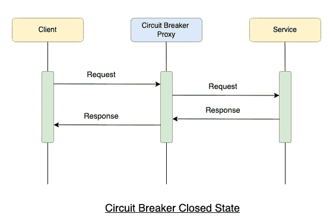
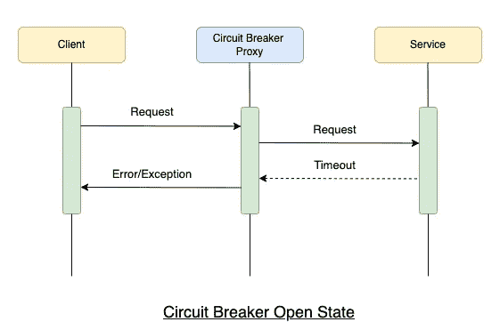
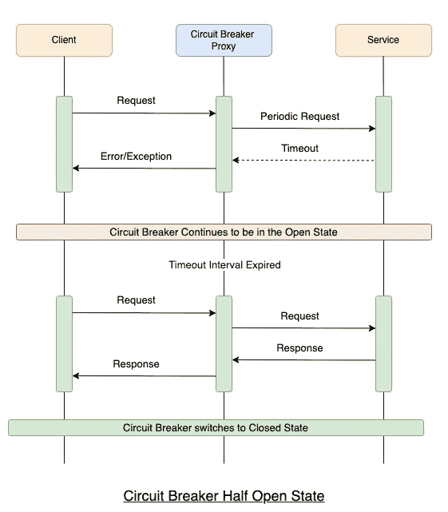

# 断路器设计模式—系统设计

> 原文：<https://levelup.gitconnected.com/circuit-breaker-design-pattern-system-design-intmain-32195c550d6c>

萨汉德·巴巴里在 [Unsplash](https://unsplash.com?utm_source=medium&utm_medium=referral) 上的照片

在分布式环境中，服务器/系统通过网络远程调用运行在不同机器上的许多进程是普遍存在的。当通过网络进行调用时，对远程资源或服务的调用很有可能会失败，这种失败可能是由于瞬时故障造成的，例如网络连接缓慢、超时或者资源被过度使用或暂时不可用。一般来说，这些类型的故障一般会在短时间内自行纠正。

然而，在有些情况下，故障需要很长时间才能自行修复。在这种情况下，如果调用者继续不断地重试不太可能成功的操作，那么线程等宝贵的资源可能会被消耗掉。此外，这可能会导致资源耗尽，这将使调用服务无法处理其他请求，反过来，一个服务的故障会导致跨多个系统的级联故障。

因此，为了将我们从这种情况中解救出来并节省 CPU 资源，引入了断路器设计模式。

# 断路器

断路器[设计模式](https://intmain.co/system-design-guide/)用于防止应用程序重复调用可能失败的服务，并允许应用程序继续运行，而无需等待故障修复或浪费 CPU 资源。

断路器背后的基本思想类似于电气断路器。它充当操作的代理，并监控失败次数。一旦故障达到某个阈值，断路器就会跳闸，并且在异常中返回进一步的调用。

断路器代理还使应用程序能够检测故障是否已经解决，并且问题似乎已经解决，应用程序可以再次尝试调用服务。

# 断路器的不同阶段

代理电路断路器模仿电路断路器的行为，并且可以具有以下状态:

*   **关闭**
*   **打开**
*   **半开**

## 关闭状态

当一切顺利运行时，断路器处于闭合状态。来自应用程序的请求被路由到服务器。代理维护最近失败次数的计数，并且如果对服务器/资源的调用不成功，则代理递增失败计数。如果给定时间间隔内的故障数量增加超过阈值，断路器跳闸并进入断开状态。

## 2.开放状态

当断路器处于断开状态时，来自请求应用程序的所有请求都会立即失败，并返回一个错误。

## 3.半开状态

超时间隔过后，断路器进入半开状态。在这种状态下，应用程序只允许有限数量的请求来调用操作。如果这些请求成功，则认为导致故障的故障已经解决，断路器切换到**闭合**状态。然而，如果请求继续失败，断路器再次进入**打开**状态。

# 断路器的优缺点

我们已经讨论了断路器模式和它们可以切换到的各种状态，现在让我们讨论这种模式的优缺点。

## 优势

1.  断路器提供了一种使系统容错的好方法。
2.  断路器有助于减少可能失败的操作中占用的资源。
3.  该模式是可定制的，并且可以根据可能的故障类型进行调整。
4.  它还可以在系统从故障中恢复时提供稳定性，并将对性能的影响降至最低。

## 不足之处

1.  测试可能比看起来更难。
2.  在不产生误报或引入过多延迟的情况下选择超时值是一项挑战。
3.  请求失败的原因可能有很多，其中一些原因可能表明失败的类型比其他原因更严重。断路器可能能够检查发生的异常类型，并根据这些异常的性质调整其策略。

这篇文章最初发表于 [IntMain。](https://intmain.co/circuit-breaker-design-pattern-system-design/)

# 分级编码

感谢您成为我们社区的一员！在你离开之前:

*   👏为故事鼓掌，跟着作者走👉
*   📰查看[升级编码出版物](https://levelup.gitconnected.com/?utm_source=pub&utm_medium=post)中的更多内容
*   🔔关注我们:[Twitter](https://twitter.com/gitconnected)|[LinkedIn](https://www.linkedin.com/company/gitconnected)|[时事通讯](https://newsletter.levelup.dev)

🚀👉 [**加入升级人才集体，找到一份神奇的工作**](https://jobs.levelup.dev/talent/welcome?referral=true)