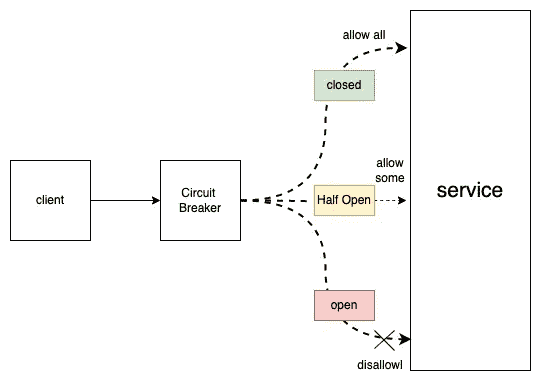
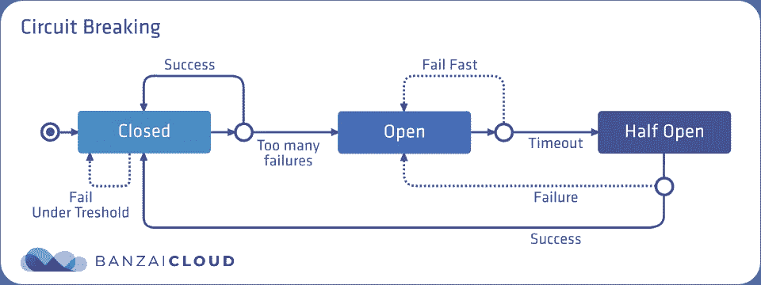
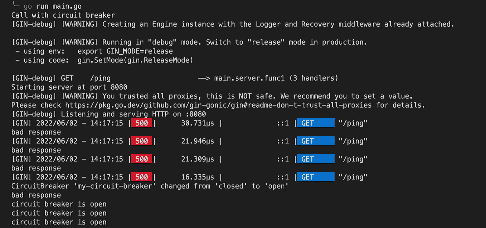
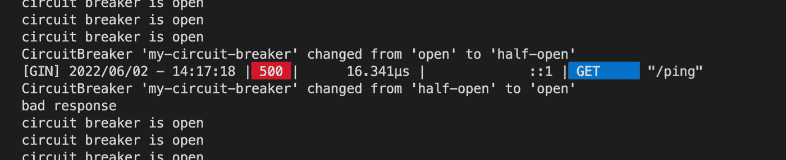
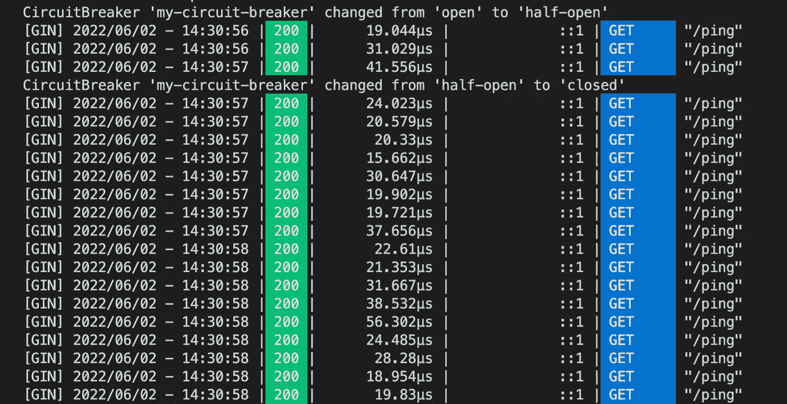

# Golang 的断路器示例

> 原文：<https://levelup.gitconnected.com/circuit-breaker-example-in-golang-e6459c87eaeb>


阿尼鲁德·雷迪在 [Unsplash](https://unsplash.com?utm_source=medium&utm_medium=referral) 上拍摄的照片

在微服务架构中，一个服务通常调用其他服务来检索数据，上游服务有可能会关闭。如果问题是由暂时网络问题或暂时不可用引起的，客户端服务可以重试请求几次来解决问题。

但是，可能会出现其他严重的问题，例如数据库中断或服务没有快速响应。在这种情况下，太多注定失败的重复请求可能会导致整个系统的**级联故障**。

所以，救援来了:**断路器**。这是一种允许您保护您的服务在短时间内不执行太多请求的机制。

在这篇文章中，我将在一个真实的例子中展示如何使用[*gobreaker*](https://github.com/sony/gobreaker)*库来实现断路器模式。*

*我们开始吧！*

# *概念概述*

## *三种状态*

*断路器有三种不同的状态，闭合、断开和半开。*

**

*   ***关闭** —所有请求都被允许传递给上游服务。*
*   ***打开** —所有请求都不允许传递给上游服务。*
*   ***半开** —为了确定上游服务是否恢复，断路器将只允许少量请求在此状态下通过。*

***状态变化***

**

*图片来自[链接](https://banzaicloud.com/docs/backyards/traffic-management/circuit-breaking/)*

*   ***合分** —断路器处于闭合状态；当失败的请求超过阈值时，断路器将变为断开状态。*
*   ***打开至半开** —断路器处于打开状态；当经过一定的超时时间后，断路器将变为半开状态。*
*   ***半开打开** —断路器处于半开状态；当对上游服务的请求仍然失败时，断路器将再次变为打开状态。*
*   ***半开转合** —断路器处于半开状态；当一定数量的预定义请求成功时，断路器将变为闭合状态。*

## *请求计数*

*断路器保存请求的数量及其成功/失败。*

```
*type Counts struct {
    Requests             uint32
    TotalSuccesses       uint32
    TotalFailures        uint32
    ConsecutiveSuccesses uint32
    ConsecutiveFailures  uint32
}*
```

# *动手示例*

## *计算机网络服务器*

*在我们的示例中，我们有一个运行在端口 8080 上的 HTTP 服务器作为上游服务。为了模拟上游服务关闭，我们在启动的前 5 秒钟向客户端返回一个 500 错误代码。*

## *客户*

*我们定义了一个简单的函数来调用客户端的上游服务。*

## *主要功能*

*在`main`功能中，我们首先用其配置初始化断路器。*

*   *`Name`是断路器的名称*
*   *`MaxRequests`是断路器半开时允许通过的最大请求数。*
*   *`Interval`是断路器清除内部计数的闭合状态循环周期。*
*   *`Timeout`是断开状态的周期，在此之后，断路器的状态变为半开。*
*   *当请求在关闭状态下失败时，就会调用`ReadyToTrip`。如果该函数返回 true，断路器将进入打开状态。*
*   *每当断路器状态改变时，调用`OnStateChange`。*

*然后，我们向上游服务发出 100 个请求，并观察断路器的状态变化。*

*[完整代码](https://gist.github.com/jerryan999/bcfdd746f3f8c2c11c3d27f1b65dfcf3?file=circuit-breaker-full.go)*

## *结果解释*

*在第一秒钟，断路器发现上游服务连续失败三次以上；它从关闭状态切换到打开状态。*

**

*超时时间过后，断路器将切换到半开状态。*

*当以下请求从上游服务返回错误时，断路器切换到断开状态。*

**

*当上游恢复时，断路器通过连续发出三次成功请求来观察这种变化。然后它切换到关闭状态。*

**

# *结论*

*希望这篇文章已经让您认识到断路器模式是如何在现实应用中使用的。*

*我希望你喜欢读这篇文章。如果你愿意支持我成为一名作家，考虑成为[一名媒体成员](https://jerryan.medium.com/membership)。你还可以无限制地访问媒体上的每个故事。*