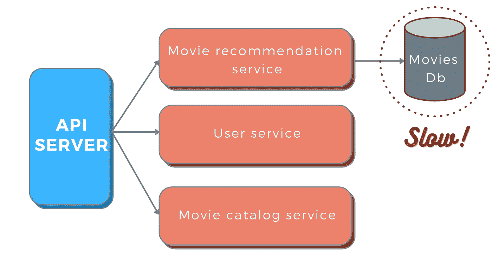
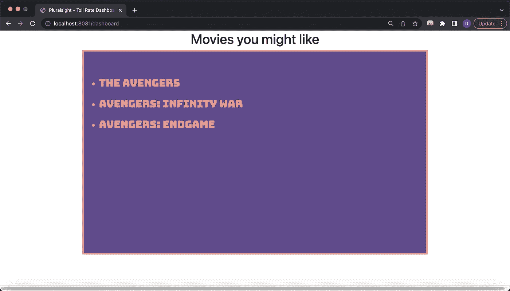

# 简化的断路器模式。为什么您的微服务中需要一个？

> 原文：<https://levelup.gitconnected.com/circuit-breaker-pattern-simplified-why-do-you-need-one-in-your-microservice-7d543052a3f>

照片由[特洛伊桥](https://unsplash.com/@esptroy)在 [Unsplash](https://unsplash.com/photos/maXnRLszYY0) 拍摄

> 及时缝一针可省九针

Covid 19 疫情导致许多国家实施封锁，试图控制疾病。只有基本服务向公众开放。我们大多数人不得不呆在家里几周甚至几个月。

它比以往任何时候都更严重地扰乱了正常生活。但是为什么政府要采取如此激烈的措施呢？

这一措施对于防止大规模疫情是不可避免的，否则疫情将会是毁灭性的。最终，随着 covid 病例的减少，封锁被分阶段解除。

整个场景类似于现实生活中的断路器。

断路器的概念最初来自电子学。如果你查一下[维基百科](https://en.wikipedia.org/wiki/Circuit_breaker)，它被定义为一个自动开关，用于保护电路免受过流或短路造成的损坏。这是一种自动切断故障系统电源的方法。

一旦故障条件得到纠正，开关就会闭合，以恢复中断电路的供电。

那么，这如何适用于我们呢？

## 为什么我们的微服务需要断路器？

让我们面对现实吧，所有的服务都可能在某个时间点失败或瘫痪。网络可能会变得脆弱，系统可能会资源匮乏，数据库可能会停机，GCs 可能会停止工作，或者僵尸可能会攻击数据中心。好吧，可能不是最后一个😁。但是你说到点子上了！

我们需要在服务中加入容错功能，以优雅地处理这些情况。

考虑这个例子。

从 API 服务器上，我们调用电影推荐服务来向用户推荐电影。假设电影数据库由于某种原因很慢，因此电影推荐服务也很慢。如果我们继续从 API 服务器发送请求，会发生什么？这会给区议会增加更多压力，并可能使情况进一步恶化。

此外，电影推荐服务的线程将忙于处理高响应请求，这将导致处理其他请求的空闲线程数量减少，最终导致服务中断。

与其不停地发送请求，让电影推荐服务负担过重，我们不如走一条更智能的路线。API 服务器可以告诉推荐服务:“嘿，你为什么不休息一下？休息一下，从任何问题中恢复过来。过一段时间我会和你核实的”。

我们可以给 API 服务器一个开关，在一段时间内关闭和停止与电影推荐服务的所有通信。

API 服务器将如何处理发送给推荐服务的请求？它有两个选择。如果出错的服务是关键服务，那么它会很快失败，并向用户显示错误消息。如果服务是非关键的，那么我们可以绕过它，为用户提供稍微降级的体验。

之后，我们可以重试几个请求，以检查故障服务是否仍然不可用或很慢。

这里有一个视频，展示了 Hotstar 如何在出现意外故障时绕过非关键服务，从而实现优雅降级。

如果我们自己实现这个解决方案，它将会干扰代码库，并且会增加大量开销。这就是断路器可以帮助我们的地方。

你希望断路器做的是:

1.  实时观察服务故障。查找过多的故障、不合理的缓慢响应时间等。
2.  关闭并中断该流动，以防止系统其余部分过载。
3.  定期检查故障服务是否已经恢复。

## 用 Resiliency4j 实现弹簧靴中的断路器

Hysterix、Resiliency4j 和 Sentinel 是一些最流行的断路器库。Hysterix 目前[已弃用](https://github.com/Netflix/Hystrix)并处于维护模式。与 Sentinel 相比，Resilience4j 是非常轻量级的，并且有更多的控制粒度。在这个演示中，我们将使用 Resilience4j。

我们的演示将使用基于 spring-boot 的电影仪表盘服务，向用户推荐电影。仪表板服务通过 Eureka 服务器与电影推荐服务对话。

首先，让我们设置为用户返回推荐电影的电影推荐服务。

我们现在配置电影仪表板服务，它将成为电影推荐服务的前端。

完整的代码可以在[这里](https://github.com/daleef-rahman/ciruit-breaker-demo)找到。

现在运行服务和尤里卡服务器。我们现在可以访问我们的电影仪表板服务端口上的`/dashboard`端点，并查看我们的电影推荐列表。

我们已经准备好服务了。穿上你的工作靴，准备好断路器！

首先，我们需要添加 Resilience4j 断路器的电抗版本作为依赖项。

一旦我们有了断路器，我们所要做的就是呼叫`run`。运行需要一个`Mono`或`Flux`和一个可选功能。可选的`Function`参数在原始请求出现问题时充当我们的后备。在我们的示例中，我们将退回到`getDefaultMovies()`。

就是这样。我们的断路器准备好了。

现在让我们关闭电影推荐服务。我们的源服务没有了，但多亏了 Resilience4J，我们可以退回到默认电影，让我们的用户满意。

## Resiliency4j 配置

Resiliency4j 提供了许多粒度配置来改变断路器的默认行为。

*   您可以在基于计数的滑动窗口和基于时间的滑动窗口之间选择。例如，我们可以配置一个基于计数的断路器，以便在最近 25 次呼叫中有 70%失败时“打开电路”。类似地，如果过去 30 秒内 80%的呼叫失败，我们可以告诉基于时间的断路器打开电路。
*   您可以为故障率配置一个阈值，高于该阈值时，断路器将转换为打开状态并开始短路呼叫。
*   您可以配置持续时间阈值，超过该阈值的呼叫将被视为慢速呼叫，并增加慢速呼叫的比率。
*   您可以定义一个应该算作失败的异常列表。

点击查看配置的完整列表[。](https://resilience4j.readme.io/docs/circuitbreaker)

## 离别的思绪

我希望这篇文章能够阐明断路器在创建容错系统中的重要性，以及如何实现容错系统。

断路器只是为系统建立容错能力的一部分。此外，Resiliency4J 还提供了其他一些容错机制，比如 bulkheads、ratelimiters、retries 和 time limits。但这是另一个博客的话题！