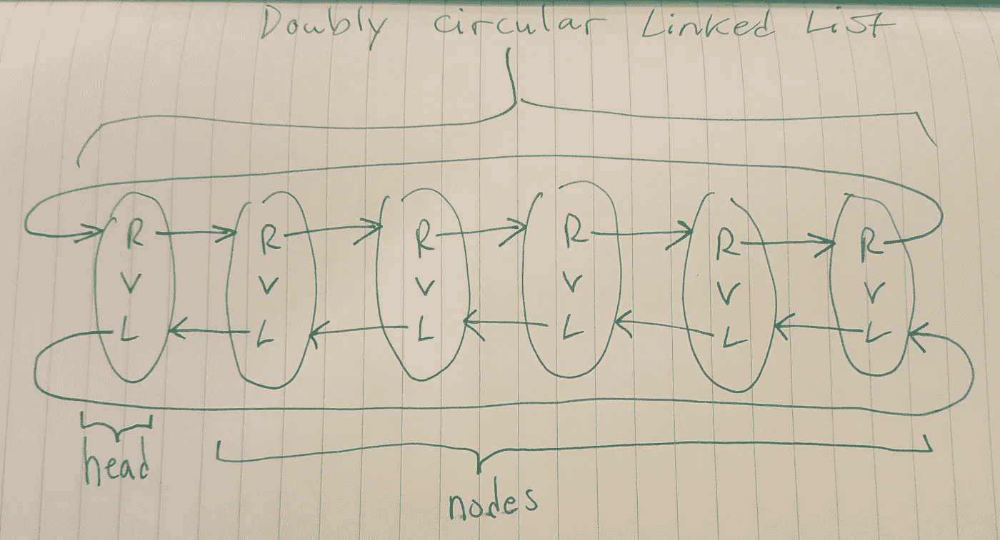
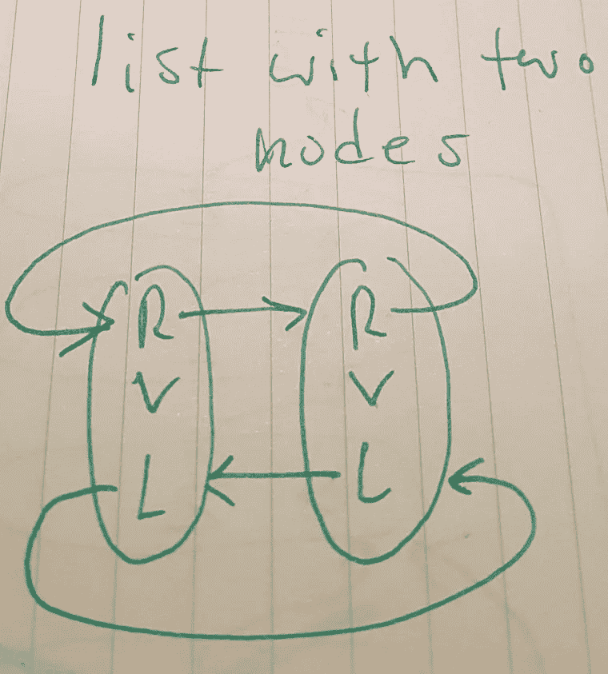
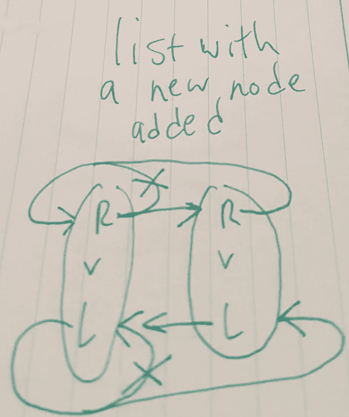
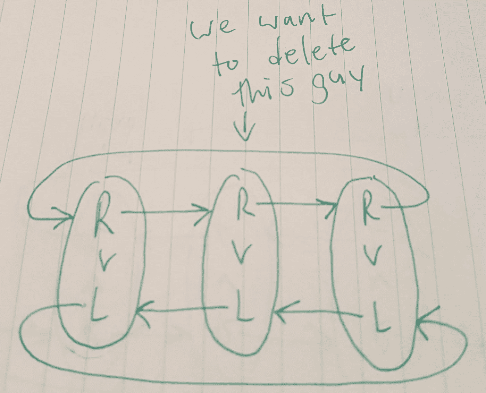
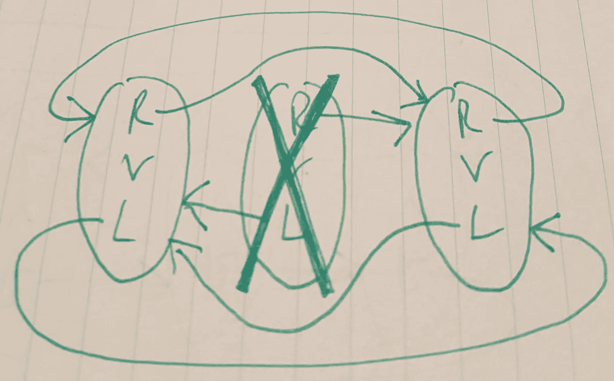
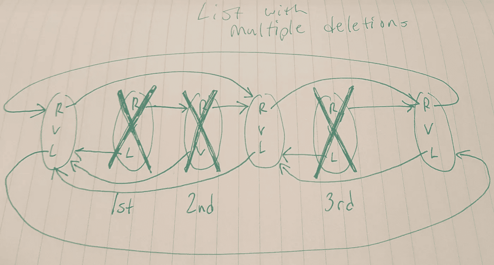
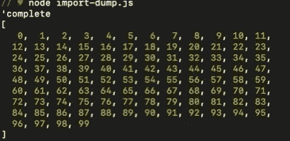
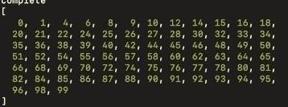
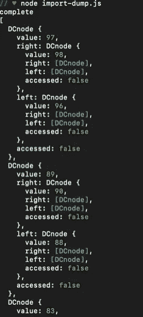

# 循环双向链表和浮动链接—打字稿

> 原文：<https://levelup.gitconnected.com/circular-doubly-linked-lists-and-dancing-links-typescript-f37bedfa08c1>

今天我要讲的是如何做一个循环双向链表。然后我将讨论跳舞链接，并向您展示如何在 Typescript 中构建这两者。

先说什么是循环双向链表。

这是一种很像单链表的数据结构。它包含了一系列的节点，就像其他的列表一样，这些节点将会指向彼此。所有节点都是相同的，因为它们都有自己的一组属性，这些属性对于每个节点都是相同的。列表本身也只是列表类的一个实例。



这样的结构有无数的好处。对于初学者来说，可以在两个方向上遍历列表，这可能使您能够比单向链表更快地找到特定的值，因为您可以同时从两端完成搜索。一旦你找到一个节点，你可以从列表中删除它，或者以比数组更快的方式添加。此外，它是最基本的数据结构之一，具有适合跳舞链接的必要属性。

我将向您展示实现和一张结构图来开始。如果您想复制并使用这段代码，您可能需要省略每个类前面的导出语句。

```
export class DCnode {value:number;right:DCnode|null;left:DCnode|null;accessed:boolean;constructor(value:number) {this.value = value;this.right = null;this.left = null;this.accessed = false;}}export class DCLL {head:DCnode|nullconstructor(){this.head = null;}appendDCnode:Function = (value:number) => {if(this.head == null) {let a:DCnode = new DCnode(value)this.head = a;a.left = a;a.right = a;} else {let b:DCnode|null = this.headwhile (b.right != this.head) {b = b.right;}let c:DCnode|null = new DCnode(value)b.right = cthis.head.left = cc.right = this.headc.left = b}}deleteDCNode:Function = (target:number) => {if(this.head == null) {return "The list is empty"} else if (this.head.value == target) {if (this.head.left == this.head) {this.head = null} else {let a:DCnode|null = this.head.leftlet b:DCnode|null = this.head.righta.right = bb.left = athis.head = b}} else {let a:DCnode|null = this.head.leftlet b:DCnode|null = this.head.rightthis.head.accessed = true;while (a.accessed == false && a.value != target && b.value != target) {a = a.leftb = b.right}if (a.value == target) {let p:DCnode|null = a.leftlet f:DCnode|null = a.rightp.right = ff.left = pthis.head.accessed = false;return a} else if (b.value == target) {let p:DCnode|null = b.leftlet f:DCnode|null = b.rightp.right = ff.left = pthis.head.accessed = false;return b} else {return "The list has been searched and the value has not been found"}}}displayList:Function = () => {let output: number[] = [];if (this.head == null) {return "The List is Empty"} else {let a:DCnode|null = this.head.rightthis.head.accessed = trueoutput.push(this.head.value)while (a.accessed == false) {output.push(a.value)a = a.right}console.log("complete")return output}}}
```

如果你读过我的单链表博客，这应该对你来说很简单。我还将按照与上次相同的步骤进行操作。

如果你不熟悉单链表，我建议你在开始学习之前先熟悉一下。

# **仅仅是基础知识**

首先，我们需要一个列表类和一个节点类。

```
class DCnode {
}class DCLL {
}
```

DC 代表双向循环，LL 代表链表，如果你想知道的话。

我们的节点将至少有一个值，访问布尔，一个右属性，和一个左属性。

我们的列表只有一个 head 属性。

```
class DCnode {
right: DCnode | null;
left: DCnode | null;
value: number;
accessed: boolean;constructor (value:number) {
this.right = null;
this.left = null;
this.value = value;
this.accessed = false;}}class DCLL {
head: DCnode | null;constructor () {
this.head = null;}}
```

很好，现在我们已经准备好开始一些最基本的功能了。这将包括删除节点和添加节点。

# **插入一个节点**

我们插入一个节点的方式将看起来非常类似于我们的单链表。我们要检查头部是否为空。如果头为空，则列表为空。否则我们需要找到尾部并追加节点。

但是，由于这是一个循环双向链表，我们必须为追加的节点设置 right 和 left 属性，以及前一个节点的 right 属性和后一个节点的 left 属性。

因为我在做一个简单的实现，所以我只在列表的末尾插入一个节点，新的尾部总是指向头部。同样，头部将总是指向新的尾部。

此外，当列表中只有一个节点时，列表看起来会很奇怪，因为属性会循环引用同一个节点。



这些图片应该有助于我们在实际编码之前理解逻辑。一个只有一个节点的列表会用它的左右属性指向它自己。

为了插入一个节点，我们可以简单地遍历列表，向一个方向移动，直到列表中的下一个节点指向头部。我们将以与单向链表相同的方式遍历该结构。将 head 节点设置为一个 tracker 变量，然后迭代直到 tracker 变量。权”属性指向头部。

然后让它的 right 属性引用新的节点而不是 head。然后将新节点的 left 属性设置为旧的 tail。然后将新尾部的右边属性赋给头部，最后将头部的左边属性赋给新尾部。

```
appendDCnode:Function = (value:number) => {if(this.head == null) {let a:DCnode = new DCnode(value)this.head = a;a.left = a;a.right = a;} else {let b:DCnode|null = this.headwhile (b.right != this.head) {b = b.right;}let c:DCnode|null = new DCnode(value)b.right = cthis.head.left = cc.right = this.headc.left = b}}
```

# **删除一个节点**

幸运的是，在我看来，从循环双向链表中删除一个节点比从双向链表或单向链表中删除一个节点更容易。

我们可以只在一个方向上遍历列表，直到找到含有我们想要的值的节点，但是如果我们那样做，我们也可以只构建一个单向链表。

为了使用双向链表的强大功能，我们将使用两个变量同时双向遍历链表，以跟踪我们正在搜索的节点。如果任一跟踪器变量的值与目标值匹配，则循环将停止。

此外，每当我用 delete 函数开始在列表中搜索时，我都将在头部左右各一步的节点处开始迭代，同时将头部的 accessed 属性设置为 true。

这样，如果值不在列表中，循环将在再次访问头时停止。

最重要的是，一旦我找到了包含我想要删除的值的节点，就像单链表一样，我们需要改变前一个和后一个节点的指针来跳过被删除的节点，使得目标节点不可访问。让我们参考我们的图纸，这样我们可以确保我们有逻辑涵盖。



```
deleteDCNode:Function = (target:number) => {if(this.head == null) {return "The list is empty"} else if (this.head.value == target) {if (this.head.left == this.head) {this.head = null} else {let a:DCnode|null = this.head.leftlet b:DCnode|null = this.head.righta.right = bb.left = athis.head = b}} else {let a:DCnode|null = this.head.leftlet b:DCnode|null = this.head.rightthis.head.accessed = true;while (a.accessed == false && a.value != target && b.value != target) {a = a.leftb = b.right}if (a.value == target) {let p:DCnode|null = a.leftlet f:DCnode|null = a.rightp.right = ff.left = pthis.head.accessed = false;return a} else if (b.value == target) {let p:DCnode|null = b.leftlet f:DCnode|null = b.rightp.right = ff.left = pthis.head.accessed = false;return b} else {return "The list has been searched and the value has not been found"}}}
```

逻辑如下:

找到候选节点，通过其左右属性引用候选节点的邻居。然后，告诉考生的左的右的属性引用右邻。反过来，告诉候选人的右的左属性引用左邻居。

这样，邻居的邻接属性跳过候选，从列表中删除其相对存在。

你可能注意到我改变了链表，但也返回了我们已经删除的节点。通常你不需要这样做，但我是，你也应该养成这样的习惯，因为只要我们有办法跟踪我们已经删除的节点，我们就可以实现跳舞链接。

现在我们已经完成了循环双向链表的最小功能，让我告诉你关于跳舞链接的事情。

**跳舞环节**

1979 年，一松浩史和 T2 发现了跳舞环节。您可能已经注意到，当我们从列表中删除一个节点时，被删除的节点仍然具有向外引用的属性。

即使该节点相对于列表不存在，列表相对于被删除的节点仍然存在。因为我们通过创建一个引用它的变量来保存被删除的节点，所以我们可以通过被删除节点的属性来访问这个列表。

不管我们从列表中删除了多少个节点，也不管它们的组合或顺序如何，都是如此。我们可以从一个大列表中删除 1000 个节点，这些节点会以一种混乱的方式引用列表中的位置。

比如说。观察这个列表，它有几个被删除的节点。



如果我们以删除节点的相反顺序恢复删除节点的引用，我们可以完美地恢复列表。无论删除了多少次，都是如此。这在处理需要回溯的复杂算法时特别有用和有效，但我将把回溯留到另一篇博客中。

现在我已经解释了跳舞链接，让我告诉你如何用我们已经做好的循环双向链表来实现它。

```
let dCLL:DCLL = new DCLLlet listentry:number = 0while (listentry < 100) {dCLL.appendDCnode(listentry)listentry += 1}console.log(dCLL.displayList())let y:number[] = math.primeSieve(100)let j:Array<DCnode | null> = [];for (let i:number = 0; i < y.length; i++) {let a:DCnode | null = dCLL.deleteDCNode(y[i])j.unshift(a)console.log(a.value)}console.log(dCLL.displayList())for (let i:number = 0; i< j.length; i++) {let a:DCnode|null = j[i]let p:DCnode|null = a.leftlet f:DCnode|null = a.rightp.right = af.left = a}console.log(dCLL.displayList())
```

在这段代码中，我实例化了一个新的循环双向链表。然后我用从 0 到 99 的 100 个值填充它。我正在使用我的 display values 函数，以便在命令行上更容易看到这一点。My display value 函数以数组的方式显示列表中的项目，但是它的值仍然与列表的结构严格相关。



然后我用质数筛找出所有小于 100 的质数。然后我遍历质数数组，用质数值搜索我的双向链表，从链表中删除每个质数。

当我在循环双向链表上调用 display values 时，它向我显示了以下内容，现在只有复合值保留在链表中:



如你所见，所有的质数都被删除了。

我还将每次删除的返回节点放入一个单独的数组中，该数组跟踪我的删除。注意，我使用的是 unshift 方法，它将每个删除顺序地推到数组的前面。这样，当我想恢复列表时，我可以从前到后遍历删除数组。

下面是我的删除顺序数组的样子:



我们可以清楚地看到，我的删除数组按照我期望的顺序包含了我删除的节点。

97 是 0-99 列表中的最后一个质数。我们可以看到 97 节点在数组的前面，它的 right 属性仍然引用 98 节点。

现在轮到造钱者了。在我的 dancing links 代码片段的最后一个 for 循环中，我遍历了被删除的节点数组，并通过写出一个与 destroy 语句非常相似的 restoring 语句，以与它们的破坏相反的顺序恢复它们的链接。

我想补充的是，在我的代码中，我一直这样做，所以每个“p”变量代表前一个节点，每个“f”变量代表后一个节点。这样我就可以演示这个步骤了。

在每一次删除中，我都写道

```
p.right = f
f.left = p
```

在每一次修复中:

```
p.right = [deleted node]
f.left = [deleted node]
```

这就是唐纳德·克努特的新书所描述的。《计算机编程艺术》第 4 卷，第 5 分册。

最后，在恢复之后，我可以使用我的显示功能来查看我的列表已经被完美地恢复了。


你自己试试吧。这是一个启发性的项目，我喜欢它的每一秒钟。下次见。

[](https://skilled.dev) [## 编写面试问题

### 一个完整的平台，在这里我会教你找到下一份工作所需的一切，以及…

技术开发](https://skilled.dev)