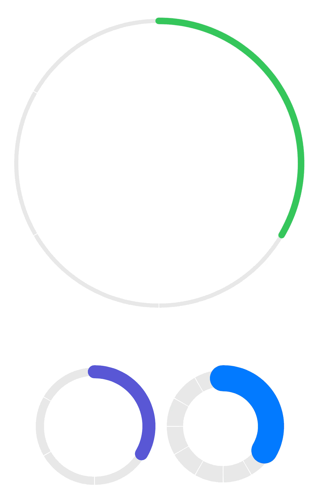
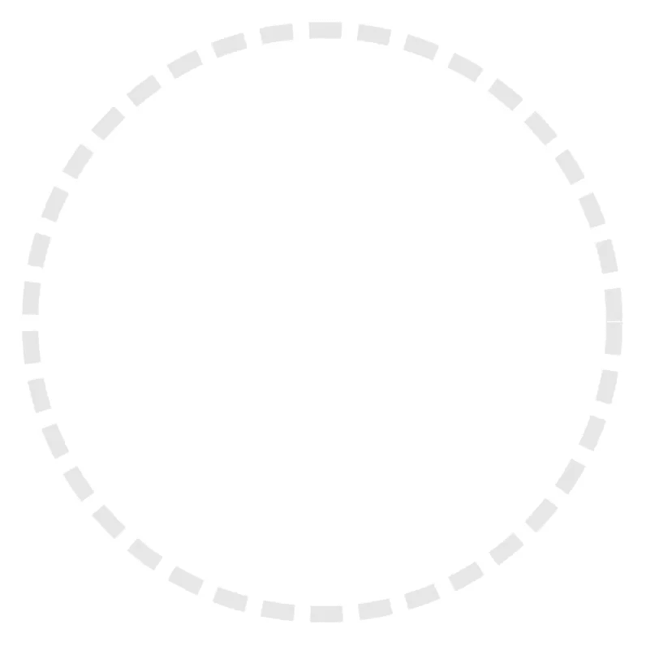
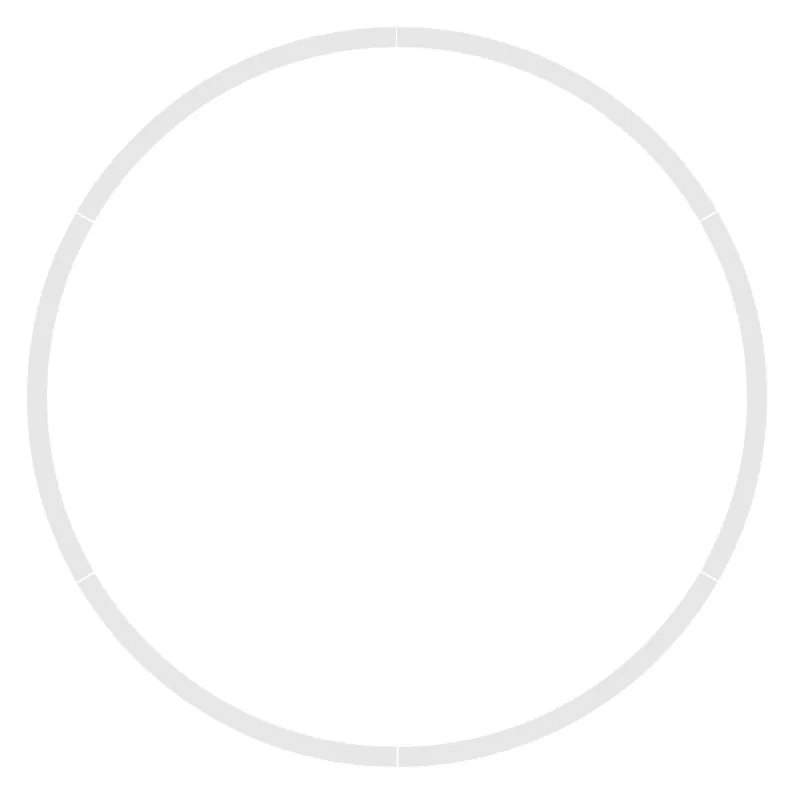
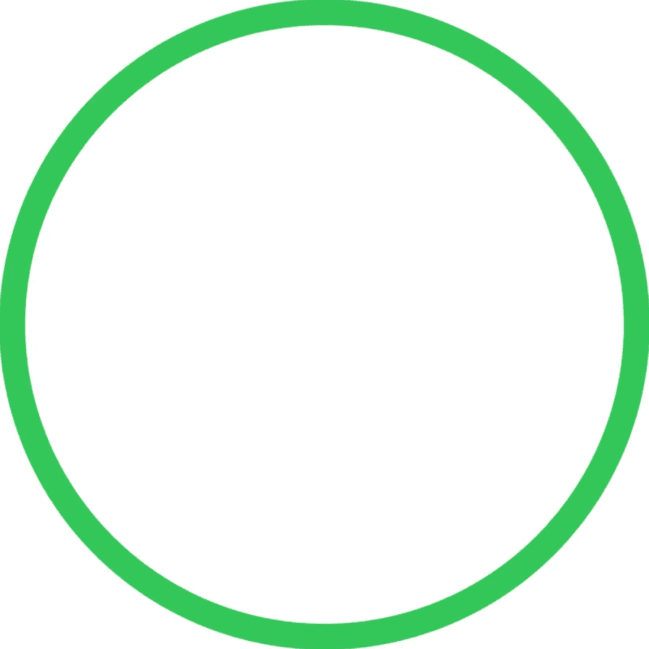
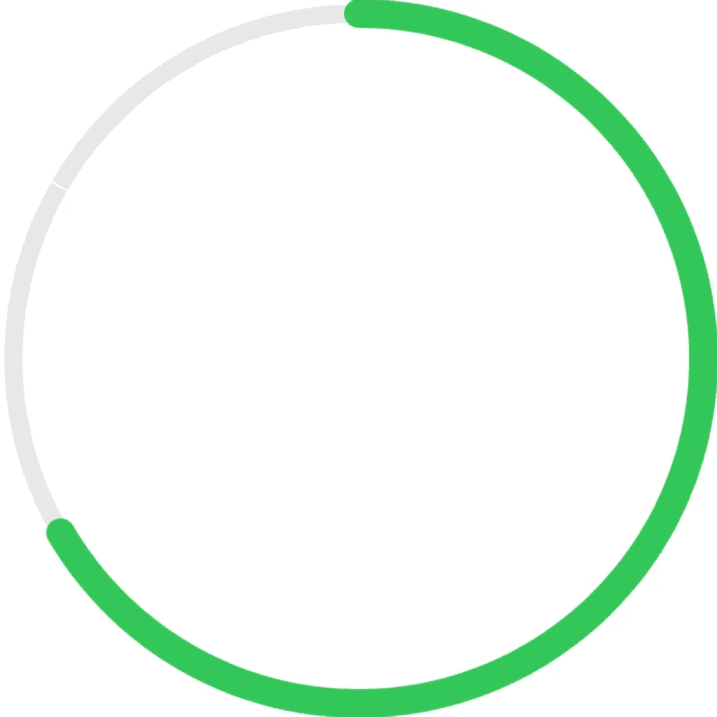
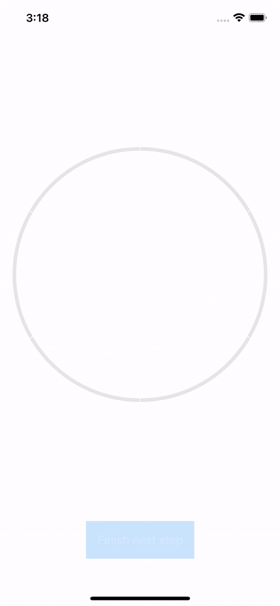
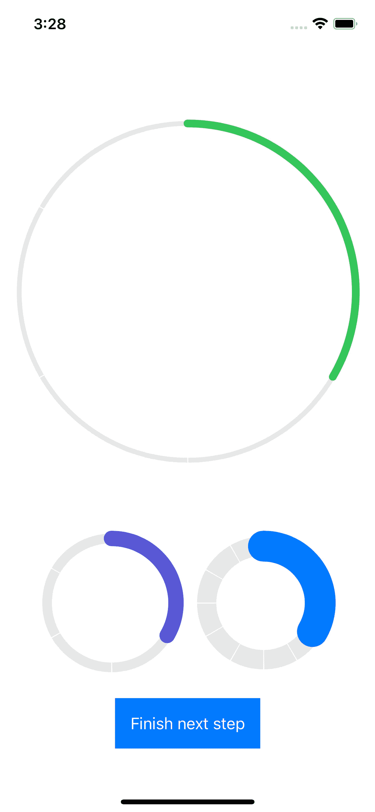

# SwiftUI 中带有步骤的圆形进度条

> 原文：<https://levelup.gitconnected.com/circular-progress-bar-with-steps-in-swiftui-a2ddf8ffc2d9>

## iOS 应用程序开发

## 在本教程中，我们将使用 SwiftUI 从头开始创建一个圆形进度条。



圆形进度条是 UI 的一个流行元素。但不幸的是，苹果默认不为我们提供它，所以没有简单的方法将其添加到您的应用程序中。幸运的是，我们可以创建自己的应用程序，并根据自己的意愿进行配置，因此我们可以在整个应用程序中重用它。

事不宜迟，让我们直接开始创建它。在 Xcode 中创建新的 iOS 应用程序，然后在那里创建 SwiftUI 视图。称之为`CircularProgressBarBackgroundView`。

> *在本教程中，我们使用最新版本的 Xcode (13.4)和 macOS Monterey (12.4)进行编写。*

首先，让我们将一个简单的`Circle`放入视图的`body`中。然后添加以下几行:

```
struct CircularProgressBarBackgroundView: View {
    var body: some View {
        Circle()
            .stroke(Color(white: 230/255),
                    style: StrokeStyle(
                        lineWidth: 10,
                        lineCap: .butt,
                        lineJoin: .miter,
                        miterLimit: 0,
                        dash: [20, 10],
                        dashPhase: 0))
            .padding(20)
    }
}
```

然后在`Canvas`中运行预览。它应该是这样的:



让我们快速讨论一下我们在这里做了什么:

*   我们添加了`stroke`修改器来设置圆形的边界，
*   我们选择了灰色作为，剧透警告，这将是我们的进度条的背景，
*   我们为笔画设置了一种样式，
*   我们添加了`padding`来使 UI 看起来更好一些。

正如你所看到的，每个破折号的长度是 20px，它们之间的距离是 10px。

现在可能还不清楚，但是这个圆是从非常正确的点开始画的，也就是 0 度。但是我们的进度条将从顶部开始，所以我们需要将形状逆时针旋转 90 度。将`rotationEffect`修改器添加到`Circle`:

```
struct CircularProgressBarBackgroundView: View {
    var body: some View {
        Circle()
            .stroke(Color(white: 230/255),
                    style: StrokeStyle(
                        lineWidth: 10,
                        lineCap: .butt,
                        lineJoin: .miter,
                        miterLimit: 0,
                        dash: [20, 10],
                        dashPhase: 0))
            **.rotationEffect(.degrees(-90))**
            .padding(20)
    }
}
```

接下来，我们将玩一会儿数学家游戏。我们希望将破折号之间的距离设置为 1px，并在我们的过程中创建尽可能多的破折号。为了实现这一点，我们需要钻研一下三角学。别担心，会很简单的。

> 注意:教程完成后，您可以很容易地将进度条切换为使用百分比而不是步骤。

周长为`π * r * 2`，其中`π`为常数，约等于。3.14，r 是圆的半径。所以，破折号的长度应该是`length / n — dd`，其中`length`是上面提到的公式，`n`是进度条将要进行的步数，`dd`是破折号之间的距离。

如果你明白了，或者即使你不明白，也不在乎，也不想写代码，那就让我们开始吧。我们将在视图中添加两个新变量，并在`dash`参数中使用它们。但是要实现它，我们还需要知道圆的半径。我们知道圆形的宽度是`r * 2`，所以我们可以使用`GeometryReader`来获得宽度，并在我们的公式中使用:

```
struct CircularProgressBarBackgroundView: View {
    let total: Int

 **var shortDashSize: CGFloat { 1 }
    func longDashSize(circleWidth: CGFloat) -> CGFloat {
        .pi * circleWidth / CGFloat(total) - shortDashSize
    }**

    var body: some View {
 **GeometryReader { geometry in**
            Circle()
                .stroke(Color(white: 230/255),
                        style: StrokeStyle(
                            lineWidth: 10,
                            lineCap: .butt,
                            lineJoin: .miter,
                            miterLimit: 0,
 **dash: [
                                longDashSize(circleWidth: geometry.size.width),
                                shortDashSize
                            ],**
                            dashPhase: 0))
                .rotationEffect(.degrees(-90))
 **}**
        .padding(20)
    }
}
```

让我们快速回顾一下我们在这里所做的工作:

*   我们将`Circle`包装到`GeometryReader`中以获得`Circle`的宽度，
*   我们添加了`shortDashSize`，它实际上是破折号之间的距离，
*   我们添加了`longDashSize`方法，使用上面的公式计算破折号长度，
*   我们在`dash`参数中使用新的变量和方法。

如果您将文件底部的画布预览设定为:

```
CircularProgressBarBackgroundView(total: 6) .previewLayout(.fixed(width: 400, height: 400))
```

你会看到这样的东西:



如你所见，我们在进度条中有多少`total`步就有多少破折号。您可以随意更改该值。

最后一件事。与其有固定的填充，不如让它灵活一点。另外，让我们输入一个参数，这样线宽也是可调的:

```
struct CircularProgressBarBackgroundView: View {
    let total: Int
    **@State var lineWidth: CGFloat = 16**        
    var shortDashSize: CGFloat { 1 }
    func longDashSize(circleWidth: CGFloat) -> CGFloat {
        .pi * circleWidth / CGFloat(total) - shortDashSize
    }

    var body: some View {
        GeometryReader { geometry in
            Circle()
                .stroke(Color(white: 230/255),
                        style: StrokeStyle(
                            **lineWidth: lineWidth / 1.6,**
                            lineCap: .butt,
                            lineJoin: .miter,
                            miterLimit: 0,
                            dash: [
                                longDashSize(circleWidth: geometry.size.width),
                                shortDashSize
                            ],
                            dashPhase: 0))
                .rotationEffect(.degrees(-90))
 **}**
        **.padding(lineWidth/2)**
    }
}
```

*   我们添加了一个新的参数`lineWidth`，其默认值设置为 16。它将是主进度条圆圈的宽度，
*   因为这是我们的背景，它会比主圆薄一点，所以我们把这个值除以 1.6，
*   我们将填充设置为`lineWidth/2`，这样整行都是可见的(否则，视图会在边缘切掉半行)。

现在，让我们画一个显示进度的圆圈。创建一个新的 SwiftUI 视图，将其命名为`CircularProgressBarProgressView`。首先，让我们创建一个简单的应用了`.stroke`的`Circle`:

```
struct CircularProgressBarProgressView: View {
    @State var lineWidth: CGFloat = 16
    @State **var** color: Color = .green var body: some View {
        Circle()
            .stroke(color,
                    style: StrokeStyle(
                        lineWidth: lineWidth,
                        lineCap: .round
                    ))
            .rotationEffect(.degrees(-90))
            .padding(lineWidth/2)
    }
}
```

以类似的方式，我们创建一个`Circle`并为`stroke`设置所有参数，逆时针旋转它并添加一个填充。



现在，我们需要在这个圆圈之外制作一个进度条。为此，我们需要`trim`这个圈:

```
struct CircularProgressBarProgressView: View {
 **let total: Int
    let completed: Int**    @State var lineWidth: CGFloat = 16
    @State **var** color: Color = .green var body: some View {
        Circle()
 **.trim(from: 0, to: CGFloat(completed)/CGFloat(total))**
            .stroke(color,
                    style: StrokeStyle(
                        lineWidth: lineWidth,
                        lineCap: .round
                    ))
            .rotationEffect(.degrees(-90))
            .padding(lineWidth/2)
    }
}struct CircularProgressBarProgressView_Previews: PreviewProvider {
    static var previews: some View {
 **CircularProgressBarProgressView(total: 6, completed: 4)**
            .previewLayout(.fixed(width: 400, height: 400))
    }
}
```

*   我们增加了两个参数`total` & `completed`，
*   我们将`.trim`应用于`Circle`。正如你所看到的，我们在执行除法之前，将`Int`值转换为`CGFloat` **，因为否则在划分`Int` s 时，它会将结果向下舍入为`Int`值，使所有值都小于`total` 0。这是不正确的，因为我们的进度条要么是空的，要么是满的，**
*   我们修改了我们的预览，所以我们可以看到它现在的样子:


您可以在预览中使用这些值，看看有什么变化。您也可以将几个预览打包成一个`Group`，这样您就可以看到视图的不同状态:

```
struct CircularProgressBarProgressView_Previews: PreviewProvider {
    static var previews: some View {
        Group {
            CircularProgressBarProgressView(total: 6, completed: 0)
            CircularProgressBarProgressView(total: 6, completed: 4)
            CircularProgressBarProgressView(total: 6, completed: 6)
        }
        .previewLayout(.fixed(width: 400, height: 400))
    }
}
```

我们快到了。现在，是时候将我们迄今为止所做的一切结合在一起了。创建另一个 SwiftUI 视图，将其命名为`CircularProgressBarView`。这很简单:

```
struct CircularProgressBarView: View {
    let total: Int
    let completed: Int
    @State var lineWidth: CGFloat = 16
    @State var color: Color = .green

    var body: some View {
        ZStack {
            CircularProgressBarBackgroundView(total: total, lineWidth: lineWidth)
            CircularProgressBarProgressView(total: total, completed: completed, lineWidth: lineWidth, color: color)
        }
    }
}struct CircularProgressBarView_Previews: PreviewProvider {
    static var previews: some View {
        CircularProgressBarView(total: 6, completed: 4)
            .previewLayout(.fixed(width: 400, height: 400))
    }
}
```

因此，它只有三个参数，两个显示总的和完成的步骤，一个显示线条宽度，一个`ZStack`包含我们的视图，首先是背景，以及下面的进度条视图:



快好了！让我们看看它是如何工作的。转到应用程序的主视图，可能是`ContentView`，将新视图添加到其中，还有一个按钮可以更新进度:

```
struct ContentView: View {
    let total = 6
    @State var completed = 0
    let lineWidth: CGFloat = 16

    var body: some View {
        VStack {
            CircularProgressBarView(total: total, completed: completed, lineWidth: lineWidth, color: .green)
            Button {
                withAnimation {
                    guard completed < total else {
                        completed = 0
                        return
                    }
                    completed += 1
                }
            } label: {
                Text("Finish next step")
                    .padding()
                    .background(Color.blue)
                    .foregroundColor(.white)
            }
            .padding(.vertical)
        }
        .padding()
    }
}
```

它是这样工作的:



您可以为进度条设置不同的大小、线宽和颜色:



就是这样！现在，我们有了一个很好的进度条，可以针对不同的情况进行调整。完整代码的链接在这里:

[](https://github.com/alexzarr/CircularProgressBar) [## GitHub-Alex zarr/circular progress bar

### 此时您不能执行该操作。您已使用另一个标签页或窗口登录。您已在另一个选项卡中注销，或者…

github.com](https://github.com/alexzarr/CircularProgressBar) 

此外，请查看我关于如何让您的 Swift 代码更好的文章:

[](https://medium.com/geekculture/when-you-write-code-in-swift-write-code-in-swift-abdac43d44fa) [## 当你用 Swift 写代码时，用 Swift 写代码

### 不要忘记 Swift 为您提供的便捷方法和构造。

medium.com](https://medium.com/geekculture/when-you-write-code-in-swift-write-code-in-swift-abdac43d44fa)