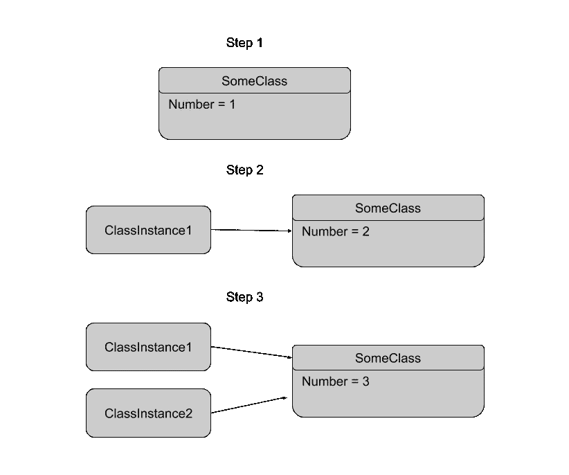
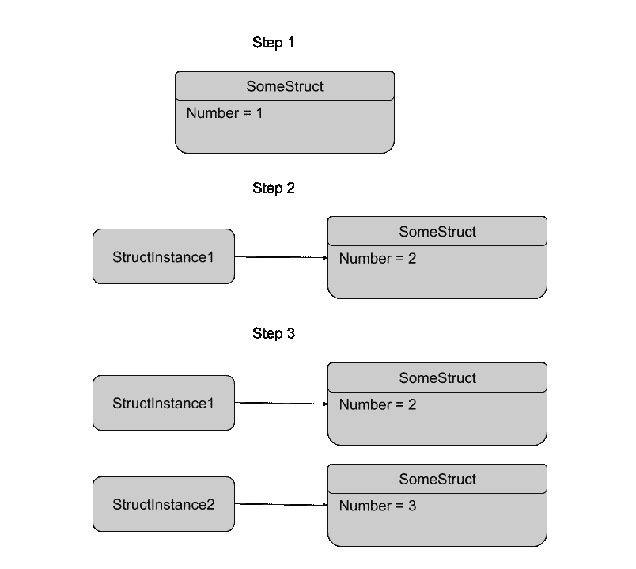

# Swift 中的类与结构

> 原文：<https://levelup.gitconnected.com/class-vs-struct-8e4dafa66ae9>

Class 和 struct 是 iOS 开发的基础，了解它们之间的区别以及何时使用它们非常重要。我们来探索一下。

class 和 struct 的一个简单区别是:struct(结构)是值类型，class 是引用类型。这是什么？

信用—[https://giphy.com](https://giphy.com)

## **参考类型(类)**

当你将一个类赋给一个变量或常量时，它不会被复制到内存中。它将指向内存中相同的现有实例。这有点令人困惑，让我们来看看这个例子，以便更清楚地了解-

类引用示例

在上面的例子中，在步骤 1 中，您创建了一个名为 SomeClass 的类，该类包含一个变量名 number。

在步骤 2 中——您正在创建一个名为 classInstance1 的 SomeClass 实例，并将变量“number”的值更改为 2。

在步骤 3 中——您正在创建一个名为 classInstance2 的 classInstance1 实例(它已经是 SomeClass 的实例),并将“number”变量的值更改为 3。

在步骤 4 -打印 classInstance1.number 和 classInstance2.number 的值，您将看到这两个值是相同的，并且是最后更新的值。

类参考图

如上图所示，两个实例都指向内存中的同一个位置，所以无论我们最后做了什么改变，都会在两个引用中反映出来。

## 值类型(结构)

当你把一个结构赋给一个变量或常数时，它将被复制到内存中。甚至 swift 的大部分内部实现都是作为 struct 编写的。让我们来看一个例子，以获得更多的说明:

结构实例图

在上面的示例中，在步骤 1 中，您正在创建一个名为 SomeStruct 的结构，该结构包含一个变量名 number。

在第 2 步中，您创建了一个名为 structInstance1 的 SomeStruct 实例，并将“number”变量的值更改为 2。

在步骤 3 中，您正在创建名为 structInstance2 的 structInstance1 实例(它已经是 SomeInstance 的实例),并将“number”变量的值更改为 3。

在第 4 步中，您正在打印 structInstance1.number 和 structInstance2.number 的值，您将看到这两个值这次不相同。

结构参考图

如上图所示，这两个实例完全不同，指向内存中的不同位置，也就是说，每当我们创建 struct 的实例时，它都会复制。

## 类和结构之间的相似性

*   在这两种情况下，您都可以定义属性来存储值。
*   在这两种情况下，您都可以定义下标。
*   两者都提供了初始化器。
*   两者都提供协议实现
*   类拥有 struct 能提供的所有东西。

## 课堂中的附加功能

*   它提供了继承。
*   它为您提供了类型转换，您可以使用它来检查运行时。
*   它为你提供解初始化器。
*   它提供引用计数。

## 参考资料:

 [## 结构和类-Swift 编程语言(Swift 5.3)

### 结构和类是通用的、灵活的构造，成为程序代码的构建块…

docs.swift.org](https://docs.swift.org/swift-book/LanguageGuide/ClassesAndStructures.html)  [## Apple 开发者文档

### 在结构和类之间选择

developer.apple.com](https://developer.apple.com/documentation/swift/choosing_between_structures_and_classes) 

感谢您阅读这篇文章。如果你觉得这篇文章有帮助，请不要忘记鼓掌。

如果您有任何问题或意见，请随时通过 [Twitter](https://twitter.com/nomadicsheldon) 联系我。