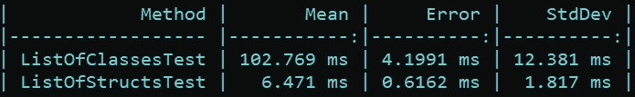
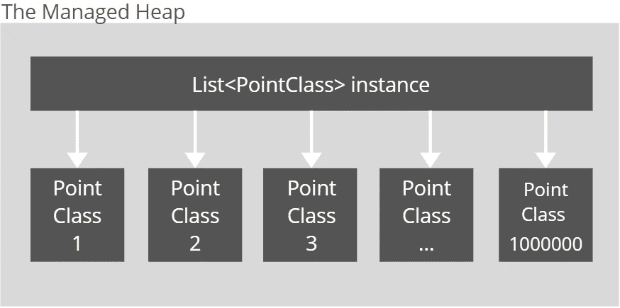
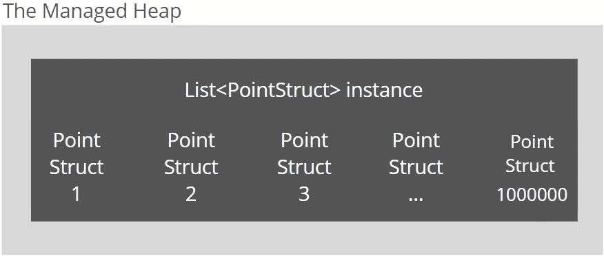

# 为什么 C# 中 List <struct>的分配速度比 List <class>快 15 倍</class></struct>

> 原文：<https://levelup.gitconnected.com/why-is-list-struct-is-15-times-faster-to-allocate-than-list-class-17f5f79889ae>


[斯科特·格雷厄姆](https://unsplash.com/@homajob?utm_source=medium&utm_medium=referral)在 [Unsplash](https://unsplash.com?utm_source=medium&utm_medium=referral) 上的照片

在上一篇文章 [5 种免费提高 C#代码性能的方法](/5-ways-to-improve-the-performance-of-c-code-for-free-c89188eba5da)中，在其中一个例子中，我测量了分配一个类列表和分配一个结构列表之间的时间差。

让我们记住这个例子:

`ListOfClassesTest`和`ListOfStructsTest`方法几乎相同。第一种方法分配一百万个`PointClass`实例并将其添加到列表中，而第二种方法分配一百万个`PointStruct`实例并将其添加到列表中。类型`PointClass`和`PointStruct`有相同的成员，但是唯一小而关键的区别是`PointClass`是一个类，而`PointStruct`是一个结构。

由 awesome library[BenchmarkDotNet](https://github.com/dotnet/BenchmarkDotNet)完成的性能结果令人印象深刻:



`ListOfStructsTest`方法比`ListOfClassesTest.`快 15 倍以上

我们来试着分析一下为什么会有如此巨大的时差。

我们首先要理解在堆上分配一个引用类型的实例和在栈上分配一个结构的实例之间的区别。

```
public void Test()
{
   var obj = new object(); //reference type allocation

   int x = 12; //value type allocation
}
```

在托管堆中为引用类型分配内存的时间通常是快速操作。对象被连续分配和存储**。公共语言运行库拥有指向内存中第一个可用空间的指针。分配一个新对象涉及到将新对象的大小加到指针上。**

在对象被放入托管堆之后，它的地址被写回到在堆栈上创建的引用`obj`。

总的来说，整个过程非常便宜。然而，为引用类型的对象分配内存的过程并不总是那么容易，并且可能涉及额外的繁重部分。

如果引用类型大于 85K 字节，运行时将花费更多时间在**大型对象堆**中寻找合适的位置来存储对象，因为那里的内存是碎片化的(空闲块或地址空间中的“洞”)。

在**小对象堆**中没有更多空闲空间来存储应用程序请求的对象的情况下，引用类型对象分配很慢。发生这种情况时，公共语言运行库需要运行垃圾回收进程。如果垃圾收集器没有释放足够的内存，运行时会请求额外的虚拟内存页面。

在堆栈上分配值类型实例怎么样？

为值类型分配内存**几乎是即时操作，分配的时间几乎不取决于值类型的大小。运行时应该做的唯一事情是创建一个适当大小的堆栈框架来存储值类型和修改堆栈指针。**

要点是将值类型的实例放入堆栈很快，更重要的是，与在堆上分配引用类型对象相比，这是一个时间上确定的过程。

现在让我们回到我们的例子。

当分配了一百万个引用类型的实例时，它们被一个接一个地推入托管堆中，并且引用被存储回集合实例中。事实上，会有一百万+ 1 个对象进入内存。



然而，当分配了一百万个值类型的实例时，只有一个对象**被推入托管堆**，它是一个集合的实例。一百万个结构将被嵌入到`List<T>`实例中。在创建了`List<T>`实例之后，运行时唯一要做的事情就是用数据填充它。



开发人员不仅受益于为大型集合选择结构而不是类时的快速分配时间，还受益于发布时间。

如果开发人员分配了一百万个`PointClass`实例，在“标记和清理”阶段，垃圾收集器将不得不扫描一百万个对象，并检查每个对象是否仍有引用。然后，在“压缩”阶段，垃圾收集器将不得不移动一百万个对象。最终，存储在`List<PointClass>`实例中的地址应该用新地址更新。这是大量的工作。

但是对于垃圾收集器来说，当开发人员分配一百万个`PointStruct`实例时，情况会好得多，因为在托管堆中只有一个`List<PointStruct>`实例是垃圾收集器必须处理的。

# 结论

结构可能比类更具性能，但是在用`struct`替换`class`关键字或相反的情况之前，一定要仔细分析您的具体情况。程序员的工作不是盲目地遵循建议或最佳实践，而是选择最合适的工具、方法和途径，以尽可能最好的方式解决他或她的独特情况。

# 参考

*   [堆 vs 栈，值类型 vs 引用类型](https://tooslowexception.com/heap-vs-stack-value-type-vs-reference-type/)
*   [分配在栈上还是堆上？](https://devblogs.microsoft.com/dotnet/allocating-on-the-stack-or-the-heap/)
*   [亲。NET Performance:优化你的 C#应用程序，作者 Sasha Goldshtein(第 3 章)](https://www.amazon.com/Pro-NET-Performance-Optimize-Applications/dp/1430244585)
*   [垃圾收集的基础](https://docs.microsoft.com/en-us/dotnet/standard/garbage-collection/fundamentals)

## 我的其他文章:

[](/50-software-engineering-best-practices-for-technical-leaders-and-seniors-cfcdf6a17e44) [## 面向技术领导者和资深人士的 50 个软件工程最佳实践

### 最佳工程师的最佳实践。

levelup.gitconnected.com](/50-software-engineering-best-practices-for-technical-leaders-and-seniors-cfcdf6a17e44) [](/how-to-fix-bugs-and-not-introduce-new-ones-9f35e625673a) [## 如何在不破坏应用程序的情况下修复 Bug

### 更改源代码时更自信的步骤。

levelup.gitconnected.com](/how-to-fix-bugs-and-not-introduce-new-ones-9f35e625673a) [](/5-ways-to-clone-an-object-in-c-d1374ec28efa) [## 在 C#中克隆对象的 5 种方法

### 各有利弊

levelup.gitconnected.com](/5-ways-to-clone-an-object-in-c-d1374ec28efa)