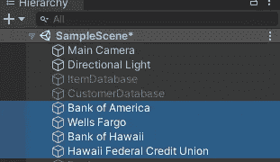

# 使用 Unity 的 C#类

> 原文：<https://levelup.gitconnected.com/classes-in-c-using-unity-4325f2080353>

什么是类、自定义类和类继承？在这篇文章中，我将深入探讨这些问题以及更多。上课了！

一个*类*基本上就是一个*脚本*，如果你熟悉 Unity 中的*单声道行为*，那么你已经熟悉了类*继承*。Mono 行为是 Unity 提供的，这样用户可以将脚本拖放到游戏对象上，这对于面向对象的编程来说很重要。将脚本附加到游戏对象上，以实现运动、UI、射击等功能。因为附加的脚本从 Unity 继承了 mono 行为。

**自定义类**

*自定义*类是开发人员定义的类，可用于创建模块化，并存储从自定义类继承的其他类的相关信息。对于第一个例子，让我们从一个名为*武器统计*的自定义类开始，它将被用作基类来定义创建最基本的武器需要哪些共享变量。在通过一个新的 C#脚本来做这件事之前，让我们把它作为一个*自定义*类添加到*玩家*类中，在那里玩家可以直接访问武器属性。

在*玩家*职业的顶端，为*武器属性*声明了一个新的公共*定制*职业。你可以在图像的底部看到玩家脚本开始的地方。这个*自定义*职业将是任何与各种武器相关的信息的基础。所有武器都会有一个*名称*、一个*射速*和一个*弹药*计数，所以这些都存储在*变量*中。

在玩家类中，新武器的变量可以通过将它们声明为*武器统计*来创建，这使用了玩家类之上的*自定义*武器统计类。这里我为新的*武器*引入两个变量。一个是等离子步枪，另一个是火箭发射器。

现在在*开始*无效的情况下，可以通过声明火箭发射器为*新*武器属性来*创建*。在那之后，火箭发射器可以被引用，然后*点符号*可以用来给*自定义*类中的变量赋值，比如名称、射速和弹药数。现在火箭发射器已经被*实例化*，并且它的所有信息已经被*初始化*。

这种方法的问题是，你必须为你想制造的每一件武器都这样做。如果你的游戏中有 50 件武器，这会变得非常冗长乏味。为了真正利用自定义类的能力，建议使用构造函数初始化对象。

**构造函数**

构造函数是*初始化来自*自定义*类的*对象的一种神奇方式。构造函数使用*公共*声明以及声明它的*自定义*类的*相同的*类名。然后，可以在构造函数中用您想要的任何值初始化变量。这里的主要问题是，这将*硬编码*这个信息到自定义武器统计*类*中，这是最好避免的。

更好的解决方案是将*参数*添加到构造器*方法*中，要求用户在创建武器时输入值。现在，用户将有机会在创建新武器时传递他们想要的值，而不是对信息进行硬编码。为了清楚起见， *this.name* 引用了*自定义*类中的名称*变量*，然后将通过构造函数方法*参数*传入的*名称*的值赋给它。

现在 player 类中的火箭发射器声明被打乱了，因为它正在寻找那些要传入这里的参数。我们来处理一下。

现在在 void *start* 的 *player* 类中，用户可以在创建新武器时在方法*参数*中传递他们想要的值。如果您想要在检查器中自定义这些值，该怎么办？好了，我们来看看*序列化定制类*。

**序列化定制类**

让我们来看看如何创建一个商品数据库。我们首先需要的是一个不继承 mono 行为的*自定义*类，称为*项目*。然后我们可以声明所有项目将共享的基本*变量*。在这种情况下，有用于 *ID、名称、描述*和*图标*的变量。

下一步是创建一个名为*物品数据库*的*空游戏对象*，以及对应的同名 C#脚本。将继承 mono 行为的项目数据库脚本拖到项目数据库对象上进行分配。

可以通过引用物品*类*来声明物品变量，然后可以在 void start 中创建和初始化物品，就像之前的武器类一样。同样，如果您要创建大量的项目，这可能会变得很乏味。让我们通过在自定义的*项目*类中添加一个构造函数来简化这个过程。

一个自定义类可以有*多个*构造函数。第一个*空*构造函数方法将允许用户创建一个*空*项，然后*在*项数据库*脚本的*空开始*中初始化*项。第二个构造函数使用需要满足的方法参数*来创建一个条目。*

回到*物品数据库*类，*匕首*使用需要*参数*的构造函数初始化，而剑使用*空*构造函数然后定义之后的值。

一个更干净的创建条目的方法是通过一个带有参数的*返回方法*。return 方法中的 *var* 数据类型会检测到你试图创建一个新的*项*。或者，您也可以键入**项目**项目*项目*。通过声明其变量，将其值赋给*创建项目*返回方法的值，然后传入所需的*参数*来创建屏蔽项目。既然我们已经看到了创建项目的三种不同方式，让我们*序列化*这些数据，以便在*检查器*中查看。

即使匕首和剑物品是*公共*，它们也不会出现在*检查器*中，除非通过基本*物品类*使它们可见。这可以通过把*【系统。*【可序列化】在*项*类的顶部。

现在*物品数据库*中的*公共*物品将在*检查器*中可见。盾牌仍然是私有的，所以需要一个额外的序列化字段属性。

现在创建的项目在*检查器*中可见。

当*播放*按钮被按下时，信息通过*构造器*和*初始化*被*分配给*。

由于基础项目类现在被序列化到检查员，你可以绕过所有项目中的硬编码，而是通过*检查员*将完全控制权交给*设计者*。您所需要的只是数据库中的一个*数组*或*列表*，使用自定义的 *Item* 类。 *foreach* 循环将告诉我当前在*数组中的*的每个*项的*名称*，*但不需要这样做。

在*检查器*中，数组中的项目数量可以被赋值 *(3)* 。然后，该数组将填充那么多的*元素*，供设计者填充空白信息。

**挑战:** *客户数据库*

我的任务是将*客户*添加到*数据库*中。让我们利用到目前为止所学的知识，创建一个*自定义*类来表示一个客户最基本的属性。

创建两个脚本，*客户*和*客户数据库*。*客户*将是*自定义*类，而*客户数据库*将被附加到一个*空*游戏对象，同时继承 *Mono 行为*。

从顶部开始，这个*自定义*类被*序列化*以显示在*检查器*中。这个*公共*类不继承 Mono 行为，有一个*客户属性*头。这些属性包括一个*客户 ID* 、*名字*和*姓氏*、*年龄*、*性别*和*职业*。底部是一个*构造器*方法，它采用*参数*来创建一个*客户*。

*客户数据库*类展示了客户的*数组*，以及另外三个硬编码到系统中的客户。有一个*创建客户*返回方法，它采用*参数*。这些客户在 void start 中通过使用 *return* 方法进行初始化。

**阶级继承**

我们之前设置了一个项目类，它具有所有项目共有的基本特征 *(ID、名称、描述和图标)*。现在，需要更多信息的其他项目可以在它们各自的类中创建，同时从 *Item* 类继承基本特征。创建了一个名为*武器*的新类来处理武器物品的创建。另一个叫做*药剂*的新职业是为管理各种药剂而创建的。

这里要注意的主要一点是，这两个脚本都不是从*单声道行为*继承的，而是从*项目*继承的。这样武器和药剂两个职业都将拥有与物品 *(ID，名字，描述，图标)*相同的基础信息。武器类有更多的变量来表示与武器相关的东西，并不是所有的物品都需要这些变量*(攻击力和重量)*。*示例方法*显示在调试消息中，可以从 *Item* 类中访问 *itemName* 变量。

药水类只有一个字符串变量，告诉我们药水会有什么效果。这是一个包含与*健康*恢复相关的 *int* 值的好地方。

在*项目数据库*类中，为新类声明了两个公共变量。有一把军刀*武器*和一剂*生命值*。你也可以有一个*数组*或*列表*中的*武器*和*药剂*，就像用*物品*的例子一样。

因为*武器*和*药水*职业都在用*系统。在*检查器*中可以看到并调整新的军刀和生命药剂的值。*

**银行系统:** *继承示例*

这里有一个定制的 *Bank* 类，它可以被 *Bank Manager* 脚本继承。所有银行都有一个分支机构的基本属性*名称*、*地址*以及金库里有多少*现金*。可以调用三种方法来检查账户的*余额*、*取款*或*存款*。*调试*消息将说出调用该方法的分支的*名称*。

*银行经理*类继承自 *Mono 行为*，因此它可以附加到场景中的银行对象。一个*银行*变量将为每个银行项目提供来自*银行*类的所有*细节*和*方法*，并且位于一个*分支细节*变量名称下。

*联邦信用合作社*类继承了*银行*的基本属性，但也为*借贷*添加了一个值，以及当您的贷款被批准时 ping 的*方法*。

创建一个*联邦信用合作社经理*类来放置在银行游戏对象上，并使用从*银行*继承的 *FCU* 类来处理所有细节。

在层次结构中创建立方体原语来表示一些不同的已知银行机构。美洲银行、富国银行和夏威夷银行都获得附加的*银行经理*脚本，而夏威夷联邦信用合作社获得 *FCU 经理脚本*。这些游戏物体上有*碰撞器*，所以当玩家进入银行时，所有的银行信息都可以被碰撞的玩家*访问。*

每个银行都可以在检查器中分配其唯一的信息。

FCU 有额外的价值供*可用的钱借给*。

**受保护的访问修饰符**

虽然*私有*声明使得一个变量或方法只能从它自己的类中访问，而*公共*声明允许访问任何脚本，但是*保护的*访问修饰符做什么呢？Protected 将保持私有，除了从它继承的类。在 Bank 类中保护这些变量和方法，意味着只有从 *Bank* 继承而来的*Bank manager*可以访问这些数据。即使*系统。Serializable* 属性出现在 *Bank* 类的顶部，您仍然需要*序列化*各个字段，以便在*检查器*中填充它们。

**虚拟方法和覆盖**

有时候你可能需要用另一个脚本覆盖一个脚本中的数据。让我们来看看如何用宠物系统做到这一点。这个*宠物*类将是所有宠物的基类，*从*单声道行为*继承*，这样它就可以被放置在场景中的宠物*对象*上。有一个*受保护的*名称，这样只有继承类的*才能访问它，还有一个受保护的*虚拟*方法。*虚拟*方法可用于存储数据，当从另一个脚本访问时，这些数据可被*覆盖*。在 void *start* 中调用一个 Speak 方法，该方法调用*虚拟*方法，并向*“Speak”*的控制台发送一个 *Debug* 消息。*

为一只*狗*和一只*鸭*创建了两个立方体对象。

每种动物都有自己的剧本。

*鸭*和*狗*类*从*宠物*继承*，并有一个*覆盖*的方法。因为*虚拟*方法受*保护*，所以*覆盖*方法也需要*匹配*才能工作。因为 Pet 是基类，如果调用 *base。Speak()* ，消息到控制台会打印*【Speak】*。如果每只动物用自己的语言用*覆盖*方法发送信息，打印的信息将被每只动物覆盖，以反映它们的母语。

当程序运行时，每个 Pet 发送一个调试消息，该消息覆盖 Pet 类中的原始消息！

**结构和内存管理:** *值类型 vs 引用类型*

为了开始这个练习，用一个匹配的 *Struct Example* 类创建一个空的游戏对象。

一个*结构*很像一个类，只是有一些限制和非常轻微的*性能*提升。与类不同，*结构*不能使用类*继承*。你使用的*字段*的个数应该小于 4，数据应该是不可变的*(无法更改)*。一个*结构*是一个*值类型*，它位于*堆栈*上，而一个*类*是一个*引用类型*，它位于*堆*上。一个**值类型** *(bool，float，byte，char，double，int，long，struct)* 直接存储自己的数据。一个**引用类型** *(string，array，class，delegate)* 指向硬盘上一个*内存地址*，数据实际存储在那里，而不是直接存储数据。让我们做一个练习，看看它们的功能有何不同。

在 *Struct Example* 类之上，有一个 Struct *(Item2)* 和一个类 *(Item3)* 看似功能相同。两者都有一个*构造函数*方法，该方法使用*参数*来创建项目。

在 *Struct 示例*类的顶部，使用 *Item2* struct 创建了一个小盾牌，而战斧则使用 *Item3* 类创建。这里一个值得注意的区别是，小盾不需要一个 *new* 声明来被*创建*，因为它已经有了自己的信息作为 *value* 类型。另一方面，战斧确实需要一个新的声明，因为它使用了一个类。在 void *start* 中可以访问小盾，分配基础属性。为了测试这一点，调用了两个方法来更改项目的名称。一个方法用于*结构*，一个方法用于*类*。在调用*变值*方法前后，有调试消息将*项*的*名称*发送到控制台。

战斧是*级*基础*参考*型。这里可以看到物品的名称是战斧，但是方法之后名称就变成了*蛮族战斧*。数据已成功*更改*。然而，基于*值类型*的*结构*在调用*改变值*方法之前和之后打印出小盾作为名称。数据被*而不是*成功更改。为了发送带有更改值名称的调试消息，我必须从更改值方法本身内部进行。所以它没有改变盾牌的实际价值，而是复制了一份。

我希望您喜欢这篇深入研究类和类继承的长篇文章。感谢阅读和快乐编码！