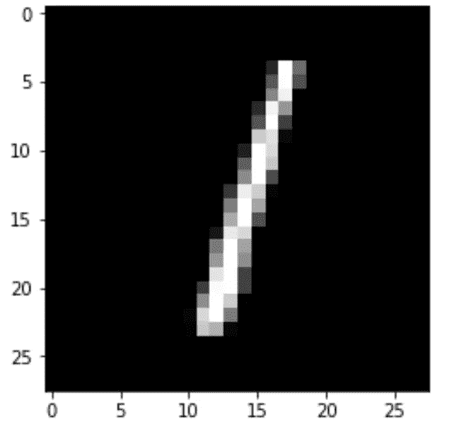

# 使用 Python 和人工神经网络对手写数字进行分类

> 原文：<https://levelup.gitconnected.com/classify-hand-written-digits-5fdbe5d99ee7>


在本文中，我将向您展示如何使用 **python 编程语言**和一种叫做**人工神经网络的机器学习技术**对来自 **MNIST 数据库**的手写数字**进行分类！**

对于任何想学习神经网络和图像分类如何工作的人来说，这是一个很好的入门程序。当然，有很多文章和程序都非常相似，比如 https://keras.io/examples/vision/mnist_convnet/。

所以，你可能会说，为什么要就这个话题再写一篇文章呢？之所以这样，是因为我相信，从不同的人那里获得不同的观点、看法和解释，有助于真正理解一个话题、主题或问题。话虽如此，这段代码的全部功劳归于[维克托·周](https://victorzhou.com/)。

如果你不想读这篇文章，想要一个视频演示，你可以看看下面的 [**视频**](https://www.youtube.com/watch?v=kOFUQB7u5Ck) 。它详细介绍了本文中的所有内容，并且将有助于您轻松地开始编写自己的人工神经网络(ANN)模型，即使您的计算机上没有安装编程语言 Python。或者你可以把视频和这篇文章都作为学习安氏症的补充材料！

# 开始编程:

首先我会写一份这个程序将会做什么的描述。这样当我将来回头看它的时候，我或者其他人就知道它到底在做什么。

```
# Description: This program classifies the MNIST handwritten digit images as a number 0 - 9
```

接下来，我需要**安装依赖项/包**。如果您还没有安装这些包，请在您的终端、命令提示符或 Google Colab 网站(取决于您安装 python 编程语言的位置)中运行以下命令。

```
pip install tensorflow keras numpy mnist matplotlib
```

现在我已经安装完了所有必要的包，我想把这些包导入到我的程序中。

```
#Import the packages / dependencies
import numpy as np 
import mnist #Get data set from 
import matplotlib.pyplot as plt #Graph
from keras.models import Sequential #ANN architecture
from keras.layers import Dense #The layers in the ANN
from keras.utils import to_categorical
```

接下来，**将数据集**加载到变量`train_images`(包含要训练的图像的变量)、`train_labels`(包含训练集中图像的标签的变量)、`test_images`(包含要测试的图像的变量)和`test_labels`(包含测试集中图像的标签的变量)。

```
#Load the data set
train_images = mnist.train_images() #training data images
train_labels = mnist.train_labels() #training data labels
test_images = mnist.test_images() #training data images
test_labels = mnist.test_labels() #training data labels
```

数据被加载到变量中，现在**操纵数据**使其更容易训练模型。这可以通过首先将像素值原始范围值从[0，255]更改为[-0.5，0.5]来实现，然后将图像从二维 28 x 28 像素展平为 28 = 784 一维向量。然后打印火车的新形状和测试图像。

```
#Normalize the images. Normalize the pixel values from [0, 255] to
# [-0.5 , 0.5] to make our network easier to train
train_images = (train_images/255) - 0.5
test_images = (test_images/255) - 0.5
#Flatten the images. Flatten each 28x28 image into a 28^2 = 784 dimensional vector 
#to pass into the neural network
train_images = train_images.reshape((-1,784))
test_images = test_images.reshape((-1,784))
#Print the shape 
print(train_images.shape)# 60,000 rows and 784 cols
print(test_images.shape) # 10,000 rows and 784 cols
```


**顶部:** train_images = 60，000 行 784 列**底部:** test_images = 10，000 行 784 列

**建立 3 层模型**(2 层 64 个神经元和 ReLu 函数& 1 层 10 个神经元和 Softmax 函数)。

```
#Build the model
# 3 layers, 2 layers with 64 neurons and the relu function
# 1 layer with 10 neurons and softmax function
model = Sequential()
model.add( Dense(64, activation='relu', input_dim=784))
model.add( Dense(64, activation='relu'))
model.add(Dense(10, activation='softmax'))
```

**使用损失函数`categorical_crossentropy`编译模型**，该函数用于大于 2 的类，因为我们将有 10 个类，所以我们将使用该函数。这些类是从 0 到 9 的数字，例如:0，1，2，3，…9。我还将添加一个指标来显示模型的准确性。

```
#Compile the model
#The loss function measures how well the model did on training , and then tries 
#to improve on it using the optimizer
model.compile(
  optimizer='adam',
    loss = 'categorical_crossentropy', #(classes that are greater than 2) 
    metrics = ['accuracy']
)
```

**使用`train_images`和`train_labels`变量(包含训练数据的变量/数据集)训练模式** l。我将在整个数据集上迭代 5 次进行训练，每次梯度更新 32 个样本进行训练。

```
#Train the model
model.fit(
  train_images,
    to_categorical(train_labels), # Ex. 2 it expects [0, 0 ,1,0, 0, 0,0,0,0,0]
    epochs = 5, #The number of iterations over the entire dataset to train on
    batch_size=32 #the number of samples per gradient update for training
)
```


每个训练步骤/时期的模型损失和准确性

现在是时候**评估模型**了，看看它在测试数据集上的表现如何。该模型表现良好，准确率约为 96.33%。

```
#Evaluate the model
model.evaluate(
  test_images, 
  to_categorical(test_labels)
)
```


图像显示损失约为 0.125，准确度约为 96.33%

**注意:**您可以将该模型保存在一个. h5 文件中，以便以后在另一个程序中使用该模型/模型权重。确保包括您想要保存模型/文件的位置。例如' **Desktop/model.h5** '。

```
#model.save_weights('model.h5')
```

利用模型做出预测。我将使用这个模型预测前 5 个测试图像的类别，以及实际的标签。

```
#predict on the first 5 test images
predictions = model.predict(test_images[:5])
#print our models prediction 
print(np.argmax(predictions, axis = 1))
print(test_labels[:5])
```


模型的预测和实际标签

最后，我会将手写图像打印到屏幕上。更具体地说，我将把测试数据的前 5 幅图像以 28 x 28 像素的灰色打印到屏幕上。

```
**import** **matplotlib.pyplot** **as** **plt**
**for** i **in** range(0,5):
  first_image = test_images[i]
  first_image = np.array(first_image, dtype='float')
  pixels = first_image.reshape((28, 28))
  plt.imshow(pixels, cmap='gray')
  plt.show()
```


手写数字 7 的图像


手写数字 2 的图像



手写数字 1 的图像


手写数字 0 的图像


手写数字 4 的图像

你可以看上面的视频，了解我是如何编写这个程序的，并和我一起编写一些更详细的解释，或者你可以点击这里的 [**YouTube 链接**](https://www.youtube.com/watch?v=kOFUQB7u5Ck) 。

如果您也有兴趣阅读更多关于机器学习的内容，以便立即开始处理问题和示例，那么我强烈建议您查看[使用 Scikit-Learn 和 TensorFlow 进行机器学习实践:构建智能系统的概念、工具和技术](https://www.amazon.com/gp/product/1491962291?ie=UTF8&tag=medium074-20&camp=1789&linkCode=xm2&creativeASIN=1491962291)。这是一本帮助初学者学习如何编写机器学习程序和理解机器学习概念的好书。

[](https://www.amazon.com/gp/product/1491962291/ref=as_li_tl?ie=UTF8&tag=medium074-20&camp=1789&creative=9325&linkCode=as2&creativeASIN=1491962291&linkId=b7cc2001f37665b84139089c59ef8571)

[使用 Scikit-Learn 和 TensorFlow 进行机器实践学习:构建智能系统的概念、工具和技术](https://www.amazon.com/gp/product/1491962291?ie=UTF8&tag=medium074-20&camp=1789&linkCode=xm2&creativeASIN=1491962291)

感谢你阅读这篇文章，希望对你有所帮助！如果你喜欢这篇文章，并发现它很有帮助，请留下一些掌声，以示感谢。坚持学习，如果你喜欢机器学习、数学、计算机科学、编程或算法分析，请访问并订阅我的 [YouTube](https://www.youtube.com/channel/UCaV_0qp2NZd319K4_K8Z5SQ) 频道([randers 112358](https://www.youtube.com/channel/UCaV_0qp2NZd319K4_K8Z5SQ)&[compsci 112358](https://www.youtube.com/channel/UCbmb5IoBtHZTpYZCDBOC1CA))。


# 功劳归于:

[1][https://victorzhou.com/blog/keras-neural-network-tutorial/](https://victorzhou.com/blog/keras-neural-network-tutorial/)