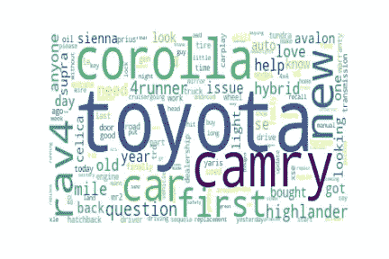
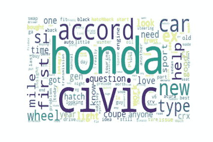
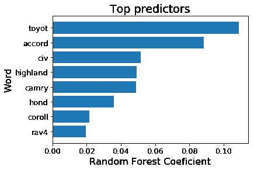

# 用自然语言处理和随机森林分类器对 Reddit 帖子进行分类

> 原文：<https://levelup.gitconnected.com/classifying-reddit-posts-with-natural-language-processing-and-random-forest-classifier-af2d8fa77bd3>


杰西卡·富特尼在 Unsplash 上拍摄的照片

在我之前的帖子中，我向您展示了使用机器学习对足球队 进行聚类的 [**的数据科学过程。在这篇文章中，我将展示我如何使用自然语言处理(NLP)和随机森林分类对来自**](https://medium.com/@bkexcel2014/using-machine-learning-clustering-on-soccer-with-python-and-tableau-ba445a8316bf)**[丰田](https://www.reddit.com/r/Toyota/)和[本田](https://www.reddit.com/r/Honda/) subreddit 频道的 Reddit 帖子进行分类。我们将只使用帖子的标题来确定帖子来自哪个子编辑。**

为了解决这个问题，我使用了数据科学流程:

*   定义问题
*   收集数据
*   清理和探索数据
*   对数据建模
*   评估模型
*   回答问题

# **定义问题**

仅使用帖子标题，预测帖子属于哪个子编辑，本田还是丰田。这似乎是一个人为的问题，但是假设 Reddit 的服务器和丢失帖子的标签出现了技术问题。这可能是解决这个问题的一种方法，而且这种技术的应用超出了本文的范围。

# 收集数据

使用 Python `requests`库从 Yelp 的 API 收集数据。Yelp 的 API 返回一个包含页面内容的 JSON 文件。以下是如何连接 API 的示例:

```
url = '[https://www.reddit.com/r/Honda/.json'](https://www.reddit.com/r/Honda/.json')
header = {'User-agent': 'Useragentname'}
res = requests.get(url,headers=header)
print("Connection status: ", res.status_code)
the_json = res.json()
print("Json Keys:",sorted(the_json.keys()))
```

如果连接成功，这段代码将打印状态`code = 200`，并且它将对 JSON 文件的密钥进行验证。如果您想从不同的子编辑中检索数据，只需更改 URL。

因为 Reddit 为每个请求提供了 25 篇帖子，所以我迭代了几次，在每个子编辑上收集了 950 篇帖子。我还使用了`time.sleep()`来创建请求之间的暂停。结果保存在 csv 文件中。在这个项目中，我只需要 Reddit 帖子标题，但我还收集了其他数据。

# 清理和探索数据

我已经从数据中删除了重复的值。为了清理文本，我创建了一个定制的函数来做这件事。该函数的工作方式如下:

1.  将字符转换为小写。
2.  用空格替换所有非数字和非字母字符。
3.  仅用一个空格替换多个空格。
4.  删除[英文停用词](https://en.wikipedia.org/wiki/Stop_words)。

清理之后，我使用`WordNetLemmatizer()`将一个单词的变形形式组合在一起，这样它们就可以作为一个单独的项目进行分析，这被称为[词条满足](https://en.wikipedia.org/wiki/Lemmatisation)。

为了探索最常见的单词，我创建了两个单词云。



丰田和本田词云

几个汽车名称和汽车制造商名称是最常用的词。本田的“**帮助”**一词比丰田的多(即更频繁)。

# 对数据建模

我使用`sklearn.model_selection.train_test_split()`将数据分为 75%的训练和 25%的测试，然后使用`sklearn.feature_extraction.text.CountVectorizer()`将 Reddit 帖子标题的集合转换为令牌(即单词)计数矩阵。有 2，681 个唯一令牌，这意味着训练数据由 2，681 列和 1，381 行的数据帧组成。每行中的值是每篇文章的字数。

使用来自`sklean.ensemble.RandomForestClassifier()`的默认参数，我已经根据训练数据拟合了模型。[随机森林](https://en.wikipedia.org/wiki/Random_forest)会建立一个决策树。每个节点模型将数据集一分为二，这是一个随机选择的特征，使用基尼系数优化分割质量。

# 评估模型

使用准确度分数进行模型评估。模型在训练中的准确率为 90%，在交叉验证和测试数据中的准确率为 77%。模型过拟合，这在随机森林模型中很常见。有一些选项可以减少差异，例如限制树的大小。我用最重要的系数画了一张图。



汽车名称和汽车制造商名称都是最好的预测标志。

# 回答问题

在这种情况下，我能够以大约 77%的准确率预测一个给定的帖子来自哪里。为了改善这一点，它将: **1)** 分析标题，并用表情符号代表的文本替换表情符号。 **2)** 包含更多功能(如帖子文本和日期)。 **3)** 根据不包括汽车制造商名称的数据创建一个模型，以了解其他哪些特性对该模型也很重要，这也很有意思。

感谢阅读！[此处有代码](https://github.com/berkurka/Reddit-Classifier)！

[](https://levelup.gitconnected.com)[](https://gitconnected.com/learn/python) [## 学习 Python -最佳 Python 教程(2019) | gitconnected

### 50 大 Python 教程-免费学习 Python。课程由开发人员提交并投票，使您能够…

gitconnected.com](https://gitconnected.com/learn/python)