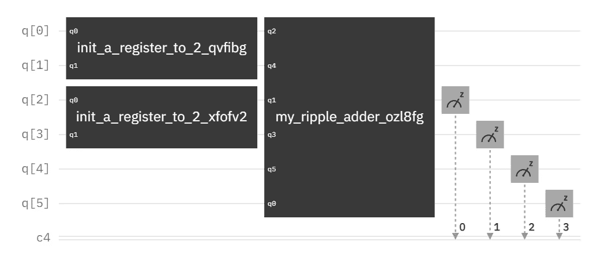
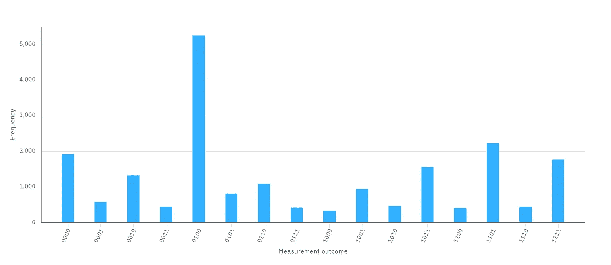
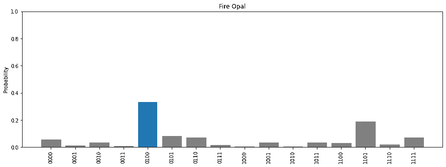
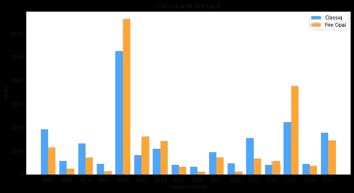

# 带火蛋白石的 Classiq

> 原文：<https://levelup.gitconnected.com/classiq-with-fire-opal-e0259d22fca9>

Classiq 纹波加法器

# “那很容易。”

Classiq 平台旨在合成我们不想手动设计的大型量子电路。然而，大型电路的问题是它们噪音太大，无法在真正的量子计算机上运行。因此，我多次提议 Classiq 和 Q-CTRL 应该合作，看看 Fire Opal 是否能在这些噪音中给出正确的结果。他们最终做到了，所以现在让我们看看它是否能…

## 逐位进位加法器

我们应该从小规模开始，所以我选择了 Classiq 纹波加法器。我们只是把 2 + 2 相加，这样正确的结果就很明显了。当然，值得承认的是，2 + 2 不是一个实际的量子计算问题，但是，Classiq 平台旨在合成大型电路。我在这篇文章中的挑战是能够展示 Classiq 合成引擎(特色图片),它有一个容易看到的结果，这个结果被 Fire Opal 放大了。波纹加法器符合这种演示的标准，对于 2 + 2，只需要 6 个量子位，并且可以在更多 Fire Opal 兼容的后端上运行。

模拟器

## 模拟器

好消息！一个经典模拟器还是可以加 2 + 2 的。如果它不能…我们肯定会有麻烦。

ibm 内罗毕

## 不带火蛋白石

纹波加法器的电路有相当大的深度，因此 ibm_nairobi 测量出了正确的答案——二进制 0100 是十进制 4——20，000 次中的 5，247 次。这不是一个很大的百分比，但至少正确的答案是“大概四个。”

火蛋白石

## 用火蛋白石

在 20，000 次测试中，Fire Opal 测得正确答案为 6，614 次。虽然这还不是大多数，但至少正确答案增加了 26%。

并排比较

## 并排比较

并排我们可以看到，大多数不正确的答案开始看起来像一个均匀的分布，正确的答案站得稍微高一点。我不知道为什么 13 得到了提升，但至少我们可以看看这个，说 2 + 2 很可能是 4。而且计数更高，可以稍微自信一点说 2 + 2 大概是 4。

## 易于集成

你可能会认为两家公司会宣布合作，而整合双方带来的东西需要时间。在这种情况下不会。作为两者的用户，我可以看到 Fire Opal 将 OpenQASM 2 作为输入，而 Classiq 可以生成 OpenQASM 2 作为其众多输出之一。集成就像用 Classiq 平台合成一个电路，输出电路为 OpenQASM 2，然后用 Fire Opal 执行 OpenQASM 2 字符串一样简单。说真的，就这么简单。

## 结论

我用 Fire Opal 做了相当多的测试，其中大部分仍然需要发布。新出现的趋势是，火蛋白石似乎不喜欢“容易”的问题。因此，虽然它会提高 2 + 2 的正确结果，但它似乎会对更难的问题给予更大的推动。只要运行时间在 T1 限制内，Fire Opal 似乎会在挑战中茁壮成长。

同样值得注意的是，Classiq 平台可以为比 Fire Opal 目前兼容的设备大得多的设备合成电路。但是，如果你专门为兼容的后端合成电路，你可以收获这种伙伴关系的好处。

*通过这篇文章，我已经在 9 个网站上发表了 400 篇文章。*

## Classiq 平台系列:

*   [Classiq 平台的新名字](https://medium.com/@bsiegelwax/the-classiq-platforms-new-name-f1fe5b469283)
*   [Classiq 的量子电路分析仪](https://medium.com/@bsiegelwax/classiqs-quantum-circuit-analyzer-764b31bd471d)
*   【Classiq 的合成引擎内部(量子内幕)
*   [演示:Classiq 的 QAD 平台](https://medium.com/gitconnected/demo-classiqs-qad-platform-f0bec3608549)
*   [回顾:Classiq 的量子算法设计(QAD)平台](https://medium.com/gitconnected/review-classiqs-quantum-algorithm-design-qad-platform-796ed3511ef6)

## Q-CTRL 火蛋白石系列:

*   [ibm_nairobi 对 Fire Opal](https://medium.com/@bsiegelwax/ibm-nairobi-vs-fire-opal-965f95800c6d)
*   [ibmq_belem vs. Fire Opal](https://bsiegelwax.medium.com/ibmq-belem-vs-fire-opal-84683f8f91f2)
*   [回顾:Q-CTRL 火蛋白石](https://bsiegelwax.medium.com/review-q-ctrl-fire-opal-6bcc187ae1bd)
*   [量子切片面包](https://bsiegelwax.medium.com/quantum-sliced-bread-bd3dd048f)
*   [我从火蛋白石中学到了什么…](https://bsiegelwax.medium.com/what-i-learned-from-fire-opal-50608282972b)
*   [Q-CTRL 的火猫眼石很牛逼](/fire-opal-is-awesome-c642347ec89d)