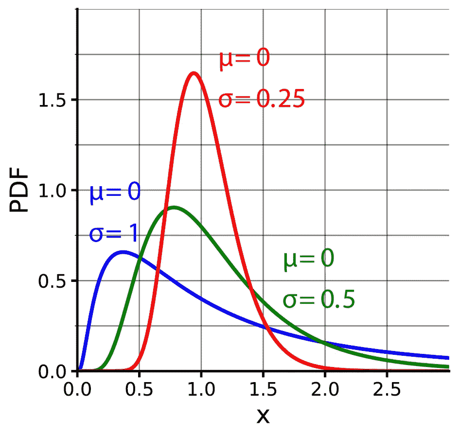

# Classiq 的分布问题

> 原文：<https://levelup.gitconnected.com/classiqs-distribution-problem-8e3c7a74afaa>

[https://commons.wikimedia.org/wiki/File:Log-normal-pdfs.png](https://commons.wikimedia.org/wiki/File:Log-normal-pdfs.png)

# 对数正常状态准备挑战

[Classiq 编码竞赛](https://www.classiq.io/competition)包括[对数正常状态准备](https://www.classiq.io/competition/state-preparation)挑战。真正的挑战——剧透警报——是经典的离散化。

> 许多量子算法依赖于在特定状态下初始化量子位。该算法承诺的加速取决于有效制备量子态的能力。制备量子态的挑战是将等距图编译成特定量子电路的更广泛使用情况的一个例子，并且已知通常需要指数数量的门 O(2n)。一种流行的分布是对数正态分布，在许多地方使用，如在布莱克-斯科尔斯模型期权定价公式中。

## #获胜

最热门的提交都有一个电路深度。然而，在获奖者中脱颖而出的是第三名获奖者特里斯坦·内莫兹。您可以查看他的解决方案，以及其他顶级解决方案，[在这里](https://www.classiq.io/insights/competition-results-state-preparation)。如果你没有自己想出如何实现一个电路深度，他的提交很好地解释了这一点。其他获奖作品提供了代码和电路，但没有解释。

TL；博士:获胜的回路的深度都是 1。它们只是一堆电线，每一根上面都有一个哈达玛门。因此，真正的挑战是离散化。这是经典的做法，而且代码非常少。但是，正式来说，你的离散化方法是你的解决方案的一部分，连同这个电路。

## #喘息

我的方法完全不同。我用了 Qiskit 的 LogNormalDistribution()，提交了从 1 量子位到 10 量子位的一系列电路。坦白地说，单量子比特的提交是为了赢得一个创造力和创新的奖项。我还提交了至少一个五量子位的电路。我提交的大部分内容——我数不清了——使用了所有 10 个允许的量子位。不用说，现在知道了获胜的解决方案，我所有的多量子比特提交都没有机会赢得任何东西。

## 结论

我觉得这个挑战很特别。获胜的电路只是上面有 Hadamards 的导线，所以一个“状态准备挑战”的“状态准备”就像 *qreg q[10]一样简单；h q；*。主要的挑战是要知道。[现在我们知道了，知道是成功的一半。](https://www.youtube.com/watch?v=pele5vptVgc)

# # ClassiqCodingCompetition 竞赛系列

*   [街区新大门](https://bsiegelwax.medium.com/new-gates-on-the-block-9cad1bc583fd)
*   [我从 Classiq 的编码竞赛中学到了什么](https://bsiegelwax.medium.com/what-i-learned-from-classiqs-coding-competition-9ebfbb6816bb)
*   [Classiq 的哈密顿问题](https://bsiegelwax.medium.com/classiqs-hamiltonian-problem-31e2992903d0)
*   [Classiq 的分配问题](https://bsiegelwax.medium.com/classiqs-distribution-problem-8e3c7a74afaa)
*   [Classiq 的托夫里问题](https://bsiegelwax.medium.com/classiqs-toffoli-problem-54b7e5084833)
*   [Classiq 的可满足性问题](https://bsiegelwax.medium.com/classiqs-satisfiability-problem-c8e78502f82b)
*   [无-安西利亚 MCX](/no-ancilla-mcx-e59f455bb9f6)
*   [回顾:Wolfram 量子框架](/review-wolfram-quantum-framework-1fdb23d61be9)
*   [土生土长的托夫利门](/a-native-toffoli-gate-970093e4770c)