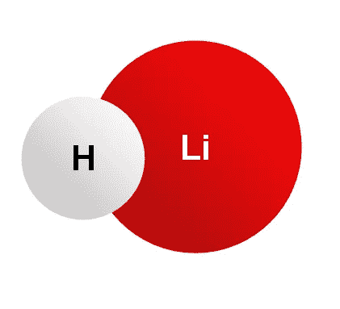

# Classiq 的哈密顿问题

> 原文：<https://levelup.gitconnected.com/classiqs-hamiltonian-problem-31e2992903d0>

[https://commons.wikimedia.org/wiki/File:Lithium_hydride.png](https://commons.wikimedia.org/wiki/File:Lithium_hydride.png)

# TL；大卫:越简单越好

[Classiq 编码竞赛](https://www.classiq.io/competition)包括一个[哈密顿模拟](https://www.classiq.io/competition/hamiltonian)问题。虽然量子化学不是我的专业领域，但我可以阅读代码和分析电路。我能分辨出它什么时候看起来有用，什么时候看起来没用。因此，我仍然可以查看排名靠前的提交内容，并找到需要学习的重要课程。

> 哈密顿量模拟问题通过求解薛定谔方程来描述量子系统的演化，如分子和固态系统。量子计算机以可扩展的方式实现模拟，如[**【Lloyd 96】**](https://www.science.org/doi/10.1126/science.273.5278.1073)所述。最值得注意的算法是基于 Trotterization 的产品公式。

## #获胜

我推荐看看第二名得主康拉德·德卡和第二名荣誉奖团队食肉仙人掌提交的材料。你可以在这里找到他们。顺便说一下，值得指出的是，食肉仙人掌队的 3 名成员年龄在 16-18 岁之间。听起来棒极了。

无论如何，这两份意见书最突出的一点就是简洁。我也在变分量子本征解算器(VQE)上看到过这种情况:许多提交的文件真的很长，有大量的解释、大量的比较和大量的图表。时不时地，就像 Konrad Deka 和 Team measure Cacti 一样，你会找到输入信息、解决问题、给你答案的提交内容，然后它们就完成了。我很感激。保持简单；解决问题。当然，它的其余部分可能很有见地，但它也可能模糊了所使用的方法。

康拉德·德卡做了团队食肉仙人掌没有做的一件事是允许更高的错误率。对于竞赛，错误率必须低于 0.1。然而，他们两个的错误率都比这个低。第二名和第二荣誉奖的区别在于，康拉德·德卡允许的准确度较低，允许误差率上升到略低于 0.1。牺牲准确性导致一个深度较小的循环，这是提交排名的度量标准。

## 结论

我的作品使用了 Qiskit Aqua。我没有竞争的期望，我只是想提交一些东西，任何东西，希望我的电路优化技巧可能会更好。我已经看了所有的顶级提交，我将进一步审查康拉德·德卡的提交。或者，也许 Classiq 可以直接让我用他们的[量子算法设计(QAD)平台](/demo-classiqs-qad-platform-f0bec3608549)来做？那会更容易些…

特别祝贺嘉年华仙人掌队。我很高兴输给下一代，这一代人将真正使用 Classiq 软件并利用量子计算机的力量。

# # ClassiqCodingCompetition 竞赛系列

*   [街区上的新大门](https://bsiegelwax.medium.com/new-gates-on-the-block-9cad1bc583fd)
*   [我从 Classiq 的编码竞赛中学到了什么](https://bsiegelwax.medium.com/what-i-learned-from-classiqs-coding-competition-9ebfbb6816bb)
*   [Classiq 的哈密顿问题](https://bsiegelwax.medium.com/classiqs-hamiltonian-problem-31e2992903d0)
*   [Classiq 的分配问题](https://bsiegelwax.medium.com/classiqs-distribution-problem-8e3c7a74afaa)
*   [Classiq 的托夫里问题](https://bsiegelwax.medium.com/classiqs-toffoli-problem-54b7e5084833)
*   [Classiq 的可满足性问题](https://bsiegelwax.medium.com/classiqs-satisfiability-problem-c8e78502f82b)
*   [非安西利亚 MCX](/no-ancilla-mcx-e59f455bb9f6)
*   [回顾:Wolfram 量子框架](/review-wolfram-quantum-framework-1fdb23d61be9)
*   [一个土生土长的托夫里门](/a-native-toffoli-gate-970093e4770c)