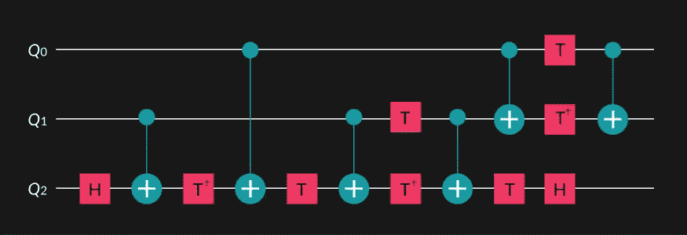

# Classiq 的托夫里问题

> 原文：<https://levelup.gitconnected.com/classiqs-toffoli-problem-54b7e5084833>

[https://www.classiq.io/competition/toffoli](https://www.classiq.io/competition/toffoli)

# 这不是在《迈克和艾克》里…

[Classiq 编码竞赛](https://www.classiq.io/competition)包括一个[托夫里分解问题](https://www.classiq.io/competition/toffoli)。这方面的资料来源——好吧，有很多——是量子计算的非官方圣经，“迈克 T10 艾克。”顺便说一下，它的正式名称是“量子计算和量子信息”，作者是迈克尔·“迈克”·尼尔森和艾萨克·“艾克”·庄。这本书的绰号的来源仍然是个谜。

> 许多量子操作包括多重控制的托夫里(MCX)门。其中最著名的是 Grover 运算符、逻辑 AND 运算符、各种状态准备算法和算术比较器。这项任务的重点是在有限的量子位计数和电路深度下实现 MCX 门。

无论如何，这些知识在这次比赛中对你没什么帮助。

## #获胜

Toffoli 可以分解成相当数量的单量子位操作和 cx 门。赢得这项挑战的关键是将 Toffoli 分解成最简化的 CCX 门，并在此基础上构建最简化的 CCCX、CCCCX，甚至 CCCCCX 门。您可以阅读多篇论文作为指导，甚至 Qiskit 链接到“[关于使用相对相位 Toffolis 的优势，以及应用于多控制 Toffoli 优化](https://arxiv.org/abs/1508.03273)，作者是德米特里·马斯洛夫。如果你不想自己构造门，你可以从使用 Qiskit 的 [Margolus](https://qiskit.org/documentation/stubs/qiskit.circuit.library.RCCXGate.html#qiskit.circuit.library.RCCXGate) 门开始，这是一个简化的 Toffoli 门，并从那里采用 Qiskit 的其他相对相位门。

你会问，“什么是相对相位门？”重要的是，Margolus RCCX 的工作原理与 Toffoli CCX 相同，只要您稍后取消计算。如果你不进行解算，那么控制量子位在 Margolus 之后不会像在 Margolus 之前一样结束。有一个相位差，正如“相对相位门”所暗示的

## #喘息

我以为我提交了一份有竞争力的作品。然而，内藤宗顺的作品实在是太好了。事实上，前三名非常接近。如果仔细观察统计数据，第二名提交的 cx 门实际上比第一名提交的要少。并且，第三名的提交与第一名的提交具有相同数量的 cx 门。胜利的关键是内藤宗顺的赛道深度只有 57，明显低于第二好的 70。

我也利用这个挑战来争取一个创造力和创新的奖项。尽管五个安西拉量子比特被授权，我还是提交了一个[非安西拉 MCX](/no-ancilla-mcx-e59f455bb9f6) 。根据电路深度和 cx 计数，它没有获胜的机会，但有了 20 个量子位——14 个控制，1 个目标和 5 个从属——你可以构建一个 C19X，而不是只有一个 C14X。值得一试，对吧？

## 结论

关于这个挑战令人兴奋的事情是，即使你知道相对相位门，无论你是通过 Qiskit 还是另一个框架使用它们，Soshun Naito 都证明了它们是多么低效。其他提交的材料也制作了定制门，也证明了这一点，但 C14X 的电路深度为 57，几乎是第二项荣誉奖的一半。

# # ClassiqCodingCompetition 竞赛系列

*   [街区上的新大门](https://bsiegelwax.medium.com/new-gates-on-the-block-9cad1bc583fd)
*   [我从 Classiq 的编码竞赛中学到了什么](https://bsiegelwax.medium.com/what-i-learned-from-classiqs-coding-competition-9ebfbb6816bb)
*   [Classiq 的哈密顿问题](https://bsiegelwax.medium.com/classiqs-hamiltonian-problem-31e2992903d0)
*   [Classiq 的分配问题](https://bsiegelwax.medium.com/classiqs-distribution-problem-8e3c7a74afaa)
*   [Classiq 的托夫里问题](https://bsiegelwax.medium.com/classiqs-toffoli-problem-54b7e5084833)
*   [Classiq 的可满足性问题](https://bsiegelwax.medium.com/classiqs-satisfiability-problem-c8e78502f82b)
*   [非安西利亚 MCX](/no-ancilla-mcx-e59f455bb9f6)
*   [回顾:Wolfram 量子框架](/review-wolfram-quantum-framework-1fdb23d61be9)
*   [一个土生土长的托夫里门](/a-native-toffoli-gate-970093e4770c)