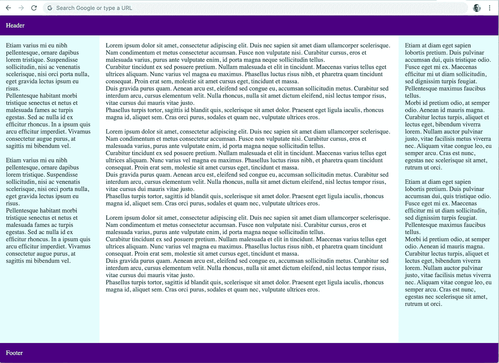

# 清洁应用—灵活的盒子布局

> 原文：<https://levelup.gitconnected.com/clean-application-flexible-box-layout-98e439bb7d96>

## WEB 开发

## 简单地说，圣杯就是一个网页布局，其中多个列具有相同的高度，并由样式表指定。


约翰·詹宁斯在 [Unsplash](https://unsplash.com?utm_source=medium&utm_medium=referral) 拍摄的照片

大约 4 年前，我有了一个想法，创建一个关于如何在没有快餐式框架的情况下构建干净、轻量级、速度极快的 web 应用程序的教程，这将引导我们通过减少 web 服务器和客户的计算机和设备的能耗来拯救环境。

这个教程还在进行中，不过现在我有时间把这些文章一篇一篇的发表出来。所以，让我们从没有任何引导程序、基础或材料 UI 的主应用程序布局开始。

# 圣杯布局

简单地说，[圣杯](https://en.wikipedia.org/wiki/Holy_grail_(web_design))是一个网页布局，其中多个列具有相同的高度，并由样式表指定。虽然它总是被开发者所偏爱使用，但是多年来，使用现有技术的实现方法有许多缺点。因此，探索和确定最佳实现方法的需求导致了圣杯的采用。

```
+---------------------------------+
|           HEADER AREA           |
+-------+-----------------+-------+
|       |                 |       |
|       |                 |       |
|SIDEBAR|     CONTENT     |SIDEBAR|
|       |                 |       |
|       |                 |       |
+-------+-----------------+-------+
|           FOOTER AREA           |
+---------------------------------+
```

Web 标准最近已经结合了进一步的端到端和健壮的解决方案，以便执行上面显示的布局。特别是 [CSS 灵活框布局](https://developer.mozilla.org/en-US/docs/Web/CSS/CSS_Flexible_Box_Layout)和 [CSS 网格布局](https://developer.mozilla.org/en-US/docs/Web/CSS/CSS_Grid_Layout)模块可提供完整的解决方案。

# 创建灵活的方框布局

为了简单起见，我们将使用灵活的框布局而不是网格布局，因为 Internet Explorer 10+是向后兼容的。因此，目录结构如下:

```
01-layout
├── styles
│   ├── flex.css
│   └── theme.css
└── index.html
```

因此，考虑创建一个具有以下结构的[index.html](https://github.com/vpodk/clap/blob/master/01-layout/index.html)页面:

> **重要提示**:在[index.html](https://github.com/vpodk/clap/blob/master/01-layout/index.html)页面中添加`DOCTYPE`、`html`和`head`部分非常重要。

如果在浏览器中打开此页面，文本将成行显示。如果是这样的话，我们可以认为这种行为对于[块级元素](https://developer.mozilla.org/en-US/docs/Web/HTML/Block-level_elements)是准确的，这将有助于设计移动设备的布局。

接下来，我们为[样式](https://github.com/vpodk/clap/blob/master/01-layout/styles)创建一个文件夹和一个名为 [flex.css](https://github.com/vpodk/clap/blob/master/01-layout/styles/flex.css) 的文件:

# 详细说明

首先，我们重置所有可用元素的缩进(`margin`、`padding`、`border-box`)。`border-box`告诉浏览器考虑我们为任何元素指定的值中的任何`border`和`padding`，即`width`和/或`height`。

其次，两件事情已经确定:

1.  `flex`-与`body`、`#main`和`article`相关的属性，允许我们将布局调整到全屏，以及
2.  `min-height`到`100vh`用于`body`元素，其中`vh`表示视口高度的百分比。

> 查看[视窗百分比长度](https://developer.mozilla.org/en-US/docs/Web/CSS/length#Viewport-percentage_lengths)了解更多信息。

从现在开始，这些规则只适用于大于或等于 768 像素的屏幕。因此，考虑到当前屏幕足够大，让我们开始构建包含三列的布局:

第一步是将`#main`显示为柔性盒模型。第二步是将我们的边栏宽度设置为`20%`。最后，我们将第一个侧边栏移动到页面的左端。

现在，我们通过以下方式将这个 [flex.css](https://github.com/vpodk/clap/blob/master/01-layout/styles/flex.css) 文件链接到我们的[index.html](https://github.com/vpodk/clap/blob/master/01-layout/index.html)页面的`<head>`部分:

```
<link href="./styles/flex.css" rel="stylesheet">
```

# 外观增强

为了改进我们的演示，我们可以给 [flex.css](https://github.com/vpodk/clap/blob/master/01-layout/styles/flex.css) 文件添加一些填充，如下所示:

我们使用以下内容创建 [theme.css](https://github.com/vpodk/clap/blob/master/01-layout/styles/theme.css) 文件:

完成后，将该文件链接到[index.html](https://github.com/vpodk/clap/blob/master/01-layout/index.html)页面的`<head>`部分:

```
<link href="./styles/theme.css" rel="stylesheet">
```

> **注意:**此时不用担心链接多个样式。我们将在以后的文章中“捆绑”它们。

此外，我们可以添加一些文本内容，如 [Lorem ipsum](https://www.lipsum.com/) 以获得更好的演示效果。

# 测试结果

我们现在准备使用浏览器打开[index.html](https://vpodk.github.io/clap/01-layout/)页面，它应该如下所示:



目前差不多就是这样，[跟我来](https://medium.com/@vpodk/)不要错过本教程的下一部分。

在下一篇教程中，我们将讨论 CSS 块的位置以及如何操作一个元素的不同位置。

[](https://medium.com/@vpodk/clean-application-block-positions-4e46fbb86674) [## 清洁应用—阻挡位置

### 这是构建一个干净、轻量级、速度极快的 web 应用程序的分步教程的第二部分。

medium.com](https://medium.com/@vpodk/clean-application-block-positions-4e46fbb86674) 

感谢阅读这篇文章！如果你有任何问题，请在下面留言。另外，看看我以前的文章，你可能会喜欢:

[](https://towardsdatascience.com/data-structures-simplified-and-classified-e0c1e304436b) [## 数据结构—简化和分类

### 本文将简化和总结这些最基本的数据结构，您将理解并能够…

towardsdatascience.com](https://towardsdatascience.com/data-structures-simplified-and-classified-e0c1e304436b) [](https://medium.com/@vpodk/how-to-increase-your-chances-of-getting-a-job-254c97c3b448) [## 如何增加你找到工作的机会

### 本文将详细介绍设计简历的最重要的技巧和诀窍，从而在求职过程中获得优势

medium.com](https://medium.com/@vpodk/how-to-increase-your-chances-of-getting-a-job-254c97c3b448)