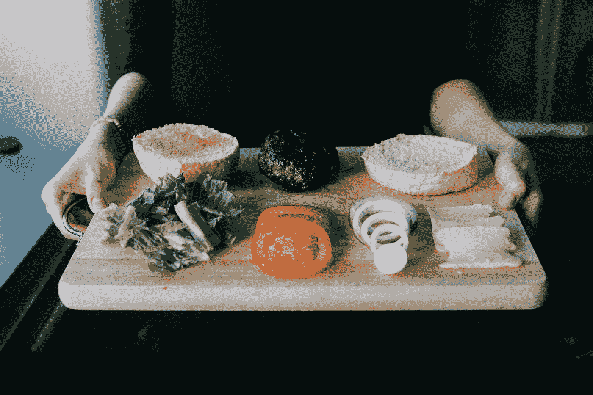

# 干净的应用程序—汉堡菜单

> 原文：<https://levelup.gitconnected.com/clean-application-hamburger-menu-5736d4c459d9>

## WEB 开发

## 构建干净、轻量级、速度极快的 web 应用程序的分步教程的第三部分。



[emy](https://unsplash.com/@grimnoire?utm_source=medium&utm_medium=referral) 在 [Unsplash](https://unsplash.com?utm_source=medium&utm_medium=referral) 上拍照

这是一个循序渐进的教程的第三部分，该教程旨在构建一个干净、轻量级、速度极快的 web 应用程序，而不需要任何快餐式的框架。如果您还没有，请查看上一部分:

[](/clean-application-block-positions-4e46fbb86674) [## 清洁应用—阻挡位置

### 这是构建一个干净、轻量级、速度极快的 web 应用程序的分步教程的第二部分。

levelup.gitconnected.com](/clean-application-block-positions-4e46fbb86674) 

汉堡菜单按钮，顾名思义，是一个通常位于图形用户界面(GUI)顶角的按钮。它的基本功能是通过折叠在菜单按钮后面或显示在屏幕上来切换菜单或提供导航栏。关于这种按钮的更详细的解释可以在维基百科上找到。

```
+--------------------------------+
│         HEADER AREA         ☰ │
+--------------------------------+
│                                │
│                                │
│             CONTENT            │
│              AREA              │
│                                │
+--------------------------------+
│          FOOTER AREA           │
+--------------------------------+
```

此三元符号(`☰`)位于上图的右上角，可使用以下 Unicode 符号进行添加:

```
:after {
  content:'\2630';
}
```

在我们的练习中，我们将尝试创建一个更加平滑和生动的菜单按钮，以获得更好的用户体验。

# 创建简单的导航菜单

和以前一样，为了简单起见，我们将通过创建 [03-nav](https://github.com/vpodk/clap/blob/master/03-nav/03-nav) 文件夹并将 [02-positions](https://github.com/vpodk/clap/blob/master/02-positions) 的内容复制到这个新创建的文件夹中来重用我们之前的应用程序。

我们的目录结构将如下所示:

```
03-nav
├── styles
│   ├── app.css
│   ├── flex.css
│   ├── nav.css
│   └── theme.css
└── index.html
```

首先，让我们通过将导航菜单添加到[index.html](https://github.com/vpodk/clap/blob/master/03-nav/index.html)页面来更新`<header>`:

接下来，我们可以创建 [nav.css](https://github.com/vpodk/clap/blob/master/03-nav/styles/nav.css) 文件。看哪！漫长的编码等待着我们:

# 改进演示

为了改进它的显示方式，我们需要更新 [theme.css](https://github.com/vpodk/clap/blob/master/03-nav/styles/theme.css) 文件，以便菜单按钮可以平滑显示:

# 测试结果

**注意:**不要忘记将 [nav.css](https://github.com/vpodk/clap/blob/master/03-nav/styles/nav.css) 文件链接到【index.html】页面[:](https://github.com/vpodk/clap/blob/master/03-nav/index.html)

```
<link href="./styles/nav.css" rel="stylesheet">
```

现在我们可以使用浏览器打开 index.html 页面。使用 Chrome 开发工具，可以调整页面大小(如我们之前所做的那样)或针对移动设备进行模拟:

感谢阅读这篇文章！如果你有任何问题，请在下面留言。另外，看看我以前的文章，你可能会喜欢:

[](https://medium.com/@vpodk/progressive-web-apps-and-their-advantages-70d3e119f165) [## 渐进式网络应用及其优势

### 许多人甚至不知道很多流行的日常应用实际上是进步的网络应用。

medium.com](https://medium.com/@vpodk/progressive-web-apps-and-their-advantages-70d3e119f165) [](https://medium.com/javascript-in-plain-english/javascript-loose-equals-and-strict-equals-ab2144fcbe) [## JavaScript:宽松等于和严格等于

### 隐性强制是邪恶的、有害的吗？在某些情况下，是的！从广义上说，也不尽然。

medium.com](https://medium.com/javascript-in-plain-english/javascript-loose-equals-and-strict-equals-ab2144fcbe)