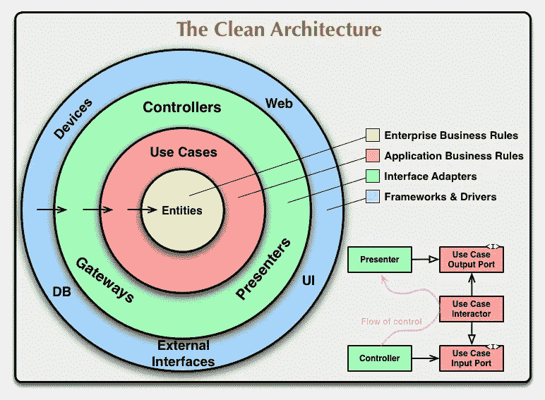

# 用 MVVM 清洁建筑

> 原文：<https://levelup.gitconnected.com/clean-architecture-with-mvvm-34cc05ab3bc5>

在本文中，我将创建一个示例项目(app ),它将帮助我们理解 Clean Architecture。这个项目是一个应用程序，第一页向你显示了一个在里克和莫蒂系列的数据字符列表，通过点击每个字符，下一页向你显示这些字符的剧集。

通过这种解释，它表明我们有两种类型的存在。角色和情节。

那么首先，我们为什么要使用干净的架构呢？

1.  **关注点分离**—将代码分离到不同的模块或具有特定职责的部分中，使得维护和进一步修改更加容易。
2.  **松耦合** —灵活的代码可以很容易地改变，而不需要改变整个系统。
3.  **易于测试**

要有个思路，我们来考虑一下项目一般有三层: **App(视图)、数据、域。**

**数据**:在这一层，你有不同数据源的**抽象** **定义**，以及它们应该如何被使用。**映射器**将服务器响应映射到数据库模型，**模型**是服务器响应模型，**储存库**实现 API 调用，**数据库**操作，用于实现 Dao 接口的数据库和用于定义来自服务器的 API 调用方法的 API 包。在一个典型的应用程序中，我们通常将存储库接口和存储库放在同一个包中，我们可以在本地完成，这样我们就可以直接访问任何地方，但在这种情况下，数据层永远不应该知道其他层。

**域**:这一层被称为**业务** **逻辑**。这些是你生意的规则。它包含一个包含数据库模型的**模型**包。**存储库**其中只有接口和用例。那么什么是用例呢？我们知道**用例**只做一项工作，在这种情况下，当我们想从数据库中获取数据时，我们编写一个用例，它的工作只是从数据库中获取数据。

**App** :该层只与 **UI** 交互，包含片段、活动、视图模型、Di。对于 Di，我们指的是用于这个片段或活动的模块。

下图显示了图层之间的交互方式。

**说够了。我们编码吧。**

所以在这个项目中，我们使用:

[RxJava](https://github.com/ReactiveX/RxJava)

[刀柄](https://developer.android.com/training/dependency-injection/hilt-android)

[数据绑定](https://developer.android.com/topic/libraries/data-binding)

[改装](https://square.github.io/retrofit/)

[房间](https://developer.android.com/topic/libraries/architecture/room?gclid=Cj0KCQiAkuP9BRCkARIsAKGLE8WrAteaUDM7dpKTCO-_EDyID5bwIp64himLGjgXpyLrtkoUUN68V7caAs9lEALw_wcB&gclsrc=aw.ds)

科特林

**依赖关系:**

**依赖关系**

对于基地的这个项目，我们创建了 3 个包:**剧集、**角色、**工具**。

> **那么 utils 是什么呢？**它是一个包，包含在两个以上的类中使用的基类和通用类。

剧集和角色都包含数据、域和视图包。如下图。

如上所述，包看起来会像这样。

API 包包含 CharacterApi 接口，它是与服务器和 CharacterApiImpl 进行通信的唯一方法，以实现这些通信。

API 接口

数据库包包含 Dao 接口。

在 CharacterRepositoryImpl 中，我们只调用我们想要的方法。背后没有逻辑。

仓库

在域中，我们定义我们想要保存到数据库中的模型。

存储库是我们在上面的类中实现的接口。

我们前面提到的用例只做一件事，比如从服务器获取数据并保存到数据库中。

我使用密封类在 ViewModel 中传递数据和观察数据。我们将用例传递给构造函数，用于这两个类之间的通信。

我使用 hilt 进行依赖注入，所以我在剧集和角色中没有 di 包，但是在 util 中，我们定义了 NetworkModule。

并在实用程序中定义 AppModule，如下所示:

在 utils 的存储库包中，我们定义了存储库模块:

**结论**

因此，我们发现用清晰的架构来开发我们的项目以获得更好的可测试性和可重用性是多么的棒。我们还可以更改代码，而不用担心项目的其他部分会发生什么。

我希望这对你有帮助。我在我的 GitHub 上上传了这个项目。你可以查一下[干净的建筑](https://github.com/GolnazTorabi/CleanArchitecture)。

由于

 [## Android 清洁架构详细指南

### 编写 Android 应用程序的最佳方式

medium.com](https://medium.com/android-dev-hacks/detailed-guide-on-android-clean-architecture-9eab262a9011)