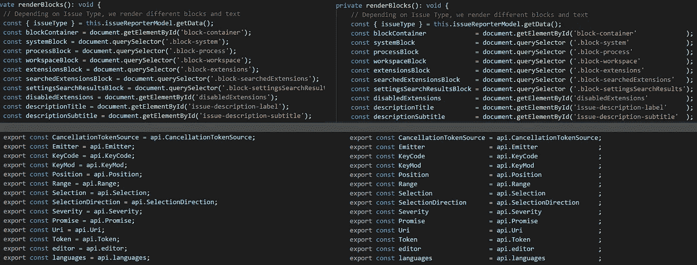

# 在敏捷团队中为傻瓜清理代码

> 原文：<https://levelup.gitconnected.com/clean-code-in-an-agile-team-79ed5fe3ed5d>

## [软件工程](https://rakiabensassi.medium.com/list/software-engineering-7a179a23ebfd)

## 软件质量的提高真的减少了挫折感吗？

[克莱玛乔](https://unsplash.com/@cremajoe?utm_source=medium&utm_medium=referral)在 [Unsplash](https://unsplash.com?utm_source=medium&utm_medium=referral) 上的照片

> “我遇到了一个问题。在我告诉你这个问题之前，要警告你——如果你继续读下去，你会变得情绪化。你会为我心碎。会有哭泣，如此多的哭泣。你可能会想创建一个 GoFundMe 页面来帮助减轻我的负担。
> 
> 好的，在这里。准备好了吗？拿张纸巾。”——[罗杰·科利尔](https://medium.com/free-code-camp/when-you-create-software-to-learn-programming-your-most-important-user-is-you-c2e57cd5a75f)

很多年前，我爱上了干净的代码。但这不是问题所在。后来，我成了一个叫做“列缩进”的东西的超级粉丝如果你不知道它的意思，这是一种实践，你在你的源代码语法中把相似的东西——比如语句、变量或声明——放在一起。

下面是一个没有列缩进的示例:

**例 1** :没有列缩进的源代码

通过列缩进，您可以将这些行转换为:

**例 2** :带列缩进的源代码

以下是该截图中的其他示例:

列缩进示例(图像[信用](https://medium.com/free-code-camp/how-to-columnize-your-code-to-improve-readability-f1364e2e77ba)

这一切都是在 2013/2014 年左右开始的，当时我与一位大师级的队友结对编程。

我从他那里学到了很多有价值的经验，我还记得他向我展示了如何在我们简单的 eclipse 编辑器中将常量的定义和语句对齐。

我喜欢它，因为它是对源代码的一种化妆或打扮。几年后，我读了[莱昂纳多·卡雷罗](https://medium.com/free-code-camp/how-to-columnize-your-code-to-improve-readability-f1364e2e77ba)的一篇文章，他在文章中展示了列缩进在多大程度上提高了代码的可读性，使直观解析变得如此愉快和快捷，结果是，它将增强开发人员的体验。

那一刻，我就被迷住了。我完全迷上了这种做法，并开始在几乎所有地方应用它，甚至在`import`语句中，这将允许你阅读代码而不用来回移动你的眼睛:

**例 3:** 导入带列缩进的报表

但更重要的是…在我告诉你之前，做好不要抓狂的准备。

更重要的是，我喜欢徒手插入空格！

是的，真的用我的双手。没有自动化插件，没有 checkstyle，没有 prettle(好吧，那时 prettle 还不存在)。我是手动完成的，没有格式化工具。

为什么？

你认为这是浪费时间吗？我不确定，因为它让我在压力大的时候放松。一些最终期限或任务花费了[比估计](/learning-velocity-and-coding-standards-10952f6c9640)多得多的时间，或者尚未修复的意外错误的压力消失了，或者至少会减少。我们都知道，快乐的开发人员比压力大的开发人员更有效率和创造力。

敲击我的手指也增加了我的动力，并加强了我与眼前一行行代码的情感联系，这样我就能感受到他们的痛苦和快乐。

这让我意识到我已经为宇宙增加了一些有价值的东西——也许是微小的影响，但它仍然是一种价值。

# 编程是一种社会活动

这样做的缺点是，就像大多数开发人员一样，我并不是一个人在项目中工作。我是[敏捷团队](https://betterprogramming.pub/agile-software-development-manifesto-be453882314)的成员，这意味着在应用列缩进时，应该考虑一些惯例，比如代码审查。

当您在一行中插入或删除一个空格时，整行都将被标记为已更改，这将增加团队或开发人员审查的代码行数，在将合并到另一个 Git 分支之前，您已经为 [pull 请求选择了审查者。](/git-workflow-devops-69e5a9071be1)

您可能会争辩说这不需要很大的努力来审查，或者说列缩进有长期的好处，但是我敢打赌，在审查者中会有一些不满意或沮丧的声音。

有了提高代码可读性后的动力，你可能会发现自己更有生产力，如果你的团队或经理对动力的价值有很大的认识，即使只是在少数个人中，这将是非常好的。

但是，如果你在清理代码上投入的时间和短期成本比动机和长期利益评估得多，你可能会发现自己陷入困境，应该准备好[管理一些冲突](https://medium.com/change-your-mind/binary-vs-spectrum-thinking-f9b8226d922)。

我喜欢[马腾·达尔米恩](https://medium.com/u/b40569a4ce51?source=post_page-----79ed5fe3ed5d--------------------------------)将 scrum 描述为“ [*它是关于发明你自己的规则*](https://medium.com/serious-scrum/scrum-is-about-inventing-your-own-rules-5a4090a33ebf) ”但不幸的是，并非所有的 scrum 或敏捷团队都是如此。

# 人们有不同的品味

也就是说，应该在拉取请求中审查的变更行的增加并不是您应该记住的唯一事情。

不同的人组成的团队意味着不同的经历，不同的习惯，不同的品味。

虽然上面第二个例子中的代码片段(有列缩进和仅仅 9 行代码)看起来很漂亮，但是有许多开发人员更喜欢下面的垂直方式定义对象数组(有 41 行代码)而不是水平方式:

**示例 4** :带换行符的网格列

# 最终想法

虽然我只提到了列缩进作为清理源代码的一个例子，但是我们有不同的开发人员的经验和不同的习惯，我们并没有准备好或者足够灵活地去改变，这一事实仍然代表了对提高软件质量的一个挑战。

我见过一些团队，他们定期为重构和修复技术债务进行冲刺。但是并不是所有的敏捷团队都有一个清晰的计划或策略，来决定开发人员是否或者何时能够/应该改进现有的“遗留”代码。

有时候，缺乏自动化测试是重构不受欢迎或不被允许的原因。其他时候，重构和质量不是优先考虑的，因为它不会产生利益相关者正在等待的短期利益或商业价值。

然而，当你的任务包括编写新的代码行时，你应该总是尽你所能地做好它，因为编写干净的、可理解的和可维护的代码是一门艺术，它将使你避免一种不同的挫折。

我希望那有帮助。如果你在敏捷团队中工作时，对软件质量的改进有其他想法或经验，请在评论部分告诉我们。我们将很高兴收到你的来信。

# 想要更多吗？

我为一群聪明、好奇的🧠人写关于工程、技术和领导力的文章💡。 [**加入我的免费电子邮件简讯**](https://rakiabensassi.substack.com/) **独家访问**或在这里注册媒体[如果你还没有做的话](https://rakiabensassi.medium.com/membership)🤗

*你可以在 Udemy 上查看我的* ***视频课程****:*[*如何识别、诊断、修复 Web Apps 中的内存泄漏*](https://www.udemy.com/course/identify-and-fix-javascript-memory-leaks/) *。*

 [## 我从设计企业应用程序中学到的 10 个教训

### 前端架构从来都不是“一劳永逸”的命题，没有任何设计或计划是完美或完整的

better 编程. pub](https://betterprogramming.pub/frontend-architecture-376e6323ef9b)  [## 为什么软件开发人员需要采用系统思考者的思维方式

### 放下原始的编码技能去理解更大的图景

better 编程. pub](https://betterprogramming.pub/system-thinking-in-software-development-9a7828303e95)