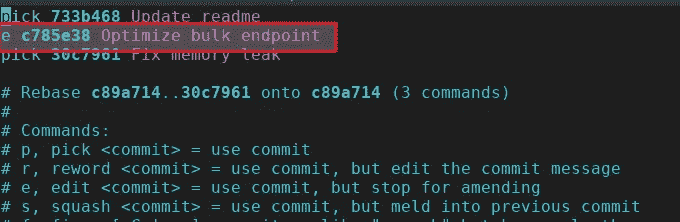
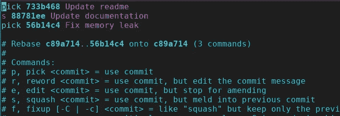
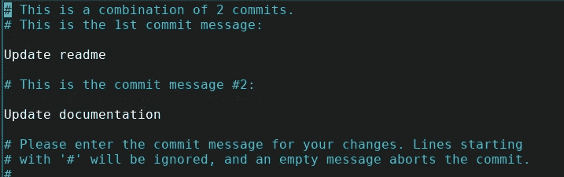
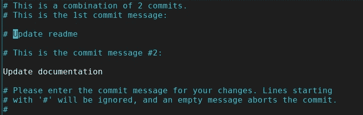
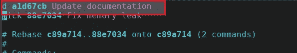

# 使用 Git 交互式 Rebase 清除提交历史

> 原文：<https://levelup.gitconnected.com/clean-commit-history-with-git-interactive-rebase-8882eacbf5ab>

## 饭桶

## 通过 git rebase 重写提交


照片由[扬西·敏](https://unsplash.com/@yancymin?utm_source=medium&utm_medium=referral)在 [Unsplash](https://unsplash.com?utm_source=medium&utm_medium=referral) 上拍摄

每当我们在做某件事时，我们在完成后向观众展示之前都会回顾我们的工作。类似地，我们的代码在进入生产系统之前需要我们同事的审查。

在调整同事请求的变更时，保持我们的[提交历史干净](/4-tips-to-write-clean-commit-history-51155f7f23b9)是至关重要的。

作为初学者，我习惯于添加一个新的提交来调整所请求的变更。但它让提交历史变得丑陋。使用 git interactive rebase，您可以克服这个问题并保持提交的整洁。

我在这篇文章中分享了 git 交互式 rebase 的多个用例。

# 调整同事要求的变更

我们的同事在我们的代码进入生产系统之前审查它。当团队请求变更时，我们可以通过编辑特定的提交来直接调整请求的变更。例如，我们的同事请求修改提交消息`Optimize bulk endpoint`。

我们可以使用`git rebase -i main`编辑提交。将打开一个编辑器窗口，列出所有提交。我们可以选择对哪个提交执行什么操作。由于我们喜欢`edit`第二次提交，我们将选择`e or edit`，如下所示。



编辑特定提交

一旦我们调整了所有请求的更改，我们就可以通过运行以下命令来提交我们的更改。

```
git add .
git rebase --continue
```

# 将多个提交合并为一个

交互式 rebase 还允许我们通过使用`squash`命令将多个提交合并成一个。我在以下场景中使用这个特性。

1.  有时我不确定如何组织我的提交，所以我添加临时提交。随着我工作的进展，情况变得更加清晰。一旦清楚了，我就把这些临时提交合并成一个有意义的提交。
2.  有时候我想尝试一些新的东西。在尝试新东西之前，我添加了一个临时提交。如果我的实验成功了，我会将它与我以前的工作合并，否则就放弃一切。

您可以通过使用`git rebase -i main`合并提交，并使用`s or squash`反对提交，您想要合并，如下所示。



粉碎第二次提交

这将导致以下窗口。



提交消息之间的选择

我们需要使用如下所示的`#`来选择我们想要保留的提交消息和要忽略的提交消息。



保存时，git 将两次提交合并为一次。

# 放弃提交

我们可以通过对特定提交使用`d or drop`命令来删除特定提交，如下所示



放弃提交

当不清楚我的同事是否会接受我的工作时，我会使用这个功能。理想情况下，我会在工作前与团队讨论。

但是，如果同事们很忙，并且更改不太耗时，我会单独提交。这样，如果需要的话，我就可以轻松地放下我的工作。

感谢阅读。

# 分级编码

```
Thanks for being a part of our community! More content in the [Level Up Coding publication](https://levelup.gitconnected.com/).Follow: [Twitter](https://twitter.com/gitconnected), [LinkedIn](https://www.linkedin.com/company/gitconnected), [Newsletter](https://newsletter.levelup.dev/)Level Up is transforming tech recruiting 👉 [**Join our talent collective**](https://jobs.levelup.dev/talent/welcome?referral=true)
```