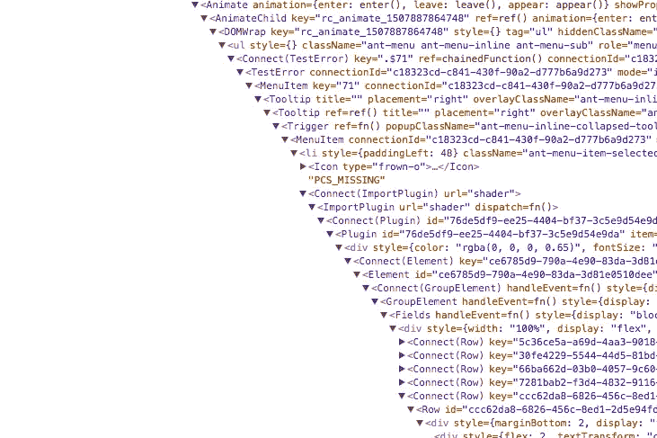
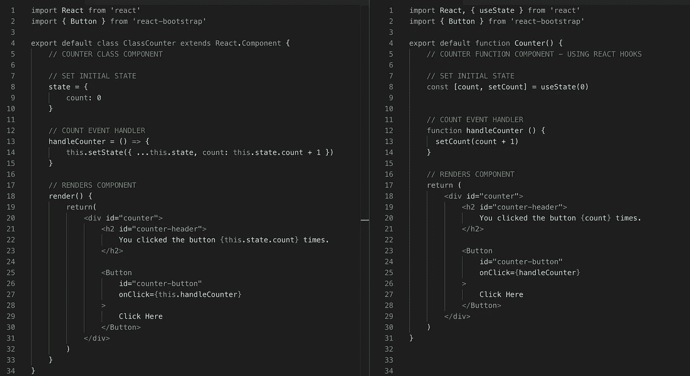
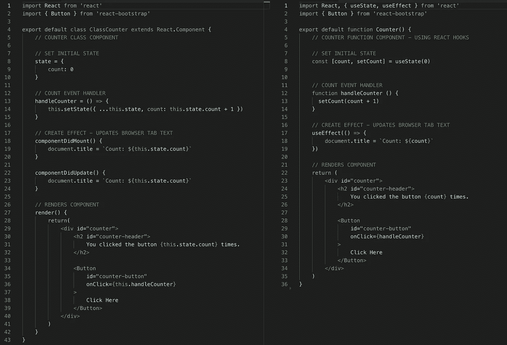
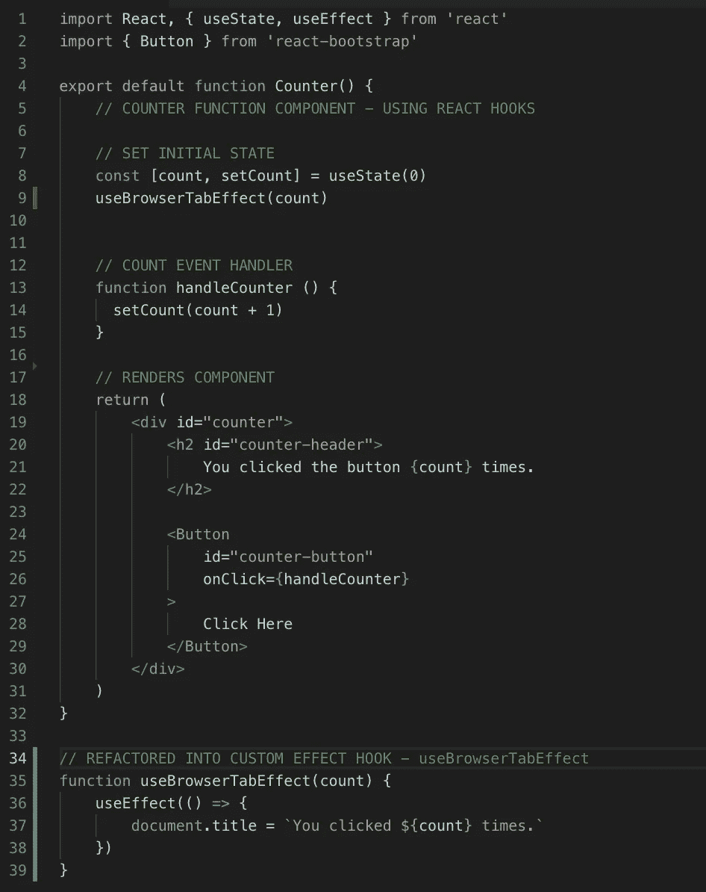
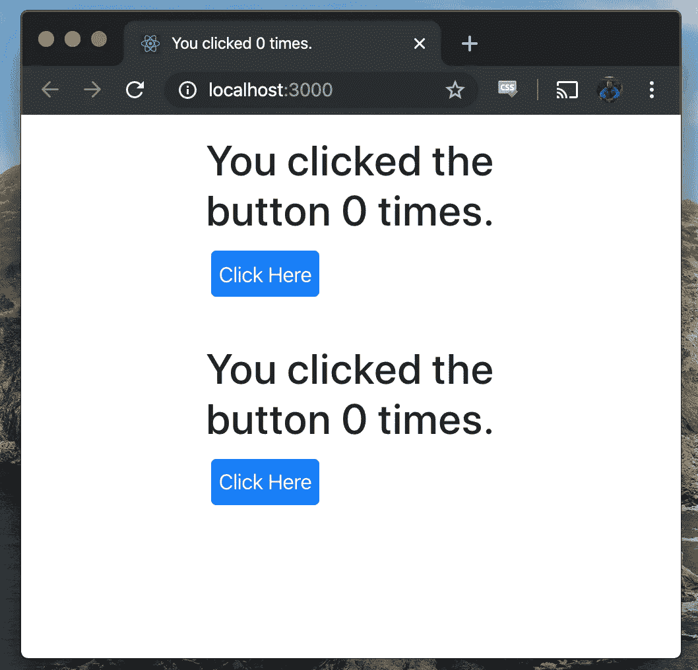
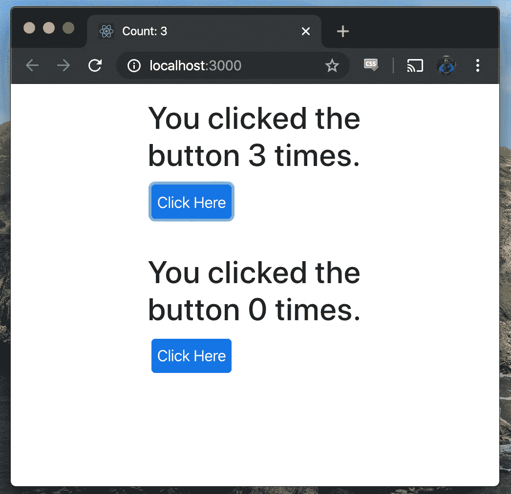
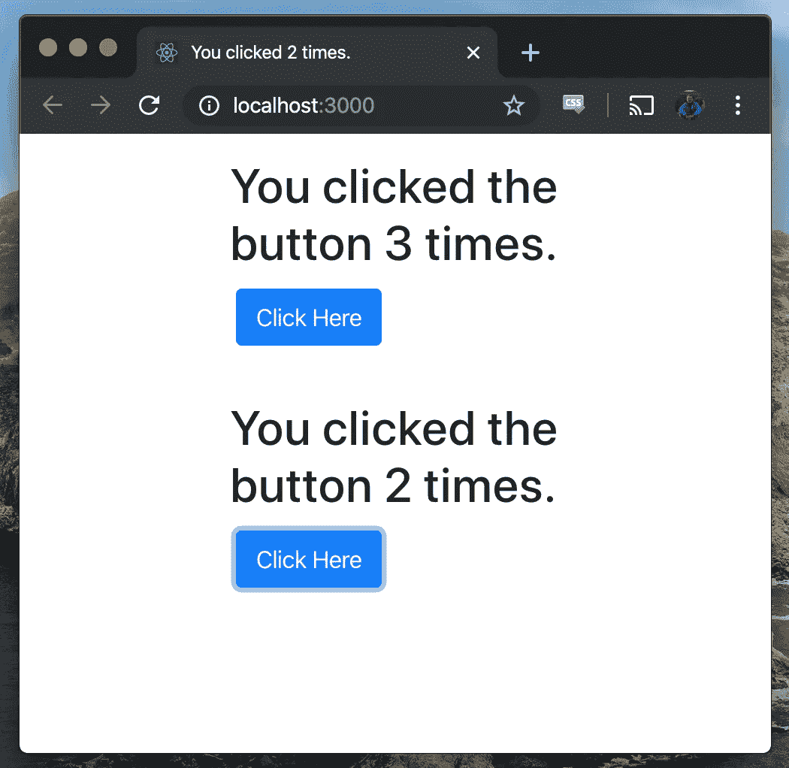

# 用反作用挂钩清洁组件

> 原文：<https://levelup.gitconnected.com/clean-components-with-react-hooks-4cfef201176e>

React Hooks 由 Sophie Alpert、Dan Abramov 和 Ryan Florence 在 React Conf 2018 上首次推出。挂钩支持状态和副作用管理，而无需创建类组件。React 团队在 React 应用程序中创建的类组件和模式方面有三个主要问题。这些问题包括:**包装地狱**、**庞大的组件**，以及**混乱的类**。该团队建议增加 React 挂钩，而不是继续沿着这条路走下去。

“包装地狱”的众多例子之一

**React 团队对挂钩的建议**

*   使用不带类的所有 React 功能
*   重用组件之间的有状态逻辑
*   选择加入并向后兼容传统 React 应用程序

React 挂钩在代码中实现是可选的，但是它们可以简化复杂性并提高组件的可读性。

## 【React 文档中的关键概念

当您了解这个 JavaScript 库的细节时，React 的文档是一个非常有用的资源。在我们在编码会话中引入钩子之前，有几个概念需要理解。

根据[反应钩文件](https://reactjs.org/docs/hooks-overview.html):

" **useState** 返回一对:当前状态值和一个让你更新它的函数。您可以从事件处理程序或其他地方调用该函数。它类似于类中的 **this.setState** ，除了它没有将新旧状态合并在一起。

钩子是让你从功能组件中“钩入”反应状态和生命周期特征的功能。钩子在类内部不起作用——它们让你在没有类的情况下使用 React。"

**React 的文档也强调了钩子是 JavaScript 函数，但是它们强加了两个额外的规则:**

1.  只调用顶层的钩子。不要在循环、条件或嵌套函数中调用钩子。
2.  仅从 React 函数组件调用挂钩。不要从常规的 JavaScript 函数中调用钩子。(只有一个地方可以调用钩子——您自己的定制钩子)

现在我们已经对 React 挂钩有了一些基本的了解，让我们开始编写代码吧！

# 计数器组件:用 React 钩子比较类组件和函数组件

上面的两个计数器组件看起来很相似，但是让我们分析一下细微的区别。

在左边，类组件设置一个初始状态，count 变量等于零。点击按钮时，`this.handleCounter`触发该功能，`this.state.count`将`count`加 1。

在右边，函数组件定义变量和函数，用`[count, setCount]` **改变变量。**计数变量的状态通过`useState`初始化为零。现在，当点击按钮时，`handleCounter`触发，`setCount`将`count`变量加 1。

# 给计数器组件添加效果

效果允许您在 React 组件中执行副作用。`useEffect`钩子是一个单独的函数，它取代了 React 类生命周期方法`componentDidMount`、`componentDidUpdate`和`componentDidUnmount`的功能。钩子从文件顶部的 React 导入。下面的代码演示了如何在计数增加时更新浏览器选项卡中的文本。

为了更新浏览器标签中的计数值，类组件需要`componentDidMount`和`componentDidUpdate`来显示变化的`this.state.count` 。使用`useEffect`钩子，函数组件调用这个钩子来更新`count`值。

# 带有自定义挂钩的功能组件

React 挂钩还允许您抽象函数组件下面的逻辑。这可以通过自定义挂钩来实现。自定义钩子命名约定以**“use”**开始，所以我们将这个钩子命名为`useBrowserTabEffect`。这个定制钩子的行为与上例中的`useEffect`钩子相同。

自定义挂钩示例

# 计数器功能

类和函数组件现在有了相同的行为！您可以在下面的窗口和选项卡中看到计数更新。如果你想尝试计数器，这里有一个链接，链接到带有计数器组件的 [GitHub 库](https://github.com/PrestonElliott/React-Hooks)。

带挂钩的函数组件之上的类组件

类别组件效果更新浏览器选项卡

功能组件效果更新浏览器标签

# 计数器组件比较的要点

*   一旦类生命周期方法开始发挥作用，类组件就会变大
*   **计数**比**计数**更容易阅读和重复
*   挂钩为您和其他开发人员创建了更整洁的代码

要了解更多关于 React Hooks 的信息，请查看下面的视频！React 团队为任何想要学习和实现代码挂钩的人提供了一个很好的基础。