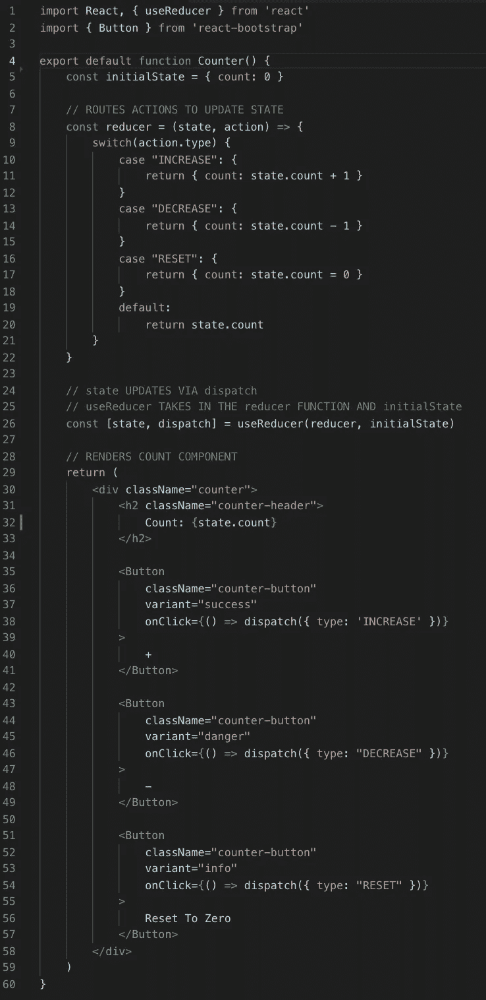
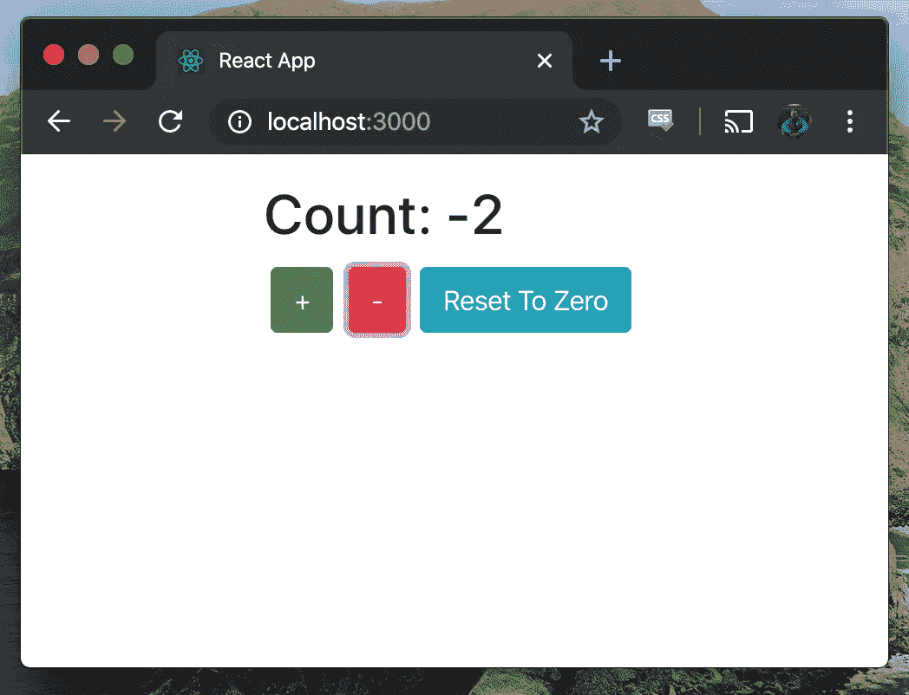
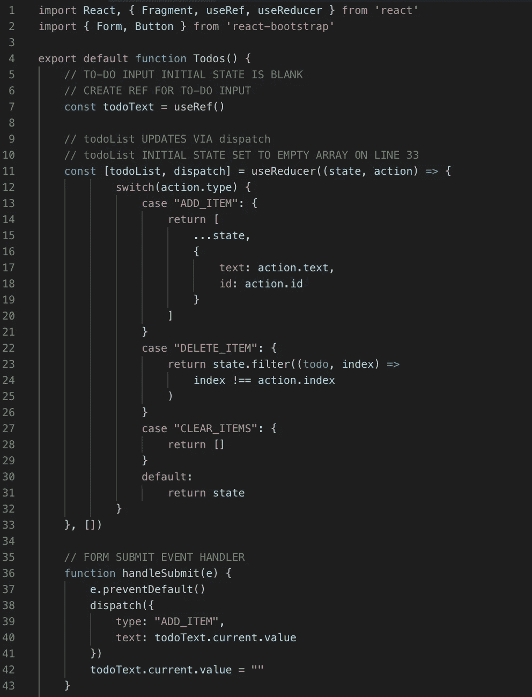
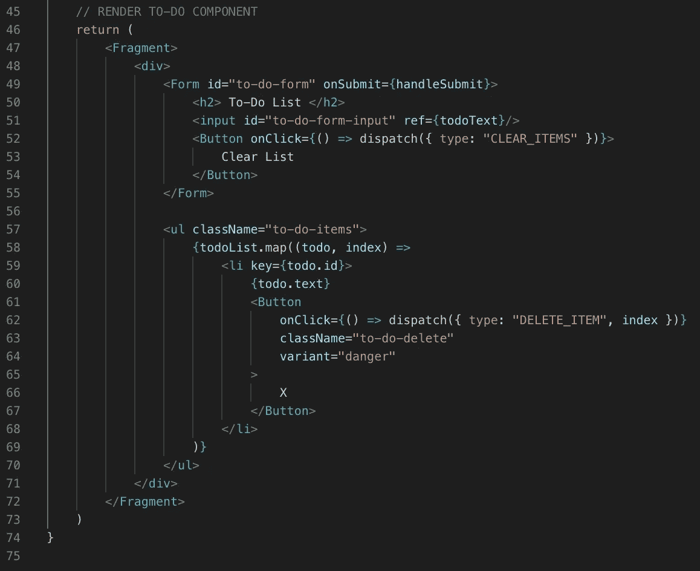
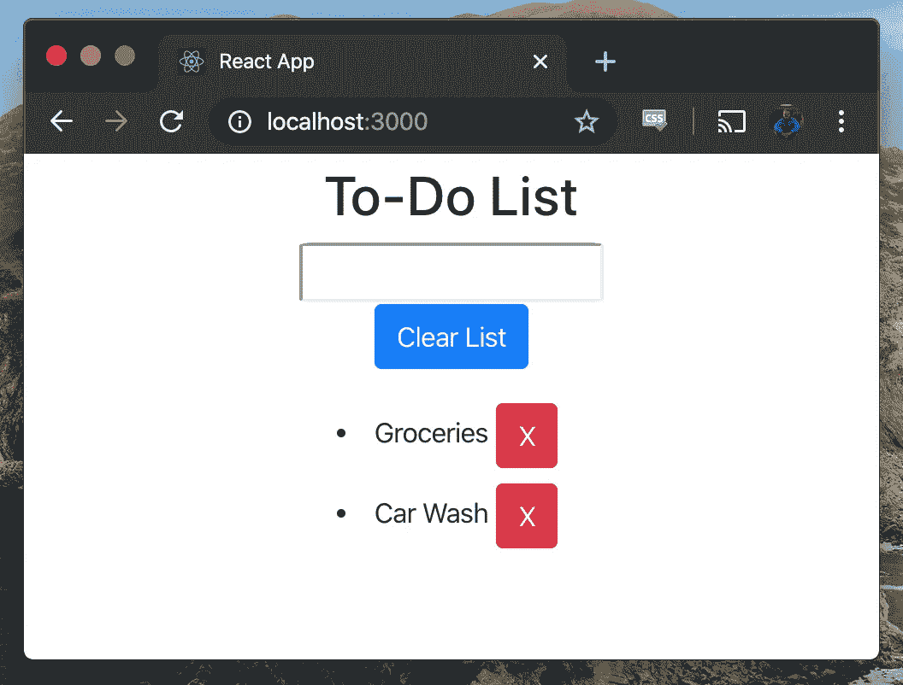

# React 挂钩— useReducer 和 useRef

> 原文：<https://levelup.gitconnected.com/clean-components-with-react-hooks-part-2-41b92f64f8b3>

[在上周的文章](/clean-components-with-react-hooks-4cfef201176e)中，我们探讨了 React 团队将钩子引入库的决定，并比较了传统的类组件和带有 React 钩子的函数组件。在这个比较中，我们走过了如何实现`useState`、`useEffect`，并创建了一个自定义钩子`useBrowserTabEffect`、T23。

今天，我们将探索`useReducer` 来创建一个可以增加、减少和复位的计数器组件。我们还将引入`useRef`来制作待办事项清单。这两个例子都是带有 React 钩子的函数组件。

# 带有用户的计数器

为了理解`useReducer`钩子，这里有一段摘录自 [React 钩子 API 参考](https://reactjs.org/docs/hooks-reference.html#usereducer)。

根据文件:

"`useReducer`通常比`useState`更适用于包含多个子值的复杂状态逻辑，或者下一个状态依赖于前一个状态的情况。"

为了开始计数，我们设置一个`initialState`，使`count`等于零。使用 switch 语句创建`reducer`函数，以说明增加、减少和重置`count`的操作。在第二十六行，通过调用`dispatch`更新`state`。`initialState`和`reducer`函数都被传递到`useReducer`钩子中。

# 使用 useReducer 和 useRef 的待办事项列表

现在我们已经看到了一个利用`useReducer`的例子，让我们来介绍一下`useRef`！ [React 钩子文档](https://reactjs.org/docs/hooks-reference.html#useref)在下面解释这个钩子。

“有没有类似实例变量的东西？是啊！这个`[useRef()](https://reactjs.org/docs/hooks-reference.html#useref)`钩子不仅仅是给 DOM 引用的。“ref”对象是一个通用容器，其`current`属性是可变的，可以保存任何值，类似于类的实例属性。

为了创建待办事项列表，我们制作了一个带有输入字段的表单，用于向列表中添加新项目。通过`useRef()`将`todoText`设置为空白，并且在提交表单时可以访问。下一步是构造初始状态设置为空数组的`todoList`变量和通过动作更新列表状态的`dispatch`。`useReducer`接收`state`和发生的`action`来添加项目、删除项目或重置待办事项列表。`handleSubmit`利用`useRef`接收输入到表单输入中的`todoText`。这个文本可以通过调用`todoText.current.value`来访问，一旦条目被添加到列表中，它就被设置回一个空字符串。

React 挂钩使得函数组件可读，并在管理中小型应用程序时创建了一个有趣的 React-Redux 替代方案。如果您对修补这些组件感兴趣，可以通过在这里克隆[库](https://github.com/PrestonElliott/React-Hooks)来尝试计数器和待办事项列表！

[来源](https://unsplash.com/photos/tvleqH3p1os)