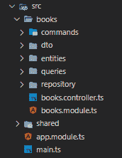

# 用 NestJS 和 CQRS 清理 REST API

> 原文：<https://levelup.gitconnected.com/clean-rest-api-with-nestjs-and-cqrs-37dac61e635b>

照片由 [MAKM 摄影](https://unsplash.com/@makmphotography?utm_source=medium&utm_medium=referral)在 [Unsplash](https://unsplash.com?utm_source=medium&utm_medium=referral)

现在 API 无处不在，不管你喜不喜欢，如果你是一个软件工程师，你不能避免 REST API，这就是它是多么的普遍。

如果你决定在 Node.js 中创建另一个 API，你可能会面临一个两难的选择……我应该使用哪个 HTTP 框架？有很多选项，包括最受欢迎的选择，如 express、koa、loopback…和 NestJS。

[NestJS](https://nestjs.com/) 是一个用于构建 [Node.js](http://nodejs.org/) 服务器端应用的框架。它自带了大量的工具，其中很多都是受 Angular 的启发，比如模块、服务、依赖注入、CLI、管道等等。默认情况下，它使用 TypeScript，但是如果您愿意，也可以使用 VanillaJS。

今天我想展示一个简单的例子，一个用于管理书籍的干净的 REST API。让我向你展示一下，在 NestJS 的 [CQRS](https://docs.nestjs.com/recipes/cqrs) 模块的帮助下，它是如何完美地组织起来的。

[点击这里查看 Github 知识库。](https://github.com/Artix1500/clean-rest-api-with-nestjs)

首先，我们将看一看大致的结构，然后我们将一步一步地分析它。

Main.ts —该文件负责从 AppModule 创建 NestJS 应用程序。

app . module——项目的核心，这里我们导入提供功能的模块。

Books.module —该模块将由 AppModule 导入，以提供与我们的图书相关的所有内容。

Books.controller —这里我们用所有参数声明端点。

实体——在这里，我们声明我们的 Book 类。

DTO——数据传输对象——一组与应用程序通信的接口。

存储库、查询、命令——这些文件夹与 CQRS 相关，我们稍后会查看它们。

最后，我们来看代码！

我的计划是向你展示整个请求流程。让我们从模块开始。

## 书籍模块

在这里，我们可以看到这个模块、控制器和提供者的所有导入。
如果我们仔细看看提供者的，我们可以看到，在这个模块中，我们提供了 IdGenerator，它是一个抽象类，我们提供了 UuidGenerator 类。

这种方法允许我们创建多个适配器，然后提供它们。这种方法的最大好处之一是将代码解耦。假设我们想把 UuidGenerator 改成自己定制的生成器，怎么做呢？只需实现一个将扩展 IdGenerator 的类，在一个模块中提供它，就这样！

从现在开始，在这个模块范围内声明的所有试图使用注入的 IdGenerator 的东西实际上都在使用它，而不是 UuidGenerator 类。

## 图书管理员

这是我们的终点。让我们讨论有趣的部分。

装饰者
通过使用装饰者，我们可以很容易地声明路径、方法和参数。阅读和定制非常简单。

*构造函数中的依赖注入* NestJS 自带的强大特性！通过这种机制，我们可以将依赖注入到类中，而不必创建注入依赖的实例，我们将让 NestJS 为我们处理这一点！这里我们将使用它来注入 commandBus 和 queryBus。为了解释这一点，我们将继续讨论…

## CQRS

CQRS 代表命令查询责任分离，它允许更好地扩展应用程序，处理复杂的业务逻辑，以及在更大的团队中更好地处理项目逻辑。当然，在这个项目中，可以很容易地跳过它，但是，我想展示用 NestJS 实现它是多么容易。

让我们来看看一个简单查询 GetBookQuery 的流程。首先，我们必须从 NestJS CSQR 实现提供的 queryBus 上的 book 控制器中调用它:

那么查询处理程序将接管控制权。

现在我们将使用注入的 BookRepository 来获取数据，就这样。让我们仔细看看 BookRepository:

我们可以看到它只是一个纯粹的抽象类，在模块中提供它是为了让你的实现尽可能的灵活。如果您向上滚动，可以看到 BookRepository 类是由 BookRepositoryMemoryAdapter 提供的:

这里只是为了开发，我们可以使用我们的存储的一些模拟实现，然后决定哪个数据库最适合我们。

总而言之，有些人会说所有这些只是简单应用程序的额外代码。但是如果你想一想，你会注意到，这种方法实际上在你的架构中实施了良好的实践。

我希望你在这里找到一些有趣的东西，也许下次你会尝试 NestJS！