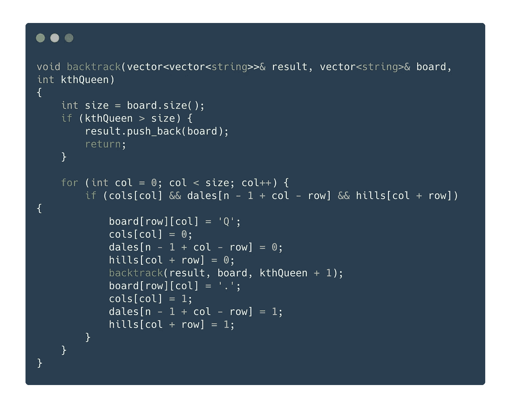
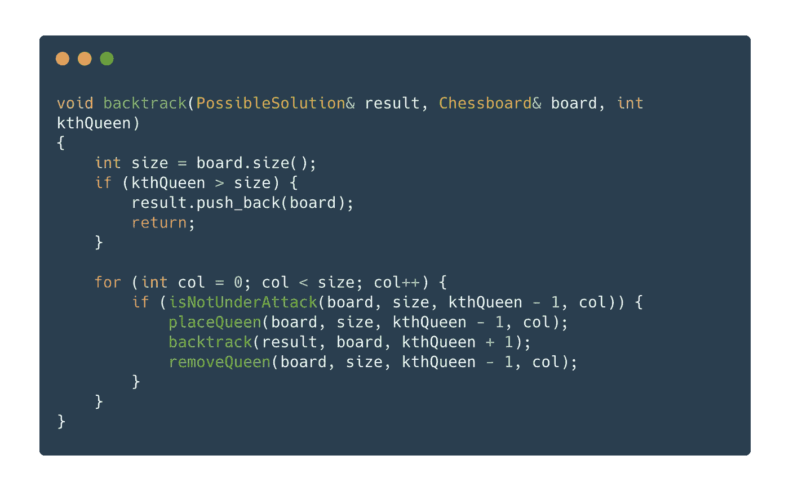
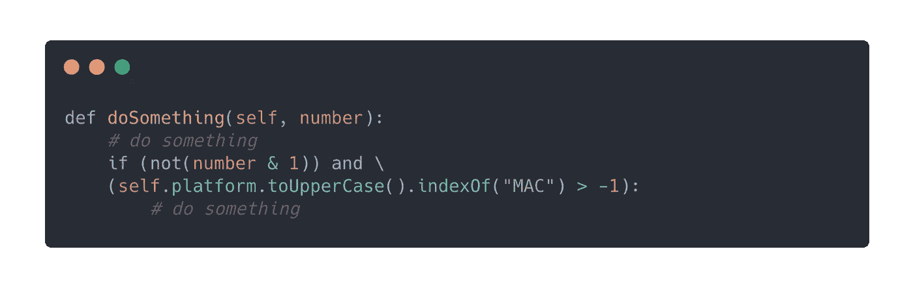
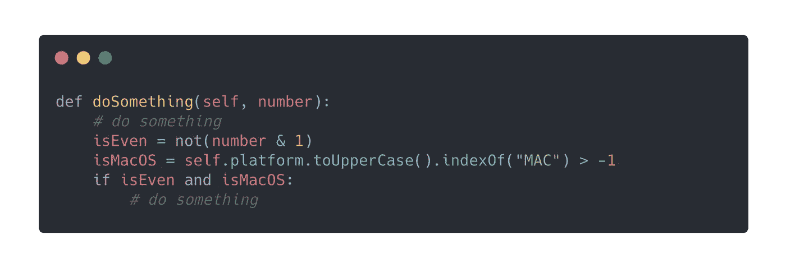

# 用封装清理你的代码

> 原文：<https://levelup.gitconnected.com/clean-you-code-with-encapsulation-25c3c8816902>

## 如果过一段时间重新审视你的代码总会打击你的士气，这些提示会派上用场。

我最近意识到一个概念似乎超越了多种编程范式:*封装*。逻辑和数据可以封装在变量、函数、类和模块/包中。我们如何利用这个概念来组织我们的代码呢？

照片由 [AltumCode](https://unsplash.com/@altumcode?utm_source=medium&utm_medium=referral) 在 [Unsplash](https://unsplash.com?utm_source=medium&utm_medium=referral) 上拍摄

# 重复代码

偶尔，当我发现自己在编码时按 Ctrl + C 时，我不禁觉得自己在做一件不可救药的事情。

在没有完全理解别人的代码做什么的情况下复制别人的代码肯定是一种不好的做法，但是复制我自己的代码也增加了我对恶意实体的恐惧:*重复代码*。复制我的代码的行为类似于把我的钥匙放在除了通常的位置以外的任何地方。每次我这么做的时候，我都得翻遍我的整个房子才找到我的钥匙。类似地，如果我复制的代码有缺陷，我不得不沮丧地在我庞大的代码库中寻找重复的代码，并修改它们中的每一个。

如何才能避免这种情况？使用编程语言支持的结构封装它们，简单地将它们转换成可重用的组件。之后，你可以在任何需要的时候参考它们。

# 挥发性化合物

如果您正在构建具有不断变化的需求的项目，那么您更愿意对代码进行尽可能少的更改。封装可以帮助您实现这一目标。

例如，我有一个实现回溯来解决 N 皇后问题的函数:

你能马上猜出这个程序在循环中做了什么吗？

放置一个新的女王后，如果我需要记录每个女王的位置怎么办？我必须研究我的代码，并找到应该添加新代码的地方。

让我们通过将不相关的代码包装在函数中来应用一些封装:

封装任何可以修改的不相关的实现

现在，我可以很容易地添加一个函数来记录`placeQueen()`函数中皇后的位置。每当我需要修改`backtrack()`函数中的任何步骤时，我只需要找到相关的函数并对其进行修改。

# 黑魔法

自古以来，人们就知道黑魔法是由那些能够操纵超自然力量来满足自己自私欲望的人使用的。它以各种形式出现。它们的范围从我妈妈经常用来召唤我丢失的袜子的咒语到第一次尝试成功编译我的代码的神奇编译器(我开玩笑的)。然而，他们都有一个共同的疏忽，人类伦理在其核心。在我作为一个学徒程序员的时间里，我遇到了一种邪恶的形式，这种形式的强大足以让有经验的程序员困惑:冗长而复杂的表达方式。

您需要多长时间才能了解病情？

“只有农民不理解如此美丽的表达！”，你可能会争辩。如果维护或调试代码的人是编码向导，那么这样做是很好的。如果是这样，您可以忽略此提示。否则，我想提出一种提高可读性的方法:

现在读它是否不那么令人沮丧？

对于那些喜欢单行和“简洁”代码的人来说，创建额外的变量来保存这些表达式无疑是一件麻烦事。然而，如果任何阅读您的代码的人只想快速理解`if`语句的作用，那么它就更简洁了。他们(包括你未来的自己)肯定会感激你的体贴。

简而言之，封装是一种提高代码可读性和可伸缩性的通用方法。谢谢你看了我的文章！如果您对这个话题有什么更好的想法，请在回复中告诉我。