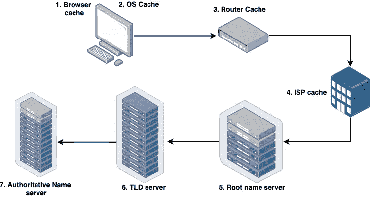
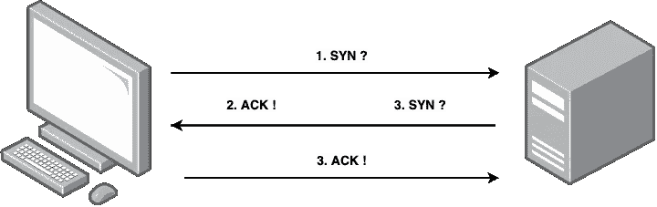

# 单击链接—接下来会发生什么？

> 原文：<https://levelup.gitconnected.com/clicking-a-link-what-happens-next-d3360553735a>

你有没有质疑过在网站上点击一个 **<一个>** 标签会发生什么？你的浏览器怎么知道要获取什么？去哪里？我希望在这篇文章的最后解释一下核心的基本面。

**TL；博士**

*   我们点击网址
*   浏览器通过 DNS 将该 URL 解析为 IP 地址。
*   在客户端和服务器之间发起 TCP 连接
*   连接是正式的，可以发送请求和响应。

首先，让我们设置一个简单的场景。我们有一个网页，网页上有一个链接到另一个网页。当我们点击那个链接时会发生什么？

首先，让我们记住这个链接是由一个统一的资源定位器 **(URL)** 组成的。URL 只是资源的一个标识符，我们使用它们是因为它们比目的地址 **(IP 地址)**更容易阅读。大多数时候，我们会看到一个 URL 以一种协议为前缀，最常见的是超文本传输协议 **(HTTP)** ，但你也可以看到 URL 以其他协议为前缀，如 MailTo 或文件传输协议 **(FTP)** 等等。

# 获取 IP 地址

我们已经点击了 URL，现在做什么呢？现在，浏览器需要将 URL 解析为 IP 地址。为此，计算机将使用域名服务器 **(DNS)** 。域名就像一本电话簿，或者对年轻一代来说，它就像你的联系人应用程序。这将把 URL 解析成 IP 地址。

但这只是一个概述，为了解析 URL，它将首先检查**本地浏览器缓存**以查看它是否最近被解析，然后它将检查**操作系统缓存**，接着是您的**路由器缓存。**如果所有这些都失败了，那么浏览器将请求**解析服务器(**，通常是你的 ISP)，检查他们的 **ISP 缓存**，之后是**根域名服务器。**根服务器将知道您可以从哪里获取数据，并将您的请求定向到该位置，这将是一个**顶级域名服务器(TLD)** ，最后该请求将被定向到一个**权威域名服务器**，该服务器将了解有关域名的所有信息。

DNS 查找发生的顺序。

现在我们做到了。 [https://matty.dev](https://matty.dev) 已解析为 127.0.0.1。太好了，现在我们已经有了可以与该地址通信的 IP 地址，这就是所谓的传输控制协议 **(TCP)** 的用武之地。

# 初始化连接

TCP 是一种确保发送方和接收方之间可靠传输数据包的协议，为此，接收方必须确认收到的每个数据包 **(ACK)** ，如果丢失了一个数据包，发送方将重新发送。TCP 协议从 **TCP 三次握手**开始，它在发送方和接收方之间建立连接。为此，发送方将发送一个 **SYN** ，接收方将发送一个 **ACK** ，然后是 **SYN，**最后发送方将回复一个 **ACK。**

现在已经建立了连接，可以向服务器发送 HTTP 请求，服务器可以用数据进行响应。

从根本上说，就是这样。我们从 DNS 查找中获得 IP 地址，然后初始化与接收方的 TCP 连接，这使计算机能够开始发送和接收 TCP 包中的数据。对于任何感兴趣的人，我也建议看看 TCP 如何处理数据包传输和数据包丢失，并通过比较**用户数据报协议** (UDP)和 TCP 进行一些进一步的阅读。