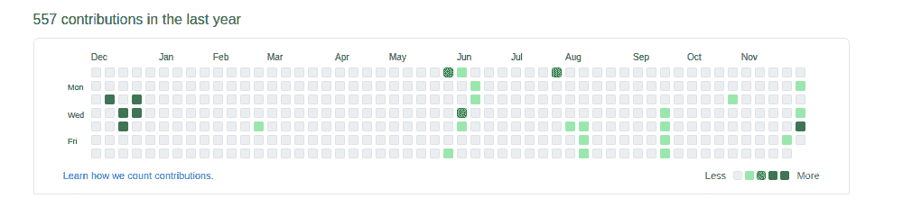

# 克里戈尔-吉菲戈尔公司

> 原文：<https://levelup.gitconnected.com/cligol-and-gifeegol-d5509a154bf6>

如果你点击了这篇文章的标题，我很抱歉让你失望了:我不会写一部基于斯米戈尔的霍比特表兄弟中土世界冒险的《指环王》衍生剧。我*将要做的*是向你展示我是如何将我的 github 个人资料的时间线转变成每天更新的生活游戏的。因此，请装满您的向导管道，加入我的编程冒险吧！

以下是最终产品最初几次迭代的截图:



穿过 github 的信号。

# 克里戈尔

我旅程的第一步是锻造 [cligol](https://github.com/lucasreta/cligol) (生活的命令行界面游戏)，这是一个小型 C 脚本，负责根据我们的要求生成模拟。我通常不写 C 程序，所以我从玛丽·雪莱的医生书里拿了一页，用我在网上找到的许多尸体创造了一个小怪物。

它的主干全部来自于 [Rosetta 代码](https://rosettacode.org/wiki/Conway%27s_Game_of_Life#C)和[这个代码评审帖子](https://codereview.stackexchange.com/questions/143167/game-of-life-in-c)的混合。经过整理以保持风格一致，并添加了一些存储和调试功能，最终结果如下:

cligol 的 main.c 文件的截断版本。

我们主要功能的流程相对简单:

1.  从文件加载电路板，如果电路板不存在，则创建一个新的电路板。
2.  检查收到的参数。
3.  如果第一个参数 *display* 不存在或者不等于 1，我们调用`move`方法，该方法遍历我们的网格并为下一轮游戏生成结果。如果 *display* 参数设置为 1，它将进入`display_loop`方法，该方法处理棋盘和可控选项的渲染，与我们当前的目标无关。
4.  将游戏的新状态写入本地文件进行存储。

所以一旦我们编译了我们的脚本(`gcc main.c -o cligol`)，我们就可以调用`./cligol`来一次推进我们的游戏一个回合。文件`data/board.txt`将在第一次运行时创建，并在随后的每次运行时更新。

我调整了提升后的代码，以便添加一个`config.h`文件，在这里我们可以设置电路板的宽度、高度和一个伪布尔标志，以指示我们的电路板是否应该表现为环形表面。这似乎是一个不错的补充，因为 github 的网格非常有限，如果没有它，我们的生命形式会很快脱离我们的 7x 52 板。

此时，我们有了一个正常工作的 CLI 程序，该程序将创建和更新一个文件，其格式如下:

```
0 0 0 0 0 0 1 0 0 0 0 0 0 0 0 0 0 0 0 0 0 0 0 0 0 0 0 0 0 0 0 0 1 1
0 0 1 0 0 0 0 0 0 0 0 0 0 0 0 0 0 0 0 0 1 0 0 0 0 0 0 0 0 0 0 0 0 0
0 0 1 0 0 0 0 0 0 0 0 0 0 0 0 0 0 0 0 0 0 1 1 0 0 0 0 0 0 0 0 0 0 0
0 0 1 0 0 0 0 0 0 0 0 0 0 1 0 0 0 0 0 0 1 1 0 0 0 0 0 0 0 0 0 0 0 0
0 0 0 0 0 0 0 0 0 0 0 0 1 0 1 0 0 0 0 0 0 0 0 0 0 0 0 0 0 0 0 0 0 0
0 0 0 0 0 0 0 0 0 0 0 0 1 0 1 0 0 0 0 0 0 0 0 0 0 0 0 0 0 0 0 0 0 0
0 0 0 0 0 0 1 0 0 0 0 0 0 1 0 0 0 0 0 1 1 0 0 0 0 0 0 0 0 0 0 0 0 0
0 0 0 0 0 1 0 1 0 0 0 0 0 0 0 0 0 0 0 1 1 0 0 0 0 0 0 0 0 0 0 0 0 1
0 0 0 0 0 1 0 1 0 0 0 0 0 0 0 0 0 0 0 0 0 0 0 0 0 0 0 0 0 0 0 1 0 1
```

现在是时候破解一个又长又脏的 bash 脚本了，它可以把这个文件的内容变成 github 配置文件中一个漂亮的绿色网格。

# 吉菲戈尔

进入 [gifeegol](https://github.com/lucasreta/gifeegol/tree/main) (Github 生命游戏)，我们的 cligol 调用，文件读取，提交垃圾邮件，默认分支改变 bash 脚本。该描述以简洁的方式解释了我们的脚本需要做的事情，按照它们必须完成的顺序:

1.  调用 cligol 生成新的棋盘，或者将现有的棋盘迭代到下一回合。
2.  读取更新文件的内容。
3.  在我们的回购中创建新的分支。
4.  开始遍历网格，将每个单元格匹配到特定的日期。
5.  每当单元格值等于 1 时，写入在匹配日期创作的 50 个提交。如果值为零，则不执行任何操作。
6.  将我们的变更推进到新的分支。
7.  使用 github 的 API 修补我们的存储库，将我们刚刚推送的分支设置为默认分支。

该脚本比我一开始设想的要简单，这在很大程度上要归功于 bash 的`date`命令:最初我错误地走上了一条道路，以一种更加不稳定和手动的方式处理日期，这导致了许多行和丑陋的代码(出于好奇，这在第一次提交中仍然可以看到)。

为了能够运行最后一个 CURL 请求，我们首先需要从 github 生成一个公共访问令牌，这可以通过 github 的[设置](https://github.com/settings/tokens)轻松完成。一旦我们有了令牌，我们就可以设置一个 cron 来每天、每小时或您认为合适的任何时候运行脚本(相应地替换**$变量**和 **/path/** ):

```
0 0 * * * USERNAME=$username ACCESS_TOKEN=$token REPOSITORY=$repo /path/to/repo/move.sh
```

就是这样，我们有一个工作 gifeegol 供我们使用！

# 然后再回来

我不怎么写 bash 脚本(更不用说用 C 编写代码了)，所以我确信我的代码充满了 bug &糟糕的实践。我很高兴地欢迎任何和所有的反馈。

感谢你阅读我的第一篇文章，希望你喜欢。

***关于我:*** *我是一名拥有超过 7 年经验的全栈式 web 开发人员，目前正在寻找新的机会。你可以查看* [*我的网站*](https://lucasreta.com/en/) *进一步参考或者直接写信给我*【1.lucasreta@gmail.com】