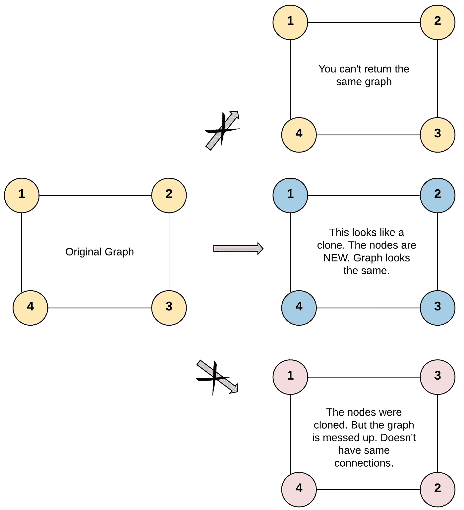
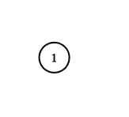
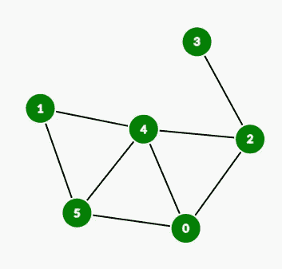
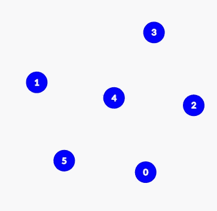
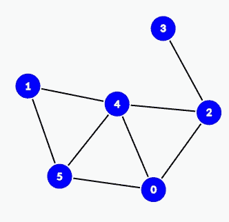

# 克隆图形盲 75 LeetCode 问题

> 原文：<https://levelup.gitconnected.com/clone-graph75-leetcode-questions-e7230ea6e017>


托马斯·库亚尔在 [Unsplash](https://unsplash.com/?utm_source=medium&utm_medium=referral) 上拍摄的照片

## 任务描述:

给定一个 [**连通的**](https://en.wikipedia.org/wiki/Connectivity_(graph_theory)#Connected_graph) 无向图中一个节点的引用。

返回一个 [**深度复制**](https://en.wikipedia.org/wiki/Object_copying#Deep_copy) (克隆)的图形。

图中的每个节点包含一个值(`int`)和一个它的邻居列表(`List[Node]`)。

```
class Node {
    public int val;
    public List<Node> neighbors;
}
```

**测试用例格式:**

为简单起见，每个节点的值与节点的索引相同(索引为 1)。例如，第一个节点带有`val == 1`，第二个节点带有`val == 2`，以此类推。该图在测试用例中使用邻接表来表示。

**邻接表**是无序列表**的集合**用来表示一个有限图。每个列表描述了图中节点的一组邻居。

给定的节点将总是带有`val = 1`的第一个节点。您必须返回给定节点的**副本，作为对克隆图的引用。**

**例 1:**



```
**Input:** adjList = [[2,4],[1,3],[2,4],[1,3]]
**Output:** [[2,4],[1,3],[2,4],[1,3]]
**Explanation:** There are 4 nodes in the graph.
1st node (val = 1)'s neighbors are 2nd node (val = 2) and 4th node (val = 4).
2nd node (val = 2)'s neighbors are 1st node (val = 1) and 3rd node (val = 3).
3rd node (val = 3)'s neighbors are 2nd node (val = 2) and 4th node (val = 4).
4th node (val = 4)'s neighbors are 1st node (val = 1) and 3rd node (val = 3).
```

**例 2:**



```
**Input:** adjList = [[]]
**Output:** [[]]
**Explanation:** Note that the input contains one empty list. The graph consists of only one node with val = 1 and it does not have any neighbors.
```

**例 3:**

```
**Input:** adjList = []
**Output:** []
**Explanation:** This an empty graph, it does not have any nodes.
```

**约束:**

*   图中的节点数在范围`[0, 100]`内。
*   `1 <= Node.val <= 100`
*   `Node.val`对每个节点都是唯一的。
*   图中没有重复的边，也没有自循环。
*   该图是连通的，并且可以从给定节点开始访问所有节点。

## 推理:

我们一如既往地关注问题，这可能看起来很有挑战性。正如我一直建议的，如果你感到卡住了或者不知道如何解决问题，从和自己交谈开始。所以我们有一个图表，我们需要克隆它，一个想法必须立即出现在你的脑海里。没有完整的遍历/探索，就没有办法复制一个完整的东西。很好。我们知道哪些遍历图/树的方法？修正 BFS(面包优先搜索)或 DFS(深度优先搜索)。我们选哪一个有关系吗？我不这么认为。我们刚刚迈出了解决问题的第一步。我们来看看简单的 DFS。

使用 DFS 和队列迭代方法遍历图的代码

现在我们有了探索给定图形的代码，但是我们不仅需要访问它们，还需要为图形中的每个节点创建一个副本。我故意不告诉你任何关于在我们要复制的节点之间创建链接的事情，我稍后会讲到，现在让我们把注意力放在创建副本上。我们需要一些数据结构来存储原始节点和它的副本之间的关系。同时，它应该支持 2 个功能，一个用于添加链接，第二个用于获取副本。它应该尽可能快地工作。有些人可能已经猜到了 Java 中的 HashMap 或者其他编程语言中的 HashTable。我们只需要在函数中添加几行代码。

更新了方法 traverseGraph 的逻辑

让我们来看看到目前为止我们都做了些什么。假设我们得到了这张图表



给定图形

然后在我们的原始复制图中，我们有这样的东西



从原始图形复制节点

唯一剩下的。我们需要以某种方式连接克隆的节点，以便它们之间的连接与原始图形完全相同。我们如何做到这一点，我们可以利用原始复制地图吗？答案我们必须用它。在完成第一次遍历后，我们将进行第二次遍历，使用来自该图的数据，我们可以在克隆的节点之间复制/建立连接，以便它们重复原始节点。

用于在节点之间遍历和创建链接的代码

在执行了 traverseGraphAndCreateLinksBetweenNodes 方法之后，我们应该会得到这个复制的图形



带边的克隆图

## 解决方案:

我们用三个简单的步骤解决了给定的问题。这是完整的源代码

解决办法

我们可以在这里停下来，为另一个解决的问题而高兴。但是你们中的一些人可能已经注意到了，我们的代码中有一些重复的部分，我们可以去掉，让我们使用递归来使我们的代码更简洁。

递归方法

我希望本文能帮助您理解这个问题背后的逻辑，并使用它来解决其他任务。

回头见！