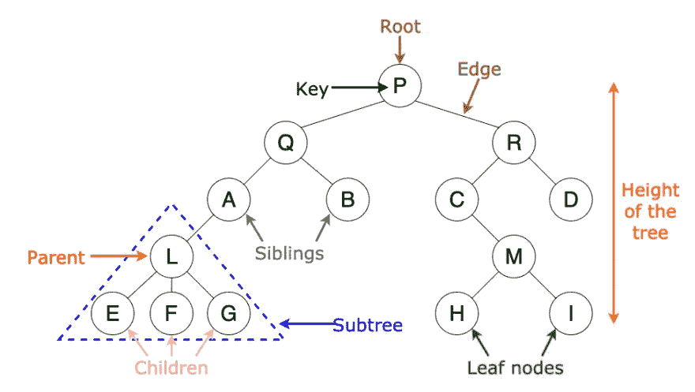

# 最接近的二叉查找树 K 值问题 LeetCode Hard(建议的解决方案)

> 原文：<https://levelup.gitconnected.com/closest-binary-search-tree-k-values-problem-leetcode-hard-proposed-solution-893cc5855df0>



# 背景

在这篇文章和接下来的文章中，我会用我提出的解决方案深入探讨一些 CS 问题。我会尽量遵循最简单的方法“这是可以接受的，足够好，但可能不是最理想的”，让每个人都容易吸收。现在，我们开始吧。

我最近检查的一个有趣的问题是最接近的二叉查找树 k 值问题。

# 问题陈述

这是[原问题陈述](https://leetcode.com/problems/closest-binary-search-tree-value-ii/)，给定一个非空二叉查找树和一个目标值，在 BST 中找出最接近目标的 k 值。

注意:

给定的目标值是浮点值。

您可以假设 k 总是有效的，即:k ≤总节点数。

保证 BST 中只有一组唯一的 k 值最接近目标值。

**举例:**

**输入:**根= [4，2，5，1，3]，目标= 3.714286， *k* = 2

```
 4 / \ 2   5 / \1   3
```

**输出:**【4，3】

# 提议解决方案(迭代方法+优先级队列)

像许多其他 CS 问题一样，我们可以有多个可接受的解决方案。但是为了展示一个容易理解的方法，我们将尝试用一个简单且足够好的方法来解决它。这种方法的主要思想是遍历输入树，将该树的前 k 个值放入优先级队列，然后使用该优先级队列的值作为结果。让我们来看一个 Java 实现。

## 密码

## 复杂性

上述解决方案的时间复杂度为`O(K(Log(N))`。注意，这个问题也可以递归解决，这可以将空间复杂度从`O(N)`降低到`O(k + height of traversed tree)`。

# 其他可能的解决方案

我们可以使用[快速选择算法](https://en.wikipedia.org/wiki/Quickselect)来解决这个问题，它可以有更好的时间复杂度 O(N ),但它的最坏情况是 O(N)。

# 下一步做什么

如果你有更好的解决方案，请随时发表评论。另外，请随意分享这种方法，并在:[https://leet code . com/problems/closest-binary-search-tree-value-ii/](https://leetcode.com/problems/closest-binary-search-tree-value-ii/)中试用

# 分级编码

感谢您成为我们社区的一员！ [**订阅我们的 YouTube 频道**](https://www.youtube.com/channel/UC3v9kBR_ab4UHXXdknz8Fbg?sub_confirmation=1) 或者加入 [**Skilled.dev 编码面试课程**](https://skilled.dev/) 。

[](https://skilled.dev) [## 编写面试问题+获得开发工作

### 掌握编码面试的过程

技术开发](https://skilled.dev)