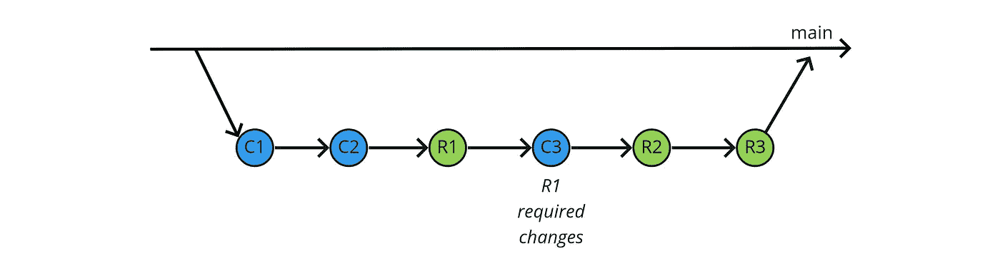

# 弥合代码审查差距

> 原文：<https://levelup.gitconnected.com/closing-the-code-review-gap-dff0fee8de>

## 你有没有感觉到你的代码要花很长时间才能被评审，而当它被评审的时候，代码库已经转移了？让我们探索如何缩小这一差距。

有时候，在代码提交和最终审查之间会有一条鸿沟

作为一名开发人员，我的一个挫折是等待看起来像是永远的*让我的代码被审查并集成到构建中。我也听到我的许多同事抱怨同样的问题。有时我们不得不催促人们审查我们的代码，以便授权合并，而其他时候角色被颠倒，我们发现自己被那些同样的人追赶！延迟的代码审查会阻碍其他的事情，比如验收测试、部署和价值的实现。*

*那么，我们怎样才能使代码评审更加及时呢？让我们来看几个选项。但首先，让我们从几个假设开始。让我们假设这些目标都是*好的*:*

1.  *快速、经常地将新的或修改的代码集成到主线中。*
2.  *防止代码被集成到主线中，直到新代码被证明是令人满意的。这可能包括通过(A)代码审查，和(B)自动化标准，例如测试套件，代码质量分析，等等。*

*让这两个目标互相矛盾并不难。我们可以实践基于主干的开发，其中所有代码都直接提交到主线上。这实现了目标 1，但是悲惨地失败了目标 2。事实上，如果你曾经开发过基于主干的 Subversion 库(或者更老的版本),那么你很可能在实践中见过这种情况:有人提交了……并破坏了构建。也许构建被灾难性地破坏了，开发人员不得不退出或者修复变更。或者也许一些测试失败了，有人将它们标记为“忽略”，意图在以后修复它们，但是以后再也不会出现了。所以在那些被忽略的测试中潜伏着一个潜在的 bug。一旦我们忽略了一个测试，就很容易忽略另一个，再一个，直到最终我们运行的测试实际上没有覆盖很多代码。*

*基于主干的开发的另一个常见问题是，在评审完成之前，代码被提交到主干中，因此，如果在评审期间发现了 bug 或违反风格的情况，那么错误的代码就已经被集成了。它依靠一个*荣誉系统*来让开发者修正缺陷；荣誉系统的问题在于它们容易出错。*

*因此，也许我们应该执行目标 2。这通常是通过 [Gitflow 模式](https://datasift.github.io/gitflow/IntroducingGitFlow.html)完成的…*

# *Gitflow 工作流*

*在理想的世界中，我们会分支、提交、审查、通过测试，然后合并。在这个编码乌托邦中，我们的工作流程如图 1 所示。您会注意到，在图 1 中，所有事情都是在应该发生的时候发生的。*

**

*图 1:在理想的世界中，我们提交，它被审查，通过所有的测试，并且合并！C1 是提交方，R1 是审核方。*

*但在混乱的现实世界中，工作很少会这样。通常，一旦我们将审核分配给审核者，我们必须等待他们完成审核。审核完成可能需要几天，甚至几周！这被称为*审查延迟*，如图 2 所示。*

**

*图 2:实际上，我们需要等待审查完成。这就是所谓的审查延迟。这可能需要很长时间。*

*当最初的开发人员等待评审延迟结束时，他们通常会继续开发同一个特性，扩展它并开发下一个难题。然后，正如他们被教导的那样，他们将把下一个片段提交到同一个分支，如图 3 所示。在该图中，C1 和 C2 分别是提交 1 和 2，R1 和 R2 是评论 1 和 2。*

**

*图 3:当我们等待 R1 的第一次审查完成时，让我们在同一个特性上做更多的工作。称这第二次提交为 C2 及其相应的审查为 R2。*

*问题来了。比方说，在 R1，我们确定了需要做出的改变。以我的经验来看，在评审中经常会发现一个变更——毕竟，这是评审的目的，是为了抓住最初的编码者遗漏的问题！所以在 R1 完成后，我们修改代码并再次提交；将其命名为 C3，并为其分配一个评审 R3。这如图 4 所示。*

**

*图 4:哎呦！审查 R1 确定了一些变化，我们需要作出承诺 C1。让我们在 C3 提交那些必需的变更，并在 R3 上对它们进行评审。*

*我们可以合并了吗？没那么快——我们还需要等待 R2 完成！假设 R2 发现了更多的问题，那么我们在 C4 再次提交并在 R4 再次审查这些问题。这如图 5 所示。现在我们终于可以提交分支了。对于最初的两次提交，这确实花了很长时间！*

**

*图 5:哎呀！提交 C2 也需要一些变化。让我们在 C4 提交，然后在 R4 审查。这个分支花了很长时间合并！*

*问题来了:*复习延迟介绍一个* ***竞赛状态*** *。延迟的时间越长，审查状态与提交状态不同步的可能性就越大，越多的返工提交和审查堆积起来，阻碍了合并。*这违反了上述目标 1。延迟合并到主代码行被认为是“不好的”，然而这就是默认的 Gitflow 模式所做的！*

# *分支每个提交*

*这里有一个想法，为了让 C1 更快地合并，我们可以在每次执行新的提交时进行分支。它没有解决审查延迟的问题，但是它显示了如果我们没有将不同的提交组合到同一个分支中会发生什么。为了方便起见，我在图 6 中展示了它。实际上这并不总是可行的，例如 C3 是在 C2 之后建立的，所以它可能会引入一些合并或更新问题。取决于它是在 R2 发生之前还是之后合并，R2 会不会看到这些变化？最后，合并的增量也很容易出错(事实上，我在绘制图表时犯了一些错误！)*

**

*图 6:我只想尽快合并提交 C1！在检查完 R1，以及 C3 和 R3 之后，我把它们合并起来怎么样？我将为 C2 创建另一个分支，并在进行过程中合并所有内容。会有多难呢？*

*图 6 清楚地显示了审查延迟对我们工作的不利影响。如果我们实际上没有用 Git 分支来做这件事，我们当然会试图在头脑中携带所有的信息。所有这些胡闹使我得出结论:*

> *问题的根源是审核延迟。减少延迟，减少问题。*

***快速反馈**毕竟是敏捷性的一个原则……*

# *加快审核周期*

*怎样才能更快的做点评？我们都很忙，我们都有许多任务需要处理，我们都有一大堆要负责的故事——那么我们如何才能“腾出时间”让评论快速完成呢？*

## *步骤 1:让评审工作可见*

*答案就是为他们腾出时间——让他们优先考虑。我们通过*使评审工作可见*来做到这一点，如图 7 所示。在图 7 的上半部分，我们看到一个典型的看板，通常有三列“待办事项”、“正在做”和“完成”。在下半部分，我们添加了第四列“Review ”,以突出显示需要审查的项目。看板的一般规则是从右边拉任务，只要不违反在制品(WIP)限制。因此，审查一个项目比开始新代码具有更高的优先级。你被要求在开始新工作之前审查未完成的工作——这是规定。*

**

*图 7:代替传统的 3 列看板(上图)，让我们试试 4 列看板(下图)。这使得审查工作可见，因此我们可以看到哪些项目仍在等待审查。*

## *步骤 2:不要指定特定的审阅者*

*如果你在上面的看板上观察到，如果没有评审被分配给你，优先化评审实际上并没有多大帮助，那就支持你。在这种情况下，假设没有任何评论上有你的名字，你也可以开始一些新的代码。这种反模式有两个影响:它增加了 WIP，并且它延迟了评审的完成，直到指定的评审者变得可用。*

*所以这里有一个解决办法:不要指定具体的审核人。每当你完成了一段代码(不一定是整个编码任务)，如果有评审等着你去做，那么你就去做。简单快捷。*

*当然，有时候我们需要某个人的专业知识来审查一段代码。也许他们以前做过，或者是在一个专门的领域。因此，我们可以将他们添加为*额外的*审核者。但是他们不会阻止合并——这是规则！因此，团队中的任何人都可以通过代码审查并触发合并，而专家可以稍后回来，用他们有经验的眼光浏览(可能)已经合并的代码。不提前指定审阅者会使审阅过程比等待特定的人变得有空要快得多。*

*如果您认为评审已经合并的代码的专家可能会识别出需要进一步修改的代码，那么您是对的！我们将在接下来处理这些问题…*

## *步骤 3:允许返工跳到队列的最前面*

*假设我们已经按照上面的模式进行了审查，并且已经发现了一些变化。我们希望优先完成这些变革。让我们再次扩展看板。记住规则是“从右边拉”，让我们引入一个新的列“等待重启”，如图 8 所示。*

**

*图 8:让我们在“Todo”后面添加第五列“waiting restart”。任何未完成的工作，如代码评审所需的更改，将放在这里，并优先于其他尚未开始的工作(本例中为“Jelly gun”)。虚线显示了我们将如何全面移动一个项目的顺序，假设提交和审查的模式与我们到目前为止使用的模式相同。*

*这个额外的列允许我们将任何正在进行的项目跳转到队列的头部。回想一下图 4，快速审查后快速返回到相同的代码意味着我们可以完成 C1，紧接着是快速审查 R1，然后是快速修订提交和审查(C3 和 R3，保持与之前相同的数字)，并合并到 main，所有这些都在我们开始提交 C2 之前！这如图 9 所示。(我承认这不是瞬间发生的，我们可能已经在 C2 开始，但还没有承诺。在这种情况下，我们可以搁置这些更改，稍后再来讨论它们。)*

**

*图 9:在 git 图中，我们修改后的看板应该是什么样子。评审进行得很快，重新开始所需的变更也进行得很快。我们最终只是在做一件事，并且比其他情况下更快地将它合并。*

*迄今为止，我们取得了哪些成就？我们没有完全消除审核延迟，但我们已经大大减少了审核延迟。我们还减少了重新启动代码以实现审查后的更改的延迟。这都大大减少了在制品。减少的 WIP 反过来减少了不同代码片段和它们的评审之间的冲突，因此像图 6 中这样复杂且容易出错的分支增量就变成了遥远的记忆。*

# *代码审查 SLA*

*[Murray Robinson](https://medium.com/u/bdf8a0952e18?source=post_page-----dff0fee8de--------------------------------) 建议，实现上述相同模式的一个更简单、更快速的方法是为代码审查引入一个[服务水平协议(SLA)。他非常成功地利用了这一点。他的 SLA 要求:](https://ev0lve.medium.com/rapid-code-reviews-9ad1acb63e50)*

1.  *代码评审比编写新代码具有更高的优先级。除非你正在做的事情很关键，否则你通常需要中断编码来完成审查。*
2.  *代码审查必须在发布后一小时内完成。*
3.  *任何人都可以做代码审查。这就消除了等待特定人员空闲的瓶颈。*

*如您所见，这与上面的看板解决方案有很大的相似之处。更高优先级的代码评审反映了看板的“从右边拉”规则，更倾向于完成已经开始的工作。一小时周转规则的意图类似于将返工推到队列的最前面，因为评审反馈保证足够快，以至于最初的开发人员可以在开始任何其他重要的新工作之前继续返工相同的代码。任何能够完成代码评审的人都等同于相应的看板规则。*

*我很惊讶我以前没有听说过这件事。当我搜索最佳实践时，它几乎没有被提及！最终，我找到了两篇来自 [DZone](https://dzone.com/articles/best-practices-for-code-review-quick-reference) 和 [Google Engineering](https://google.github.io/eng-practices/review/reviewer/speed.html) 的文章，它们都建议将*代码审查的周转时间缩短为一个工作日*。这无疑将重点放在编写代码和审查代码之间的紧张关系上。也就是说，*代码评审 SLA 清楚地表明我们重视完成代码评审，而不是编写新代码*。这乍一看似乎有点反直觉，但是正确的！*

*尽管这通常是一个很好的解决方案，但我仍然有一些保留意见:*

*   *评审工作不像看板那样清晰可见。对于较短的 SLA，这不是一个大问题，因为人们会定期看到提要，但是对于较长的 SLA，比如一个工作日，工作可能会“隐藏”在该时间段的审查队列中。*
*   *SLA 太短会导致中断和注意力分散。我们将在本文的后面重新讨论专注，但是重点是如果你经常被打断去做其他的事情，那么(对一些人来说)很难回到专注的状态。*
*   *对于位于同一地点或者经常与 Slack 这样的信使交互的大型团队来说，实现 SLA 更容易。如果一个团队非常小，或者跨不同时区工作，协调起来会变得更加困难，因为不太可能有人总是立即可用。*

# *结对编程:让评论瞬间完成！*

*我们如何才能让审核周期更快？我们如何将审核延迟减少到零？答案是结对编程。*

*当您与程序配对时，评审员与您并排坐在一起。在你提交之前，你的评审者会提出修改建议，并观察你实际做出的修改。因此，就像魔术一样，我们的提交周期看起来像图 1 中的乌托邦愿景。事实上它看起来更好！这如图 10 所示。这正是我们试图实现的:我们的代码在提交之前被审查(目标 2)并且它被快速集成(目标 1)。看起来结对编程是我们的灵丹妙药！*

**

*图 10:结对编程对 Git 图的影响。我们在提交之前进行审查(这是这一对的目的之一)，因此没有什么可等待的，也没有什么可修改的！所有修订都已在配对会议中确定并解决。*

*但是没那么快，结对编程有一些障碍。并不是对每个人都有效。结对编程的一些常见批评包括:*

*   *当我们需要集中注意力，避免分心时，这种方法并不奏效。对于内向的人来说尤其如此，对于需要大量个人空间的人来说，或者对于容易失去注意力的人来说，或者在处理需要高度集中注意力的复杂问题时更是如此。*
*   *结对的时候不是每个人都处得好。一些高度成功的开发人员可能很难一起工作:摩擦太大了。一些开发人员与一些人配合得很好，但与另一些人不合适。但是，如果给他们一些距离，即使用传统的提交和审查周期，这些人仍然可以有效地协作。*
*   *对于远程团队来说，结对可能很困难；你只是没有互联网上同等程度的通信带宽。像 Jetbrains 的 [Code With Me](https://www.jetbrains.com/code-with-me/) 这样的工具正在帮助克服这个差距，但是分心的机会仍然很高。当你的搭档没有意识到你是否真的在远程屏幕后观察时，你很容易溜进阅读你的电子邮件或注意力不集中。*

*所以问题是:*我们需要一直结对编程吗，即使它并不适用于每个人和每种情况？*答案是响亮的**不**“大叔”鲍伯·马丁:*

> *配对是可选的。不应该强迫任何人成双成对。其次，配对是间歇性的。有很多很好的理由不时地单独编码。一个团队应该参与的配对数量是 50%左右[但是可能会有很大的变化。]这是个人和团队的选择。《干净的敏捷》，p127，作者罗伯特·c·马丁*

*事实证明，许多其他人也相信结对编程只适用于某些特定的任务，而且只适用于某些时候。下面是[一个很好的讨论](https://www.linkedin.com/posts/activity-6780215862424043520-eBoZ/)。*

# *为什么不两者都要？*

*许多对结对编程的批评在 Berg 等人的“敏捷 2”中有所涉及。艾尔。敏捷 2 的一个核心主题是“聚焦”，它认为我们应该尊重沟通*和*聚焦。这体现在以下原则中:*

> *1.尊重认知流。
> 2。让人们更容易不间断地专注工作。
> 3。促进深入交流。
> — [敏捷 2](https://agile2.net/agile-2/the-values-and-principles-of-agile-2/)*

*那么，为什么不两者兼得呢？为什么不在某些时候结对编程，而在其他时候使用快速复习周期呢？毕竟，似乎很多人已经只在某些时候结对了。都是关于*平衡*。*

*实际上，这就是我的团队所做的。我们远程工作。我们的常规做法是使用图 9 中的五列看板模型。当我们进入探索领域或有人需要帮助时(例如在他们不熟悉的领域工作)，我们就会进行视频通话和结对计划。例如，当开始开发一个特性时，我们发现结对进行粗略的代码设计通常是一个好的实践，这将贯穿代码库并讨论我们可能需要警惕的任何事情。然后，每个人都可以独立地从骨骼中充实他们的部分。我们发现这是一个很好的系统，它平衡了提交速度和代码质量的治理。*

# *代码评审速度与质量*

*继续平衡的主题，到目前为止我们已经关注了速度:为了合并代码，我们能多快完成审查？但是代码审查质量如何呢？显而易见，我们越是要求代码评审快速，它们就越可能流于表面。阅读代码和编写代码一样，需要专注、思考和时间。当我们匆匆忙忙时，很容易错过一些东西，这就产生了另一种类型的技术债务。我肯定遭受过肤浅的代码审查的影响，未能发现最终滚雪球般变成关键 bug 的变化！*

*这就是额外的高级审查员变得方便的地方。任何人都可以查看“fast”以取消对合并过程的阻止。额外的指定审查者也允许更彻底的审查。如果我们让所有评审工作*可见*，那么希望后面的评审也应该是及时的！*

# *代码评审优先级:思维模式的改变*

*代码审查 SLA 和“从右边拉”的看板规则都强调了隐藏在整个过程中的一个事实:*

> *审查代码的优先级高于编写代码。*

*对于我们大多数人来说，传统的想法是编写新代码比审查代码更重要，但是*实际上反过来才是正确的*。这是一个**心态的转变。**它开启了一种全新的思考代码提交评审过程的方式。就像 TDD 改变了我们编码的方式一样，采用审查优先的思维方式可以让我们接受编码风格的改变。我们可能会更加努力地思考代码如何被我们的评审员接收，而不是它如何计算。例如，我们可能更倾向于代码的可读性，或者解开和解释一个复杂的代码序列。*

# *持续改进*

*像我们做的任何其他事情一样，我们的代码审查过程也可以经历持续的改进。[杰西卡·奈特](https://medium.com/u/5a34c3bd1af9?source=post_page-----dff0fee8de--------------------------------)向我指出了两种常见的屏蔽评论:*

*   *工具不足。审查通知的及时性和可见性如何，审查工具的易用性如何？如果工具阻止了团队以一种及时的和流线型的方式工作，那么像上面那些过程变化将不会有它们全部的影响。*
*   *管理阻力。团队是否有自主权来调整他们的评审过程，或者管理层是否规定了一个永不改变的过程？团队经常比其他人更早意识到他们的摩擦点，所以他们应该被给予自由去尝试克服它们。如果管理强化了一个僵化的过程，这就会产生摩擦，让每个人都慢下来。*

*持续改进是我最喜欢的话题之一。尽管存在阻碍，但让它发挥作用的诀窍是，你首先设定一个目标，尝试各种技术，然后在过程中学习和调整。换句话说，改进的形。*

# *奖励技术*

## *小型提交和小型审查*

*有时候最简单的技术效果最好。我发现我和我的同事都更喜欢阅读小的代码评审——它们容易理解并且可以快速完成。例如，你可以把它们安排在会议或其他任务之间，而不是必须留出一个小时或更多。所以这里的建议很简单:更喜欢小的提交而不是大的，因为人们(大多数)更喜欢读小的。你可能会发现，仅这一项就大大加快了你的复习周期。*

## *在小型团队中将技术与基于主干的开发相结合*

*这里有一个危险的想法:为什么不考虑回到基于主干的开发，而只是结合上面的解决方案呢？对于一个大团队来说，这可能是有风险的，但是对于一个小的、专注的团队(例如在一个初创公司)来说，这可能是一种享受！是的，它确实重新引入了我在本文开头描述的基于主干的开发的危险。但是有了团队的纪律、专注和*权威*，结合我们讨论的快速周转技术，我们可以减轻大部分风险。如果你能承受风险，它有助于使小团队的开发更快、更简单、更敏捷。我已经在适当的地方使用了这种技术，并且发现它工作得非常好…只要你关注那个测试套件！甚至有一个致力于基于主干的开发的网站:*

* [## 基于主干的开发

### 一种源代码控制分支模型，在这种模型中，开发人员在一个称为“主干”的分支中就代码进行协作，抵制任何…

trunkbaseddevelopment.com](https://trunkbaseddevelopment.com/) 

# 结论

在本文中，我们研究了一些方法，这些方法可以让我们的代码被快速和频繁地评审和合并。我们确定了两个目标:(1)快速并经常地集成代码，以及(2)防止这样的集成，直到新代码证明自己是令人满意的。

这些目标之间的矛盾促使我们考虑几种选择:基于主干的开发、Gitflow 工作流、增强的看板、代码审查 SLA 和结对编程。所有的方法都有利弊。我们发现核心问题是审查延迟，并研究了这些方法如何处理这个问题。

我们可以将改进表应用到我们的代码评审过程中，以随着时间的推移稳步改进它。但是获得最大收益的关键是应用*思维模式的改变*，我们认为*评审代码比编写代码*更重要。

我很想听听你的经历。让我知道你是否尝试过以上任何一种方法，以及它们是如何为你工作的。如果你有任何解决这个问题的好建议，请留下你的评论。* 

*《敏捷 2》(这本书)现在已经在亚马逊和所有主要书店发售。如果你想了解更多关于敏捷 2 的价值观和原则，请访问 agile2.net[网站。](https://agile2.net)*