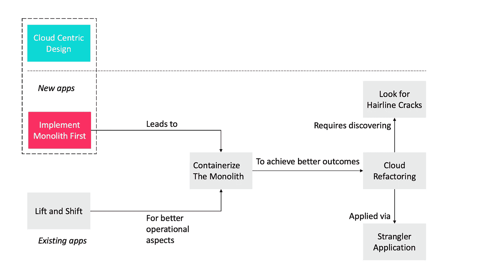
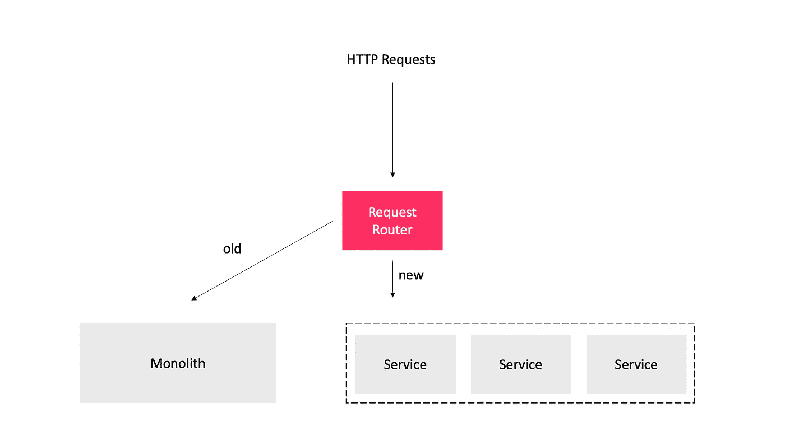

# 云采用模式:向云迁移的主要模式

> 原文：<https://levelup.gitconnected.com/cloud-adoption-patterns-top-patterns-for-moving-to-the-cloud-66ddd404455d>

## 思想建筑师

## 面向开发人员和架构师的一套模式

这里列出的云采用模式代表了组织从传统运营转向云计算的最常见方式。它们包含了前人的惨痛教训。

> 模式是对上下文中问题的解决方案。

向云迁移的最佳模式

# 以云为中心的设计

*   语境。您有能力构建一个新的应用程序来解决您的需求。
*   问题。如何设计您的应用程序来最大限度地利用云的所有特性，以实现最佳的未来适应性和敏捷性？
*   解决方案。对您的应用实施以云为中心的设计，以便在 PaaS 环境中本机运行。

云原生应用( ***诞生于云*** )遵循几个以云为中心的设计原则，使其不同于传统的构建应用。

*   它将基于微服务架构。我们可以使用领域驱动的设计从整体中提取服务。
*   遵循 DevOps 原则。
*   使用 12 因素规则:(1)代码库，(2)依赖性，(3)配置，(4)支持服务，(5)构建-发布-运行，(6)流程，(7)端口绑定，(8)并发性，(9)可处置性，(10)开发-生产奇偶校验，(11)日志，(12)管理流程。

# 首先实施 Monolith

*   语境。时间是新项目的关键，微服务会增加开销。
*   问题。如何快速启动新的应用程序？
*   解决方案。首先实现一个整体。只有当应用程序足够复杂，需要重构时，并且在应用程序证明它是值得的之后，才重构微服务架构。

首先实现 monolith 有助于开发团队了解业务领域。可以利用这些知识向微服务转型。向微服务的转变有两种方式。

*   第一种选择是保持一个坚实的整体基础，并开始围绕它构建微服务。
*   第二种选择是将整个应用程序迭代转换为微服务。

# 提升和移动

*   语境。您正在评估许多不同的云提供商选项。你有一个现成的应用程序，你想把它迁移到云中，但是你没有重写它的能力。
*   问题。如何通过将应用程序部署到云中来获得云的优势，同时最大限度地减少对应用程序所做的更改？
*   解决方案。选择一个 IaaS 云提供商，该提供商能够创建与最初构建应用程序的环境最接近的匹配。然后将现有应用程序提升并转移到云平台上。

# 用集装箱装运整块石头

*   语境。您正在将现有系统迁移到云中。
*   问题。快速迁移到云，同时又能让您灵活地进行内部开发或部署的最佳方法是什么？
*   解决方案。将您的整体应用程序容器化，作为迈向云的第一步。如果需要，您可以继续在 Docker 中运行您的应用程序，但这允许您随着时间的推移迁移到多个公共云和私有云选项。

# 云重构

*   语境。您希望将现有的应用程序迁移到云上。
*   问题。如何最低限度地调整现有应用程序以在云上工作？您负担不起从头重写应用程序的费用，但是您确实需要对其进行调整以利用 PaaS 的特性。
*   解决方案。执行云重构，以改变对现有环境的极大依赖，直到应用程序可以作为 PaaS 组件轻松部署。随着时间的推移，您可能会一次重构更多的组件，以采用更多的云原生技术。

# 寻找细微的裂缝

*   语境。您正在评估一个现有应用程序的云采用情况。
*   问题。如何找到一种方法来识别应用程序中可以重构为微服务的区域？
*   解决方案。寻找细微的裂缝——这些是整块石头容易断裂的地方。

# 扼杀者应用

请求路由器是陌生人应用的关键元素

*   语境。您从一个作为 Web 应用程序实现的遗留整体开始。当将遗留应用程序迁移到云中时，您通常需要考虑如何以渐进的方式替换应用程序。
*   问题。你需要一种方法，使你能够避免一个完整的“大爆炸”重写和替换，但仍然允许你最终替换整个整体。
*   解决方案。使用 web 应用程序和 HTTP 的结构来重定向对应用程序各部分的请求，使之远离遗留的整体结构，并转向这些功能的新实现。向新应用程序(strangler 应用程序)逐步添加特性，并在添加新特性时更新重定向逻辑。

该策略的主要思想是将新的特性和功能委托给微服务，同时充分利用旧的单片应用程序。这种方法防止 monolith 变得更大，更难维护。

# 参考

[1][https://12factor.net](https://12factor.net)

[2]https://www.ibm.com/cloud/learn/lift-and-shift

[3]https://martinfowler.com/bliki/StranglerFigApplication.html