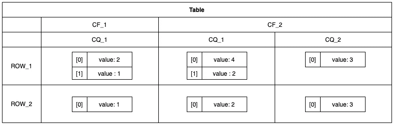

# 云大表:使用 Node.js 客户端了解大表 NoSQL 三维存储模型

> 原文：<https://levelup.gitconnected.com/cloud-bigtable-understanding-bigtables-nosql-3-dimensional-storage-model-using-the-node-js-client-237946b9c3c9>

在本系列文章的第二部分中，我们想看看 Bigtable 的 NoSQL 三维存储模型。首先，我们将从理论上了解它是如何构造的，然后我们将使用 Google 提供的 [Node.js 客户端](https://www.npmjs.com/package/@google-cloud/bigtable)，在一些实际代码上验证它。


照片由[卡斯帕·卡米尔·鲁宾](https://unsplash.com/@casparrubin)在 [Unsplash](https://www.unsplash.com/) 上拍摄

# 存储模型

Bigtable 中的存储模型与您将从其他数据库中了解到的非常不同。通常，您将使用类似 SQL 或 NoSQL 的数据库。类似 SQL 的版本将使用行和固定列定义，如 MySQL、PostgreSQL，而 NoSQL 版本通常使用类似 JSON 语法的文档来表示数据。

尽管您可以很容易地在 JSON 结构中表示 Bigtable 行，正如我们将在本文后面看到的，但是在第一次使用该模型时，这一点并不明显。这是因为 Bigtable 使用了“表”、“行”、“列族”、“列”和“单元格”等术语，这对于 NoSQL 方法来说是非常不典型的，并且会使大多数人一开始就用 SQL 术语来思考。

那么我们来看看上面提到的术语在 Bigtable 的范围内是什么意思。

**Table:** Tables 是由行组成的排序键/值映射形式的“根”元素。

**行:**行代表表中的单个实体及其列，由“行键”标识。“行键”是有索引的，所以可以非常快速地访问该行。

**列族:**列族是一种分组机制，它允许一个列族下的多个列将同一规则集应用于该列族内的所有列。

**列:**列包含每行的单个值。每个列在其列族中都有一个唯一的名称，称为“列限定符”。即使您可以在其他列族中再次使用相同的列限定符。您可以通过组合列族和列限定符来标识列。除此之外，值得一提的是 Bigtable 中的列是稀疏的，这意味着如果一列在特定的行中不包含任何数据，它就不会占用任何空间。

**单元格:**单元格是行/列交叉点内的实体。这几乎和“普通”桌子一模一样。但是 Bigtable 最大的不同在于，它不是只有一个单元格，而是可以有多个单元格。此外，每个单元格由实际值和时间戳组成，以有序的方式保存单元格，而不是单个值。

至少对我来说，当我开始使用 Bigtable 时，理解多单元格方法是一个棘手的部分，因为这看起来很糟糕。然而，我认为谷歌没有很好地记录它，至少在我开始的时候，所以我会在这篇文章中尽可能地让它变得容易理解。

您可以在下图中看到一些假想的 Bigtable 表，这可能有助于您理解其结构。



在本例中，有两行，每行包含三列。你会注意到有两列名相同， *CQ_1。这是因为它们*有相同的列限定符。尽管如此，由于我们将它们分组在不同的列族下， *CF_1* 和 *CF_2* ，您可以使用它们的列族和限定符的组合来区分和识别它们，例如 *CF_2 + CQ_1* ，以确定第二列*。*

此外，您可以看到，对于第一行， *ROW_1* ，我们为列 *CF_1CQ_1 和 CF_2CQ_1* 提供了一种数组。这就是 Bigtables 单元版本控制。如前所述，行/列组合中可以有多个单元格，按每个单元格的时间戳排序。如果您总是希望得到某一特定列的最后 X 个值，这个特性就很方便。

因为大多数读者很可能是 TypeScript/JavaScript 开发人员，并且我们后面的示例使用 Node.js，所以让我们为上面的结构定义一个 TypeScript 接口。您可以在下面的代码片段中看到指定的接口。当然，这并不反映真实世界，真实世界包含类、元数据等。但是对于理解结构来说，这应该足够了。

# 动手编码

现在是动手编写代码的时候了。我们会用 Node.js 搭配纯 JavaScript 和 Google 的[云 Bigtable node . js Client @ Google-Cloud/Bigtable](https://www.npmjs.com/package/@google-cloud/bigtable)。另外，假设您想进一步使用 Node.js 客户端，或者对 NPM 上糟糕的模块文档有疑问。那样的话，我一直建议看一下 [Google 的开发者 API 文档](https://googleapis.dev/nodejs/bigtable/3.3.1/index.html)，至少一直对我有很大帮助。

**设置**

在使用 *npm init* 初始化您的新本地节点模块之后，您必须通过`npm i --save @google-cloud/bigtable`安装我们唯一的依赖项。

除此之外，我强烈建议创建一个新的 GCP 项目，以免干扰您的生产环境。此外，您应该在您的 GCP 项目上创建一个拥有 *Bigtable Administrator* 角色的专用服务帐户，并下载它的 JSON 密钥文件，以便我们可以在测试代码中使用它。

当使用 Node.js Bigtable 客户端运行代码时，可能会出现“权限被拒绝”错误，并打印一个链接来启用云 Bigtable 管理 API。点击链接，在您的 GCP 项目上启用云 Bigtable API。这些变化可能需要几分钟才能在谷歌系统中传播开来。

可能出现的错误消息:

```
*Error: 7 PERMISSION_DENIED: Cloud Bigtable Admin API has not been used in project XYZ before or it is disabled.*
```

**代码**

在接下来的几节中，我们将仔细阅读各个代码片段，看看如何通过代码建立一个新的 Bigtable 实例。除此之外，我将展示如何从/向 Bigtable 读取/写入，并帮助更好地理解单元版本化。

如果你想立刻看到全部代码，你可以看看这个[要点](https://gist.github.com/Abszissex/93d351e01b6d1c94ced23d6f9b036816)。检查代码时，您会注意到我没有编写任何特定的错误处理，也没有检查指定的实体是否已经存在。对于生产案例，您应该总是添加尽可能多的错误处理。

**主方法**

如果你看了上面提到的要点，你会发现我们在这方面做了很多。例如，在下面的代码片段中检查 *main* 方法，您会看到我们有五个步骤来建立一个干净的环境，在其上读写，然后拆除它。

首先，我们创建一个新的 Bigtable 实例和一个新表。之后，我们向新表写入不同的数据，然后从新表中读取不同的数据。当脚本完成或发生错误时，我们删除已创建的实例，以防止空闲实例的进一步开销。如果您还记得上一篇文章中的成本指标，拥有一个 24/7 运行的 Bigtable 实例会很快变得昂贵。请记住，根据地区的不同，一个节点每小时的成本在 0.65 美元到 0.98 美元之间。幸运的是，创建和删除一个新的 Bigtable 实例只需要几秒钟。多亏了这一点，我们可以运行上面的代码片段，而不会产生很多成本。

除了实际的`main()`方法，您还可以在代码片段中看到一些常量、一个 helper 方法和 Bigtable 客户端的初始化。在接下来的代码片段中，我们需要客户端和常量。

**创建和删除 Bigtable 实例**

在写入任何数据或创建表之前，我们首先必须设置 Bigtable 实例和集群。在下面的代码片段中，您可以看到建立我们的第一个 Bigtable 实例是多么容易。因为我们还没有使用任何多集群，所以我们只需要在选项数组中定义一个集群来设置我们的新实例。

我们的集群定义很简单。首先，我们必须定义一个 ID 来标识我们的集群，告诉 Bigtable 我们想要提供多少节点，我们想要在哪个物理区域定位我们的集群，最后但同样重要的是，我们想要使用什么类型的存储 *HDD* 或 *SSD* 。

出于演示的目的，上面选择的选项并不重要。但是对于一个生产案例来说，您只是刚刚开始，您总是可以遵循以下经验法则:

*   `*nodes*` —始终从 1 开始。当开始时，这将是绰绰有余，尤其是考虑到成本。
*   `location` —始终选择离您最近的地区以减少延迟，即使这意味着多花一些成本。
*   `storage` —如果你不确定，就从固态硬盘开始吧。SSD 允许比 HDD 多得多的读取操作，即使每个节点的可用存储更少。但是特别是在开始时，可用的存储空间是绰绰有余的。

当然，根据您的用例，更改上述值是有意义的。例如，您可能需要更多的节点，因为您的表上有太多的读/写操作。或者由于法律规定，您需要实例的特定位置。

在整个过程完成之后，我们应该再次清理我们的实例，以避免不必要的开销。

只需几行代码就可以轻松做到这一点:

**在 Bigtable 中创建表格**

通过 Node.js 客户端创建一个新表非常简单，可以在下面的代码片段中看到:

您需要定义唯一的表 ID 和列族。正如我们在本文的存储模型一节中所了解的，我们现在知道列族是列的分组机制，没有附加的列族，列就不能存在。此外，我们知道 Bigtable 是一个宽列 NoSQL 数据库，所以我们不需要预定义任何列并根据需要创建它们。这也是我们在创建表时只需预定义列族的原因，这样我们就有了放置列的空间。

此外，您会注意到我们正在为两个列族定义属性 *rule.version* 。你会记得我们说过每个单元可以有多个版本。这个属性定义了。因此，我们定义第一个列族每个单元格最多保留两个版本，第二个列族只保留最新的版本。

即使设置*版本*不会在您添加新版本时立即删除旧版本。但是 Bigtable 有一些垃圾收集机制，定期运行以在内部优化您的表，并根据列族版本清理不再需要的版本。

**将简单的行写入 Bigtable**

在下面的代码片段中，我们将第一行写入数据库。我们创建了一个小的 helper 方法来创建一个简单的行，我们可以将它插入到我们的表中。值得一提的是，这个 helper 方法不是很灵活，总是使用相同的列族和列限定符来写值。

我们在这里创建的结构是一行包含一列，由*数据*数组的键值对表示。*键*是所谓的*行键*，而*值*是我们将写入由列族—列限定符组合标识的单元格中的实际值。

此外，您可以看到，在为*行键*“e”插入新值之前，我们*休眠了*250 毫秒。因此第二次插入将导致行“e”中上述定义的单元格的两个版本。如果我们现在读取这一行的值，我们会看到它会返回同一个单元格的两个版本。

使用版本化，您还应该知道版本化值的顺序不取决于接收时间。但它指的是你在`createSimpleRow()`方法中可以看到的*时间戳*属性。因此，如果您有异步操作，您不必关心代码何时向数据库添加数据。但是，如果您相应地设置了时间戳，您可以放心地假设版本控制是正确的。

**从 Bigtable 中读取数据的三种不同方式**

许多开发人员对在 Bigtable 中查询数据的概念并不熟悉，因为大多数数据库遵循不同的数据获取原则。使用 Bigtable 时，您必须知道 Bigtable 中的所有行都是按照行键按字典顺序排序的。使用行键来查询特定的行或某个范围的行应该是查询数据的唯一方式，以避免代价极其高昂的表扫描。即使您不必提供整个行键，也可以只提供一个前缀。

我将在下面的文章中处理行键的优化、设计和适当规划，因此我们不会完全超出本文的范围。

现在让我们来看看下面的代码片段，看看我们如何从 Bigtable 中高效地检索数据。我提供了在`readData()`方法中调用的三个不同的方法，并打印出它们的结果。

1.  `getRow()` —根据其唯一的行键获取单个行。接收单个行不会变得更快，因为 Bigtable 可以直接访问其内部键值映射中的键。
2.  `*getRows()*` —根据行关键字前缀获取一系列行。当试图检索相关数据时，主要使用按行键范围查询。
3.  `*getRowsStreaming()*` —当检索许多行时，通过流式方式获取行特别有用。当然，您可以并且应该在这里添加一些前缀范围或类似的内容，以防止返回整个表。在我的例子中，我不是为了演示才这么做的。请不要在没有任何前缀的情况下在生产数据集上运行。

当您需要从 Bigtable 中查询几行时，我总是建议使用流式方法。使用流式传输，Bigtable 在发送行之前必须在服务器端缓冲更少的数据，这提高了性能。否则，它必须在发送最终结果之前缓冲所有行。除此之外，您的数据接收服务已经可以异步处理接收到的行，而不必等待整个数据集到达它并保持空闲。根据使用情况，这可能会大大提高性能。

在代码片段中，在等待来自 Bigtable 的结果之后，您可以看到接收到的行的输出。例如，对于键“e”，您可以看到我们收到了两个值，打印为*【10，5】*，而 *5* 是我们的旧值，而 *10* 是我们最后添加的值。

此外，您可以看到我们对所有查询应用了一个过滤器，其中我们将 *cellLimit* 属性设置为 *2* ，导致每个单元最多接收两个版本，即使有 20 个可用版本。当您存储许多版本，但您只想获得特定用例的最新版本时，单元限制特别有用。因此，使用 *cellLimit* 可以节省很多不必要的流量。

当您使用过滤器时，重要的是要理解 Bigtable 中的“过滤器”并不意味着您可以说“只返回 X 列包含 Y 的行”或类似的话。Bigtable 没有这样的“查询语言”。但是你必须使用这里的行键。相反，您可以使用过滤器来限制单元格版本，只返回某些列族或列限定符，以及其他一些。因此，过滤器主要用于减少要查询和发送的数据量，以提高性能。

# 最后的话

通过这篇文章，我想为您提供 Bigtable NoSQL 存储模型的大致概述，帮助您理解单元版本控制，并为您提供如何创建第一个 Bigtable 实例和进行基本的读/写操作。

## 你想联系吗？

如果你想联系我，请在 LinkedIn 上给我打电话。

另外，请随意查看我的书籍推荐📚。

[](https://mr-pascal.medium.com/my-book-recommendations-4b9f73bf961b) [## 我的书籍推荐

### 在接下来的章节中，你可以找到我对所有日常生活话题的书籍推荐，它们对我帮助很大。

mr-pascal.medium.com](https://mr-pascal.medium.com/my-book-recommendations-4b9f73bf961b) [](https://mr-pascal.medium.com/membership) [## 通过我的推荐链接加入 Medium—Pascal Zwikirsch

### 作为一个媒体会员，你的会员费的一部分会给你阅读的作家，你可以完全接触到每一个故事…

mr-pascal.medium.com](https://mr-pascal.medium.com/membership)