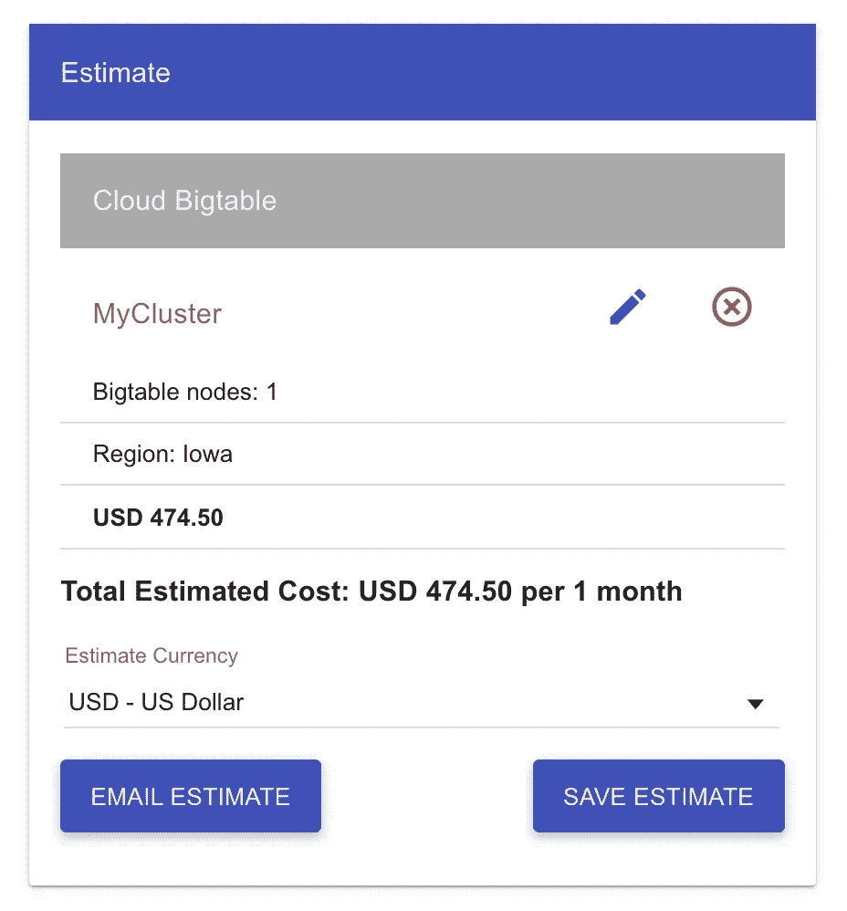
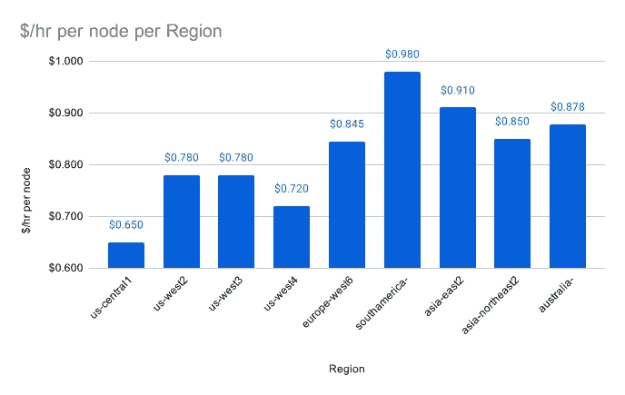
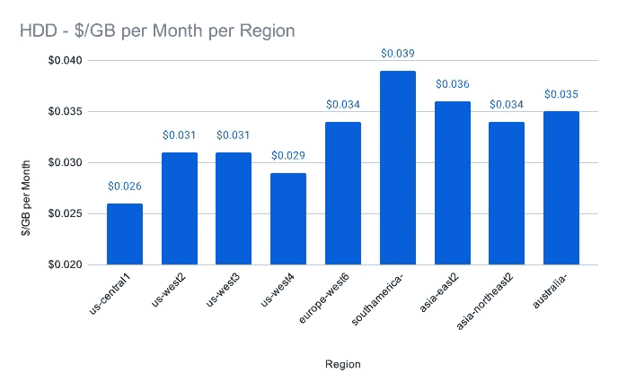
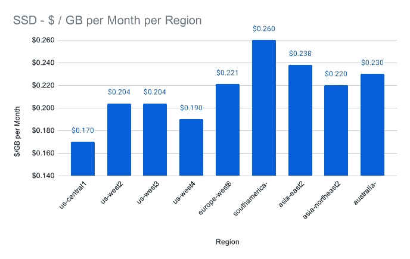

# 云 Bigtable:是什么？适合做什么？这要花多少钱？

> 原文：<https://levelup.gitconnected.com/cloud-bigtable-what-is-it-for-what-is-it-suitable-and-what-does-it-cost-31967521e16d>

Google 的 Cloud Bigtable(简称 CBT)是一个完全托管的 NoSQL 数据库，具有难以置信的速度、低维护和可伸缩性。

[rupixen.com](https://unsplash.com/@rupixen)在 [Unsplash](https://www.unsplash.com/) 上拍照

> 声明:自从这篇文章第一次发表以来，谷歌提高了它的整体价格，也影响了 CBT 的价格，所以现在的价格甚至比这里提到的还要高一点。

Google 自己宣称 CBT 的延迟只有 10ms，但仍然每秒处理数百万个请求。除此之外，您可以很容易地将 CBT 与 BigQuery 连接起来。您可以使用 BigQuery 来查询您的 CBT 数据并进行分析。

除了数据库模式的初始配置和设置之外，CBT 无需额外的开发人员端维护即可运行。唯一的“维护”发生在 CBT 集群节点必须升级时，即使这只是在 Google 的云控制台中点击几下。

在这里，我们已经看到了许多其他谷歌云技术之间的一个显著差异。CBT 不是无服务器的，因此，您必须预先定义集群上要使用的节点数量。即使您可以在不停机的情况下扩展集群，也可能需要几分钟时间(取决于与现有节点相比添加了多少额外节点)才能完成所有新节点的准备工作。

尽管我上面提到的低维护对于已经运行的 CBT 是有效的，但这并不意味着当您想要正确伸缩时，CBT 很容易使用。当第一次使用 CBT 并坚持随意的方法时，你可能并且很可能会以错误或低效的方式做很多事情。

但是不用担心。本系列文章将帮助您从云 Bigtable 开始，并正确地使用它来扩展您的系统。与所有其他技术一样，在开始研究和使用所有优化技术之前，我们将首先介绍一些基础知识。

**云 Bigtable 用例**

Google 构建了云 Bigtable，以高性能和低延迟的方式处理每秒数百万个请求。考虑到这一点，以下是最常见的使用案例:

*   实时分析
*   跟踪数千个物联网传感器数据
*   数据的实时存储和查询
*   AdTech
*   金融科技

**什么时候不该用云 Bigtable**

当然，云 Bigtable 并不是适合所有用例的解决方案。云 Bigtable 不是一个好的解决方案的典型用例如下:

*   数据湖
*   长期储存
*   当您需要复杂的查询时

对于数据湖和长期存储，Google 提供了更好的方法来满足这种需求。

作为一个例子，BigQuery 将更适合上述所有要点。由于您可以在不运行服务器的情况下存储无限量的数据，并且每存储 GB 的成本更低，尤其是在使用长期存储时，复杂的查询也不是问题。但是，当然，BigQuery 的实时性甚至不如 Bigtable。如果您阅读了我以前关于 BigQuery 的文章，您会知道 BigQuery 使用作业来运行其自动调度的查询，并且您不应该等待它们。

如果只是关于长期存储，这里首选 Google 云存储的方式。因为您可以大幅削减成本—从标准存储到归档存储的成本降低了 94%—即使您不可能简单地查询/分析数据。

除了以上几点，云 Bigtable 并不是小型项目的首选技术。大多数情况下，它的复杂性是多余的，一个简单的 MongoDB 也可以完成这项工作。除了复杂性，成本肯定也是一个非常关键的因素。在下一节中，我将介绍使用云 Bigtable 需要管理的不同成本。现在，您已经可以在下图中看到，一个云 Bigtable 实例的最低配置已经花费了每月 474.50 美元，尽管我们没有在那里存储任何数据，也没有包括网络带宽。因此，几乎每月 500 美元，使用一个更便宜的地区，只有一个可用的实例。

# 基本术语—实例、集群和节点

在继续之前，我们需要声明 Cloud Bigtable 中的几个基本术语以防止混淆。

**实例**

Cloud Bigtable 中的实例是数据的容器和集群的包装器。因此，实例对数据拥有主权，而不是单个集群或节点。此外，您在实例级别定义存储类型(HDD 或 SSD ),因此所有集群都必须使用相同的存储类型。

除此之外，特定实例中的所有集群除了它们的区域之外，配置都是相同的。这也意味着当每个实例使用多个集群时，您正在进行复制。

一个实例最多可以有四个集群，最少需要一个集群和一个节点。此外，它只是 Bigtable 服务的包装，背后没有任何业务逻辑。

**星团**

Bigtable 中的集群表示特定区域中的 Bigtable 服务，因此，一个区域中只允许一个实例的一个集群。第二个集群必须在不同的区域运行。

当您开始使用复制并在一个实例中运行至少两个集群时，Cloud Bigtable 会自动同步两个集群之间的数据更新，因此每个副本都具有相同的本地数据集。

使用多个集群，您还可以使用“应用程序配置文件”以不同的方式将流量路由到各个集群——关于应用程序配置文件的更多信息，请参阅另一篇文章。

如果使用复制，当一个群集不可用时，可以从一个群集故障转移到另一个群集。因此，运行第二个集群始终是实现高可用性的一种安全机制。

**节点**

Bigtable 中的节点是管理数据和读写表的实际处理单元。更多关于“表”的内容将在后面的文章中介绍，但已经作为警告了。不要将 Bigtable 中的表与来自类似 SQL 的数据库服务的表相混淆，因为我们在开始时已经说过:Bigtable 是一个 NoSQL 数据库。

即使您只定义了一个表，Bigtable 也会在后台将这个表分割成单独的*片*。对于本文的范围来说，深入研究平板电脑有些矫枉过正。但是您应该知道，Bigtable 将每个 table 分配给单个节点，因此，Bigtable 将总是对特定 table 的所有操作使用同一个节点。

因此，如果您想要从/向特定的平板电脑读取/写入，负载将总是在同一个节点上，而不是分布在不同的节点之间，即使您有几个正在运行的节点。了解这一点对我们后面的优化文章非常重要。

但是分布负载和优化您的 Bigtable 实例/集群/节点对于**至少是**另一篇文章来说已经足够了，因为有很多东西需要考虑。

**结构**

在下图中，您可以看到如何从高层次的角度假设 Bigtable 结构，尽管它有些简化。

一个实例可以有几个集群，集群又可以有几个节点。每个节点包含几个关联的平板电脑，而由于复制的性质，Bigtable 在不同集群之间同步平板电脑的数据。

# 费用

在我已经提到高的最低成本之后——当然，如果你每月的账单是 50000 美元，那么 500 美元并不算高😉—在最后一部分，让我们更详细地了解一下是什么推动了云 Bigtable 的运行费用。

使用云 Bigtable，有四种不同的成本驱动因素:

1.  节点
2.  工作数据的存储成本
3.  备份数据的存储成本
4.  网络带宽

**节点**

云 Bigtable 中的每个集群至少包含一个节点。对于地区 *us-central1* ，Google 每个节点收费 0.65 美元/小时，这样每月总共 468 美元(用 30 天计算)，只为你的节点不做任何事情就存在。

但是你要小心。例如，不要为您的集群随机选择一个区域，因为您的集群每个节点每小时的价格相差很大。

在下图中，我列出了几个可用的区域及其每个节点每小时的价格。如您所见，差异非常显著，从 0.65 美元到 0.98 美元，从最便宜的到最贵的成本增加了**50%**！

当然，你不应该盲目地遵循这个成本表。选择更贵的定价可能有一个很好的理由。例如，你可能是一家位于苏黎世的瑞士公司，所有的数据和客户都在你身边。在这种情况下，使用*欧洲-西方 6(苏黎世)*可能**有意义，尽管它更贵，但与通过太平洋与服务器交谈相比，你得到的减少的延迟*美国-中央 1*——可能值得这些额外的成本。**

**工作数据的存储成本**

除了实际工作的机器(节点)，您还必须为大表集群的存储付费。出于计费的目的，谷歌经常测量你的数据存储量，并将其平均值乘以月费率。

使用 Bigtable，您可以在两种不同的存储类型(HDD 和 SSD)之间进行选择，每种类型都提供不同的成本和性能价值。

我不会在本文中讨论这两者的细节，但在接下来的文章中，作为一个经验法则，如果您需要尽可能低的延迟，您可以假设使用 SSD 总是更好，如果您没有延迟敏感的用例，HDD 可能也可以。但是，当然，由于其性质，SSD 比 HDD 贵得多，是 HDD 的 6.5 倍。

此外，与节点价格类似，*美国中部 1* 最便宜，而*南美东部 1* 存储价格最贵。因此，尽管差异没有节点那么大，但仍然很显著。

在下面两张图中，您可以看到一组特定区域的硬盘和固态硬盘的不同存储价格。

查看上面的图表，您可能还会注意到，HDD 与 SSD 的价格比率在各个地区总是相同的。总是贵~6.5 倍。

此外，如果使用多个集群，可以在紧急情况下进行故障转移。你应该考虑到 Cloud Bigtable 为每个集群保存了一份单独的数据副本，所以 Google 也会相应地向你收费。如果从一个集群迁移到两个集群，这会导致存储成本翻倍。

**备份数据的存储成本**

在 Cloud Bigtable 中，如果数据损坏，您还可以创建数据备份来恢复集群中的特定时间点。

谷歌对备份存储收取与硬盘存储相同的费用。由于内部 Bigtable 优化，存储/收费的数据可能少于整个数据集的实际物理副本，但绝不会更多。

**网络带宽**

像往常一样，云提供商总是会对使用的流量收取一些费用。与其他成本驱动因素一样，不同地区之间的成本也存在差异。然而，即使在网络流量方面，这种差异也没有其他差异那么显著。

作为一般规则，到云 Bigtable 的入口流量总是免费的，并且也没有限制。

在谷歌的网络中，跨区域网络出口到同一个洲的费用是 0.01 美元/GB。谷歌像收取互联网出口费一样收取洲际出口费。

互联网出口速率有许多不同之处，因为它取决于您将数据发送到何处以及数据需要流向何处。此外，Google 在这里提供了一些分层计费，涵盖 0–1TB、1–10TB 和 10TB 以上。

由于很多可能性，我不会在这里提供完整的列表。但是你可以在谷歌官方文档中找到互联网出口率的完整列表。

但根据经验，在达到 10+TB 层后，您可以假设全球出口为每 GB 0.08 美元，即使这里不包括中国和澳大利亚。

# 最后的话

正如您在本文中已经看到的，有相当多的因素需要考虑，尽管我们只概述了 Bigtable 的成本和基本结构，还没有考虑任何实现或实际的数据结构。

与许多其他云产品也非常不同，Bigtable 从单个节点的高初始成本开始，而不管其实际用途。因此入门门槛相当高，大多数时候，您应该只在最低 500 美元没有问题的项目中使用 Bigtable。如果你开始一个小的创业公司，并且必须控制成本，那么还不需要 Bigtable，因为你还没有足够的流量让 Bigtable 值回它的成本。

除此之外，您必须始终监控您的 Bigtable 集群，以便及时请求集群的向上扩展，因为正如您从无服务器产品中所了解的那样，没有自动扩展。这里要提到的最后一点是，每个节点只能处理一定量的存储，这取决于其存储类型，因此减少可用存储也是一个向上扩展的原因。

## 你想联系吗？

如果你想联系我，请通过 [LinkedIn](https://www.linkedin.com/in/pascal-zwikirsch-3a95a1177/) 联系我。

另外，可以随意查看[我的书籍推荐](https://medium.com/@mr-pascal/my-book-recommendations-4b9f73bf961b)📚。

 [## 我的书籍推荐

### 在接下来的章节中，你可以找到我对所有日常生活话题的书籍推荐，它们对我帮助很大。

mr-pascal.medium.com](https://mr-pascal.medium.com/my-book-recommendations-4b9f73bf961b)  [## 通过我的推荐链接加入 Medium—Pascal Zwikirsch

### 作为一个媒体会员，你的会员费的一部分会给你阅读的作家，你可以完全接触到每一个故事…

mr-pascal.medium.com](https://mr-pascal.medium.com/membership)