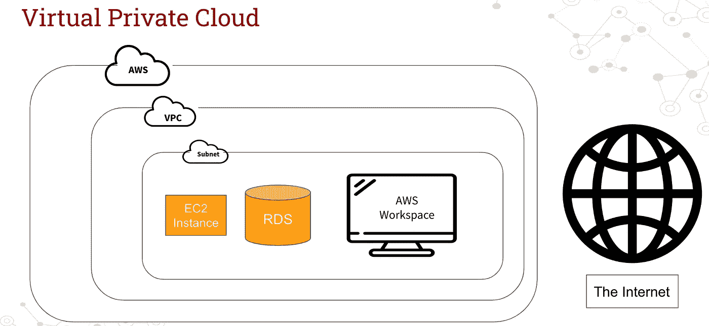
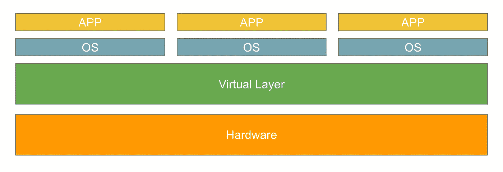
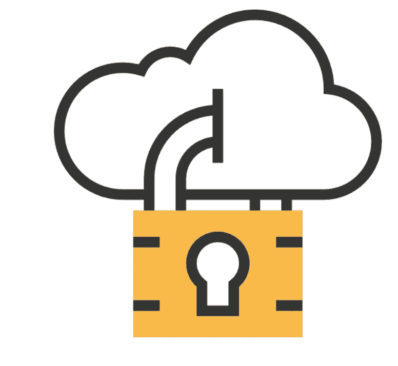

# 云计算 101:云服务和概念介绍

> 原文：<https://levelup.gitconnected.com/cloud-computing-101-intro-to-cloud-services-and-concepts-2bc89bce2de>

## 解释虚拟私有云、弹性计算等的重要性

劳拉·温克在 [Unsplash](https://unsplash.com/s/photos/cloud?utm_source=unsplash&utm_medium=referral&utm_content=creditCopyText) 上的照片

云计算已经从一项仅限于价值数十亿美元的大公司的技术变成了任何人都可以使用的技术。大多数开发人员可能已经忘记了偶尔运行 AWS 的 EC2 实例，因为在一天结束时，可能每月只需要 10 美元就可以维持 Linux 机器的运行。

这种可访问性为中小型企业提供了一个机会，它们希望以较低的成本获得与大型企业同等水平的技术。

这些技术可以帮助您的企业扩展，并利用过去需要多个系统管理员和开发人员来设置的技术。现在，您只需进入管理控制台，点击几个按钮，就可以了。

好吧，没那么简单。

如果是的话，那么每个人都会这么做。

但是第一步是知道什么是可能的。

因此，这篇文章的目的是涵盖一些基本概念，你作为一个企业主应该了解，这样你就知道你能做什么。

# VPC 私有云

让我们从一个非常重要的概念开始，那就是私有云，有时也称为虚拟私有云或 VPC。这使您的团队能够建立一个虚拟网络，只有具有正确授权设置的团队成员才能访问该网络(有时这是使用 AWS Workspace、VPN 等设置的)。

这使您的公司能够拥有自己的网络。你可以直接设置你的网络，而不需要设置你的服务器并使用以太网连接你的电脑。这很好，因为它可以让你远离互联网(或者至少多几层)。过去，公司需要雇用一名系统管理员，设置服务器和数百名有能力的人来整合他们的网络。

# 无服务器

也许你听说过这个词作为新的热门词汇到处流传。他们使用无服务器基础设施。

这是怎么回事？你怎么能没有实际的基础设施而仍然有代码功能呢？

嗯，这是因为无服务器并不是指有任何服务器参与，只是没有一个指定的特定服务器。相反，云服务提供商只负责执行代码。它在哪里执行基本上取决于提供者。

这使得云服务提供商能够降低他们的成本，从而将他们节省的成本传递给客户。事实证明，与使用 EC2 等其他服务相比，这在降低成本方面非常有效。

# 虚拟化

首先，虚拟化并不总是需要基于云。虚拟化已经流行了一段时间。实质上，虚拟化让您可以将多个环境放在一个硬件上。这可能是多个虚拟服务器、虚拟桌面等。

比如虚拟桌面，AWS 提供了一个叫 AWS Workspace 的东西。这实际上是一台你可以遥控使用的电脑。

为什么这很有帮助？

## 资源的部署

随着世界继续推动更多的远程工作，必须获得一台准备好供新员工使用的笔记本电脑并将其发送给您的员工，这不仅在后勤上非常耗时，而且还存在安全风险。

相反，您可以启动新员工当天可以使用的虚拟桌面。

## 降低成本

随着公司的发展，很难跟踪您拥有多少台笔记本电脑以及何时需要购买更多。这导致许多公司过度购买笔记本电脑，并经常失去对其资源的跟踪。另一个选择是开发一个资源跟踪系统，通常需要几个员工来管理和监控。所有这些最终会让公司每年多花数千美元。

## 管理您的网络

回到 VPC 思想的概念。例如，当您已经在利用基于云的网络时，拥有虚拟桌面可以轻松管理您的网络。在这种情况下，从技术上来说，您的其余大部分服务器通常也是虚拟的。因此，当涉及到管理 IP 地址的进出以及哪些计算机可以访问您的网络时，拥有一个虚拟网络可以简化很多工作。

通常只需配置少量设置，您的工作空间可以访问 VPC 的其余部分，而外部用户则不能

# 供应商锁定

来自 www.flaticon.com[的](https://www.flaticon.com/)[桉树](https://www.flaticon.com/authors/eucalyp)制作的图标

供应商锁定是所有中小型企业都需要了解的一个非常重要的主题，因为它会对他们的财务产生影响。您的企业变得依赖任何技术(无论是云技术还是其他技术)的一个不利方面是供应商锁定。

这与其说是一个技术术语，不如说是一个一般概念。它指的是这样一种情况，即一家公司的业务的一个关键部分变得依赖于一家供应商，而由于高昂的转换成本，该公司无法转换到另一家供应商。

例如，假设您在 AWS 上开发整个应用程序。然后你会发现，转而使用谷歌的云，你可以花更少的钱。

太好了！

但是转换的代价是什么呢？如果你需要雇佣一个开发人员来切换你的软件，重新连接 API，以及切换你所有的基础设施，这对于你的公司来说可能太昂贵了。即使将来可能会更便宜。

这就是为什么它被称为供应商锁定。

现在转换的成本可能太高了，即使从长远来看能为你省钱。有时，一些云提供商甚至会在你与他们的合同中加入偷偷摸摸的条款，如果你停止使用他们的服务，你仍然需要支付一些可笑的提前终止服务的费用。

所以要小心你早期的选择。

# 弹性计算

在云计算中，有一个被称为弹性的概念。这是指系统通过根据需要减少和增加资源来适应工作负载的能力。

拥有能够适应的系统的能力是云服务提供商存在的首要原因之一。这不仅仅是硬件的问题，也是管理硬件的软件的问题。拥有可以快速扩展资源来管理输入网络流量或数据库事务的软件，可以让客户只为他们使用的东西付费。

AWS 的 EC2 就是一个例子。这代表弹性计算 2。这允许您作为用户

# 云迁移

如果您的企业比较大，或者只是利用大量的云服务，那么您可能最终需要从一个云提供商迁移到另一个。为什么你的公司可能会这样做，因为也许你可以通过转换节省一大笔钱，或者你可能需要其他云的一些技术能力。

如果你的公司很小，那么这个数字可能在 2 万到 4 万之间，但是如果你的公司很大，这个数字可能会超过 10 万到 20 万。这取决于要迁移的服务类型。例如，由于迁移而不得不重写代码会非常昂贵，而仅仅改变存储备份的位置会稍微便宜一些。

# 一些基本服务怎么样？

## 亚马逊的简单存储服务(亚马逊 S3)

[S3 斗](https://aws.amazon.com/s3/)

亚马逊的简单存储服务(亚马逊 S3)是一个云存储服务，允许您使用 REST 和 SOAP 与存储的对象进行交互。

S3 提供对存储系统的访问，存储系统是快速、可靠、可扩展且廉价的数据存储基础架构。几种客户端类型，无论大小，都可以利用其服务来存储和保护不同用例的数据。

亚马逊 S3 提供对象(本质上是文件)存储服务，具有集成数据、易于使用的管理和云经常提供的其他一切功能。它本质上可以充当一种文件服务器，可以为您的网站管理您公司的内容，如视频和照片，或者用于为您的分析开发数据层。

## BigQuery

BigQuery 是 Google 使用 BigTable 构建的无服务器企业级数据仓库。

该应用程序可以在几秒钟内对过去难以管理的大量数据执行复杂的查询。

BigQuery 支持 SQL 格式，并通过命令行工具和 web 用户界面提供可访问性。这是一种可扩展的服务，允许用户专注于分析，而不是处理基础架构。

我喜欢 BigQuery 的在线用户界面。无需设置任何连接器或下载任何第三方工具来与数据交互。

## AWS 豆茎

[AWS 豆茎](https://aws.amazon.com/elasticbeanstalk/)

你是否曾经希望只需点击部署就可以在线查看你的网站，而无需太多的配置？使用 AWS Beanstalk 服务，您可以轻松地部署用 Java、Python、.NET，PHP。和其他几种语言，而不必花太多时间配置服务器。

Elastic Beanstalk 服务用于部署和扩展使用 Apache、Nginx 和 IIS 等服务器的应用程序。要使用这项服务，您只需在 AWS 上上传代码，所有部署流程(如自动伸缩、应用程序监控、容量供应和平衡)都由 beanstalk 自动处理。

# 是时候开始您的云之旅了！

随着这些基本术语的消失，我们的团队希望您对云计算词汇有一个良好的基线。虽然仍有许多细微差别，但当你打算做出关键决定时，有一个良好的基本理解会对你有所帮助。