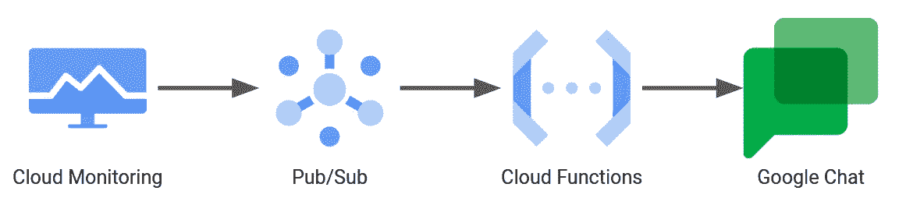
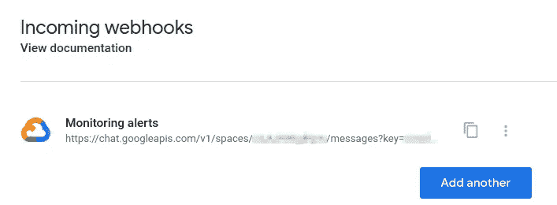
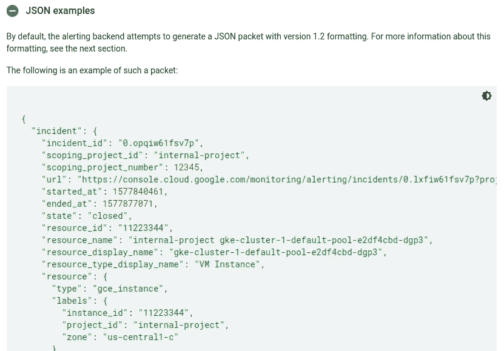
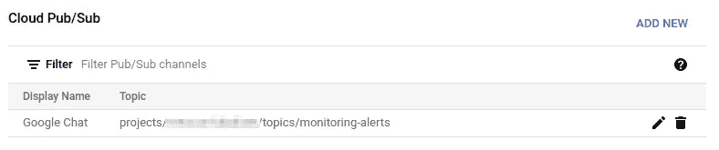
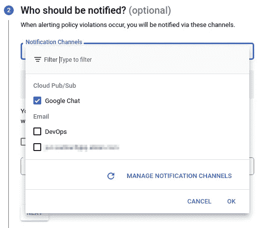
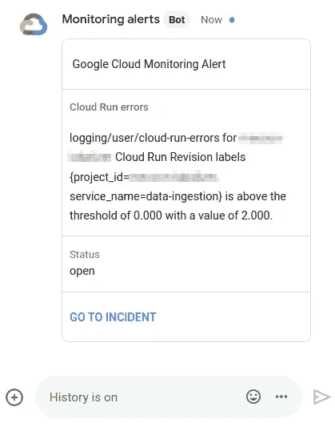

# 云监控，我们需要聊天

> 原文：<https://levelup.gitconnected.com/cloud-monitoring-we-need-to-chat-54c45b346a21>


沃洛季米尔·赫里先科在 [Unsplash](https://unsplash.com?utm_source=medium&utm_medium=referral) 上的照片

[云监控](https://cloud.google.com/monitoring)是跟踪运行在谷歌云平台上的工作负载的应用指标和错误的重要工具。除了其仪表板功能，它还允许您定义警报策略，以便在出现错误或指标高于阈值时自动通知您。

云监控支持不同的[通知渠道](https://cloud.google.com/monitoring/support/notification-options)，如电子邮件、短信或 Slack，但奇怪的是，不是谷歌自己的聊天应用，它是谷歌工作区的一部分。我个人更喜欢在团队聊天中而不是通过电子邮件获得警报，这样团队可以更容易地协调解决事件。

幸运的是，使用[云功能](https://cloud.google.com/functions)和 [Pub/Sub](https://cloud.google.com/pubsub) ，我们几乎可以立刻构建与 Google Chat 的集成。设置如下:



警报将发布到 Pub/Sub，然后通过云功能转发到 Google Chat

我们从配置 Google Chat 开始，回溯到云监控中的警报策略。

首先，我们需要[在 Google 聊天空间中创建一个 webhook](https://developers.google.com/chat/how-tos/webhooks#setting_up_an_incoming_webhook) 来发布警报。



创建一个网页挂钩，复制网址

接下来，我们编写云函数，将监控警报转发到上一步中生成的 webhook URL。我们不能在云监控中直接使用这个 webhook 作为通知渠道，而是需要一个云功能，因为 Google Chat 需要一个与云监控不同的消息有效负载结构。如[文档](https://cloud.google.com/monitoring/support/notification-options#pubsub)中所述，警报消息是以下形式的 JSON:



来源:[https://cloud . Google . com/monitoring/support/notification-options # pubsub](https://cloud.google.com/monitoring/support/notification-options#pubsub)

然而，Google Chat，[期望](https://developers.google.com/chat/api/guides/message-formats/basic#basic_unformatted_messages)有效载荷看起来像这样:`{"text": "Here goes the message content"}`。因此，我们为 Google Chat 定义了一个消息模板，其中包含感兴趣的警报参数的占位符(例如`incident[summary]`),并使用一个云函数将占位符替换为警报的实际值，并将生成的 JSON 转发给 Google Chat。

让我们使用 Python 和 fancier [卡消息](https://developers.google.com/chat/api/guides/message-formats/cards)格式，而不是基本的文本格式。它基本上只需要三行代码和消息模板(完整代码也在 [Github](https://github.com/jsarbach/cloud-monitoring-2-google-chat) 上):

注意，我们不是以字典的形式定义模板，并循环遍历所有嵌套层来替换占位符，而是将模板定义为 JSON 字符串，使用`format()`进行替换，然后将其解析到字典中。这是一行代码，而不是许多代码:

```
message = json.loads(MESSAGE_TEMPLATE.format(**alert))
```

应用`format()`时[转义](https://docs.python.org/3/library/string.html#format-string-syntax)需要用到模板串中的双花括号`{{...}}`。

该部署了！

```
gcloud functions deploy monitoring-alerts --entry-point monitoring_alerts --region europe-west6 --runtime python39 
--trigger-topic monitoring-alerts
```

发布/订阅主题`monitoring-alerts`是为我们自动创建的。因此，剩下要做的就是建立一个相应的发布/订阅通知通道，并在我们的[警报策略](https://cloud.google.com/monitoring/alerts/using-alerting-ui)中使用它。



为监控警报创建通知通道…



…并在警报策略中使用它

就是这样。现在，享受谷歌聊天中显示的提醒信息吧(但别忘了关注它们)。



哦，你好，你这个大错误