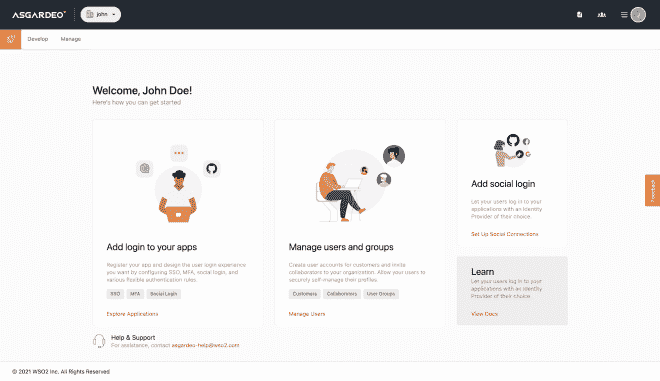

# 我从为 Asgardeo 构建云原生前端应用中学到了什么

> 原文：<https://levelup.gitconnected.com/cloud-native-frontend-app-development-3fef8759d399>

## 云原生前端应用开发

时代变化很快。如果你从事科技行业，就更是如此。15 年前，JavaScript 只是一个儿童玩具，被谴责为给网页提供某种可编程性的外表。今天，它将带我们去太空。15 年前，WSO2 identity Server 是一个基于本地服务器的新兴身份解决方案。今天，我们将启动云计算。

Asgardeo 对我和我的团队来说是一个巨大的飞跃。实现飞跃意味着改变你的思维，质疑你的感知，彻底改变你的工作方式。虽然这显然不容易，但范式转变是不可避免的。毕竟是时间强制的。你挣扎，跌倒，感觉像个骗子，坚持，坚持，最终你胜利了。

对我来说，开发 Asgardeo 是一次既谦卑又有教育意义的经历。在通往终点的路上，有很多东西需要学习。在这里，我分享一些我从构思到实现的心得。

# 准备好无聊吧

我在开发 Asgardeo 控制台应用程序时面临的一个主要问题是，我已经非常习惯于前端应用程序的可视化设计，以至于对此感到厌倦。事实上，我觉得在开发前端应用程序的某个时候，你开始质疑自己的设计选择是一种习惯。

这是非常自然的，我很肯定大多数开发人员会有这种感觉。虽然这种感觉很难消化，但我发现它给了我一个机会来认真审视最初的设计，并使它们重新焕发活力。毕竟，让你的设计受到质疑只会让它们变得更好。

然而，提醒你自己也很重要，一旦我们熟悉了事物，就会发现它们很无聊，这是我们的天性。仅仅因为应用程序的设计不再让我兴奋，并不意味着用户在第一次使用应用程序时会有同样的感觉。这就是为什么你必须不时地对你的视觉设计进行可用性测试。

即使你不应该完全忽视这种感觉，它在很大程度上是消极的，你也应该确保你不会沉溺其中。作为一条经验法则，每当我发现一些不那么吸引人的东西时，我都会仔细看看。如果有什么我能改变的，我已经改变了。否则，我继续提醒自己这只是一种自然的感觉。

这给我上了重要的一课——需要留心。意识到我们的认知偏差并留意它们在我们的设计和开发中的影响，对于为我们的用户提供良好的用户体验和安心是非常重要的。在这里，当我意识到我的设计没什么可改进的时候，对人类与生俱来的无聊本性的关注让我坚持己见。

# UX 和 frontend 之间的联盟

到现在为止，你可能已经开始想知道为什么一个前端工程师会关心 UX 的设计。这是我的第二堂课。

人们很容易认为 UX 是这个行业中的一个独立领域，它设计产品并把它们交给开发者。实际上，情况可能并非如此。事实上，我一点也不喜欢把设计交给开发团队的想法。

原因有二。尽管开发几种不同产品的大企业可能有能力拥有一个专门的 UX 设计师团队，但开发一两种产品的中型企业负担不起太多的 UX 设计师。因此，前端工程师将不得不一直戴着 UX 设计师的帽子。

虽然你可能会说工程师不应该做 UX 的设计，但我强烈反对。我相信好的工程总是好的 UX 思维的产物。不了解用户的痛点，就不可能设计出解决方案。以圆珠笔为例。拉迪斯洛·比罗发明了圆珠笔，因为他厌倦了经常给自来水笔换笔芯。这就是了。伟大工程的核心是好的 UX 思想。

第二个原因是设计在进化。我不认为你可以确定一个设计，然后称之为最终设计。总会有新的想法，新的视角，当然，也有几个灵光乍现的时刻。

因此，随着设计的发展，开发不能只是等待。UX 进程永无止境。因此，开发过程必须搭上 UX 设计过程的顺风车，并经历几次迭代。设计、开发和测试都成为迭代的一部分。这是一个无止境的过程。毕竟，完美不是一种状态；这是一个过程。

# 进步的启示

真相并不是一下子就显露出来的。这一理念非常适用于前端工程。有时，很容易被许多不同的设计想法和计划淹没，以至于你甚至不知道从哪里开始。通常，你会被设计阶段本身所消耗，而看不到任何结束的迹象。

重要的是要明白，人类的头脑是思想的宝库。你越是不断寻找新的想法，你就会发现越多。所以，重要的是你要选择一些东西并从某个地方开始。你不必一次做所有的事情。只要从一个可行的想法开始，并开始实施它。然后，您可以反复访问和修改设计。

我通常会想出一个功能的设计，与我的团队讨论，修改，然后开始实现它们。有时，设计是不完整的。有一个问题我找不到设计解决方案。最初，我对此感到焦虑。但渐渐地，我了解到事情可以随时解决。

通常，当您尝试解决另一个功能中的设计问题时，可以找到设计问题的解决方案。在其他时候，你会在新一轮的讨论中发现它。这就是为什么某个地方很重要。建立一些可行的东西，并不断添加新的东西。

实现也将逐步改进。因此，一些在开始时看起来如此不讨人喜欢的东西将随着时间的推移逐渐成形，并不可避免地成为成熟的功能。特征只有逐渐变得完整！

# UX 在发展

正如我前面提到的，设计是不断发展的。所以，不要太依赖你已经开发的功能。在前端，没有什么是永恒的。这也包括应用程序！

是的，我们从一个开发人员门户应用程序开始。然后，开发人员门户被拆分为管理门户和开发人员门户。然后，我们认为它应该是一个应用程序，并将这两个应用程序结合在一起，并将其命名为控制台应用程序。一个变成了两个，两个又变成了一个。欢迎来到前端开发的世界！

这可能会让一些人感到沮丧，但这就是现实。不要期望事情会僵化。会有新的想法。新的研究将发掘出新的见解。所以，你必须时刻准备着改变。“如果它没坏，就不要修理它”的普遍观点并不适用于前端。

# 熟悉阻碍了共鸣

当您熟悉用户流时，您最终会将自己限制在可预测的用户交互模式中。此外，你还会忘记用户的痛点。

例如，在我们应用程序的一个表单中，我们有一个允许用户输入 URL 的文本框。然后，我们有一个文本按钮，允许用户将该 URL 添加到允许的来源列表中。如果不将其添加到允许的来源列表中，该 URL 将毫无用处。然而，我们已经习惯了一输入 URL 就通过肌肉记忆点击按钮，我们没有意识到我们可以自动将该 URL 添加到允许来源的列表中。

当我们用一个新用户测试这个流程时，我们意识到了这个小故障。所以，这对我来说是重要的一课。当您开发和测试应用程序时，您最终会轻松地通过流程。而这种知识的诅咒会让你很难与一个新用户产生共鸣。在我看来，唯一的解决办法是不时地测试你的应用程序的可用性。

# 巡航控制与超级用户

我们的内部产品非常具有可定制性，因为我们希望该产品能够满足不同用户的需求。换句话说，我们没有特定的最终用户。

在为云开发应用程序时，我们需要了解最终用户。这意味着你需要抽象出大量的特性来为用户提供一个简单的、没有麻烦的用户体验。我们的理念从构建高度可定制的产品转变为构建高度定制的产品。

例如，我们在云应用程序中预配置了许多基于用户角色的设置，而我们允许用户在本地产品中配置它们。这使我们能够为最终用户提供出色的用户体验。

然而，它并不完美。有时候，我们希望用户可以选择调整设置，同时确保它从主用户流中抽象出来。我们通过两种方式实现了这一点。

首先，我们创建了一个更简单的创建流程，并允许在编辑视图中进行额外的配置。因此，如果用户希望快速创建应用程序，他们可以浏览应用程序创建流程。如果另一个用户想要对某些设置进行粒度控制，那么他们可以在编辑视图中这样做。

第二，默认情况下，我们在屏幕上隐藏了高级设置。这使得用户界面更加简单明了。超级用户可以通过取消隐藏设置来访问高级设置。

# 更多的测试，更少的遗憾

当开发内部产品时，我在测试上很放松。这是因为我们不必持续开发和集成本地产品。产品的一般可用版本只会在开发生命周期结束时发布。

但是，在云中，您的代码更改会持续推送到云中。这意味着，没有更多的空间来存放错误或半生不熟的代码。因此，我必须手动测试我的实现，并运行自动化的端到端测试，以验证我的更改是有序的，并且没有破坏应用程序中的任何其他内容。

由于我已经习惯了这个过程，所以有点习惯了。但是通过在云中破坏构建和崩溃应用程序，我最终强迫自己确保我推到云中的代码是稳定的。这是一个很大的学习曲线。

Asgardeo 对我来说是一个迷人的旅程，它将继续保持下去。就像产品本身一样，我意识到我也经历了几次变化。我的想法已经改变，我的工作流程已经进化，开发过程也有了新的转折。

最激动人心的部分还在后面。我最兴奋的是知道真正的用户对实际产品的感觉，并根据他们的反馈重复设计。知道改进用户体验后，开始修改你从零开始构建的功能将会非常有趣。

在某种程度上，你可以说最大的挑战还没有到来。从头开始开发云应用程序只是应用程序生命中的一小部分。我知道我最终会花更多的时间来维护和改进它，而不是开发它。

无论如何，这段经历让我非常充实，让我对未来充满期待。下面是更多的设计、讨论、迭代、可用性测试、代码变更以及随之而来的产品改进！

*原载于 2021 年 11 月 4 日*[*【https://www.thearmchaircritic.org】*](https://www.thearmchaircritic.org/tech-journal/what-i-learned-building-a-cloud-native-frontend-app-for-asgardeo)*。*