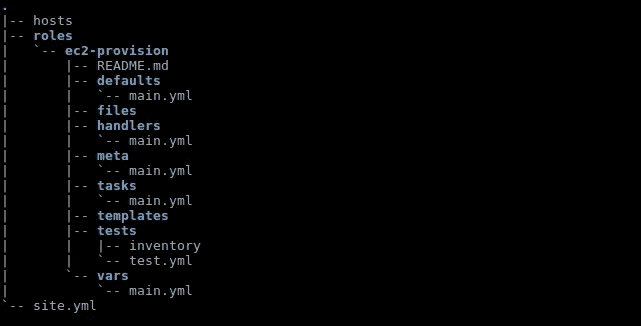
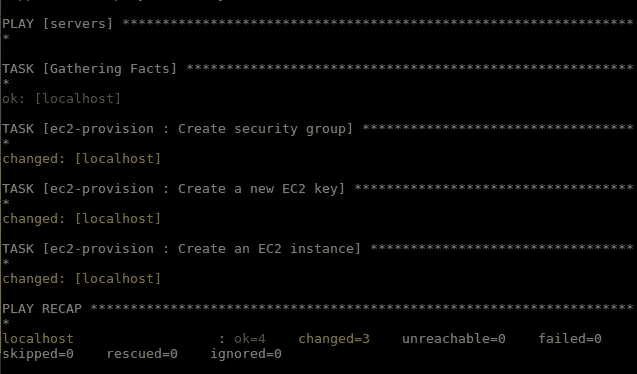
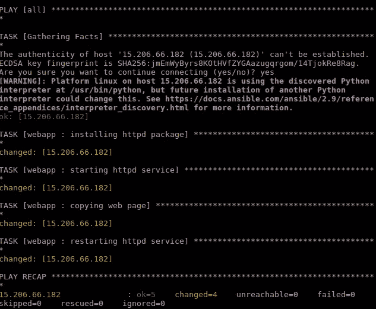
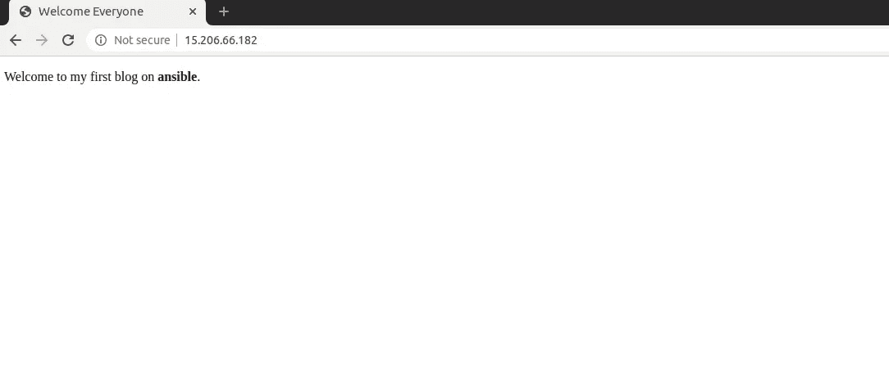

# 使用 Ansible 在 AWS 中提供实例和部署应用程序

> 原文：<https://levelup.gitconnected.com/cloud-provisioning-and-app-deployment-to-aws-using-ansible-56f00fc0d36d>


*这篇* ***博客*** *描述了如何在****AWS****上创建 EC2 实例和* ***部署****web 应用。在这篇博客中，我们将介绍使用 Ansible 相对于其他配置管理工具的优势。除此之外，我们还将展示如何设置 Ansible、定义角色以及编写剧本来提供 ec2 实例并使用 Ansible 部署简单的 web 应用程序。*

# 什么是 Ansible？

A nsible 是一个开源平台，用于自动化和各种操作，如[云供应](https://www.ansible.com/provisioning?hsLang=en-us)、[配置管理](https://www.ansible.com/configuration-management?hsLang=en-us)、[应用部署](https://www.ansible.com/application-deployment?hsLang=en-us)、[服务内编排](https://www.ansible.com/orchestration?hsLang=en-us)、持续交付、编排以及许多其他 IT 需求。

Ansible 从第一天起就为多层部署而设计，它通过描述所有系统之间的相互关系来模拟您的 IT 基础设施，而不仅仅是一次管理一个系统。Ansible 易于设置，而且高效、可靠、功能强大。

它不使用代理和额外的定制安全基础设施，所以很容易部署——最重要的是，它使用一种非常简单的语言( **YAML** ，以**可翻译剧本**的形式，允许您以接近简单英语的方式描述您的自动化作业。

# Ansible 中的重要术语

这是 Ansible 中使用的几个重要术语—

*   **控制器节点:**这是 Ansible 安装的地方。控制器机器有助于在我们管理的服务器上实现资源调配。
*   **受管节点:**这是控制器节点执行任务的节点。
*   **清单:**这基本上是一个初始化文件，包含我们正在管理的服务器的信息。
*   **模块:**这些小程序充当封装常见任务的构建块，例如使用 yum 安装包或 ping 测试到远程主机的连接。
*   **剧本:**它是一个有组织的脚本单元，为我们服务器的配置管理定义了一个自动化的工作。
*   任务:任务块定义了一个在服务器上执行的过程，就像安装软件包一样。

# 可行工作流

1.  随着服务的增加，系统管理员将提供更多的服务器来进行配置管理。他们需要在主节点上安装 Ansible，在那里他们需要将代码写入 Ansible playbook，以描述这些服务器所需的设置、安装过程和配置。
2.  本地机器使用安全的 SSH 连接通过清单连接到这些服务器(节点)。
3.  一旦这些节点被连接到主服务器，则节点服务器被分析，并且剧本代码被推向每个服务器，使得这些剧本可以远程配置服务器，这导致一致的环境。

# 使用 Ansible 的好处

*   **无代理:**只要是可以 SSHed 的连接，并且有 Python，就可以用 Ansible 配置；不需要在我们的客户端或主机系统上安装代理/软件或额外的防火墙端口来实现自动化。此外，我们不必担心设置和管理基础架构。
*   **简单:**正如我们所见，Ansible 使用了一种非常简单的语法，这种语法是在 YAML 编写的，被称为 playbooks——YAML(另一种标记语言)是一种人类可读的数据序列化语言。我们不需要特殊的编码技能来编码和理解剧本。按顺序安装和执行任务非常容易。
*   模块化:Ansible 是模块化的，因为我们每个脚本只需要一个程序。这样，我们可以将我们的程序分布在不同的服务器上。
*   **高效:**我们的服务器不需要任何额外的软件，这意味着我们的资源有了更多的空间。
*   **强大而灵活:**强大的功能使我们能够在更短的时间内对复杂的 IT 工作流进行建模，并管理已经在使用的基础设施、网络、操作系统和服务。

**先决条件和安装**

***如何安装 Python？***

按照 [Python 安装指南](https://www.python.org/downloads/)安装 Python。完成后，您应该能够运行 python 命令了:

```
$ python --version
Python 3.8.3
```

***如何安装 Ansible？***

按照 [Ansible 安装指南](https://docs.ansible.com/ansible/latest/installation_guide/intro_installation.html)在控制器节点上安装和配置 Ansible。完成后，您应该能够运行 ansible 命令了:

```
$ ansible --version
ansible 2.9.7
  config file = /etc/ansible/ansible.cfg
  executable location = /usr/bin/ansible
  python version = 2.7.12 (default, Oct  8 2019, 14:14:10) [GCC 5.4.0 20160609]
```

***如何配置 AWS 凭证？***

为了让 ansible 能够在您的 AWS 帐户中进行更改，您需要为您之前创建的用户配置 AWS 凭据。有几种方法可以做到这一点(参见[在命令行](https://blog.gruntwork.io/a-comprehensive-guide-to-authenticating-to-aws-on-the-command-line-63656a686799)上验证 AWS 的综合指南)，其中最简单的一种方法是设置以下环境变量:

```
export AWS_ACCESS_KEY_ID=(your access key id)
export AWS_SECRET_ACCESS_KEY=(your secret access key)
```

# 让我们开始吧…

***第一步:设置可行剧本项目***

Ansible Playbook 是您发送的一组指令，用于在一台或一组服务器主机上运行。它代表了 ansible-provisioning，其中自动化被定义为任务，所有像安装包、编辑文件这样的工作都将由 ansible 模块来完成。

*首先，创建名为“project-webapp”的 Ansible 项目目录，并进入其中。*

```
mkdir project-webapp/
cd project-webapp
```

*现在创建新的配置文件‘hosts’和‘site . yml’，然后创建一个名为‘roles’的新目录。*

```
touch hosts site.yml
mkdir -p roles/
```

*配置详情:*

***主机*** *—这是一个清单文件，包含 ansible 托管服务器的信息。*

***site . yml****—包含将使用我们的可用角色管理的主机组的主行动手册文件。*

***角色*** *—它是为某种目的配置主机的一组任务，如配置服务。角色有自己的目录结构，每个角色包含任务、处理程序、变量等目录。*

***第二步:为目录结构生成角色***

*在这一步，我们将使用 ansible-galaxy 命令生成 ansible roles 目录。我们将生成两个角色，称为“公共”角色和“web”角色。*

*在“project-webapp”目录中，转到“roles”目录。*

```
cd roles/
```

*通过运行下面的 ansible-galaxy 命令，为“common”和“web”角色生成角色结构目录和文件。*

```
ansible-galaxy init ec2-provision
ansible-galaxy init webapp
```

*之后，使用以下命令检查所有可用的 ansible roles 目录结构。*

```
tree .
```

你将看到如下结果。



***第三步:设置 hosts 和 site.yml***

“主机”文件将包含由 Ansible 管理的服务器的列表和组。使用 vim 编辑器编辑“主机”文件。

*粘贴配置如下图*。

*保存并关闭。接下来，编辑 site.yml 配置文件。在下面粘贴配置。*

*保存并关闭。*

***第四步:设置 ec2-设置角色***

*在这一步中，我们将设置“ec2-供应”角色。它将执行一些任务，包括创建 AWS 安全组、定义入口和出口安全组规则、创建 AWS 密钥对和 EC2 实例。*

*转到“ec2-provision”目录，编辑“tasks/main.yml”文件。用您的公钥(id_rsa.pub)的路径替换 key_material 的值。*

***第五步:为 ec2-provision 角色*** 设置变量文件

*在这一步，我们将定义“ec2-provision”角色中使用的变量。转到“ec2-provision”目录并编辑“vars/main.yml”文件。*

*将配置粘贴在*下方。

*保存并关闭。*

***第六步:设置 webapp 角色***

*在这一步，我们将设置“webapp”角色。它将执行一些任务，包括安装 httpd 包、启动 httpd 服务以及将网页复制到远程主机中的目的地。*

*转到“webapp”目录，编辑“tasks/main.yml”文件，并将配置粘贴到*下方。

*保存并关闭。*

***第七步:写网页(index.html)***

*在这一步，我们将为“webapp”角色编写 index.html 文件。转到“webapp”目录，创建“files/index.html”文件，并粘贴下面给出的代码片段*。

*保存并关闭。*

***第八步:设置动态库存档案***

*在这一步中，我们将为‘web app’角色设置* [***动态库存***](https://docs.ansible.com/ansible/latest/user_guide/intro_dynamic_inventory.html) *文件。如果您使用 Amazon Web Services EC2，维护一个清单文件可能不是最好的方法，因为主机可能会随着时间的推移来来去去，由外部应用程序管理，或者您甚至可能使用 AWS 自动伸缩。*

*此后，我们定义了一个角色(ec2-provisioner)来创建 ec2 实例。因此，为了避免从 AWS 控制台手动复制公共 IP 地址并在 hosts 文件中重写，我们将动态获取公共 IP 地址来部署 web 应用程序。*

*首先，在 prod project-web app 文件夹中创建一个名为‘dynamic _ host’的目录，并进入其中。*

```
$ mkdir *dynamic_host*/
$ cd *dynamic_host*
```

*然后使用下面的命令*复制[*EC2*](https://raw.githubusercontent.com/ansible/ansible/stable-2.9/contrib/inventory/ec2.py)*和*[*EC2 . ini*](https://raw.githubusercontent.com/ansible/ansible/stable-2.9/contrib/inventory/ec2.ini)*文件。*

```
$ wget [https://raw.githubusercontent.com/ansible/ansible/stable-2.9/contrib/inventory/ec2.py](https://raw.githubusercontent.com/ansible/ansible/stable-2.9/contrib/inventory/ec2.py)
$ wget [https://raw.githubusercontent.com/ansible/ansible/stable-2.9/contrib/inventory/ec2.ini](https://raw.githubusercontent.com/ansible/ansible/stable-2.9/contrib/inventory/ec2.ini)
```

*使用以下命令使 ec2 外部库存文件可执行:*

```
$ chmod +x ec2.py
```

*您可以通过运行下面给出的命令来测试脚本本身，以确保您的配置是正确的:*

```
$ python ec2.py --list
```

*过一会儿，您应该会在 json 中看到所有地区的整个 ec2 库存。*

***运行 Ansible Playbook***

*在这一步中，我们将运行 ansible 剧本来创建一个 ec2 实例，并在其上部署一个简单的 web 应用程序。*

1.  转到 Ansible 项目目录。

```
$ cd project-webapp/
```

*2。运行下面给出的 ansible-playbook 命令来执行 ec2-provision 角色。*

```
$ ansible-playbook -i hosts ec2.yml
```

*输出应该是这样的(* ***这是示例输出*** *):*



*3。现在 ansible 将运行我们分配给主机的所有角色。* *该命令将在 AWS 中创建一个安全组、密钥对和 ec2 实例。运行下面给出的 ansible-playbook 命令来执行 webapp 角色。*

```
$ ansible-playbook -i dynamic_host/ec2.py site.yml
```

*要确认 ssh 认证，键入:* ***yes。*** *输出应该是这样的(* ***这是示例输出*** *):*



*如果出现错误，请重新访问之前的步骤，以确保您的配置与上述步骤相匹配。如果您无法解决您的配置问题，请访问此* [***GitHub 链接***](https://github.com/renuka24502/webapp_ansible_playbook) *了解配置，并确保 GitHub 链接中的以下配置文件与您的文件匹配。*

4.*通过在 chrome 浏览器中键入实例 IP 地址来验证 webapp 部署。您将会看到类似这样的内容:*



是的……你的服务已经启动并运行了……..

# 结论:

*在这篇博客中，我们写了剧本来创建 EC2 实例和* ***部署*** *一个 web 应用在* ***AWS*** *上。为了便于理解，每个步骤都有详细的解释。我们已经介绍了****ansi ble****及其相对于其他配置管理工具的优势。除此之外，我们还展示了如何使用 Ansible 设置 Ansible、定义角色、配置动态库存以及编写剧本来提供 ec2 实例和部署简单的 web 应用程序。*

感谢您的阅读。:)

# 分级编码

感谢您成为我们社区的一员！ [**订阅我们的 YouTube 频道**](https://www.youtube.com/channel/UC3v9kBR_ab4UHXXdknz8Fbg?sub_confirmation=1) 或者加入 [**Skilled.dev 编码面试课程**](https://skilled.dev/) 。

[](https://skilled.dev) [## 编写面试问题

### 掌握编码面试的过程

技术开发](https://skilled.dev)