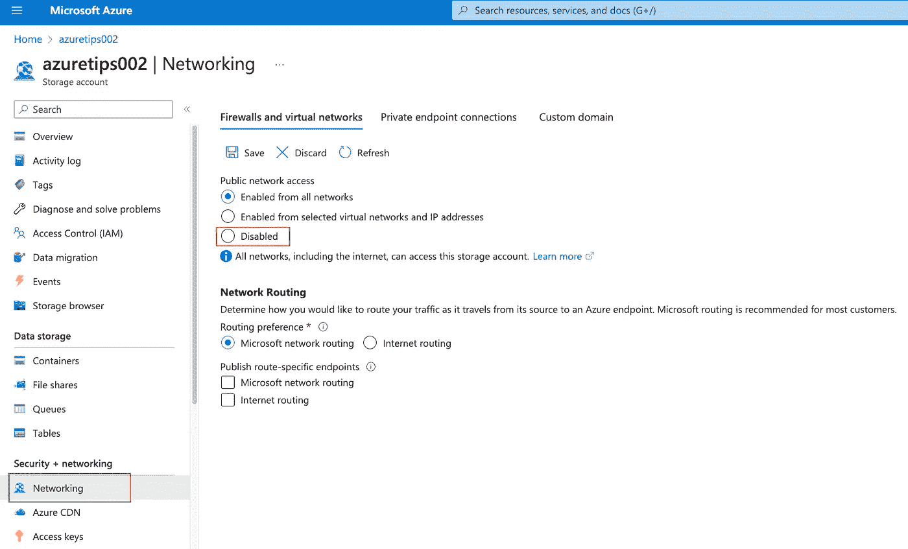

# 云安全:让你的 Azure 存储账户更安全的一些建议！

> 原文：<https://levelup.gitconnected.com/cloud-security-some-suggestions-to-make-your-azure-storage-account-more-secure-1011ebb19d8>

马库斯·斯皮斯克在 [Unsplash](https://unsplash.com/s/photos/cybersecurity?utm_source=unsplash&utm_medium=referral&utm_content=creditCopyText) 上的照片

D 数据保护非常重要，因为它有助于保护敏感数据免受未经授权的访问、修改或破坏。对于使用云服务存储和处理数据的组织来说，这有助于确保数据安全存储并在需要时可用。

**Azure Storage Account** 是一项为微软 Azure cloud 中的数据提供安全云存储的服务。在这篇文章中，我想分享一些让你的 Azure 存储帐户更安全的建议！

# #1 确保 Azure 存储中每个存储帐户的“启用基础架构加密”设置为“已启用”

Azure Storage **自动**使用 **256 位 AES** 加密对存储帐户中的所有数据进行加密。但是，您也可以在 Azure 存储**基础架构级别**启用 **256 位 AES** 加密，以便手动进行双重加密！

为了启用基础架构加密选项，您必须在创建存储帐户时启用。您无法在创建存储帐户后启用它，如下图所示。

好的，让我们创建一个新的存储帐户。创建过程中，填写基本信息后，选择“**加密**”切换到加密面板，即可在此启用基础设施加密。

像大多数技术选择一样，启用基础架构加密会增加您的存储帐户的安全性，但如果同时选中默认加密和基础架构加密，存储帐户的读写速度将会受到影响，因为第二种加密形式需要更多的资源开销来加密信息。

 [## 启用基础架构加密，实现数据的双重加密- Azure 存储

### 需要更高级别的数据安全保证的客户也可以在以下位置启用 256 位 AES 加密…

learn.microsoft.com](https://learn.microsoft.com/azure/storage/common/infrastructure-encryption-enable?tabs=portal&WT.mc_id=DT-MVP-5001664#create-an-account-with-infrastructure-encryption-enabled) 

# #2 确保为每个存储帐户启用“启用密钥轮换提醒”,并定期重新生成访问密钥

定期轮换**访问密钥**是一个好主意，可以确保潜在的泄露密钥不会导致长期可利用的凭证。要做到这一点，你可以设置一个**旋转提醒**来帮你。

ddd

而且重新生成密钥超级容易。你只需要点击“旋转密钥”，然后对提示点击“是”确认你要重新生成访问密钥。

但是请记住更新所有应用程序以使用新密钥来访问此存储帐户。

 [## 管理帐户访问密钥- Azure 存储

### 创建存储帐户时，Azure 会为该帐户生成两个 512 位存储帐户访问密钥。这些钥匙…

learn.microsoft.com](https://learn.microsoft.com/azure/storage/common/storage-account-keys-manage?tabs=azure-portal&WT.mc_id=DT-MVP-5001664) 

# #3 确保使用客户管理的密钥加密关键数据的存储

默认情况下，存储帐户中的数据使用微软托管密钥静态的 **256 位 AES** 加密进行加密。但是，您可以自己控制和管理此加密密钥，以保护存储帐户中的数据。

你可以点击“加密”打开“加密”面板，然后在“加密类型”选项中选择“自定义管理密钥”。

 [## 帐户加密的客户管理密钥- Azure 存储

### 您可以使用自己的加密密钥来保护存储帐户中的数据。当您指定客户管理的…

learn.microsoft.com](https://learn.microsoft.com/azure/storage/common/customer-managed-keys-overview?toc=%2Fazure%2Fstorage%2Fblobs%2Ftoc.json&bc=%2Fazure%2Fstorage%2Fblobs%2Fbreadcrumb%2Ftoc.json&WT.mc_id=DT-MVP-5001664) 

# #4 创建一个诊断设置来监控您的 Azure 存储帐户

资源日志可用于监控对存储服务的每个请求，以提高安全性或进行诊断。但是，在您创建诊断设置并将其路由到一个或多个位置之前，不会收集和存储这些日志。因此，要收集资源日志，必须首先创建一个诊断设置。

下面的链接介绍了详细的步骤。

 [## 监控 Azure Blob 存储

### 当您有依赖 Azure 资源的关键应用程序和业务流程时，您希望监控这些…

learn.microsoft.com](https://learn.microsoft.com/en-us/azure/storage/blobs/monitor-blob-storage?tabs=azure-portal&WT.mc_id=DT-MVP-5001664#collection-and-routing)  [## Azure 监视器中的诊断设置- Azure 监视器

### 本文提供了关于创建和配置诊断设置以发送 Azure 平台指标和日志的详细信息…

learn.microsoft.com](https://learn.microsoft.com/en-us/azure/azure-monitor/essentials/diagnostic-settings?tabs=portal&WT.mc_id=DT-MVP-5001664#create-diagnostic-settings) 

# #5 禁用存储帐户的公共网络访问

存储帐户应配置为拒绝来自所有网络的流量访问。但是，默认情况下，存储帐户将接受来自任何网络上的客户端的连接。因此，最好限制对选定网络的访问，或者阻止来自所有网络的流量，并且只允许通过私有端点进行访问。

您可以在“**网络|防火墙和虚拟网络|公共网络访问**”中找到并更改“公共网络访问”配置。

 [## 配置 Azure 存储防火墙和虚拟网络

### Azure 存储提供了分层的安全模型。此模型使您能够保护和控制对…的访问级别

learn.microsoft.com](https://learn.microsoft.com/en-us/azure/storage/common/storage-network-security?tabs=azure-portal&WT.mc_id=DT-MVP-5001664#change-the-default-network-access-rule) 

# #6 使用私有端点访问存储帐户

为你的 Azure 存储帐户使用私有端点，以允许客户端和服务通过加密的私有链接安全地访问位于网络上的数据。

查看以下链接了解更多信息！

 [## 使用私有端点- Azure 存储

### 你可以为你的 Azure 存储帐户使用私有端点，以允许虚拟网络(VNet)上的客户端安全地…

learn.microsoft.com](https://learn.microsoft.com/en-us/azure/storage/common/storage-private-endpoints?WT.mc_id=DT-MVP-5001664) 

# 我的新书！

嘿，朋友们，我非常兴奋地宣布，我的新书已经可以在亚马逊上预购了！

 [## 游戏开发与统一。NET 开发者:用 Unity 创建游戏的终极指南…

### Amazon.com:使用 Unity 进行游戏开发。NET 开发者:用 Unity 和…创建游戏的终极指南

www.amazon.com](https://www.amazon.com/Game-Development-Unity-NET-Developers-ebook-dp-B09P5R4QPS/dp/B09P5R4QPS) 

在本书中，我们将探索如何使用 **Unity 游戏引擎**和**微软游戏开发**，包括**微软 Azure 云**和**微软 Azure PlayFab** 服务，来创建游戏。

跟上我:

 [## 陈家东——高级软件开发人员——X 公司| LinkedIn

### 陈家东是国际上公认的 3000 名微软最有价值职业(MVP)获奖者之一

www.linkedin.com](https://www.linkedin.com/in/chenjd/)