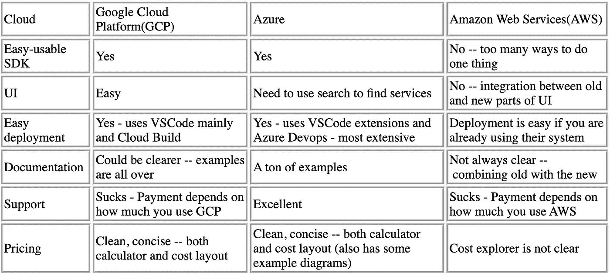

# 云—先学哪个？

> 原文：<https://levelup.gitconnected.com/cloud-which-to-learn-first-cd074c7029f3>

简化您的云选项以最大化您的学习

照片由[森迪·纪伯伦](https://unsplash.com/@sendi_r_gibran?utm_source=medium&utm_medium=referral)在 [Unsplash](https://unsplash.com?utm_source=medium&utm_medium=referral) 上拍摄

云计算已经成为全球许多公司 IT 基础设施不可或缺的一部分。

有这么多的云服务，可能很难决定学习哪一种。

确定什么最适合你的一个方法是考虑你的经验水平和你想用云服务做什么。例如，如果你刚开始做 IT 工程师，想了解 AWS，那么 GCP 不会是一个很好的选择，因为它比 AWS 更复杂。

如果你是一名经验丰富的工程师，想要使用 Azure 的企业级安全功能，那么 GCP 可能不是最佳选择，因为他们的安全功能远不如 Azure 先进。

在这里，我们将看看他们中的每一个，并列出他们的优点和缺点。

# *TL；博士*

我是华盛顿大学的一名计算化学博士生，几天前我走进了物理大楼里的电子科学研究所。零云体验。我无法决定从哪里开始，但幸运的是，我有一位导师教我诀窍。希望分享一些他的点点滴滴以及自己一路走来学到的或者正在学习的东西。

电子科学研究所提供了关于 GCP 的早间培训，这是我开始我的个人项目的地方。我只在个人使用时使用过它，因为它是最容易也是最快速开发的。GCP 有 VSCode google extensions，可以让你像开发一样快速部署。比如这个网站其实是通过云代码发布的；我将很快写一篇文章对此进行更多的解释。此外，GCP 提供了大量的例子，这些例子到处都是，所以弄清楚要找什么可能需要一点时间。不幸的是，GCP 没有统一的支持服务价格，所以如果你想订阅开发者支持，费用是多少并不明显。

与 GCP 相比，微软 Azure 实际上有相似的功能和感觉。我在 Blueprint Technologies 工作过的大多数工具是 Azure Functions、Azure Data Factory、Azure Databricks、Azure DevOps、Azure Logic Apps、Azure Batch 和 SQL Server Management。微软提供值得信赖的计算的愿望在其开发工具中大放异彩。Azure 提供了一个干净的 SDK，为 VS 代码提供了很好的扩展，最终通过 Azure DevOps 提供了源代码控制和版本控制，这使得我的开发过程变得很容易。

我目前在 Qumulo 与亚马逊网络服务(AWS)合作。AWS 很复杂。这绝对不是我第一次尝试云计算的首选。这里有一个例子。从 VSCode 开始，我考虑在 Qumulo 部署一个应用程序。SDK 和在线文档并不总是一致的，尤其是对于各种资源，我可以选择这些服务:EC2、弹性容器服务、Fargate 和弹性 Kubernetes 服务、AWS Batch、AWS BeanStalk 和 AWS Lightsail。我想我已经错过了一两个，但你明白我的意思。不过，这也有它的好处。它相对便宜，可以为更具体的用例提供各种工具。

在比较了 AWS、GCP 和 Azure 之后，我希望我能阐明每种云的优缺点。并允许您作为开发人员对使用哪种云做出更明智的决定。

我希望这对你有帮助！如果有任何反馈，请告诉我。

*原载自*【https://dutchengineer.org/posts/cloud-providers】