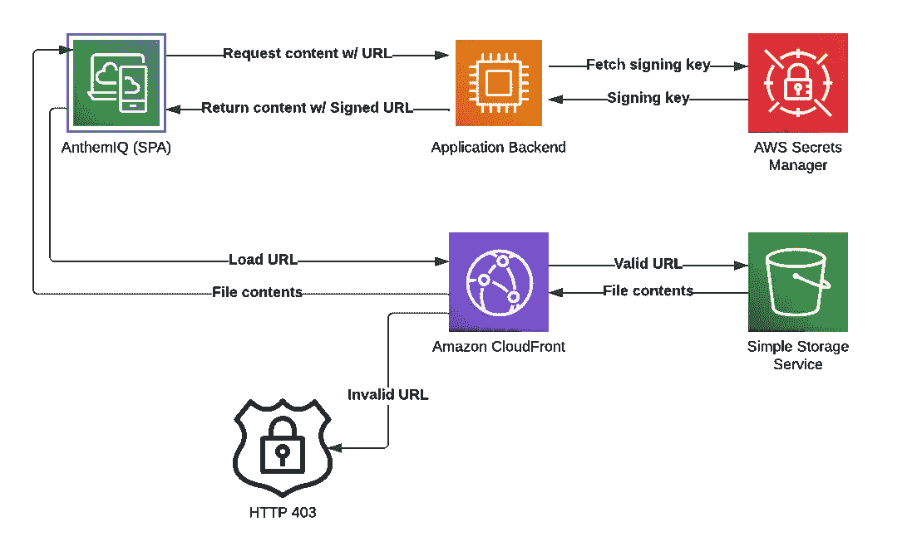

# CloudFront 用 Node.js 和 Express 签署了 URL

> 原文：<https://levelup.gitconnected.com/cloudfront-signed-urls-with-node-js-and-express-c0602ac405a3>

将安全性分层到现有应用程序中

你可以在网上找到几个不同的关于使用 [CloudFront](https://aws.amazon.com/cloudfront/) 签名 URL 的帖子，包括几个来自 AWS 本身的帖子。然而，这些帖子忽略了等式中非常重要的一部分，那就是 URL 实际上是如何被签名并返回给客户端的，尤其是当这些 URL 可以位于数据模式中的任何位置时。这篇文章将涉及在 Node.js、Express 和 MongoDB 中端到端使用签名 URL 的主题。

我假设你至少有 CloudFront 和 S3 的工作知识。如果你不知道，网上有很多帖子非常详细地讨论了这些话题。

## 背景

[AnthemIQ](https://www.anthemiq.com/) 是一个 SaaS 应用程序，用于促进商业房地产交易。作为这项服务的一部分，用户可以上传文件和图像，最终存储在 S3。当我们第一次开始时，这些 S3 桶中的文件是公开可访问的(如果用户能够发现 URL)。这种基本方法的问题显而易见。我们知道我们需要保护对用户上传的文件的访问，并且我们很快发现在 AWS 中使用签名的 URL 可以做到这一点。

URL 签名非常简单——如果不使用用我们的私钥签名的 URL，对我们的 S3 存储桶中的所有文件的访问都会被拒绝。获得有效签名 URL 的唯一方法是从我们的应用程序后端获取，只有在它验证了用户有权访问所讨论的文件之后。

实际上，目前有两种不同的方式让用户通过 CloudFront 访问这些文件。您可以使用已签名的 cookie，而不是单独对所有 URL 进行签名。对我们来说，这种方法的问题是，它允许用户访问由给定的 CloudFront 行为提供服务的所有文件，这不符合我们的要求。我们需要逐个文件地控制访问。

## 第一步

一旦我们理解了如何在 AWS 中完成我们所需要的(稍后会详细介绍)，我们就需要计划如何将这些签名的 URL 返回给客户端。我知道这听起来非常简单，但是事情远比你想象的要复杂。首先，我们必须追踪数据模式中存在的所有 URL。一旦完成，我们就需要确保这些 URL 无论在哪里被返回都是经过签名的。因为我们使用 Node.js 和 MongoDB，所以我们显然也在使用 Mongoose。我们可以在我们的 Mongoose 模式上使用类似虚函数的东西，但是这些不能用于聚合。一旦你使用了聚合，几乎所有的赌注都被取消了。试图在业务逻辑中访问这些 URL 的任何地方手动处理它们当然会非常容易出错。我们必须想出一种方法来确保所有的 URL 都得到签名，而开发人员不需要做任何事情。

这需要我们变得…有创造力。老实说，我们并没有想出一个很好的解决方案，但它确实有效。我们编写了一个 Express 中间件函数来替换所有响应对象上的`send`和`json`函数。这个函数使用一个正则表达式来查找已知的媒体文件 URL 并对它们进行签名。以下是打字稿代码:

我们稍后将讨论实际的签名代码。如果你的 API 是 100% GraphQL，你实际上可以使用一个定制的标量而不是这个 hack。我们正在进行移植，所以我们目前有一个混合 API，还不能使用这种技术。

既然我们知道了如何将已签名的 URL 返回到前端，我们还需要能够处理前端将已签名的 URL 发送回后端(当保存数据时)。我们不能坚持他们的签名形式。我们需要删除所有签名参数。这看起来更干净一点，但是我们仍然或多或少地使用 Express 中间件来做这件事。我们使用 Express 中内置的`[json](https://expressjs.com/en/resources/middleware/body-parser.html#bodyparserjsonoptions)`中间件功能。这个函数实际上采用了它所称的`reviver`函数，这个函数在请求 JSON 中的每个属性上都被递归地调用。这使得通过正则表达式运行这些值来查找签名的 URL 并去掉相关的查询参数变得非常容易。

好的，那么我们知道我们需要做什么，在一个高层次上，使这个工作。现在，让我们进入 AWS 设置的细节。

## 配置 AWS

在这一点上，我假设你知道 [CloudFront](https://aws.amazon.com/cloudfront/) 是一个 CDN，以及使用它以优化的方式服务 S3 文件的基本知识。因为我们使用 CloudFront 来提供文件，我们已经可以通过 S3 关闭公共访问。用户必须使用 CloudFront URL 来访问这些文件。然而，这仍然存在同样的问题，即任何拥有该 URL 的人都可以加载文件。

快速回顾一下，我们将使用发行版，它有起源(配置文件从哪里提取)和行为(配置文件如何被提供)。为此，我们将更新与我们的 S3 血统相关的行为。

然而，在此之前，我们需要创建一个密钥对，并将公钥上传到 CloudFront。您可以在密钥管理>公钥>创建公钥下完成。如果你不知道如何创建一个 keypair，只需要几个命令就可以了，而且有很多关于这个主题的帖子。上传公钥后，还必须创建一个密钥组:密钥管理>密钥组>创建密钥组。这是 CloudFront 验证一个签名的 URL 所需的所有信息。一旦创建了密钥组，就可以通过启用限制查看者访问、选择可信密钥组和选择密钥组，将它与 CloudFront 发行版上的行为关联起来。我会等待这样做，直到你有逻辑签署的网址工作第一。

我还强烈推荐使用 AWS Secrets Manager 来存储您的私钥，而不是提交到您的源存储库并从磁盘加载。当然，你也可以用其他的机制来存储它，但是 Secrets Manager 是专门为这类事情设计的，非常安全，而且非常便宜。你甚至可以设置这些键的自动旋转，但我不会深入讨论。将私钥添加到 Secrets Manager 非常简单，只需导出它，创建一个新的密钥，然后将私钥作为明文粘贴进来。现在你只需要在后端服务启动时获取它，它可以在运行时驻留在内存中。

## 让我们签署一些网址

到目前为止，我们已经确定了如何以及何时对 URL 进行签名的策略，并且逐步了解了在 AWS 中设置 URL 签名的细节。现在是实际签署 URL 的时候了。

第一步是在后端启动时从 Secrets Manager 获取私钥。这非常简单——只有几行使用 AWS SDK for JavaScript 的代码。你需要的 npm 包是`@aws-sdk/client-secrets-manager`。代码如下:

为了给 URL 签名，我们将使用`@aws-sdk/cloudfront-signer`。这段代码也非常简单:

在这里，我们只是指定要签名的 URL、CloudFront 密钥组的 ID、导出的明文私钥以及 URL 过期的日期。如果没有指定日期，默认是从当前日期起两天后的一天的开始(我们使用`date-fns`包来实现)。

剩下的工作就是创建一个正则表达式(或者标识需要签名的 URL)并将其插入到上面描述的 Express 中间件中(注意第一个代码片段中对`transformCloudFrontUrls`的调用)。类似地，对于所有包含签名 URL 的请求，只需从 URL 中删除签名参数。就是这样！

## 摘要

在这篇文章中，我们探索了使用 Node.js 和 Express 在后端进行端到端的 CloudFront URL 签名。我们看到了如何插入 Express 来对响应上的 URL 进行签名，并删除请求数据上的签名参数。我们看到了需要在 AWS 中配置什么来支持 URL 签名。最后，我们看到了如何使用 AWS SDK 对 URL 进行签名。

感谢您的阅读，并在不久的将来关注更多类似的内容！