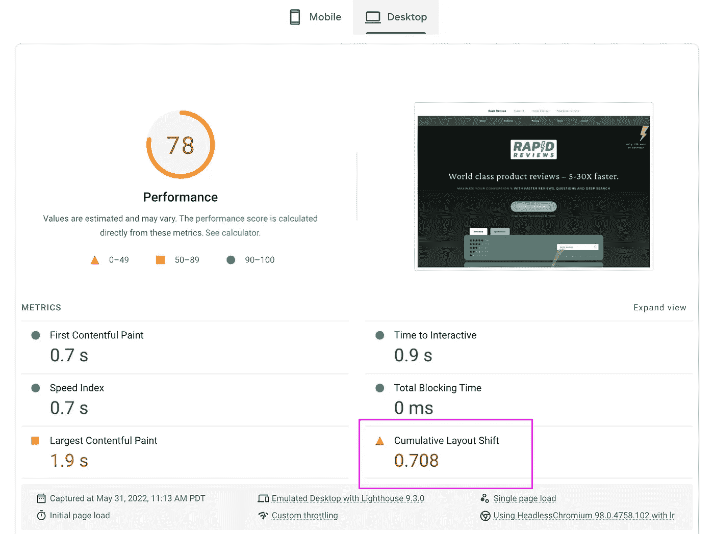

# CLS 用 10 行代码将 0

> 原文：<https://levelup.gitconnected.com/cls-to-0-with-10-lines-of-code-34576fbff2e0>

## 我如何用 10 行代码将我的累积布局移位到 0…

我们知道累积布局转移(CLS)是谷歌的一个[排名因素。CLS 测量网页加载时布局移动的程度。CLS 属于“页面体验”一类，并以核心网站指标来衡量。](https://developers.google.com/search/docs/advanced/experience/page-experience)

我在一个营销网站上为我的新 Shopify 产品评论应用[快速评论](https://www.rapidreviews.pro)做了一点实验。

我得到了一个糟糕的 CLS 号码，我的页面负载非常跳动。我试图找出最简单的方法来解决这个问题(使用原始 javascript)，并让 Google 的 PageSpeed Insights 评分满意。

我最后使用了下面的代码——它隐藏了加载时的`<body>`,并添加了一个非常短的`setTimeout()`和 css 转换来显示它。看起来整个 DOM 已经用 3 毫秒超时结束时计算的宽度和高度构造好了。相当酷。

如果你认为这个解决方案是垃圾，或者很棒，或者在我之前已经有人这样做了，请评论。我只是把它扔在那里，因为它可能会帮助其他人思考问题/解决方案空间。

```
<style>
  body {
    opacity: 0.01;
    transition: opacity 0.1s ease-out;
  }
  body.active {
    opacity: 1;
  }
</style><script>
  function activateBody () {
    var bodyEl = document.querySelector('body') setTimeout(function(){
      bodyEl.classList.add('active')
    }, 3)
  } // RUNS ON DOM COMPLETE, NOT PAGE READY
  // PAGE READY IS WAY TOO SLOW
  if (document.readyState !== 'loading') {
    activateBody()
  } else {
    document.addEventListener('DOMContentLoaded', activateBody)
  }
</script>
```

# 结果

移动结果基本上没有变化，分数有 2 分的损失。这可能只是自然差异。

桌面结果*非常*有趣，有 **13 点提升**！

这似乎表明，CLS 是一个更大的桌面比移动页面得分因素。对于这样一个简单的变化来说，13 点的摆动是相当疯狂的。

## 移动—以前

[](https://www.rapidreviews.com)

## 手机—之后

[](https://www.rapidreviews.com)

## 桌面—以前

[](https://www.rapidreviews.com)

## 桌面—之后

[](https://www.rapidreviews.com)

*在*[*WilliamBelk.com*](https://www.williambelk.com)*找我。关注我* [*推特*](https://twitter.com/wbelk) *。*