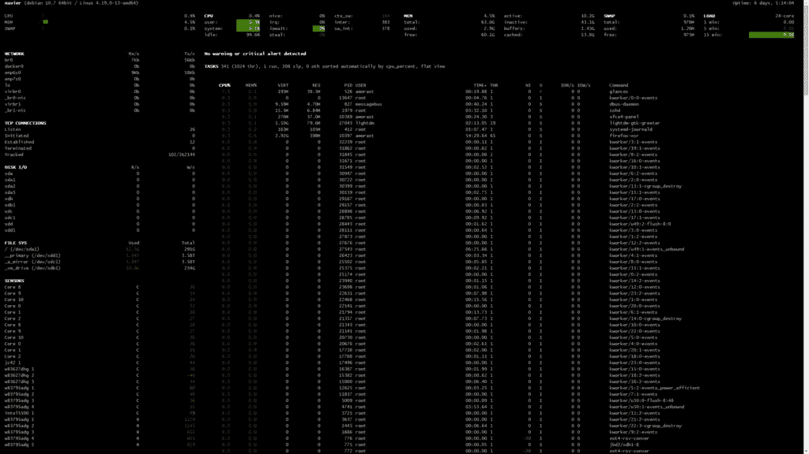

# Python 中的集群监控

> 原文：<https://levelup.gitconnected.com/cluster-monitoring-in-python-with-glances-a6a69f5ce3f7>

在 [Unsplash](https://unsplash.com?utm_source=medium&utm_medium=referral) 上由[秋莫特罗德希尔](https://unsplash.com/@autumnmott?utm_source=medium&utm_medium=referral)拍摄的照片

几年前，我妻子给我买了几台 Raspberry Pi 3 B+单板计算机作为圣诞礼物，这样我就可以尝试创建和管理计算机集群(这是我一直想要的)。从那以后，我发现了用一些我经常使用的高端电脑进行高性能计算的更好方法。因此，我的 Raspberry Pi 集群很大程度上处于休眠状态，只执行一些小任务(主要是为我的[股票价格 API](https://www.anthonymorast.com/blog/2020/12/08/creating-a-database-with-an-api-stock-price-data/) 收集数据，并充当我家庭网络的 SSH 接入点)。在此之前，我已经使用 Raspberry Pis 完成了许多任务，并且总是发现自己在想同样的事情，“那些东西还在运行吗？”由于我使用的是机箱，我无法亲眼看到设备来验证电源和处理灯是亮着还是在闪烁，所以我真的不知道它们的状态。我决定实现一个更容易实现的解决方案，而不是像 ping 每个 Pi 或尝试登录每个节点那样做一些基本的事情。在这篇文章中，我描述了 Glances API 的设置和使用，以及在一个小 LCD 屏幕上显示某些数据，这个小 LCD 屏幕安装在我用来存储 PI 集群的箱子外面。

# 反光

[glasses](https://glances.readthedocs.io/en/latest/index.html)是用 Python 编写的跨平台监控工具。API 提供了大量关于运行该软件的服务器上发生了什么的信息。我发现最有用的是在 web 服务器模式下运行 Glances，它通过一个漂亮的 web 界面提供信息。在这种模式下运行 Glances 监听端口 61208 上的连接(默认情况下),基本上给出的信息类似于您通过 **top** 或 **htop** 看到的信息，还有其他一些细微之处。在 web 服务器模式下运行 Glances 并导航到 URL(即 http:// <服务器 ip > :61208)会提供以下输出:

这很好，但我计划在多个设备上运行这个软件，并希望能够确定它们的可用性。出现了两个问题，I)必须记住许多设备的 IP 地址，以及 ii)每当我们想要确定设备可用性时，必须(本质上)检查多个网站。

幸运的是，Glances 还提供了一个 RESTful API 来检索上面显示的信息(以及更多)。在我的例子中，我想知道我的 Raspberry Pi 集群中的一个节点是否可用，以及集群的总资源利用率是多少。因此，我需要能够 ping 节点，获得每个节点的 CPU 使用情况，以及每个节点的内存(RAM)使用情况。当通过可用的 API 端点在 web 服务器模式下运行 Glances 时，这很容易做到。基本 URL 是:

在哪里

*   *服务器 ip* 是 Glances 服务器的 ip 地址
*   *眼色端口*是眼色端口正在监听连接
*   而*插件*，在我的例子中，被替换为 *cpu* 以获得 cpu 使用细节或者 *mem* 以获得内存使用细节

以下命令用于在集群中的每个节点上以 web 服务器模式启动 glances。 *-w* 命令行选项是指定 web 服务器模式，而 *-p* 选择端口。尽管使用了默认端口，但我还是通过命令行指定了它，以防将来更改默认端口。

为了方便起见，我把它添加到/etc/rc.local 文件中，这个文件在 Raspbian 启动时运行。然而，最近基于 Ubuntu/Debian 的发行版已经废除了 rc.local 文件，因此需要另一种方法(cron 作业、服务等)。)

# 收集 CPU 和内存使用情况

使用了两个函数来获取内存和 CPU 使用情况，尽管两者做的事情或多或少是一样的。第一个示例如下所示，它使用 Glances API 来获取关于被查询设备上可用的 RAM 数量、正在使用的 RAM 数量以及正在使用的 RAM 百分比的详细信息。

首先，导入以下库并定义变量:

获取存储器数据的函数如下所示:

这里，集群中每个 Pi 的 IP 地址被迭代，并且构建了一个 URL 来向 Glances API 提交 GET 请求。online 参数是一个列表，如果节点在线，则存储“1”，否则存储“0”。从 API 返回的数据存储在列表中，并从函数中返回。请注意，我已经通过路由器的 DHCP 设置为集群中的每个 Raspberry Pi 分配了一个静态 IP 地址，因此我不需要更新列表(它们每次都是连续的，我不知道从现在到那时发生了什么)。

接下来，在下面的函数中，查询 Glances API 来检索每个 PI 的 CPU 使用情况。

这个函数非常类似于 *get_mem()* 函数，唯一的区别是返回 pi 的 CPU 使用百分比。

下面是监控脚本的主要函数，它首先检查 Raspberry Pis 是否正在运行并通过 ping 连接到互联网，然后调用上面的函数来获取使用数据，最后使数据更具可读性并将其写入屏幕。

这里提供的代码将显示文本行

*   可用的计算机数量与群集中的计算机总数之比，
*   集群节点的 IP 地址，
*   “1”表示节点可用，“0”表示节点不可用，
*   所有节点的平均 CPU 使用率(百分比)，
*   可用的 RAM 总量与正在使用的 RAM 总量相比，
*   和正在使用的 RAM 的平均百分比。

这本身就是一个漂亮的脚本，但是它仍然需要持续运行以不断提供更新的值。在我的例子中，我想被动地监视集群中的 pi。正因为如此，我最终购买了一个小的 20 字符，4 线 I2C 液晶显示器，并把它挂在一个旧的树莓 Pi 2 上。下面提供了实现这一点的代码。

首先，我需要为 Raspberry Pi 下载一个 I2C 接口驱动程序。这是从 GitHub 页面中截取的，或多或少是按原样使用的。感兴趣的文件是 [RPi_I2C_driver.py ***。由于这个文件几乎有 200 行长，我将把它从这篇文章中删除，这样它就不会太长，而且因为我没有写脚本或以任何方式修改它(至少我记得)。***](https://gist.github.com/DenisFromHR/cc863375a6e19dce359d#file-rpi_i2c_driver-py)

为了使用上面讨论的驱动程序写入 LCD 屏幕，下面的代码被添加到上面 main 函数的 print 语句之后。

文本有些浓缩，对于大量节点来说不实用，因为 LCD 屏幕太小了，但对我来说，它做得很好。

# 结论

总之，Glances 库是一个非常强大的监控工具，几乎可以在任何地方运行，并提供对远程或无头机器的当前状态的深入了解。在 web 服务器模式下运行的能力，加上这样做打开了一个 RESTful API，使得监控集群中的许多节点变得非常容易，只需要几个 GET 请求和一些 JSON 解析。请注意，我使用的是这些 GET 请求提供的数据的一个非常小的子集(主要是为了适合 LCD 屏幕)，但是还有更多可用的数据，可以在[glasses RESTful 文档](https://github.com/nicolargo/glances/wiki/The-Glances-RESTFULL-JSON-API)中找到。我用一个旧的小型电脑机箱为我的集群定制了一个机箱，并剪了一个孔来安装 LCD 屏幕。现在，只需看一眼 LCD(也许库就是这么命名的)，我就可以对我的集群的状态有很多有价值的了解。

# 完整代码

请使用上面的链接找到树莓派 I2C 驱动程序代码。

## 监视器. py

*原载于 2021 年 5 月 7 日 https://www.anthonymorast.com***。**