# 用 Python 聚类 GPS 坐标和形成区域

> 原文：<https://levelup.gitconnected.com/clustering-gps-co-ordinates-forming-regions-4f50caa7e4a1>

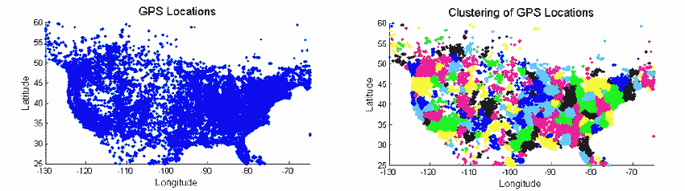

聚类 GPS 位置

我最近在处理一些包含 GPS 纬度和经度的数据时遇到了一个挑战。为了从现有的数据中获取尽可能多的信息，我有了这个想法。这不是什么新鲜事，但绝对是令人兴奋的事。

热图和聚类图很好，但是如果我们可以用 GPS 坐标做更多的事情呢？让我们想象一下，如果人口统计学和其他数据点之间有关系会怎么样。例如，客户流失受地区影响吗？

这里有一个简单而强大的方法，用 Python 对 GPS 位置进行聚类。

为此，我使用了来自卡格尔的 Zillow 奖的数据:Zillow 的房屋价值预测(Zestimate) 。我用的是‘properties _ 2016 . CSV’。**真大！**

## 导入先决条件。

```
import pandas as pd
import numpy as np
import matplotlib.pyplot as plt
from sklearn.cluster import KMeans
import seaborn as sns; sns.set()
import csv
```

## 加载文件并读取前几行

```
df = pd.read_csv('properties_2016.csv')
df.head(10)
```

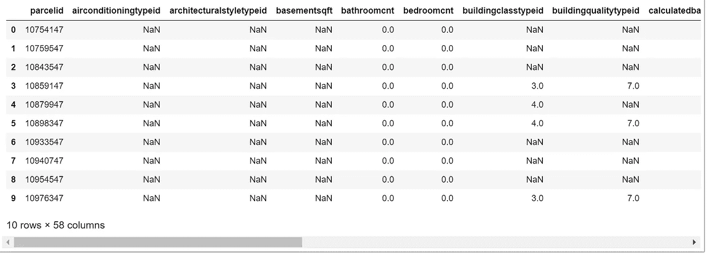

所有数据

## 删除经度和/或纬度为空值的行

```
df.dropna(axis=0,how='any',subset=['latitude','longitude'],inplace=True)
```

创建一个只有我们需要的变量。我们需要“parcelid ”,这样我们就可以在以后连接到原始数据，经度和纬度。

```
# Variable with the Longitude and Latitude
X=df.loc[:,['parcelid','latitude','longitude']]
X.head(10
```

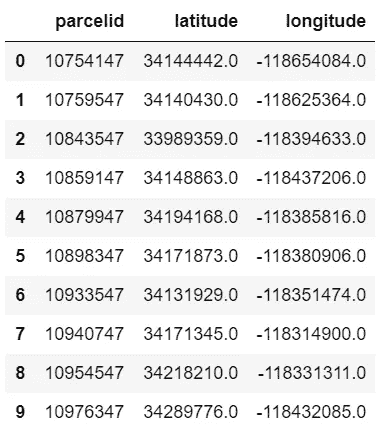

KMeans 的切片数据

# 肘形曲线

哇，等等我！这是什么约瑟夫？

K-means 有些天真——它将数据聚类成 k 个簇，即使 k 不是要使用的正确簇数。当我们谈到聚类时，很难知道有多少个聚类是最佳的…在我们的数据集中，有多少个聚类是最佳的，即有意义的，我们现在不想猜测，不是吗？因此，在使用 k-means 聚类时，我们需要一种方法来确定我们是否使用了正确的聚类数。

> 让我们变得有趣一些——猜猜最佳聚类的数量，写在某个地方……现在让我们看看你是否真的能赢得彩票。

验证集群数量的一种方法是**肘方法**。肘方法的思想是对 k 值范围(比如 k 从 1 到 10)的数据集运行 k 均值聚类，并对 k 的每个值计算误差平方和(SSE)。

当 K 增加时，质心更靠近簇质心。这种改善会在某一点上迅速下降，形成肘形。这是 k 的最佳值。

这可能需要一段时间..稍微伸展一下。

```
K_clusters = range(1,10)kmeans = [KMeans(n_clusters=i) for i in K_clusters]Y_axis = df[['latitude']]
X_axis = df[['longitude']]score = [kmeans[i].fit(Y_axis).score(Y_axis) for i in range(len(kmeans))]# Visualize
plt.plot(K_clusters, score)
plt.xlabel('Number of Clusters')plt.ylabel('Score')plt.title('Elbow Curve')plt.show()
```

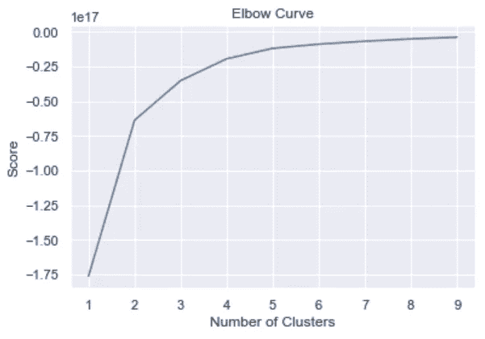

显示最佳聚类数的肘形曲线

当我们绘制图表时，我们看到图表在 **3** 簇之后缓慢变平。这意味着添加更多的集群对我们没有多大帮助。

## 使用 K-Means 进行聚类并将聚类分配给我们的数据

先来看看 [KMeans 函数](https://scikit-learn.org/stable/modules/generated/sklearn.cluster.KMeans.html)的一些参数。

## KMeans 参数

*   int，可选，默认 8。要形成的簇的数量以及要生成的质心的数量。
*   `init` `{‘k-means++’, ‘random’ or an ndarray}`。`k-means++`’:智能选择 k-means 聚类的初始聚类中心，加快收敛速度。`random`:从初始质心的数据中随机选择`k`个观测值(行)。如果通过了一个`ndarray`，它应该是形状(`n_clusters`，`n_features`)，并给出初始中心。

# 让我们开始吧

```
kmeans = KMeans(n_clusters = 3, init ='k-means++')
kmeans.fit(X[X.columns[1:3]]) # Compute k-means clustering.X['cluster_label'] = kmeans.fit_predict(X[X.columns[1:3]])centers = kmeans.cluster_centers_ # Coordinates of cluster centers.labels = kmeans.predict(X[X.columns[1:3]]) # Labels of each pointX.head(10)
```

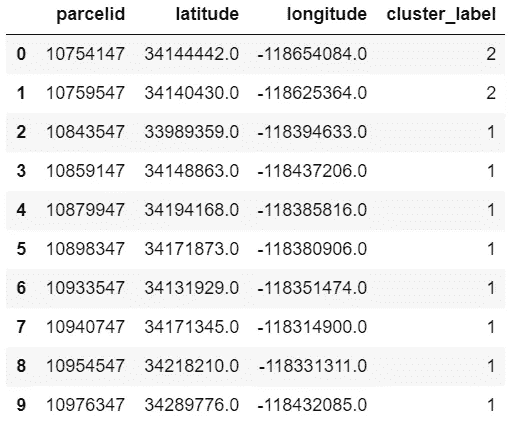

聚类数据

## 将结果可视化

让我们通过绘制用这些标签着色的数据来可视化结果。我们还将绘制由 k-means 估计器确定的聚类中心:

```
X.plot.scatter(x = 'latitude', y = 'longitude', c=labels, s=50, cmap='viridis')
plt.scatter(centers[:, 0], centers[:, 1], c='black', s=200, alpha=0.5)
```

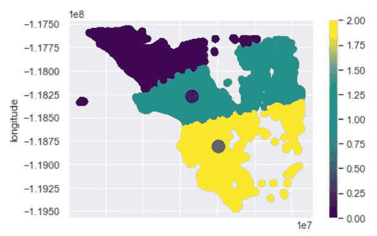

可视化结果

你可以试着用你选择的数字运行`k_means`并想象它。我选了 5 个，看起来像这样:没那么漂亮，是吧？

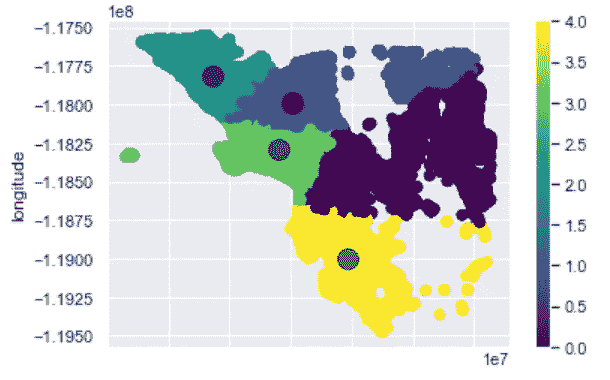

来自猜测聚类的可视化结果

## 将结果与所有数据合并

我们必须合并我们现有的数据，以包括集群，这样我们就可以做更多的分析。我们有两个变量包含我们的数据，`df`和`X`。让我们看看他们以前是什么样子。

```
df.head(5)
```

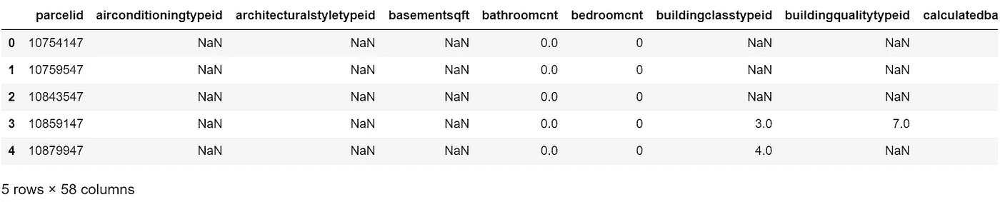

主数据框

```
X.head(5)
```

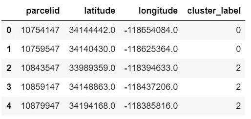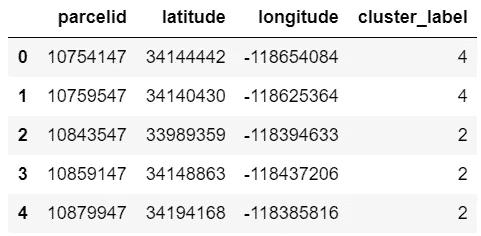

具有分类的数据子集

让我们从`X`中删除经度和纬度，因为它们已经存在于`df`中。如果我们不删除经度和纬度列，我们将在数据框中为经度和纬度创建另外 2 列。我们不想那样。

```
X = X[['parcelid','cluster_label']]
X.head(5)
```

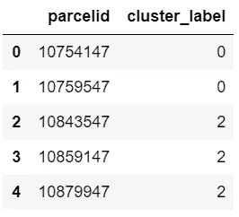

聚类数据的修剪子集

让我们现在合并数据。合并后，新列将被添加到您的数据集的右侧。

```
clustered_data = df.merge(X, left_on='parcelid', right_on='parcelid')clustered_data.head(5)
```

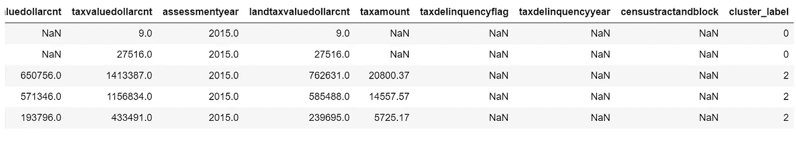

具有聚类的数据

## 将数据框导出到 CSV

幸运的是，有一个`pandas.DataFrame.to_csv`函数，非常简单:

```
clustered_data.to_csv ('clustered_data.csv', index=None, header = True)
```

## **奖励——如何获得中心。**

`centers = kmeans.cluster_centers_`
`print(centers)`

## 下一步是什么？

对位置进行聚类后，我们现在可以从不同的角度来看待我们所拥有的数据。

[Github 链接](https://github.com/JosephMagiya/Clustering-GPS-Co-ordinates--Forming-Regions./blob/master/Clustering-GPS-Co-ordinates--Forming-Regions.ipynb)

# 感谢您的阅读，祝您好运